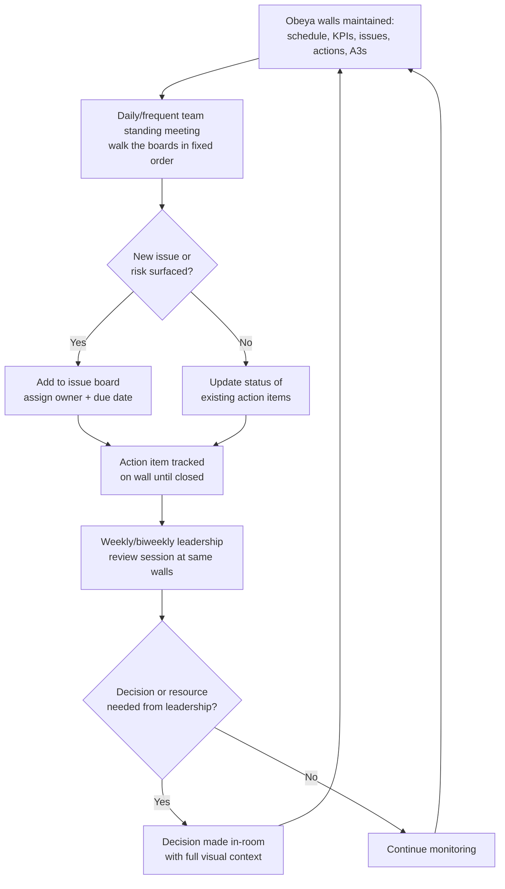

## Obeya War Room Design and Use

### Overview

Obeya (大部屋, literally "big room") is a dedicated physical or virtual space where cross-functional project information is visually displayed and a project team meets regularly to review status, surface problems, and make coordinated decisions quickly, all in one location rather than scattered across individual offices, emails, and disconnected reports. Obeya originated within Toyota's product development system — most notably associated with chief engineer Takeshi Uchiyamada's use of the concept during the first-generation Prius program — as a way to compress decision-making cycle time on complex, cross-functional projects by making the full state of the project visually and physically present to everyone who needs to act on it. The Western term "war room" captures the same idea but is applied more broadly, sometimes losing the specific visual-management discipline that distinguishes a true obeya from an ordinary meeting room with some charts on the wall.

### Key Points

- Obeya's core purpose is to reduce the time and distortion involved in cross-functional communication by putting the relevant people and the relevant visual information in one place at one time, rather than relying on sequential reports, emails, or relayed summaries
- An obeya is defined by its walls (the visual information system) as much as by its meetings — the room itself functions as a persistent, always-visible status of the project, not just a venue that's empty between meetings
- Obeya is typically used for larger, more complex, or more cross-functional initiatives (new product development programs, major kaizen initiatives, plant-wide transformations) rather than for single-workstation or single-line problems, which are better served by localized visual management and daily huddles
- A functioning obeya combines visual displays (status, schedule, risk) with visual controls (action-item tracking with owners and due dates that are actively followed up) — without the control element, an obeya degenerates into a decorated status-reporting room
- Obeya is not simply "a room with whiteboards" — its value depends on disciplined content curation, a consistent visual layout, and a regular cadence of use that keeps the walls current and the team's attention anchored to it

### Purpose and Philosophy

Obeya addresses a specific communication failure mode common in complex projects: information that exists somewhere in the organization (a schedule slip, a quality concern, a resource conflict) but takes too long to reach the people who need to act on it, or arrives distorted by being relayed through intermediate reports and summaries. By physically co-locating the cross-functional team — or, in modern practice, co-locating them virtually around a shared, persistent visual system — and anchoring their recurring reviews to the same visual displays, obeya compresses the loop between "a problem exists" and "the right people know about it and can decide what to do."

The underlying principle connects directly to core TPS ideas already embodied in andon and visual controls at the shop-floor level: make abnormalities visible immediately, and pair that visibility with a fast, defined response — obeya simply applies this logic at the project and cross-functional management level rather than at the individual workstation level.

### Core Design Elements

**1. Physical or persistent virtual space**

Traditionally a dedicated room reserved for the project's duration, with wall space treated as a primary design resource, not an afterthought. In distributed or hybrid organizations, this is increasingly replaced or supplemented by a persistent digital equivalent (a shared virtual board), though practitioners generally note that a genuinely shared physical space produces communication dynamics — incidental conversation, immediate pointing-and-discussing — that digital equivalents replicate only partially. [Inference] The relative effectiveness of physical versus fully virtual obeya implementations is an area of ongoing practitioner debate rather than a settled finding, and likely depends heavily on team distribution and organizational culture.

**2. Visual wall zones**

The walls are organized into consistent, purpose-specific zones rather than an unstructured collage of charts. Common zones include:

- **Project overview / charter**: goal, scope, key stakeholders, high-level timeline
- **Schedule / milestone tracking**: often a large-format Gantt-style chart or milestone timeline showing planned versus actual
- **Key metrics / KPI trends**: cost, quality, schedule performance indicators tracked over time
- **Problem/issue board**: currently open issues, often with a visual severity or age indicator
- **Action item tracker**: specific actions with named owners and due dates — this is the zone that converts the room from a display into a control, since it is where accountability is visually and persistently tracked
- **Risk register / countermeasure tracking**: identified risks, their status, and mitigation actions
- **A3 reports**: for larger initiatives, obeya walls often host completed or in-progress A3 problem-solving documents, giving visibility into both the reasoning and the current status of major problem-solving threads

**3. Consistent visual language**

Color coding (commonly red/yellow/green for status), standardized symbols, and a stable spatial layout (the same zone is always in the same physical location) so that anyone entering the room — including someone from outside the core team — can orient quickly without a guided tour.

**4. Cadence of use**

An obeya is only as effective as the discipline of its recurring use. A typical cadence includes:

- A **standing team meeting** (daily or several times weekly for fast-moving programs) held physically in front of the walls, walking the boards in a fixed order
- **Leadership review sessions** at a lower frequency (weekly or biweekly), where the same visual system is used to brief and get decisions from more senior stakeholders
- **Ad hoc use** as a default meeting space for the project, so that any discussion naturally happens in front of the current state rather than relying on someone's memory or a separately prepared slide deck

**5. Ownership and curation discipline**

A designated owner (often the project or chief engineer, echoing the obeya's origin in Toyota's chief-engineer-led product development system) is responsible for keeping the walls current — stale information on an obeya wall is worse than no obeya at all, because it actively misleads anyone who trusts what's posted.

### How Obeya Differs from an Ordinary Conference Room or Status Meeting

| Dimension | Obeya | Ordinary Conference Room / Status Meeting |
| --- | --- | --- |
| Persistence of information | Walls remain populated and current between meetings | Room is empty/repurposed between meetings; information lives in slide decks |
| Information format | Physical, large-format, glanceable visual displays | Often projected slides, one screen at a time, sequential |
| Cross-functional visibility | All functions' status visible simultaneously, side by side | Typically one function reports at a time |
| Accountability mechanism | Action-item zone with owners/dates, reviewed every session | Action items often recorded in meeting minutes, reviewed inconsistently |
| Decision speed | Faster — decision-makers see full context together, in one place | Slower — decisions often deferred pending follow-up with absent stakeholders |
| Primary artifact | The room itself (walls) | The meeting (which ends and leaves no persistent artifact) |

### Common Failure Modes

- **"Decorated conference room" syndrome**: walls are populated once at project kickoff and never meaningfully updated, so the room looks impressive but conveys stale or misleading status
- **No action-item accountability**: issues and risks are displayed, but there's no owner/due-date tracking actually followed up meeting to meeting, so the room functions as a display without a control loop
- **Too much data, insufficient curation**: every available report or chart is posted regardless of relevance, overwhelming the room and defeating the "understood at a glance" purpose that makes obeya effective
- **Inconsistent layout over time**: zones move or are reorganized between sessions, forcing participants to re-orient each time instead of building the pattern-recognition fluency a stable layout enables
- **Obeya used only for reporting up, never for deciding**: senior leaders review the walls passively without the room being used as an actual decision-making venue, missing the primary value obeya is meant to deliver
- **No designated owner**: without a clear person accountable for wall currency, updates become sporadic and depend on whoever happens to remember, and the room decays
- **Treating obeya as universally applicable**: applying the full obeya model to a small, single-team problem that would be better served by a simple daily huddle board, adding overhead disproportionate to the problem's complexity
- **Virtual obeya as a static file repository**: replacing the physical room with a shared drive folder of documents, without replicating the "always-visible, always-current, walked-through-together" discipline that makes physical obeya work — this produces a repository, not an obeya

### Obeya Meeting Cadence and Information Flow

### Roles and Responsibilities

- **Project/Chief Engineer or Program Lead**: primary owner of the obeya's content and cadence, responsible for ensuring the walls reflect current reality and that the room is actually used as a decision venue, not just a status museum
- **Functional Leads (engineering, quality, manufacturing, procurement, etc.)**: maintain their function's zone of the wall, bring current status to each standing meeting, and take ownership of action items assigned to their function
- **Facilitator (if distinct from the lead)**: keeps the standing meeting moving through the boards in a fixed, time-boxed order, preventing any one topic from consuming disproportionate time
- **Senior Leadership**: participates in periodic review sessions using the same visual system rather than requesting separate, custom-prepared briefings, reinforcing that the obeya is the single source of project truth
- **Visual Management Support (where used)**: may assist with maintaining chart currency, especially on larger programs where manual wall updates would otherwise consume significant team time

### Example

A vehicle development program establishes an obeya for its 18-month timeline. The room is laid out with a master milestone timeline across the back wall, a KPI zone (weight, cost, quality-gate status) on the left wall, an issues board in the center with red/yellow/green severity tags, an action-item tracker beneath it listing owner and due date for each item, and a rotating set of A3 problem-solving sheets on the right wall for the program's current top three chronic issues.

The core cross-functional team meets each morning for 20 minutes, walking the boards in the same fixed sequence: milestones, KPIs, new issues, action-item status, A3 updates. When the exterior-styling team flags a supplier tooling delay that threatens a milestone, it's added to the issues board that morning with an owner and a proposed mitigation date, visible to procurement, manufacturing engineering, and program management simultaneously — without requiring a separately scheduled cross-functional meeting to surface the same information days later. At the biweekly leadership review, the chief engineer walks senior stakeholders through the same unchanged wall layout, and a resourcing decision to expedite an alternate tooling supplier is made in the room, informed by the same visual context the working team uses daily.

### Conclusion

Obeya is a deliberately designed physical (or disciplined virtual) space that compresses cross-functional communication and decision-making by making a project's full status — schedule, metrics, issues, actions, and problem-solving artifacts — persistently and consistently visible to everyone who needs to act on it. Its value depends less on the room's furnishing and more on curatorial discipline: keeping the walls genuinely current, maintaining a stable and consistent visual layout, and pairing status displays with an actively tracked action-item accountability mechanism so the room functions as a decision-making control, not merely an attractive status report. Applied to complex, cross-functional initiatives — its original context in Toyota's chief-engineer-led product development system — obeya remains one of the clearest large-scale extensions of the same visual-management philosophy that underlies andon, kanban, and shop-floor visual controls: surface reality immediately and completely, to the people positioned to act on it.

### Related Topics

- Visual controls versus visual displays
- A3 problem-solving methodology and reporting format
- Chief engineer system in Toyota product development
- Tiered daily management meetings and escalation cadence
- Hoshin kanri (policy deployment) and strategic goal visualization
- Cross-functional team structures in lean product development
- Action-item accountability systems and follow-up discipline
- Andon and real-time visual management at the shop-floor level
- Digital/virtual obeya tools for distributed teams
- Kaizen event structure for large, cross-functional initiatives