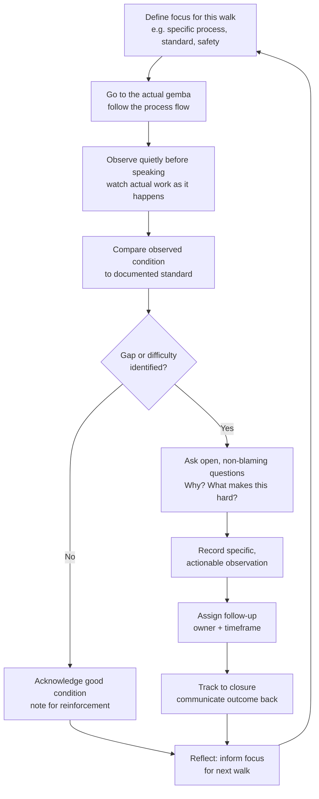

## Gemba Walks and Their Purpose and Practice

### Overview

A gemba walk is a structured practice of going to the actual place where work is performed — the *gemba* (現場), literally "the real place" — to observe the process directly, understand it as it actually operates, and engage with the people doing the work, rather than managing based on reports, dashboards, or secondhand summaries alone. In TPS, the gemba is treated as the primary source of truth: the shop floor, not the conference room, is where waste, abnormalities, and improvement opportunities are actually visible. Gemba walks formalize "go and see" (*genchi genbutsu*) into a repeatable management practice, distinguishing genuine gemba walks — disciplined, observation-focused, and respectful of the people working there — from superficial "management walkthroughs" that inspect for compliance or produce disruption without generating any real understanding or improvement.

### Key Points

- Gemba walks are grounded in *genchi genbutsu* — "go and see for yourself" — the principle that decisions and understanding should be based on direct observation of actual conditions, not assumptions, reports, or relayed descriptions
- The primary purpose of a gemba walk is to *understand the process and support the people doing the work*, not to audit, catch mistakes, or assign blame — this distinction fundamentally shapes how the walk is conducted
- A gemba walk should follow the actual flow of material or information (following the process), rather than randomly wandering or only visiting the areas a manager happens to know well
- Effective gemba walks are structured around specific questions and a consistent focus (safety, quality, a particular process, a specific standard), not open-ended, unfocused observation
- The walk's value depends heavily on psychological safety: if operators fear that pointing out a problem to a walking leader will result in blame, they will hide problems, and the walk's core purpose — surfacing reality — is defeated

### The Purpose of Gemba Walks

**1. Ground decisions in direct observation, not assumption**

Reports and dashboards are abstractions; they summarize reality but can obscure or delay important nuance. A schedule-attainment number might look fine while masking a workaround an operator has quietly adopted because the documented standard doesn't actually work under current conditions. Gemba walks close this gap by putting the observer directly in contact with the actual condition.

**2. Build direct relationships between leadership and the people doing the work**

Regular, respectful presence on the floor — especially when it is clearly not primarily for catching people doing something wrong — builds trust that makes operators more willing to surface problems, propose improvements, and be candid about difficulties with the current standard.

**3. Reinforce that standards matter and are actively supported**

A leader who regularly checks whether Standardized Work is being followed, and who investigates *why* when it isn't (rather than assuming laziness or non-compliance), reinforces both the importance of the standard and the organization's commitment to fixing whatever is making the standard hard to follow.

**4. Surface waste and abnormalities that don't appear in aggregate metrics**

Waste (muda) — waiting, excess motion, overproduction, defects, unnecessary transport — is often visible on the floor well before it shows up as a measurable trend in a report. A gemba walk is a direct search for these forms of waste in their physical, observable form.

**5. Develop the walker's own understanding of the process**

Especially for leaders who did not come up through operations, or whose process knowledge might be dated, gemba walks are a mechanism for staying current with how work actually happens now, not how it happened when they last worked the floor directly.

### Genchi Genbutsu: The Underlying Principle

*Genchi genbutsu* translates roughly as "actual place, actual thing" and is one of the foundational TPS principles underlying gemba walks specifically and much of Toyota's problem-solving approach generally. The principle holds that:

- Problems should be investigated at the location where they actually occur, not reconstructed from secondhand reports
- Data and reports are useful but incomplete; direct observation frequently reveals context, constraints, or nuances that don't survive being summarized into a metric
- Decision-makers who have personally observed a situation make better-informed decisions than those relying entirely on relayed information

Gemba walks are the routine, scheduled application of genchi genbutsu; a focused investigation of a specific problem at its source (e.g., a root-cause investigation following a defect) is genchi genbutsu applied to a specific incident rather than a regular walking cadence.

### How to Conduct an Effective Gemba Walk

**1. Define a focus before starting**

An unfocused walk tends to produce unfocused observations. Common focus areas include a specific process step, adherence to a particular Standardized Work document, safety conditions, 5S status, or following up on a previously identified problem. The focus should be communicated (implicitly or explicitly) so operators understand what the walk is about.

**2. Go to where the work actually happens**

This sounds obvious but is the most commonly skipped step — reviewing a summary of the area from an office, or having someone bring samples or data to a meeting room, is not a gemba walk regardless of how much genuine attention is paid to that information.

**3. Follow the process flow**

Walking the actual path material or information takes through the process — rather than jumping between disconnected points — reveals handoffs, queues, and transitions that are often where the most significant waste accumulates.

**4. Observe before speaking**

Spend meaningful time watching the actual work before commenting or asking questions. Immediate commentary, especially critical commentary, short-circuits the observation phase and can prime operators to perform for the observer rather than work normally.

**5. Ask open, non-blaming questions**

Questions framed to understand rather than to judge — "What's difficult about this step?" "What happens when this part arrives late?" "Walk me through what you did just now and why" — surface far more useful information than questions that presuppose a fault ("Why aren't you following the standard?").

**6. Compare observed condition to the documented standard**

Where Standardized Work exists, the walk should note whether actual practice matches the posted standard, and — critically — treat any gap as a question to investigate (is the standard outdated? is there an unaddressed obstacle? is there a training gap?) rather than an automatic violation to correct on the spot.

**7. Engage respectfully with the people present**

Acknowledge operators, ask permission before interrupting if timing allows, and treat the interaction as a two-way conversation, not an inspection of a subject who has no voice in the exchange.

**8. Record specific, actionable observations**

Vague notes ("area seemed disorganized") are far less useful than specific ones ("bin for part #4521 was empty at 10:15am, operator reported this happens roughly twice a shift"). Specificity is what makes an observation followable into a corrective action.

**9. Follow up — this is the step most often skipped**

An observation that generates no visible follow-up teaches operators that gemba walks are theater. Whatever is raised — a problem, a question, a commitment to investigate — should be tracked and closed out, and ideally the outcome should be communicated back to the people who raised or were involved in the original observation.

**10. Reflect and adjust the next walk's focus**

Use what was learned to inform where the next walk should focus, building a cumulative understanding of the area over successive visits rather than treating each walk as an isolated event.

### Comparison: Genuine Gemba Walk vs. Compliance-Style Management Walkthrough

| Dimension | Genuine Gemba Walk | Compliance-Style Walkthrough |
| --- | --- | --- |
| Primary intent | Understand the process; support the people doing it | Check for rule violations; assign corrective action |
| Framing to operators | "Help me understand what's happening here" | "Am I going to find something wrong?" |
| Response to a deviation found | Investigate why; treat as a signal | Correct immediately; treat as a violation |
| Effect on psychological safety | Builds trust over time if consistently non-punitive | Erodes trust; teaches operators to hide problems |
| Typical outcome | Specific, followed-up observations feeding kaizen | A list of infractions, sometimes with disciplinary follow-up |
| Operator behavior when walker approaches | Continues normal work; may proactively raise issues | Performs "correct" behavior for the duration of the visit |
| Long-term effect on standard adherence | Improves, because obstacles to following the standard get addressed | Often superficial, reverting once the walker leaves |

### Common Failure Modes

- **Walks used as inspections**: leadership presence on the floor is primarily experienced as scrutiny, causing operators to alter behavior for the duration of the visit ("Hawthorne effect" style distortion) — [Inference] this behavioral-change-under-observation pattern is widely discussed in management literature generally, not a TPS-specific finding, but it directly undermines a gemba walk's purpose regardless of source
- **No follow-up on raised issues**: observations and commitments made during a walk are never tracked to closure, teaching the workforce that the walk is a ritual without consequence
- **Unfocused wandering**: walks with no defined purpose tend to produce shallow, scattered observations rather than a coherent, cumulative understanding of an area
- **Talking more than observing**: a leader who spends most of the walk explaining, directing, or lecturing rather than watching and asking questions misses the actual point of "going to see"
- **Infrequent or irregular cadence**: sporadic walks (once a quarter, or only when a problem has already surfaced) fail to build the ongoing relationship and pattern-recognition that regular walks provide
- **Skipping the front line for the office**: reviewing a report or a summarized dashboard and calling it "gemba" — the term specifically requires physical presence at the actual place
- **Punitive response to deviations found**: disciplining an operator on the spot for a deviation discovered during a walk, without first investigating why the deviation occurred, discourages future transparency
- **Walking without a translator of intent**: a senior leader unfamiliar with normal floor etiquette or safety protocol disrupting work or creating a safety issue during the walk itself, undermining both safety discipline and the walk's credibility

### Gemba Walk Cycle

### Roles and Responsibilities

- **Team Leader / Supervisor**: conducts the most frequent gemba walks (often daily), closest to the point of work, with direct authority to address most observations quickly
- **Middle Management / Value-Stream Manager**: conducts walks at a lower frequency (weekly), often following up on cross-area or recurring issues that individual team leaders can't resolve alone
- **Senior Leadership**: conducts periodic walks (e.g., monthly), whose primary value is reinforcing organizational priority and gathering unfiltered, direct understanding of floor reality, less about resolving individual tactical issues personally
- **Operators**: are not passive subjects of the walk — a mature gemba walk practice actively solicits their observations and treats them as the primary source of insight into their own workstation

### Example

A plant manager conducts a weekly gemba walk focused, this week, on a recently updated Standardized Work Chart at a sub-assembly cell. Rather than starting with questions, the manager observes two full cycles silently. On the second cycle, the operator reaches for a fastener bin in a way that doesn't match the documented path on the chart. Instead of correcting the operator on the spot, the manager waits until a natural pause and asks, "I noticed you're reaching over there for that part — can you walk me through why?" The operator explains that the marked bin location is frequently empty because the refill cycle doesn't match actual consumption rate, so they've been quietly working around it for weeks.

This is recorded as a specific, actionable observation: bin refill frequency mismatch at station 4, causing an undocumented workaround. Rather than disciplining the operator for deviating from the posted standard, the manager assigns the team leader to investigate the refill cycle with materials handling. The following week's walk confirms the refill schedule has been adjusted and the operator is now following the documented path without needing the workaround — an outcome made possible specifically because the walk treated the deviation as a signal to investigate rather than a violation to correct.

### Conclusion

Gemba walks operationalize genchi genbutsu — the principle that direct observation of the actual place produces understanding that reports and secondhand summaries cannot — into a regular, structured management practice. Their value depends entirely on how they are conducted: a walk that is focused, observation-first, framed around non-blaming questions, and consistently followed up on builds both a genuine understanding of the process and the trust that makes operators willing to surface problems. A walk conducted as a compliance inspection, without follow-up, or without genuine respect for the people doing the work produces the opposite effect — it teaches the workforce to perform for the observer and hide the very problems the walk was meant to reveal, defeating its purpose regardless of how frequently it's conducted.

### Related Topics

- Genchi genbutsu and "go and see" decision-making
- Standardized Work Observation and audit discipline
- Psychological safety and non-punitive problem reporting
- Muda (waste) identification: the seven/eight forms of waste
- PDCA and root-cause investigation at the point of occurrence
- Tiered daily management meetings and escalation structures
- Obeya and cross-functional visual management
- Team leader as first-line coach and standard owner
- 5S audits as a related but distinct floor-observation practice
- Leadership standard work and management routines in lean organizations