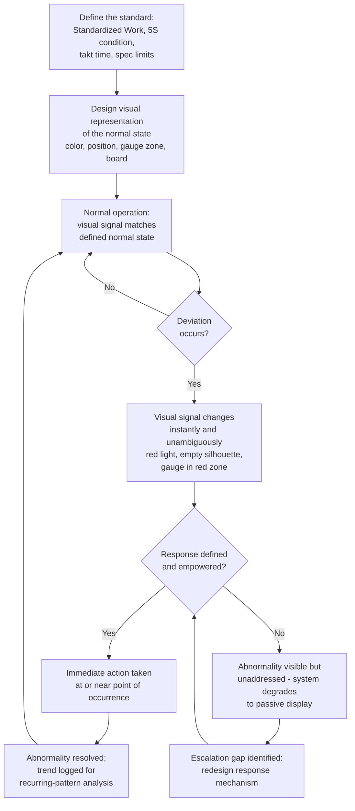

## Management by Sight and Abnormality Detection

### Overview

Management by sight (視える化, *mieruka*, often translated "visualization" or "making things visible") is the overarching TPS principle that a workplace should be designed so that its normal, correct operating state is instantly recognizable, and any deviation from that state — any abnormality — becomes visible to anyone looking, without requiring specialized knowledge, a report, or an explanation from someone else. It is the unifying concept behind 5S, visual controls, andon, kanban, and standardized work postings: each of these is a specific mechanism, and management by sight is the underlying design philosophy that explains why they all take the form they do. Abnormality detection is the direct payoff of management by sight — the entire point of making the normal state visible is so that the *abnormal* state stands out immediately, ideally to the person doing the work, before it propagates into a defect, a delay, or a larger problem.

### Key Points

- Management by sight is not about generating more information — it is about presenting information in a form that requires zero interpretation to understand whether a situation is normal or abnormal
- The core test of a well-designed visual workplace: can someone unfamiliar with the process determine, within seconds, whether things are running correctly, just by looking?
- Abnormality detection depends on first establishing a clear, unambiguous definition of "normal" — you cannot see a deviation from a standard that isn't itself precisely defined and visibly represented
- Management by sight operates at multiple layers simultaneously: the individual workstation, the production line, the department, and the whole facility — each layer typically needs its own appropriately-scaled visual system
- The ultimate goal is to shift abnormality detection from being solely a management responsibility (requiring inspection or reporting) to being a built-in property of the process itself, visible to and actionable by the person doing the work at the moment the abnormality occurs

### The Philosophy Behind Management by Sight

Traditional management often relies on reports, periodic inspections, or escalation chains to surface problems — a structure in which abnormalities are discovered after some delay, often by someone other than the person closest to the process, and often only after the abnormality has already caused downstream effects. Management by sight inverts this: it treats the workplace itself as the reporting mechanism, engineered so that the process's current state broadcasts itself continuously to anyone present, especially the operator, without anyone needing to ask, check, or wait for a report cycle.

This connects directly to jidoka (automation with a human touch) and to the general TPS preference for stopping problems at their source rather than catching them downstream: if an abnormality is visible the instant it occurs, at the location where it occurs, the person best positioned to respond (the operator) can act immediately, rather than the problem surviving until a scheduled inspection, a quality audit, or a customer complaint eventually surfaces it.

### Preconditions for Effective Abnormality Detection

Abnormality can only be recognized against a clearly defined normal. This makes several other TPS disciplines direct prerequisites for management by sight, not separate initiatives:

- **Standardized Work** defines the normal work sequence, cycle time, and motion pattern — without it, "abnormal" performance has no fixed reference point
- **5S (particularly Set in Order and Standardize)** defines the normal physical location and condition of items and the workspace — without it, a missing tool or a spill has no visible baseline to be missing or present against
- **Takt time** defines the normal pace of production — without it, "falling behind" has no clear threshold
- **Specification limits and quality standards** define the normal range of a measured characteristic — without them, a measurement has no basis for being flagged as out of range

Management by sight, in other words, is not a technique that can be bolted onto a disorganized or undocumented process — it is the visible expression of standards that must already exist for the visibility to mean anything.

### Categories and Techniques of Abnormality Detection

**1. Positional/spatial abnormality (visible via 5S and Set in Order)**

- Shadow boards: an empty silhouette is instantly recognizable as "tool missing"
- Floor marking: an item, cart, or person outside a marked zone is immediately visible as out of place
- Min/max stock lines: material level outside the marked range is visible without counting

**2. Status abnormality (visible via andon and status boards)**

- Color-coded andon lights: red/yellow/green states communicate line or station status without requiring anyone to ask
- Running versus stopped machine indicators (often a simple light or flag at each machine)

**3. Sequence/pace abnormality (visible via takt-time and pacing displays)**

- Hour-by-hour production boards showing planned versus actual: a growing gap is visible well before shift-end
- Pacing lights or digital countdown timers referencing takt time, showing whether the operator's current cycle is on pace

**4. Quality abnormality (visible via poka-yoke and inline checks)**

- Poka-yoke fixtures that physically prevent an incorrectly oriented or incomplete part from proceeding — the abnormality is not just visible but blocked
- Color-coded or gauge-based measurement displays (a needle in a marked red zone communicates out-of-spec instantly, without reading and mentally comparing a number to a spec sheet)

**5. Flow/inventory abnormality (visible via kanban and WIP limits)**

- Kanban card accumulation beyond a defined point signals overproduction or a downstream slowdown
- Visibly excess work-in-process piling up at a station is itself a visual signal that something upstream or downstream is out of balance, even without a formal WIP-limit system

**6. Condition/wear abnormality (visible via Shine/clean-to-inspect and TPM practices)**

- A clean baseline makes a new leak, a metal shaving, or unusual residue visible almost immediately, whereas the same abnormality is invisible against a chronically dirty baseline

### Designing for "At a Glance" Recognition

Several practical design principles recur across these techniques and are worth stating explicitly:

- **Minimize the interpretation required.** A color (red = stop/abnormal) requires no interpretation; a number on a screen requires reading, recalling a threshold, and comparing — each of those steps is an opportunity for the abnormality to be missed or the response to be delayed.
- **Make the abnormal state impossible to mistake for normal.** An empty shadow-board silhouette, a red andon light, or a part that physically won't fit into a poka-yoke fixture cannot be confused with the correct state, unlike, say, a slightly-off number that might be dismissed as within noise.
- **Locate the signal where the response needs to happen.** A signal visible only in a remote office does little to enable the operator at the point of work to respond immediately; effective management by sight generally locates the signal at or very near the point where the abnormality occurs.
- **Keep the visual vocabulary small and consistent.** Overloading a facility with many different colors, symbols, or board formats defeats the "instantly recognizable" goal — consistency across areas means someone trained to read one board can read any similar board elsewhere in the facility.
- **Pair visibility with an expected response.** Visibility alone (a passive display) is necessary but not sufficient — as with the broader visual-controls-versus-displays distinction, a management-by-sight system delivers its full value only when the visible abnormality is reliably paired with a known, expected response, ideally one the person who sees it first can initiate themselves.

### Layers of Management by Sight

| Layer | What "normal" looks like | Example abnormality signals |
| --- | --- | --- |
| Workstation | Tools in place, parts within min/max, cycle on pace | Empty shadow board, empty bin, andon pull |
| Production line | All stations green/running, hourly count on target | Red andon segment, growing actual-vs-plan gap on hour board |
| Department/value stream | WIP within normal range, no aged issues on the board | Kanban pile-up, aging unresolved items on a tiered issue board |
| Facility/plant | Safety, quality, and delivery metrics within normal range on daily review boards | A metric crossing a defined threshold, triggering the escalation tied to a tiered management system |

### Common Failure Modes

- **Abnormal state not clearly distinguishable from normal**: a visual system where the "correct" and "incorrect" states look similar (e.g., ambiguous color choices, no clear boundary markings) fails the basic test of instant recognizability
- **No defined response tied to the signal**: a visible abnormality that nobody is expected or empowered to act on immediately degrades into decoration — this is the same control-versus-display distinction that applies to andon specifically, generalized to the whole management-by-sight system
- **Undefined or drifting "normal"**: without a maintained, current Standardized Work document, 5S standard, or takt-time reference, the visual system has nothing stable to compare against, and what counts as "abnormal" becomes a matter of individual judgment rather than an objective signal
- **Visual overload**: too many signals, colors, or boards competing for attention causes genuinely important abnormalities to blend into noise
- **Detection without empowerment**: an operator who can see an abnormality but has no authority or clear channel to respond (e.g., no andon system, or a culture that discourages stopping the line) experiences the visibility as frustrating rather than useful
- **Retrofitting visibility onto an undocumented process**: attempting to install visual boards or color-coded signals before the underlying standard (Standardized Work, 5S condition, spec limits) is actually defined and stable, producing a visual system that looks organized but doesn't correspond to any real, agreed baseline
- **Treating management by sight as a one-time installation**: like 5S's Sustain phase, a visual system requires ongoing maintenance (updated reference photos, current standards, recalibrated thresholds) — a system that isn't kept current eventually starts displaying a "normal" that no longer matches reality

### Management by Sight: From Standard to Detected Abnormality

### Roles and Responsibilities

- **Operator**: is the primary detector and, ideally, first responder to abnormalities at their own workstation, since they are physically present continuously and positioned to notice deviation the instant it occurs
- **Team Leader**: designs and maintains the workstation- and line-level visual systems, ensures the defined "normal" stays current as standards are updated, and is typically the designated responder when an operator's detection triggers a signal requiring help
- **Engineering/Quality**: defines the specification limits, gauge zones, and poka-yoke logic that translate a quality standard into a visible pass/fail or in-range/out-of-range signal
- **Management/Leadership**: reviews department- and facility-level visual boards as part of tiered daily management, ensures the response mechanisms tied to visual signals remain functional and resourced, and models the behavior of actually acting on what the visual system reveals rather than only reviewing it passively

### Example

A stamping line installs pressure gauges with marked red/yellow/green zones on each press, replacing digital numeric readouts that operators previously had to compare mentally against a printed spec sheet. Within the first month, an operator notices a press's gauge needle drifting into the yellow zone over several cycles — a change that would have been easy to miss as "still basically the same number" on a digital display, but is immediately visually apparent as movement toward the boundary on the color-zoned gauge. The operator flags it before the needle reaches red, and maintenance identifies early wear on a seal well before it would have caused an out-of-spec part or an unplanned stoppage.

This single change — replacing a numeric display with a color-zoned visual — didn't alter the underlying process at all, only how its state was presented; the abnormality (gradual pressure drift) existed identically either way, but only the visual, management-by-sight version made it detectable by the operator in real time, at the point of work, without requiring active mental comparison against a remembered specification.

### Conclusion

Management by sight is the design philosophy that unifies 5S, Standardized Work, andon, poka-yoke, and kanban into a coherent system: make the normal operating condition of every layer of the workplace immediately and unambiguously visible, so that any deviation from it is equally immediate and unambiguous, ideally to the person closest to where it occurs. Its effectiveness depends entirely on two things existing together — a clearly defined and currently maintained standard to compare against, and a real, empowered response mechanism tied to whatever signal reveals a deviation from it. Without the first, there is nothing meaningful to detect a deviation from; without the second, even a perfectly designed visual signal degrades into decoration that reveals problems no one is positioned or expected to act on.

### Related Topics

- Mieruka (visualization) as the umbrella TPS visual-management concept
- Visual controls versus visual displays
- Andon boards and real-time performance visualization
- 5S: Sort, Set in Order, Shine, Standardize, Sustain
- Poka-yoke and physical error-proofing design
- Jidoka and stop-the-line philosophy
- Standardized Work as the baseline "normal" for motion and sequence
- Kanban and visual pull-signal inventory control
- Tiered daily management and escalation structures
- Gemba walks as a human-driven complement to built-in visual detection