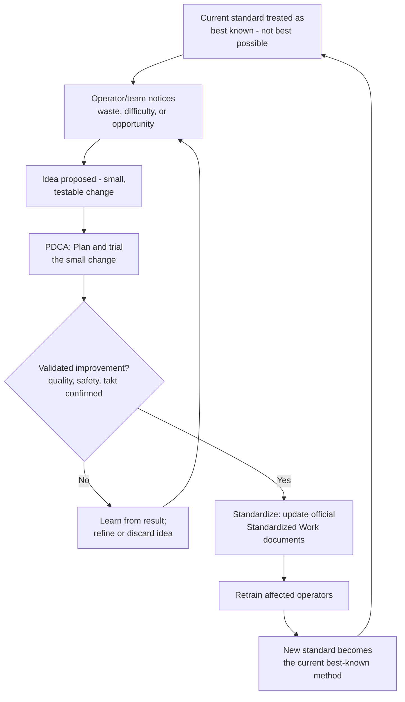

## The Kaizen Mindset and Philosophy of Continuous Small Steps

### Overview

Kaizen (改善) combines the Japanese characters for "change" and "good," commonly translated as "improvement" or "continuous improvement." As a mindset rather than a technique, kaizen holds that meaningful, lasting improvement comes primarily from a continuous stream of small, incremental changes made by the people closest to the work, rather than from occasional large, top-down transformation projects. This distinguishes kaizen philosophically from breakthrough or "big-bang" improvement approaches: kaizen does not reject large improvements when they're warranted, but it treats the accumulation of many small, tested, standardized changes — sustained indefinitely — as the primary engine of a lean organization's long-term performance, and treats every person in the organization, not just specialists or engineers, as a legitimate source of improvement ideas.

### Key Points

- Kaizen is a mindset and daily discipline, not a single event or a department — the "kaizen event" (a scheduled, intensive workshop) is one specific application of the philosophy, not the philosophy itself
- Small, incremental, continuous change compounds over time into large cumulative improvement, and — critically — is far more sustainable than large, infrequent changes because each small change is easier to fully understand, validate, and standardize before the next one is layered on top
- Kaizen assumes that the people doing the work possess irreplaceable tacit knowledge about waste, difficulty, and improvement opportunity that no outside engineer or manager can fully substitute for
- "There is no such thing as a process so good that it cannot be improved" is a foundational kaizen belief — the current standard is always understood as the best *known* method today, not the best *possible* method
- Kaizen requires psychological safety and a non-punitive response to problems: since kaizen depends on people surfacing waste and difficulty (which often means admitting something isn't working well), a culture that punishes the messenger extinguishes the flow of improvement ideas at the source

### The Philosophical Foundations

**Small steps versus big leaps**

Kaizen's central wager is that small, frequent, well-validated changes outperform large, infrequent ones over the long run, for several interlocking reasons:

- A small change is easier to fully understand and test before committing to it, reducing the risk of an untested large change causing unforeseen problems elsewhere in the system
- A small change is easier for the people affected by it to absorb, adapt to, and sustain, compared to a disruptive large-scale change imposed all at once
- A continuous cadence of small changes keeps improvement as an ongoing, everyday activity rather than an occasional, disruptive "project," normalizing change itself as part of how work is done
- Cumulatively, a steady stream of small improvements compounds; a percentage improvement repeated regularly over months or years can exceed what a single large initiative achieves, while carrying substantially less implementation risk at any given step

**Everyone is a source of improvement**

Kaizen explicitly rejects the idea that improvement is the exclusive domain of engineers, specialists, or management. The person performing a task repeatedly, every day, typically has direct, detailed, tacit knowledge of exactly where the task is awkward, wasteful, or risky — knowledge that is difficult for an outside observer to fully replicate through occasional observation alone. Kaizen philosophy treats this frontline knowledge as a primary and legitimate input to improvement, not merely a supplementary one.

**Standards enable kaizen, and kaizen changes standards**

Kaizen and Standardized Work are mutually dependent, not separate disciplines: without a defined current standard, there is no stable baseline against which an improvement can be measured, validated, or even recognized as an improvement at all. Once a change is validated, updating the standard (see: updating standards after improvement) is what "locks in" the gain and prevents drift back to the prior method — without this step, an improvement is a temporary deviation rather than a genuine kaizen.

**The current state is never treated as finished**

A kaizen mindset resists complacency about current performance, regardless of how good current performance already is relative to competitors or historical baselines. This is sometimes summarized as "there is no last improvement" — a kaizen culture treats even a well-performing process as merely the current best-known method, implicitly inviting the next incremental improvement rather than treating good performance as a reason to stop looking.

**Problems are valuable, not shameful**

Because kaizen depends on continuously surfacing waste, difficulty, and defects, a kaizen culture must treat the discovery of a problem as valuable information rather than as an occasion for blame. This is a significant cultural departure from management approaches where reporting a problem risks exposing the reporter to criticism — under those conditions, people learn to hide problems rather than surface them, which starves kaizen of its primary raw material.

### Kaizen Versus Kaikaku (Radical/Breakthrough Change)

Kaizen is often contrasted with *kaikaku* (改革), meaning radical or revolutionary change — a large-scale, often disruptive transformation (a new production line design, a major technology change, a significant layout overhaul). Both have legitimate places in a lean organization, and understanding the distinction clarifies when each is the appropriate tool.

| Dimension | Kaizen (continuous small steps) | Kaikaku (radical change) |
| --- | --- | --- |
| Scale of change | Small, incremental | Large, transformational |
| Frequency | Continuous, ongoing, everyday | Occasional, project-based |
| Primary source of ideas | Frontline operators and team leaders | Often engineering, management, or specialist-led |
| Risk per change | Low — easy to test, validate, and reverse | Higher — larger investment, larger consequences if wrong |
| Typical trigger | Ongoing observation of waste and difficulty | A strategic shift, a major capability gap, or a competitive threat |
| Relationship to standards | Standard is updated after each validated small change | Standard is often substantially redesigned |
| Cultural requirement | Broad participation, psychological safety, daily habit | Strong leadership sponsorship, cross-functional coordination |

[Inference] The precise boundary between a "large kaizen" and a "small kaikaku" is not rigidly fixed in the literature — the terms describe a continuum and a difference of philosophy and cadence more than a strictly quantified size threshold, and practitioners' usage varies.

### Mechanisms Through Which the Kaizen Mindset Is Practiced

The philosophy manifests through several concrete organizational mechanisms, each covered in more depth as its own topic elsewhere, but worth naming here as expressions of the underlying mindset:

- **Daily kaizen / point kaizen**: small, individual-level improvements made by an operator to their own immediate work area or task, often without requiring a formal event or significant resource
- **Kaizen events (kaizen blitz)**: scheduled, intensive, time-boxed workshops (commonly several days) where a cross-functional team focuses on a specific process or area
- **Suggestion systems**: a formal channel for capturing and acting on improvement ideas from any employee, with feedback loops to keep contributors engaged
- **PDCA cycles**: the structured scientific method (Plan-Do-Check-Act) that gives kaizen its methodological rigor, ensuring that "small steps" are also validated, evidence-based steps rather than untested guesses
- **Standardize-after-improve discipline**: the practice of updating official standards once a kaizen is validated, which is what prevents individual improvements from evaporating over time

### The Compounding Effect of Small Improvements

The core mathematical intuition behind kaizen's preference for small, frequent change over large, infrequent change is that repeated proportional gains compound multiplicatively:

$$P_n = P_0 \times (1 + r)^n$$

where $P_0$ is the starting performance level, $r$ is the small improvement rate achieved per cycle, and $n$ is the number of improvement cycles completed. Even a modest $r$ per cycle, sustained over a large $n$, produces substantial cumulative gain — and because each individual $r$ is small, each change carries proportionally less implementation risk, less disruption to the people affected, and is easier to validate before committing to it than a single change attempting to achieve the same cumulative gain in one step.

[Inference] This compounding framing is a widely used illustrative analogy for explaining kaizen's rationale rather than a formula found verbatim in original TPS source material — actual improvement processes rarely follow a perfectly smooth exponential curve in practice, since individual kaizen gains vary in size and are subject to diminishing returns as a process matures.

### Common Failure Modes

- **Treating "kaizen" as synonymous with "kaizen event"**: reducing the philosophy to a scheduled workshop a few times a year misses the core idea that kaizen is meant to be a continuous, everyday activity, not a periodic program
- **Punishing problem reporting**: if surfacing a difficulty or a defect results in blame, employees rationally stop surfacing them, and the flow of raw material for kaizen dries up regardless of how many events are scheduled
- **No mechanism to capture and act on ideas**: a workforce genuinely willing to suggest improvements, but with no suggestion system, no time allocated, or no follow-through on submitted ideas, quickly learns that participation doesn't matter
- **Confusing activity with kaizen**: hosting frequent kaizen events that produce recommendations which are never validated, standardized, or sustained is motion, not actual continuous improvement
- **Expecting kaizen to substitute entirely for necessary radical change**: some problems (a fundamentally undersized facility, an obsolete core technology) genuinely require kaikaku-scale change; treating every problem as solvable through incremental steps alone can mean under-investing in transformation that's actually needed
- **Management-only kaizen**: improvement initiatives designed and executed exclusively by engineering or management staff, without meaningful frontline involvement, forfeit the tacit-knowledge advantage that is kaizen's core philosophical justification
- **No time or capacity allocated**: expecting kaizen participation on top of a fully loaded existing workload, with no protected time, treats the philosophy as an unfunded mandate rather than a genuine organizational priority

### The Kaizen Mindset Cycle

### Roles and Responsibilities

- **Operator**: is the primary daily source of improvement ideas, expected and encouraged (not merely permitted) to notice and raise waste, difficulty, and opportunity in their own area
- **Team Leader**: coaches operators toward structured problem-solving (PDCA, basic root-cause tools), responds non-punitively to reported problems, and ensures validated ideas get formalized into updated standards
- **Kaizen Facilitator / Continuous Improvement Staff**: designs and runs structured kaizen events, maintains suggestion-system throughput and feedback cycles, and tracks cumulative kaizen activity and impact over time
- **Management/Leadership**: allocates protected time and resources for kaizen activity, models non-punitive response to surfaced problems, distinguishes when a challenge calls for kaizen versus kaikaku, and sustains organizational attention on continuous improvement as an everyday expectation rather than an occasional initiative

### Example

A packaging line operator notices that a specific carton-folding motion, repeated hundreds of times per shift, requires an awkward wrist rotation that slows the cycle slightly and causes mild fatigue by the end of a shift. Rather than treating this as simply "how the job is," the operator — in a culture where raising such observations is normal and welcomed — proposes rotating the carton feed orientation by roughly 30 degrees.

The team leader times the proposed change over several cycles, confirms it doesn't affect the fold quality or exceed takt time, and finds the new orientation actually reduces cycle time slightly while eliminating the awkward motion. This single change is small — it would barely register as a line item in an annual improvement report — but it is trialed, validated, and standardized within days, and the updated Standardized Work Chart is rolled out to both shifts. Over a year, dozens of similarly modest changes across the line, each individually unremarkable, compound into a measurably faster, less fatiguing, and more consistent process than would likely have resulted from a single annual "improvement project" attempting to redesign the whole line at once.

### Conclusion

The kaizen mindset holds that sustained, meaningful improvement comes primarily from a continuous stream of small, validated, standardized changes made by the people who do the work every day, rather than from occasional large transformation efforts alone. Its philosophical core rests on treating the current standard as merely the best-known method today, treating frontline tacit knowledge as an essential and legitimate input to improvement, and treating surfaced problems as valuable signals rather than occasions for blame. Kaizen does not replace the need for radical change (kaikaku) when a genuine strategic or capability gap calls for it, but it functions as the everyday, compounding engine of improvement that — sustained over time, protected with real capacity, and reinforced by psychological safety — produces cumulative gains that occasional large projects alone typically cannot match.

### Related Topics

- PDCA (Plan-Do-Check-Act) as kaizen's methodological engine
- Kaizen events (kaizen blitz) structure and facilitation
- Kaikaku and radical/breakthrough change
- Updating standards after improvement
- Suggestion systems and idea-to-implementation cycle time
- Psychological safety and non-punitive problem reporting
- 5 Whys and root-cause analysis as daily kaizen tools
- Standardized Work as the baseline for measuring improvement
- Gemba walks as a mechanism for surfacing kaizen opportunities
- Toyota Production System's two pillars: Jidoka and Just-in-Time