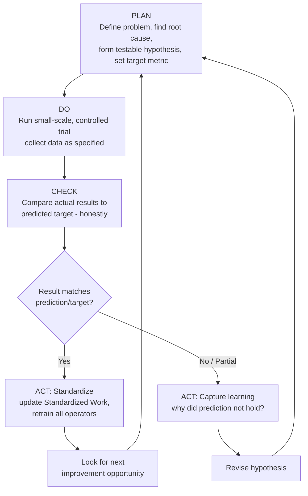

## PDCA as the Plan Do Check Act Cycle

### Overview

PDCA (Plan-Do-Check-Act), also known as the Deming Cycle or Shewhart Cycle after the statisticians most closely associated with its development and popularization, is the structured scientific method that gives kaizen its methodological rigor. Where the kaizen mindset provides the philosophy — continuous small steps, driven by frontline knowledge, treated as valuable rather than threatening — PDCA provides the concrete, repeatable procedure for actually carrying out a single improvement cycle: forming a hypothesis about a better method, testing it in a controlled way, honestly evaluating the result against the original prediction, and then either standardizing the change or learning from its failure and trying again. Nearly every structured problem-solving activity within TPS — kaizen events, A3 problem-solving, updating standards after improvement — is, at its core, an application of PDCA.

### Key Points

- PDCA is a cycle, not a linear project — after Act, the loop returns to Plan, either to standardize and look for the next improvement or to revise the approach based on what Check revealed
- Plan is the most frequently under-invested phase in practice — teams often rush to "Do" before clearly defining the problem, the goal, the specific change to test, and how success will be measured
- Check must be an honest, evidence-based comparison against the prediction made in Plan, not a general impression of whether things "seem better" — this is what separates PDCA from an unstructured trial-and-error approach
- Act has two distinct outcomes depending on Check's result: if the change worked, Act standardizes it (locking in the gain); if it didn't work as predicted, Act captures the learning and feeds it into the next Plan
- PDCA operates at multiple scales simultaneously — an individual operator can run a PDCA cycle on a single motion in an afternoon, while an organization can run PDCA at the strategic level (hoshin kanri) over a full fiscal year

### The Four Phases in Detail

**Plan**

Define the problem or opportunity clearly, using direct observation of the actual situation (genchi genbutsu) rather than assumption. A well-executed Plan phase includes:

- A specific, clearly stated problem definition — not "quality is bad" but "defect rate on operation 4 has been 3.2% over the past month, versus a target of 1%"
- Root-cause investigation (5 Whys, fishbone/cause-and-effect analysis, or direct observation) to understand *why* the current condition exists, rather than jumping directly to a proposed fix based on assumption
- A specific, testable hypothesis: "if we relocate the parts bin to reduce reach distance, cycle time will decrease by approximately 3 seconds without affecting quality"
- A defined success metric and target, decided *before* the change is tested — this is what makes Check possible as an honest comparison rather than a retrospective rationalization
- A trial plan: scope, duration, who is involved, and what data will be collected

**Do**

Implement the planned change, but typically as a small-scale, controlled trial rather than an immediate full rollout — this is a deliberate risk-reduction practice, consistent with kaizen's preference for small, testable steps over large, unvalidated commitments.

- Execute exactly what was planned, so that the results can be attributed to the specific change tested, rather than to an ad hoc mix of adjustments made during implementation
- Collect the data specified in the Plan phase as the trial runs, rather than only after it concludes
- Document deviations from the plan as they occur — if the trial didn't run exactly as intended, that context matters when interpreting the results in Check

**Check**

Compare the actual results against the prediction and target set in Plan, honestly and specifically.

- Was the predicted outcome achieved? By how much, and with what variation across trials, shifts, or operators?
- Were there unintended side effects — did solving the target problem create a new one elsewhere (a classic risk with any localized change)?
- Was the change actually implemented as planned, or did execution drift from the plan in a way that complicates interpreting the result?
- This phase requires intellectual honesty: a team invested in a proposed change can be tempted to interpret ambiguous results favorably; disciplined Check requires comparing against the *specific, pre-defined* target set in Plan, not a post-hoc, more forgiving standard

**Act**

Based on what Check revealed, take one of two paths:

- **If validated**: standardize the change — update the relevant Standardized Work documents, retrain all affected operators, and treat the new method as the current best-known standard (see: updating standards after improvement)
- **If not validated, or only partially validated**: capture what was learned — why didn't the change produce the predicted result? Was the hypothesis wrong, was the trial poorly controlled, or did an unaccounted-for factor interfere? — and feed this understanding into a revised Plan for the next cycle

Either path leads back into Plan: a successful cycle prompts the search for the *next* improvement opportunity (consistent with the kaizen belief that no process is ever finished), while an unsuccessful cycle prompts a revised hypothesis to test next.

### PDCA as a Continuous Cycle, Not a Linear Project

A common misapplication of PDCA treats it as a one-time linear sequence: Plan, then Do, then Check, then Act, then stop. The name itself signals otherwise — it is a *cycle*, explicitly intended to repeat indefinitely. This connects directly to the kaizen mindset: because no standard is ever treated as final, every completed PDCA cycle (successful or not) naturally opens into the next one, either building on a newly standardized improvement or refining an approach that didn't work as predicted the first time.

### Relationship to Kaizen and Other TPS Tools

PDCA is the general-purpose scientific method underlying most other structured TPS problem-solving tools; those tools are typically PDCA with additional structure or format layered on:

| Related tool/practice | How it relates to PDCA |
| --- | --- |
| Kaizen mindset | PDCA is the *method* by which the kaizen *philosophy* of continuous small steps is actually executed and validated |
| A3 problem-solving | A single-page document format that walks through essentially the same Plan-Do-Check-Act logic (background, current condition, goal, root cause, countermeasures, results, follow-up) |
| Kaizen events | A time-boxed, cross-functional PDCA cycle (or several rapid cycles) executed over a few concentrated days |
| Updating standards after improvement | The specific Act-phase activity of formalizing a validated PDCA result into the official standard |
| 5 Whys / fishbone diagram | Root-cause tools used specifically within the Plan phase to move from symptom to underlying cause before proposing a countermeasure |
| Hoshin kanri (policy deployment) | PDCA applied at a strategic, organization-wide scale and cadence, cascading Plan-level goals down through the organization and rolling Check-level results back up |

### Comparison: Disciplined PDCA vs. Common Anti-Patterns

| Dimension | Disciplined PDCA | Common Anti-Pattern |
| --- | --- | --- |
| Starting point | Direct observation, root-cause analysis | Jumping straight to a proposed solution |
| Target/metric | Defined before the trial, specific and measurable | Vague or defined only after seeing results ("looks better") |
| Scale of first trial | Small, controlled | Full-scale rollout without a trial phase |
| Check phase | Honest comparison against pre-set target | Confirmation-biased interpretation favoring the proposed change |
| Failed trial handling | Learning captured, feeds next Plan | Quietly dropped or blamed on execution without genuine analysis |
| Successful trial handling | Standardized into official documents, all operators retrained | Left as an informal practice known only to the trial participants |
| Cycle continuation | Explicitly returns to Plan for the next opportunity | Treated as a completed, closed project |

### Common Failure Modes

- **Skipping or rushing Plan**: implementing a change based on intuition or a single anecdote, without root-cause analysis or a clearly defined success metric, makes Check meaningless because there's no specific prediction to compare against
- **No small-scale trial**: implementing a change at full scale immediately, without a controlled Do phase, increases risk and makes it harder to isolate whether the change itself (versus some other coincidental factor) caused any observed result
- **Confirmation bias in Check**: a team that invested effort in a proposed change unconsciously interpreting ambiguous or mixed results as success, rather than honestly measuring against the pre-defined target
- **No follow-through in Act**: a validated improvement that is never actually standardized into official Standardized Work documents and retrained across all shifts, meaning the gain quietly erodes over time (see: updating standards after improvement)
- **Treating a failed cycle as a dead end**: abandoning an initiative entirely after one unsuccessful trial, rather than treating the result as informative data that should shape a revised hypothesis for the next cycle
- **Treating PDCA as a one-time linear project**: closing out a PDCA effort after a single Act phase, rather than recognizing that the cycle is meant to continue — either into standardization-then-next-opportunity, or into a revised Plan
- **Metric mismatch**: measuring something different in Check than what was specified as the target in Plan, making the comparison invalid even when the data collected looks rigorous

### Illustrative Example

A shipping department has an average pick-and-pack cycle time of 4.1 minutes per order, against a target of 3.5 minutes.

**Plan**: Direct observation and a quick 5 Whys reveal that a significant portion of the time is spent walking to a shared label printer located at the far end of the packing area. Hypothesis: relocating a second label printer closer to the primary packing stations will reduce average cycle time by approximately 20–25 seconds per order, without affecting pick accuracy. Target: average cycle time of 3.6–3.7 minutes or better, no increase in mis-picks, measured over 100 orders.

**Do**: A second printer is installed at the packing stations for a one-week trial involving two of the four packers, with cycle time and pick-accuracy data logged for every order during the trial period.

**Check**: Average cycle time for the trial group drops to 3.65 minutes — within the predicted range — with no measurable change in pick-accuracy rate. The prediction is validated, close to the estimated magnitude.

**Act**: The change is standardized: a second (and, after reviewing total station count, a third) printer is permanently installed, the Standardized Work Chart for the packing station is updated to reflect the new equipment layout and reduced walk distance, and all four packers (not just the two involved in the trial) are retrained on the updated standard. The team then moves to Plan for the next opportunity, having noticed during the trial that mis-labeled boxes occasionally occurred when two printers queued similar-looking labels simultaneously — a new, smaller problem surfaced by solving the first one, which becomes the next PDCA cycle's Plan phase.

### Conclusion

PDCA is the disciplined, repeatable scientific method that operationalizes the kaizen mindset: it requires a clearly defined problem and testable hypothesis before acting (Plan), a controlled and data-collecting trial rather than an untested leap (Do), an honest comparison against a pre-defined target rather than a favorable retrospective impression (Check), and a decisive next step — either standardizing a validated gain or capturing the learning from an unvalidated one — that always feeds back into the next Plan (Act). Understanding PDCA as a continuous cycle rather than a linear, closable project is what connects it to the broader kaizen philosophy of continuous small steps: every cycle, successful or not, is expected to open directly into the next one.

### Related Topics

- The kaizen mindset and philosophy of continuous small steps
- 5 Whys and root-cause analysis techniques
- A3 problem-solving methodology and report format
- Updating standards after improvement
- Kaizen events (kaizen blitz) structure and facilitation
- Genchi genbutsu and direct observation in the Plan phase
- Hoshin kanri (policy deployment) as strategic-level PDCA
- Fishbone (Ishikawa) diagrams for cause analysis
- Statistical process control and data-driven Check-phase evaluation
- Confirmation bias and disciplined hypothesis testing in problem-solving