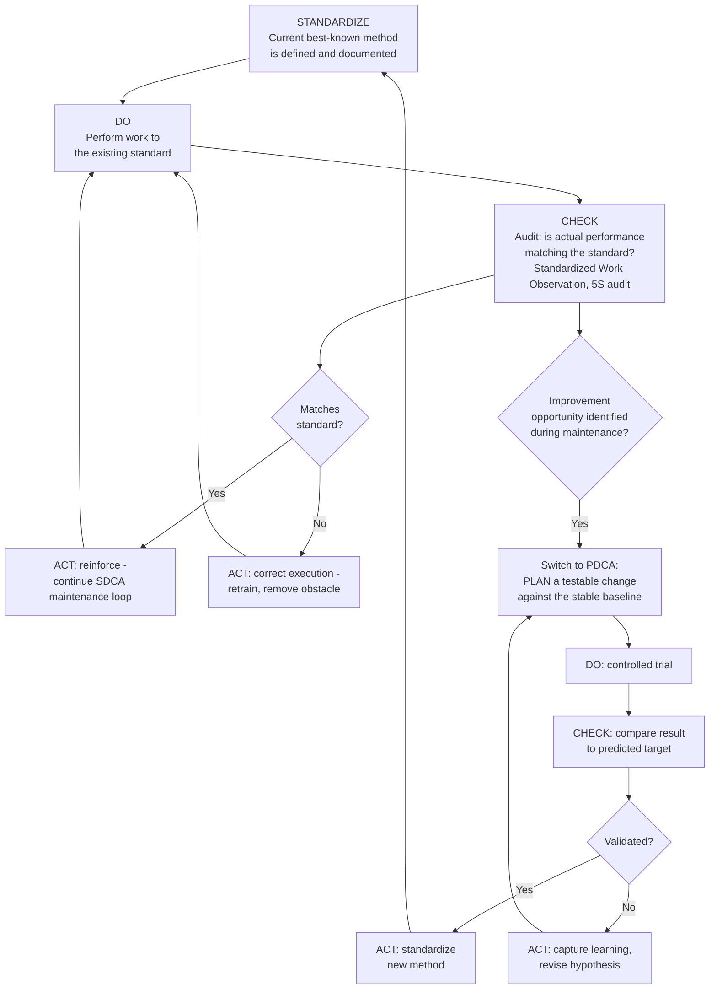

## SDCA Versus PDCA

### Overview

SDCA (Standardize-Do-Check-Act) and PDCA (Plan-Do-Check-Act) are complementary cycles that operate on different sides of the same underlying discipline: SDCA is the cycle used to *maintain* a process at its current standard once that standard has been established, while PDCA is the cycle used to *improve* a process beyond its current standard. Masaaki Imai, who popularized much of the kaizen literature in the West, framed this pairing explicitly: an organization must first stabilize a process through SDCA before PDCA can meaningfully improve it, because there is no reliable way to measure whether a change is an improvement if the starting condition itself is not yet stable and consistent. Confusing the two — attempting to "improve" a process that hasn't first been stabilized, or treating ongoing maintenance activity as if it were kaizen — is a common source of wasted effort in continuous-improvement programs.

### Key Points

- SDCA maintains; PDCA improves. They are not competing methods but sequential and complementary phases of the same overall improvement discipline
- SDCA answers the question "are we consistently doing what the current standard says?"; PDCA answers the question "is there a better standard than the one we have?"
- Attempting PDCA on a process that isn't yet stable under SDCA produces unreliable results, because variation from inconsistent execution gets confused with variation caused by the tested improvement itself
- The output of a successful PDCA cycle becomes the new input to SDCA — once a change is validated and standardized, the organization returns to maintaining (SDCA) that new standard until the next improvement opportunity arises
- Both cycles rely on the same underlying logic (define an expected state, do the work, check against the expectation, act on the result) but differ in what the first step actually accomplishes: Standardize confirms and holds a known-good state, while Plan proposes and tests a new one

### The SDCA Cycle in Detail

**Standardize**

Establish (or confirm) the current best-known method as the defined standard — the Standardized Work Chart, Combination Table, and Work Sheet, along with associated 5S and visual-control conditions. This step assumes the standard already exists or is being newly documented for the first time; it is not proposing a change, only fixing what "correct" currently means.

**Do**

Execute the work according to the defined standard, exactly as documented. Unlike PDCA's Do phase (a deliberate, controlled trial of something new), SDCA's Do phase is simply the normal, ongoing performance of the job to the existing standard.

**Check**

Verify that actual performance matches the standard — this is the audit function: Standardized Work Observation, 5S audits, quality checks against specification. Check in SDCA is not evaluating whether the standard itself is good; it is evaluating whether the standard is being *followed*.

**Act**

If performance matches the standard, no change is needed — continue Do. If a deviation is found, investigate and correct it: retrain if the gap is a skill or knowledge issue, address a resource or environmental obstacle if that's the cause, or reinforce compliance if the deviation was avoidable. Critically, Act in SDCA does *not* mean revising the standard itself in response to every deviation — that would blur SDCA into PDCA. SDCA's Act corrects execution to match the existing standard; only a distinct, deliberate PDCA cycle should be used to decide whether the standard itself ought to change.

### Why Stability Must Precede Improvement

A process that is not yet running consistently to a defined standard produces output with two blended sources of variation: variation caused by inconsistent execution (different operators doing it differently, or the same operator doing it differently from cycle to cycle) and variation that would be caused by any genuine change to the method. If a team attempts a PDCA trial on such a process, Check cannot cleanly attribute a change in results to the tested improvement, because the pre-existing execution variation is confounding the comparison — the team may credit an improvement idea with a gain that was actually just noise, or dismiss a genuinely good idea because it happened to be tested during a period of unrelated execution drift.

This is the practical justification for Imai's ordering: **SDCA first, to establish a stable, known baseline; then PDCA, to test and validate genuine improvements against that stable baseline.** An organization chasing kaizen activity on top of an unstable process is, in a meaningful sense, trying to improve on a foundation that hasn't yet been built.

### Comparison Table

| Dimension | SDCA (Standardize-Do-Check-Act) | PDCA (Plan-Do-Check-Act) |
| --- | --- | --- |
| Primary purpose | Maintain the current standard consistently | Improve beyond the current standard |
| First-step activity | Confirm/establish the existing best-known method | Propose and design a new, untested method |
| "Do" phase nature | Routine, ongoing execution of known work | Deliberate, controlled trial of something new |
| "Check" phase question | Are we following the standard? | Did the tested change produce the predicted result? |
| "Act" phase on success | No change; reinforce/correct execution | Standardize the new method (hands off to SDCA) |
| "Act" phase on gap found | Correct execution (retrain, remove obstacle) | Capture learning, revise hypothesis, retry |
| Typical frequency | Continuous, ongoing (every shift, every cycle) | Periodic, triggered by an identified opportunity |
| Relationship to the other | Maintains the baseline PDCA needs to measure against | Produces the new standard SDCA will maintain next |

### The Combined SDCA–PDCA Loop

In mature practice, SDCA and PDCA are not run as isolated, alternating programs but as a single continuous loop: an organization spends most of its time in SDCA, maintaining a stable process, until an opportunity or problem is identified, at which point a focused PDCA cycle is run against that stable baseline. Once PDCA validates a change, the new method becomes the standard, and the organization returns to SDCA — now maintaining the improved standard — until the next improvement opportunity arises.

### Where the Confusion Typically Arises

- **Treating every deviation as a kaizen opportunity**: if an operator deviates from the standard because they've found a genuinely better method, that's valuable input for a future PDCA cycle — but if the deviation reflects a training gap, a shortcut under time pressure, or an unaddressed obstacle, correcting it is an SDCA (maintenance) action, not a PDCA (improvement) one. Conflating the two can lead an organization to formalize an inconsistency as if it were a validated improvement, without ever actually testing whether it's better.
- **Running "kaizen" continuously on an unstable process**: teams eager to show continuous-improvement activity sometimes launch a stream of PDCA-labeled changes on a process that has never actually been stabilized under SDCA, producing a moving target that never accumulates a reliable baseline to measure future improvements against.
- **Treating standard-following as itself an improvement activity**: conversely, some organizations label routine SDCA audit and correction work as "kaizen," diluting the term and obscuring whether genuine improvement (a change to the standard itself) is actually occurring versus simple compliance maintenance.
- **No clear trigger for when to switch cycles**: without a defined process for recognizing "this deviation/observation is worth testing as a change" versus "this deviation is simply non-compliance to correct," teams can drift indefinitely in SDCA-only maintenance mode without ever initiating the PDCA cycles kaizen depends on.

### Common Failure Modes

- **Skipping SDCA entirely and jumping straight to PDCA**: attempting improvement projects on processes with no defined, audited standard, making it impossible to know whether a measured change resulted from the tested improvement or from pre-existing inconsistency
- **Treating SDCA's Act phase as license to informally modify the standard**: correcting every observed deviation by quietly adjusting the standard to match whatever was observed, rather than either enforcing the existing standard or explicitly running a PDCA cycle to test whether the observed alternative is genuinely better
- **No return trip from PDCA back to SDCA**: a validated PDCA improvement that is never formally handed off into ongoing SDCA maintenance (i.e., the "Updating standards after improvement" step is skipped), so the gain isn't actually locked in and audited going forward
- **Conflating audit frequency with improvement frequency**: assuming that frequent SDCA audits are themselves evidence of an active kaizen program, when audits alone only confirm stability — they don't generate the improvement PDCA is responsible for
- **Applying PDCA rigor to routine maintenance decisions**: over-engineering simple corrective actions (e.g., retraining an operator on an existing, uncontested standard) with a full PDCA cycle, when SDCA's simpler correct-and-reinforce loop is the appropriate and sufficient response

### Example

A weld cell has a documented Standardized Work Chart specifying a 38-second cycle time. For several months, the team runs SDCA: the team leader audits adherence weekly (Check), finds occasional minor drift in one operator's fixture-loading motion, and corrects it through brief coaching back to the documented standard (Act) — no change to the standard itself occurs during this period, because the deviations found are execution gaps, not proposed improvements.

During one such audit, the team leader notices that a different operator has, independently and consistently, developed a slightly different fixture-loading sequence that appears faster and shows no quality issues across dozens of observed cycles. This is a genuinely different situation from the earlier drift: rather than simply correcting this operator back to the old standard, the team leader recognizes a possible improvement and initiates a PDCA cycle — timing the alternative sequence formally, validating it against takt time and quality criteria, and confirming it holds up when trialed by other operators. Once validated, the new sequence is standardized, the Standardized Work Chart is updated, and all operators are retrained. From this point forward, the cell returns to SDCA — now maintaining the new, faster standard — until the next distinct improvement opportunity is identified.

### Conclusion

SDCA and PDCA are two halves of a single continuous discipline rather than competing frameworks: SDCA maintains a process at its current, defined standard through routine execution and audit-driven correction, while PDCA is the deliberate, evidence-based cycle used to test and validate a genuinely better method. The critical sequencing insight — attributed most directly to Masaaki Imai — is that stability under SDCA is a precondition for meaningful improvement under PDCA, because a process with unmanaged execution variation cannot reliably reveal whether a tested change actually made things better. Mature continuous-improvement practice spends most of its time in the SDCA maintenance loop, invoking PDCA deliberately when a genuine improvement opportunity is identified, and then returning the validated result to SDCA to be maintained as the new baseline going forward.

### Related Topics

- PDCA (Plan-Do-Check-Act) cycle in detail
- The kaizen mindset and philosophy of continuous small steps
- Standardized Work Observation and audit discipline
- Updating standards after improvement
- 5S Sustain (Shitsuke) as an SDCA-aligned maintenance discipline
- Masaaki Imai's kaizen framework and terminology
- Process stability and statistical variation in improvement measurement
- Training operators to follow and improve standards
- Root-cause correction versus standard revision decision criteria
- A3 problem-solving as a structured PDCA application