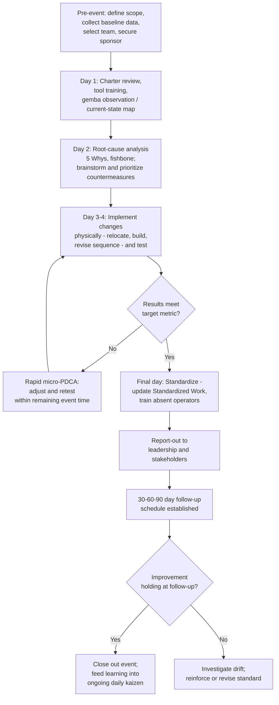

## Kaizen Events and Rapid Improvement Workshops

### Overview

A kaizen event — also called a kaizen blitz, rapid improvement workshop, or rapid improvement event (RIE) — is a time-boxed, intensive, cross-functional effort focused on achieving significant, measurable improvement in a specific process or area, typically over a period of three to five days. Where the broader kaizen mindset describes continuous, everyday small-step improvement, and PDCA describes the general scientific method behind any single improvement cycle, a kaizen event is a specific organizational mechanism: a concentrated application of PDCA, executed by a dedicated team pulled temporarily from their normal duties, designed to compress what might otherwise take weeks or months of incremental effort into a focused burst of activity with an immediate, tangible result at the end.

### Key Points

- A kaizen event is one specific tool within the broader kaizen philosophy — it should complement, not replace, ongoing daily kaizen activity; an organization that only improves during scheduled events has not adopted the continuous-improvement mindset, only the event format
- The defining structural features are: a narrow, well-defined scope; a dedicated cross-functional team pulled fully off their normal duties for the event's duration; a compressed timeline; and an expectation of implemented (not merely proposed) change by the event's end
- Pre-event preparation and post-event follow-through are as important to a kaizen event's success as the event days themselves — a poorly scoped event or one with no sustainment plan produces a short-lived result
- The event follows the PDCA structure at an accelerated pace: problem definition and baseline data gathering (Plan), hands-on implementation and testing of changes (Do), validation against the baseline (Check), and standardization with a 30-60-90 day follow-up plan (Act)
- Full-time, dedicated participation is what distinguishes a kaizen event from an extended series of meetings — team members are pulled from their regular jobs precisely because sustained, uninterrupted focus produces materially faster progress than the same work spread across normal daily interruptions

### Structure of a Kaizen Event

**Pre-event preparation (typically 1-3 weeks before)**

- Define a clear, narrow scope — a single process, workstation, or value-stream segment, not an entire department or product line
- Establish baseline data — current cycle time, defect rate, throughput, or whatever metric the event targets — collected before the event so improvement can be measured against a known starting point
- Select the team — a mix of the operators who work in the target area (essential, for the same tacit-knowledge reasons underlying the broader kaizen philosophy), a facilitator, and representatives from supporting functions (engineering, quality, maintenance) as relevant to the scope
- Secure leadership sponsorship — a sponsor who commits to being available during the event for decisions the team can't make on their own, and who commits resources for implementation
- Communicate to affected personnel — people whose area or work will be directly affected should know the event is happening and, ideally, why

**Day 1: Charter, training, and current-state analysis**

- Review the event charter: scope, goal, target metric, boundaries (what's in scope and explicitly out of scope)
- Brief training on relevant tools if team members aren't already familiar (basic waste identification, PDCA, value-stream mapping, 5 Whys)
- Go to the gemba: observe the current process directly, map the current state (often via a value-stream map or process map), and gather additional direct observations beyond the pre-collected baseline data

**Day 2: Root-cause analysis and idea generation**

- Identify waste and root causes in the current state using structured tools (5 Whys, fishbone diagrams, waste-walk observations)
- Brainstorm and prioritize potential countermeasures — often using a simple impact/effort framework to focus effort on changes with meaningful impact that are achievable within the event's remaining time
- Design the future-state process or layout

**Day 3-4: Implementation ("Do") and testing**

- This is the defining characteristic that separates a kaizen event from a planning workshop: the team physically implements changes during the event itself — relocating equipment, building or modifying fixtures, revising work sequences, testing new layouts — rather than only producing recommendations for someone else to implement later
- Test the implemented changes under real or simulated production conditions, collecting data as the trial runs
- Iterate quickly — a kaizen event often runs several fast PDCA micro-cycles within its overall structure, refining a change based on what the first test reveals rather than treating the first implementation attempt as final

**Day 5 (or final day): Validation, standardization, and report-out**

- Check results against the baseline and the original target metric
- Standardize validated changes: update Standardized Work documents, train remaining operators not present during the event
- Prepare and deliver a report-out to leadership and stakeholders, documenting what was achieved, what remains open, and the follow-up plan
- Establish a defined 30-60-90 day follow-up schedule to verify the improvement holds and to close out any items that couldn't be completed within the event itself

### The Role of Full-Time Dedication

A structural feature that distinguishes a genuine kaizen event from a project team meeting periodically over several weeks is that participants are pulled entirely off their normal job duties for the event's full duration. This is a deliberate choice, not merely a scheduling convenience: sustained, uninterrupted focus by a cross-functional team compresses a work of problem-solving and implementation into days that would otherwise be spread — with all the momentum loss, competing priorities, and scheduling friction that spreading implies — across weeks or months of periodic meetings. The cost of this dedication (temporarily backfilling participants' normal roles) is a deliberate trade the organization makes in exchange for the compressed, high-momentum result.

### Comparison: Kaizen Event vs. Daily/Continuous Kaizen

| Dimension | Kaizen Event (Blitz/RIE) | Daily/Continuous Kaizen |
| --- | --- | --- |
| Scope | Defined project, moderate complexity | Small, individual-level improvement |
| Duration | Concentrated (typically 3-5 days) | Ongoing, everyday |
| Team | Dedicated, cross-functional, pulled off normal duties | Usually an individual operator or small local team, alongside normal work |
| Facilitation | Often facilitated by a trained kaizen/CI specialist | Often self-directed, coached by team leader |
| Typical trigger | A defined, moderately complex problem or opportunity | Everyday observation of waste or difficulty |
| Resource commitment | Higher — dedicated time, possible capital for changes | Lower — typically minimal or no additional resource |
| Relationship to overall kaizen culture | One periodic mechanism among several | The foundational, continuous expression of the philosophy |

Neither replaces the other — an organization relying exclusively on kaizen events, without a parallel culture of daily improvement, has adopted the format without the underlying philosophy; conversely, daily kaizen alone may struggle to tackle more complex, cross-functional problems that benefit from concentrated, dedicated effort and cross-functional participation.

### Common Failure Modes

- **Scope too broad**: attempting to address an entire department or multiple interconnected processes in a single event, exceeding what a team can meaningfully analyze and implement within the available days
- **Insufficient pre-event preparation**: no baseline data collected beforehand, forcing the team to spend valuable event time gathering data that should have been ready on day one
- **No implementation during the event**: a "kaizen event" that produces only recommendations or a future-state plan, with actual implementation deferred to "later," loses the defining characteristic (and much of the momentum and credibility) that distinguishes a kaizen event from an ordinary planning workshop
- **No follow-up plan**: an event ends with an enthusiastic report-out, but with no defined 30-60-90 day check-in, allowing the change to quietly erode without anyone tasked to notice
- **Operators not meaningfully included**: staffing the team primarily with engineers or managers, sidelining the people who work in the area daily and hold the most relevant tacit knowledge
- **Treating events as the entire kaizen program**: an organization that runs several kaizen events per year but has no parallel daily-kaizen culture mistakes the format for the philosophy, missing most of the compounding value continuous small-step improvement is meant to provide
- **Leadership sponsor unavailable during the event**: decisions requiring authority beyond the team's own (capital approval, cross-departmental coordination) stall without a sponsor genuinely available during the event days, not just nominally assigned
- **Post-event standard not actually updated**: implemented changes that are never formalized into the official Standardized Work documents and trained to absent shifts/operators, reintroducing exactly the variation the event was meant to eliminate

### Kaizen Event Timeline and Flow

### Roles and Responsibilities

- **Event Sponsor (typically a manager or director)**: charters the event, commits resources, remains genuinely available during event days for decisions beyond the team's authority, and champions implementation of the results afterward
- **Facilitator (often a dedicated kaizen/CI specialist)**: guides the team through the structured PDCA-based agenda, keeps the event on schedule and scope, and ensures rigorous data collection and honest Check-phase evaluation rather than confirmation bias
- **Team Members (operators, engineers, quality, maintenance as relevant)**: are pulled fully off normal duties for the event, contribute direct process knowledge (especially the operators), and participate in hands-on implementation, not just brainstorming
- **Team Leader / Area Owner (if not directly on the team)**: supports post-event sustainment, ensures the updated standard is trained to all shifts, and owns the 30-60-90 day follow-up checks

### Example

A distribution center runs a four-day kaizen event targeting order-picking cycle time in a specific zone, chosen because pre-event data showed an average pick time 22% above the facility's target. The team — two pickers from the zone, a warehouse engineer, an IT representative (for potential system-side changes), and a facilitator — spends day one mapping the current pick path and confirming the baseline data with direct timed observation. Day two's root-cause analysis reveals that a disproportionate share of picks require crossing to a distant aisle for a small set of high-frequency items stored inefficiently.

On days three and four, the team physically relocates the high-frequency items to a reorganized zone closer to the pick-path start, rebuilds the pick-list sequencing logic with IT's help, and tests the new layout across several dozen live orders, iterating the exact placement twice based on early results. By the final day, average pick time has dropped 18%, close to the event's target, and the team updates the facility's picking Standardized Work documentation, trains the picker shift not present during the event, and reports results to the distribution center's leadership. A 30-60-90 day follow-up is scheduled to confirm the gain holds once picking volume returns to normal seasonal levels, and the picker who first raised the original observation continues, afterward, to submit smaller point-kaizen suggestions through the facility's regular suggestion system.

### Conclusion

Kaizen events are a structured, time-boxed application of PDCA — dedicated cross-functional teams, pulled fully off their normal duties, executing problem definition, root-cause analysis, hands-on implementation, and validation within a compressed several-day window, followed by formal standardization and a defined follow-up schedule. Their value depends heavily on rigorous pre-event scoping and baseline data, genuine operator involvement, actual implementation (not just recommendations) during the event itself, and disciplined post-event sustainment — without which the event produces an impressive report-out but a result that quietly erodes. Kaizen events are best understood as one specific, periodic mechanism within a broader kaizen culture, not a substitute for the everyday, continuous small-step improvement that the kaizen philosophy is fundamentally about.

### Related Topics

- The kaizen mindset and philosophy of continuous small steps
- PDCA as the Plan-Do-Check-Act cycle
- Value-stream mapping for current- and future-state analysis
- 5 Whys and fishbone (Ishikawa) root-cause tools
- Updating standards after improvement
- 30-60-90 day follow-up and sustainment planning
- Suggestion systems and daily/point kaizen
- Cross-functional team structures in lean problem-solving
- A3 problem-solving methodology and reporting format
- Leadership sponsorship and resourcing for continuous improvement