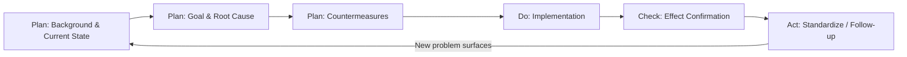
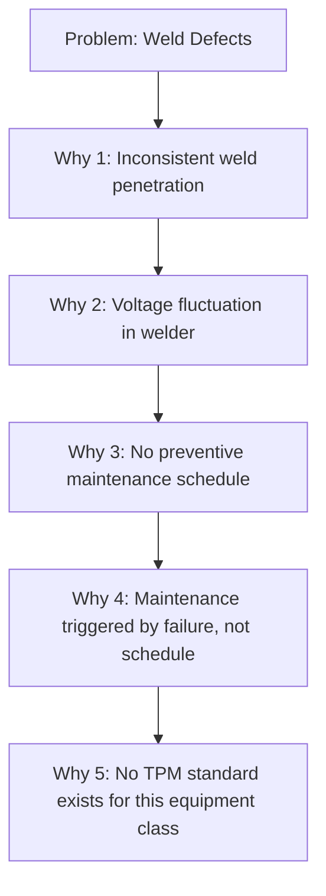
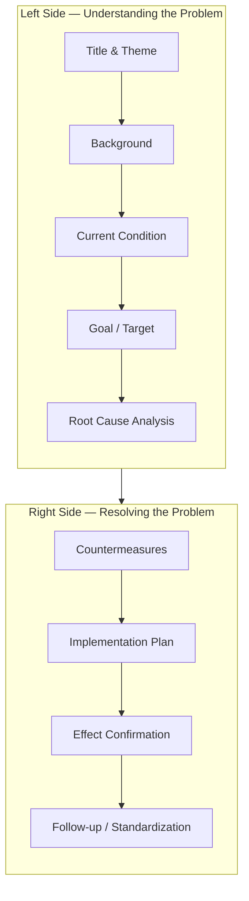

## A3 Thinking and the A3 Report Structure

### Overview

A3 thinking is a structured problem-solving methodology developed at Toyota, named after the ISO A3 paper size (11" x 17") on which the entire analysis, proposal, or report is documented. The constraint of a single sheet forces disciplined, concise communication and compels the author to distill complex problems into their essential logic. A3 thinking is not merely a template — it is a mentoring process and a manifestation of the Plan-Do-Check-Act (PDCA) cycle, emphasizing scientific reasoning, root-cause analysis, and consensus-building over quick fixes.

**Key Points**

- A3 is both a physical document format and a cognitive discipline (a way of thinking, not just reporting)
- Rooted in the scientific method and PDCA
- Forces prioritization: only the most critical facts, data, and logic make the cut
- Functions as a communication tool between subordinate and mentor (often called "catchball")
- Used across multiple report types: problem-solving, proposal, status, and strategy A3s

---

### Historical and Philosophical Origins

A3 reports emerged at Toyota as an extension of the work of quality pioneers, particularly the influence of W. Edwards Deming's PDCA cycle on Japanese manufacturing after World War II. Toyota engineers, notably under the mentorship tradition of leaders like Taiichi Ohno, used the A3 format because it was the largest sheet that could be transmitted via a single fax page — a practical constraint that reinforced the philosophical principle of brevity and clarity.

The deeper purpose of A3 thinking extends beyond documentation:

- **Nemawashi** (根回し): building consensus incrementally before formal decisions
- **Genchi Genbutsu** (現地現物): going to the actual place to observe the actual situation firsthand
- **Hansei** (反省): reflective self-critique embedded in the follow-up stage

[Inference] The A3's emphasis on visual, single-page logic is often cited as a countermeasure to the tendency of Western management reports to bury root causes in lengthy prose, though this comparison is a generalization rather than a rigorously benchmarked claim.

---

### The Core Logic: PDCA Embedded in A3

The A3 report is structurally a physical manifestation of PDCA:

| PDCA Phase | A3 Sections |
| --- | --- |
| **Plan** | Background, Current Condition, Goal, Root Cause Analysis, Countermeasures |
| **Do** | Implementation Plan |
| **Check** | Effect Confirmation / Follow-up |
| **Act** | Standardization, Future Actions |

---

### Standard A3 Report Structure (Problem-Solving A3)

The classic problem-solving A3 is divided into left and right halves, read top-to-bottom, left-to-right, mimicking the flow of the scientific method.

#### 1. Title

A clear, specific statement of the problem or theme — not vague ("Improve Quality") but precise ("Reduce Weld Defects on Line 3 Rear Door Assembly").

#### 2. Background / Business Context

- Explains why this problem matters to the organization
- Connects the problem to broader business goals, customer impact, or strategic priorities
- Establishes ownership and stakes

#### 3. Current Condition (Current State)

- A factual, data-driven, often visual depiction of the process as it exists today
- Typically includes a simple diagram, process map, or Pareto chart
- Must be based on **Genchi Genbutsu** — direct observation, not assumption
- States the gap between current performance and target performance quantitatively

**Example**

"Current defect rate: 3.2% (320 DPMO). Target: 0.5%. Data collected over 4 weeks, 3 shifts, n=12,400 units."

#### 4. Goal / Target Condition

- A specific, measurable, time-bound objective (SMART goal)
- Distinguished from Current Condition — this is the desired future state
- Example: "Reduce defect rate from 3.2% to 0.5% by end of Q3, without increasing cycle time."

#### 5. Root Cause Analysis

- The analytical core of the A3
- Common tools embedded here:
  - **5 Whys**: iterative questioning to trace symptom to root cause
  - **Fishbone / Ishikawa diagram**: categorization of causes (Man, Machine, Method, Material, Measurement, Environment)
  - **Pareto analysis**: prioritizing the "vital few" causes
- Root causes must be verified with data, not assumed

#### 6. Countermeasures

- Proposed actions that directly address the verified root cause(s), not just symptoms
- Each countermeasure should map explicitly back to a specific root cause
- Often presented in a simple table: Countermeasure | Root Cause Addressed | Owner | Due Date

#### 7. Implementation Plan

- Specific action items with responsible owners and deadlines
- Frequently visualized as a Gantt-style table or simple timeline
- Answers: Who does What by When

#### 8. Effect Confirmation / Follow-up

- Defines how success will be measured after implementation
- Specifies the metric, target, and monitoring cadence
- This is the "Check" in PDCA — data collected post-implementation is compared against the Goal section

#### 9. Follow-up Actions / Standardization

- If successful: how the countermeasure becomes the new standard (linked to Standardized Work)
- If unsuccessful: return to Root Cause Analysis — the A3 process is iterative, not linear
- Represents the "Act" phase — embedding the gain and preventing regression

---

### Visual Layout (Typical A3 Physical Layout)

---

### Types of A3 Reports

While the problem-solving A3 is most common, several variants exist, each retaining the single-page discipline but adapting section content:

- **Problem-Solving A3**: Structured as above; addresses a specific deviation from standard
- **Proposal A3**: Used to propose a new initiative, capital investment, or process change; emphasizes cost-benefit and risk analysis over root-cause diagnosis
- **Status Report A3**: Tracks ongoing projects against milestones; used for periodic review (e.g., weekly/monthly)
- **Strategy A3 (Hoshin A3)**: Connects to Hoshin Kanri; cascades organizational strategy into departmental actions, often called a "strategy deployment A3"

---

### A3 as a Mentoring Tool ("Catchball")

A3 thinking is inseparable from Toyota's mentor-mentee (Sensei-Kohai) tradition:

- The author drafts the A3 and presents it to a mentor/manager
- The mentor asks probing questions rather than providing answers ("What data supports that root cause?")
- The A3 is revised iteratively — often many drafts — through this dialogue, called **catchball** (キャッチボール), reflecting the back-and-forth exchange
- This process develops the problem-solver's critical thinking rather than simply producing a document

[Inference] Practitioner literature (e.g., Sobek and Smalley) suggests the mentoring dialogue is considered as valuable as the final document itself, since it builds organizational problem-solving capability — though the relative weighting of "document value" versus "mentoring value" is not something that can be empirically quantified.

---

### Common Pitfalls

- **Jumping to countermeasures**: Proposing solutions before completing root cause analysis (a violation of scientific method discipline)
- **Vague current condition**: Using qualitative impressions ("things seem slow") instead of quantified baseline data
- **Root cause not verified**: Stopping the 5 Whys at a symptom rather than a systemic cause
- **Overloading the page**: Cramming excessive text, defeating the purpose of forced conciseness
- **Treating A3 as a one-time report**: Failing to close the loop with Effect Confirmation, breaking the PDCA cycle

---

### Relationship to Other TPS/Lean Tools

- **5 Whys** and **Fishbone Diagrams**: embedded directly within the Root Cause Analysis section
- **PDCA**: the overarching cycle the A3 physically documents
- **Standardized Work**: the endpoint of a successful A3's Act phase
- **Hoshin Kanri**: strategy A3s serve as the cascading communication mechanism
- **Gemba Walks**: the practice supporting Genchi Genbutsu-based data collection for the Current Condition section

---

### Practical Example (Condensed)

**Title**: Reduce Changeover Time on Press Line 2

**Background**: Changeover time of 45 minutes limits line to 2 changeovers/shift, constraining small-batch flexibility required by new customer mix.

**Current Condition**: Time study shows 45 min average, with 60% of time spent searching for tools and adjusting die alignment (data from 15 observed changeovers).

**Goal**: Reduce changeover time to 15 minutes within 8 weeks (SMED single-digit target).

**Root Cause Analysis**: 5 Whys trace excessive time to lack of standardized tool staging and absence of external (pre-positioned) setup activities — internal and external setup steps are not separated.

**Countermeasures**: Apply SMED — convert internal setup steps to external (pre-stage dies and tools before machine stop); implement shadow-board tool organization; create standardized changeover checklist.

**Implementation Plan**: Pilot on Press 2, Weeks 1–4; team training Week 5; full rollout Week 6–8. Owner: Line Supervisor.

**Effect Confirmation**: Track changeover time weekly via time study; target 15 minutes by Week 8.

**Follow-up**: Standardize checklist across all press lines; incorporate into new operator training.

---

**Related Topics**

- PDCA Cycle (Plan-Do-Check-Act) in depth
- 5 Whys Root Cause Analysis technique
- Ishikawa (Fishbone) Diagram construction
- SMED (Single-Minute Exchange of Die)
- Hoshin Kanri and Strategy Deployment
- Genchi Genbutsu and Gemba Walks
- Standardized Work documentation
- Nemawashi and consensus-building in Lean organizations