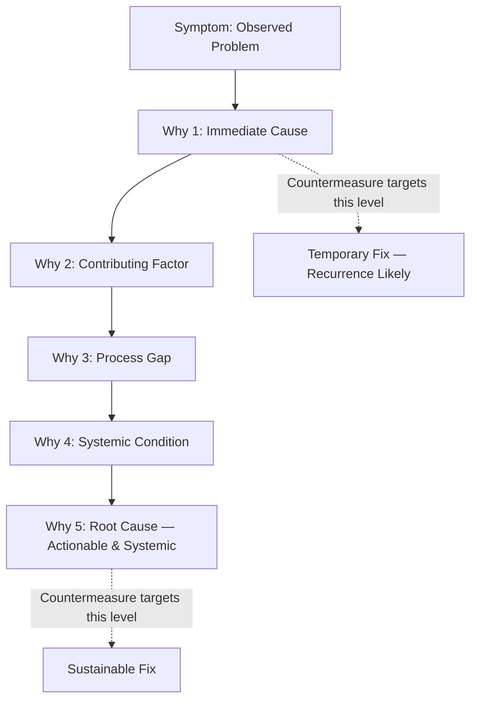
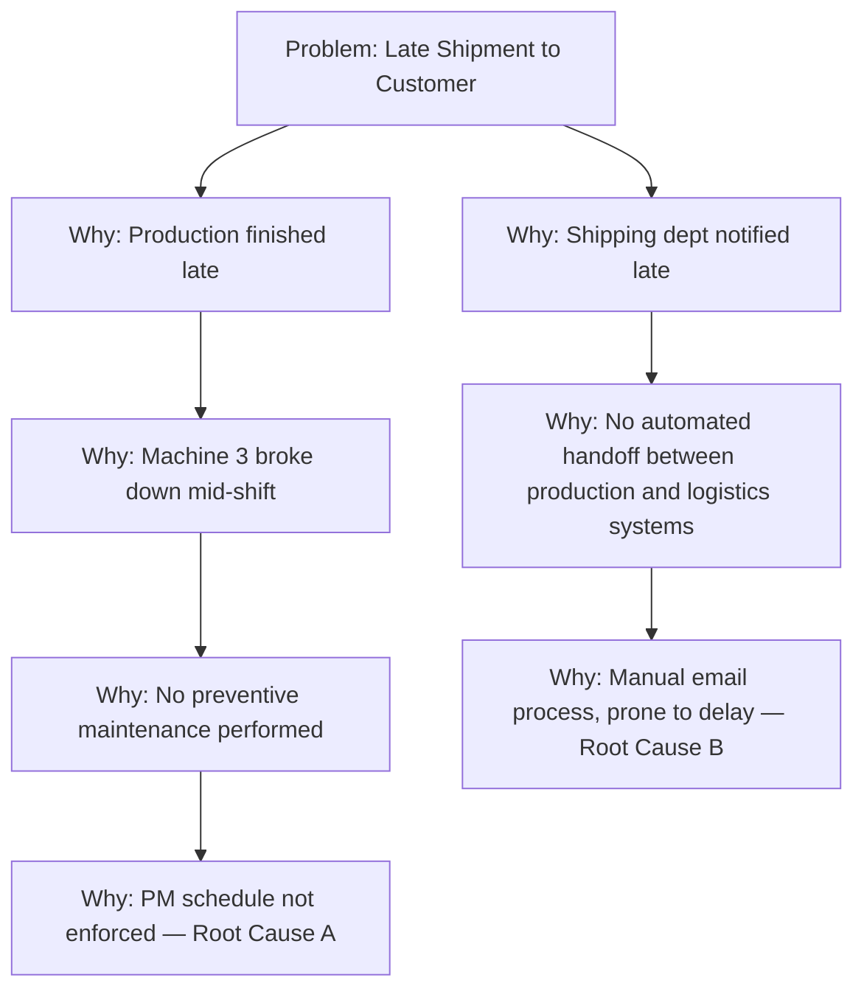

## Five Whys Root Cause Analysis

### Overview

The Five Whys is an iterative interrogative technique used to explore the cause-and-effect relationships underlying a specific problem. By repeatedly asking "Why?" — traditionally five times, though the number is heuristic rather than fixed — the investigator peels back layers of symptoms to reach the systemic root cause, distinguishing it from superficial or proximate causes that would otherwise prompt ineffective countermeasures.

**Key Points**

- Developed and popularized within Toyota Production System by Taiichi Ohno
- "Five" is a rule of thumb, not a strict requirement — the process stops when a true root cause is identified, which may take fewer or more iterations
- Distinguishes between symptoms, proximate causes, and systemic/root causes
- Most effective when paired with direct observation (Genchi Genbutsu) rather than conducted purely from memory or assumption
- A precursor analytical step often embedded within the A3 Root Cause Analysis section

---

### Origins and Philosophy

Taiichi Ohno, considered the father of the Toyota Production System, described the method in his writings as central to Toyota's scientific approach to problem-solving. Ohno emphasized that the purpose of the Five Whys was not merely to find *a* cause, but to expose the underlying system or process failure — often organizational or procedural — that allowed the problem to occur in the first place.

Ohno's own frequently cited example involves a stopped welding robot:

1. **Why did the robot stop?** — The circuit overloaded, causing a fuse to blow.
2. **Why did the circuit overload?** — There was insufficient lubrication on the bearings, so they locked up.
3. **Why was there insufficient lubrication?** — The lubrication pump on the robot was not circulating sufficient oil.
4. **Why was the pump not circulating sufficient oil?** — The pump intake was clogged with metal shavings.
5. **Why was the pump intake clogged?** — There was no filter on the pump intake to catch the shavings.

The root cause is not "the fuse blew" (a symptom) but the absence of a filter — a systemic gap in equipment design/maintenance standards. The countermeasure (install a filter) addresses the system, not the symptom.

---

### The Core Distinction: Symptom vs. Root Cause

A key principle: countermeasures applied at the symptom or proximate-cause level tend to produce only temporary suppression of the problem, since the systemic condition that generated it remains unaddressed. This is closely related to the Lean distinction between "fire-fighting" (treating symptoms) and true problem-solving (eliminating root cause).

---

### Methodology / Procedure

#### Step 1: Define the Problem Precisely

- State the problem as observed, using specific, factual, and measurable language
- Avoid vague statements ("quality is bad") in favor of specific ones ("12% of Batch 4471 units failed dimensional tolerance on the outer diameter")
- Should ideally be based on direct observation of the actual process (Genchi Genbutsu), not secondhand reports

#### Step 2: Assemble the Right Team

- Include people with direct knowledge of the process (operators, technicians), not only supervisors or engineers
- Cross-functional perspectives reduce the risk of a biased or incomplete causal chain

#### Step 3: Ask "Why?" Iteratively

- For each stated cause, ask why that cause occurs
- Each answer must be supported by verifiable evidence or direct observation — not assumption or speculation
- Continue until reaching a cause that is:
  - Systemic (relates to process, method, or standard rather than a one-off event)
  - Actionable (something the organization can change)
  - Verified (confirmed through evidence, not conjecture)

#### Step 4: Validate the Causal Chain

- Read the chain of causes backward using "therefore" to check logical soundness: "There was no filter on the pump intake, *therefore* metal shavings clogged the intake, *therefore* the pump under-lubricated the bearings, *therefore*..." — if the reverse logic doesn't hold, the chain has a gap
- Confirm each link with data or direct observation where possible

#### Step 5: Identify and Implement Countermeasures

- Target the root cause(s), not intermediate symptoms
- Multiple branches may emerge — Five Whys can produce a branching tree rather than a single linear chain when multiple contributing factors exist

#### Step 6: Verify Effectiveness

- Monitor whether the problem recurs after the countermeasure is implemented
- Feeds into the Check/Act phases of PDCA

---

### Branching Five Whys (Complex Problems)

Simple linear chains are often insufficient for multi-causal problems. A branching structure captures multiple contributing root causes for a single symptom.

---

### Tools Often Combined with Five Whys

| Tool | Purpose in Combination |
| --- | --- |
| **Fishbone (Ishikawa) Diagram** | Generates candidate cause categories (Man, Machine, Method, Material, Measurement, Environment) before drilling down with Five Whys on each branch |
| **Pareto Chart** | Prioritizes which symptom/problem to apply Five Whys to first (the "vital few") |
| **A3 Report** | Houses the Five Whys output within the Root Cause Analysis section |
| **Genchi Genbutsu** | Supplies the verified, firsthand data needed at each "why" step |
| **PDCA** | Five Whys typically occurs in the Plan phase, informing what to Do and later Check |

---

### Common Pitfalls

- **Stopping too early**: Halting at a proximate cause because it's convenient or the first plausible answer, rather than continuing to a systemic root
- **Stopping too late / over-drilling**: Continuing past the actionable root cause into unrelated philosophical or organizational abstractions unrelated to the specific problem
- **Single-path bias**: Treating the analysis as strictly linear when the problem has multiple independent contributing causes
- **Blaming people instead of systems**: Answers like "the operator made a mistake" should prompt further inquiry ("why was it possible for that mistake to occur without detection?") rather than stopping at individual blame — a violation of the systemic-thinking principle
- **Assumption-based answers**: Answering "why" from opinion or hearsay rather than verified fact or direct observation
- **Confirmation bias**: Steering the causal chain toward a predetermined or politically convenient conclusion

[Inference] Practitioner critiques (e.g., in reliability engineering literature) note that Five Whys can produce inconsistent results between different teams analyzing the same problem, since the technique lacks a formal method for validating causal claims against data; this is a recognized limitation rather than a universally quantified failure rate.

---

### Strengths and Limitations

**Strengths**

- Simple, requires no specialized statistical training
- Fast to deploy for straightforward, single-cause problems
- Encourages a "why" mindset that resists jumping to conclusions
- Low cost, applicable at any level of the organization

**Limitations**

- Not well-suited to problems with complex, multi-variable, or probabilistic causes
- Relies heavily on the knowledge and honesty of the team conducting it
- No inherent statistical validation of causal links (unlike techniques such as Design of Experiments or statistical process control)
- Risk of superficial analysis if not paired with direct observation and data verification

**Example**

A problem with a low, well-understood cause count (e.g., a specific machine stoppage) is well-suited to Five Whys. A problem with many interacting variables (e.g., intermittent quality drift across multiple shifts, machines, and suppliers) may require Fishbone diagramming, Pareto prioritization, or statistical analysis in addition to or instead of a simple Five Whys chain.

---

### Relationship to Other TPS/Lean Tools

- **A3 Thinking**: Five Whys is the core analytical technique populating the Root Cause Analysis section of an A3 report
- **PDCA**: situates within the Plan phase
- **Jidoka**: stopping a process at the point of abnormality (andon) creates the trigger event that Five Whys is then applied to
- **Poka-Yoke**: countermeasures derived from Five Whys often take the form of error-proofing devices addressing the systemic root cause
- **Kaizen**: Five Whys is a foundational tool within continuous improvement activities and kaizen events

---

**Related Topics**

- A3 Thinking and the A3 Report Structure
- Ishikawa (Fishbone) Diagram construction
- PDCA Cycle in depth
- Jidoka and Andon systems
- Poka-Yoke (error-proofing) design principles
- Pareto Analysis for problem prioritization
- Genchi Genbutsu and direct observation practices