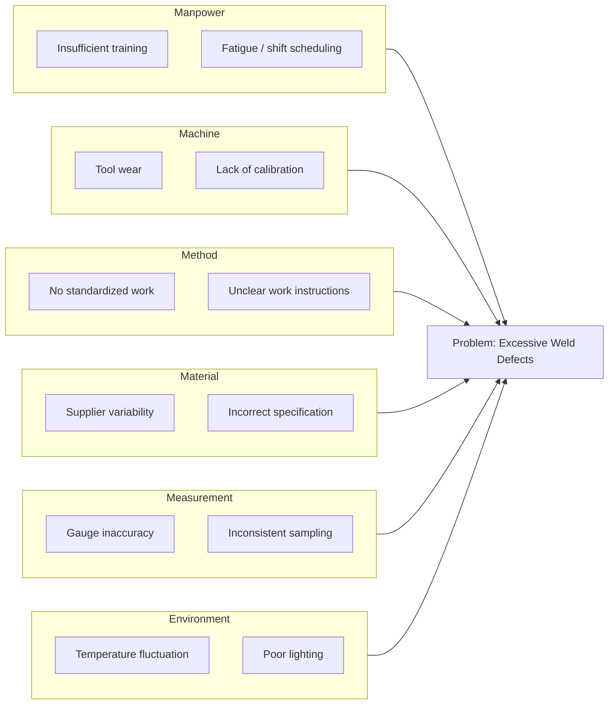
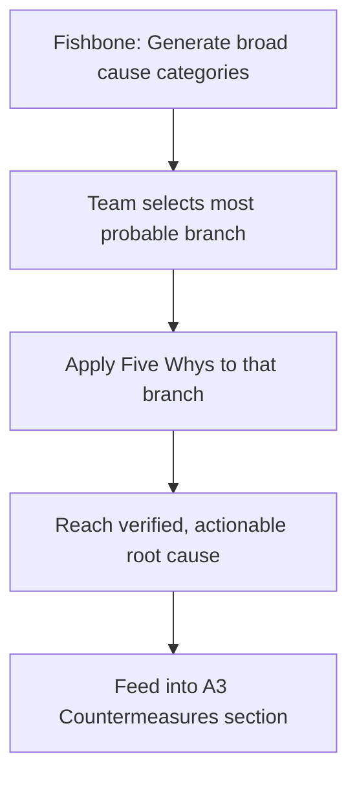

## Ishikawa Fishbone Diagrams

### Overview

The Ishikawa diagram, commonly known as the fishbone diagram (due to its visual resemblance to a fish skeleton) or cause-and-effect diagram, is a structured brainstorming tool used to systematically identify, categorize, and explore the potential causes of a specific problem or effect. Developed by Japanese quality control pioneer Kaoru Ishikawa in the 1960s, the tool is a cornerstone of root cause analysis within Total Quality Management and the Toyota Production System, providing a visual framework that organizes potential causes into major categories branching off a central "spine."

**Key Points**

- Created by Kaoru Ishikawa at Kawasaki Shipyards in the 1960s
- Organizes causes into standard categories to ensure comprehensive brainstorming
- Visually resembles a fish skeleton: the "head" is the effect (problem), the "bones" are cause categories
- Complements, rather than replaces, quantitative root-cause tools like Five Whys and Pareto analysis
- Widely used in quality circles, kaizen events, and Six Sigma DMAIC projects

---

### Origins

Kaoru Ishikawa developed the diagram as part of his broader work on company-wide quality control (CWQC) in postwar Japan, influenced by the statistical quality control teachings of W. Edwards Deming and Joseph Juran. Ishikawa's intent was to create a tool accessible to shop-floor workers, not just statisticians or engineers — consistent with the TPS philosophy of respect for people and involving frontline employees directly in problem-solving. The diagram became one of Ishikawa's "Seven Basic Tools of Quality," alongside the Pareto chart, check sheet, control chart, histogram, scatter diagram, and stratification.

---

### Structure and Visual Layout

The diagram consists of a horizontal "spine" leading to the problem statement (the fish's head, typically drawn on the right), with diagonal branches ("bones") representing major cause categories. Each major branch has smaller sub-branches representing specific, granular potential causes.



```
                Method        Machine
                   \             /
                    \           /
              -------\---------/------- [EFFECT / PROBLEM] (svg_diagram)
                    /           \
                   /             \
                Material       Manpower
```

*(Simplified text representation — see Mermaid diagram below for structured hierarchy.)*



---

### Standard Cause Categories

#### Manufacturing Context: The 6 M's

The most common category framework in manufacturing settings:

| Category | Description | Example Causes |
| --- | --- | --- |
| **Man (Manpower)** | Human factors | Skill gaps, fatigue, inconsistent training |
| **Machine** | Equipment and tooling | Wear, miscalibration, breakdowns |
| **Method** | Processes and procedures | Missing standardized work, unclear instructions |
| **Material** | Raw materials and components | Supplier defects, incorrect specifications |
| **Measurement** | Data and inspection accuracy | Gauge error, inconsistent sampling methods |
| **Mother Nature (Environment)** | Physical/ambient conditions | Temperature, humidity, dust, lighting |

#### Service/Administrative Context: The 4 P's or 8 P's

Adapted for non-manufacturing settings (used less frequently in a TPS-specific context but relevant for administrative kaizen):

- **Policies, Procedures, People, Plant** (4 P's)
- Extended variants add **Price, Promotion, Process, Physical Evidence** for service/marketing contexts

#### Alternative Framework: The 4 S's (Service Industries)

- **Surroundings, Suppliers, Systems, Skills**

[Inference] The choice of category framework (6M vs. 4P vs. 4S) is a matter of practitioner convention suited to the domain rather than a fixed universal standard — teams often customize categories to fit their specific process.

---

### Construction Methodology

#### Step 1: Define the Effect (Problem Statement)

- State the problem specifically and measurably (e.g., "Paint booth rework rate at 8%" rather than "paint quality issues")
- Write the problem in the "head" position of the diagram

#### Step 2: Identify Major Categories

- Select the category framework appropriate to the domain (6M for manufacturing is most common in TPS contexts)
- Draw the main branches ("bones") extending from the central spine

#### Step 3: Brainstorm Causes Within Each Category

- For each category, ask "what within this category could cause the effect?"
- Encourage participation from cross-functional and frontline staff — a wider range of perspectives produces a more complete diagram
- Record every plausible cause without initially filtering — divergent brainstorming precedes convergent analysis

#### Step 4: Drill Down with Sub-Causes

- For significant causes, ask "why does this occur?" repeatedly (integrating the Five Whys technique) to move from surface-level causes to deeper contributing factors
- Add these as smaller branches off the main category bones

#### Step 5: Analyze and Prioritize

- Review the completed diagram as a team
- Identify causes with the strongest supporting evidence or highest suspected impact
- Often paired with a Pareto chart or voting technique (e.g., multi-voting, nominal group technique) to prioritize which causes to investigate or address first

#### Step 6: Validate with Data

- Causes identified through brainstorming are hypotheses, not confirmed facts
- Follow-up data collection (checksheets, process observation, statistical analysis) is needed to confirm which branches are actual contributors versus merely plausible

---

### Combining Fishbone with Five Whys

The fishbone diagram excels at **divergent** thinking (generating a wide range of possible cause categories), while Five Whys excels at **convergent** thinking (drilling a single branch down to its systemic root). A common and effective practice is to use the fishbone diagram to identify candidate cause categories, then apply Five Whys to the most probable branch(es) to reach an actionable root cause.



---

### Example Application

**Problem**: Increased customer returns for a molded plastic component (defect: surface bubbles)

| Category | Candidate Causes |
| --- | --- |
| Man | New operator, insufficient training on injection molding parameters |
| Machine | Barrel temperature drifting outside spec; screw wear |
| Method | No standard work for material drying time before molding |
| Material | Resin pellets not sufficiently dried; moisture content too high |
| Measurement | No inline moisture sensor; reliance on visual inspection only |
| Environment | High ambient humidity in storage area |

**Analysis**: Team applies Five Whys to the "Material" branch and traces to: resin dries inconsistently because the drying hopper's timer is manually set with no standard, and operators are not trained on moisture-content verification. Root cause: lack of standardized work for material pre-processing, not the resin itself.

---

### Strengths and Limitations

**Strengths**

- Highly visual and intuitive; accessible to non-specialists
- Structures brainstorming to avoid tunnel vision on a single cause category
- Encourages cross-functional participation
- Effective for generating hypotheses at the start of an investigation

**Limitations**

- Does not by itself validate causes with data — it generates hypotheses, not conclusions
- Can become cluttered and unwieldy for very complex problems with many interacting variables
- Quality of output is highly dependent on the knowledge and diversity of the brainstorming team
- Risk of the diagram reflecting groupthink or dominant voices rather than a balanced view if facilitation is poor

[Inference] Some practitioner literature suggests fishbone diagrams are less effective for problems involving complex, non-obvious statistical interactions between variables, where formal Design of Experiments (DOE) may be more appropriate — this is a domain-suitability observation rather than a strict rule.

---

### Relationship to Other TPS/Lean Tools

- **Five Whys**: applied within individual fishbone branches to drill toward root cause
- **Pareto Analysis**: used to prioritize which fishbone-identified causes to address first
- **A3 Thinking**: the fishbone diagram is a common visual artifact within the Root Cause Analysis section of an A3
- **Genchi Genbutsu**: firsthand observation informs which causes are realistically plausible versus speculative
- **Check Sheets**: used to gather data validating hypothesized causes from the fishbone diagram

---

**Related Topics**

- Five Whys Root Cause Analysis
- A3 Thinking and the A3 Report Structure
- Pareto Analysis and the 80/20 Principle
- Seven Basic Tools of Quality
- Check Sheets and Data Collection Methods
- PDCA Cycle in depth
- Statistical Process Control (SPC) fundamentals