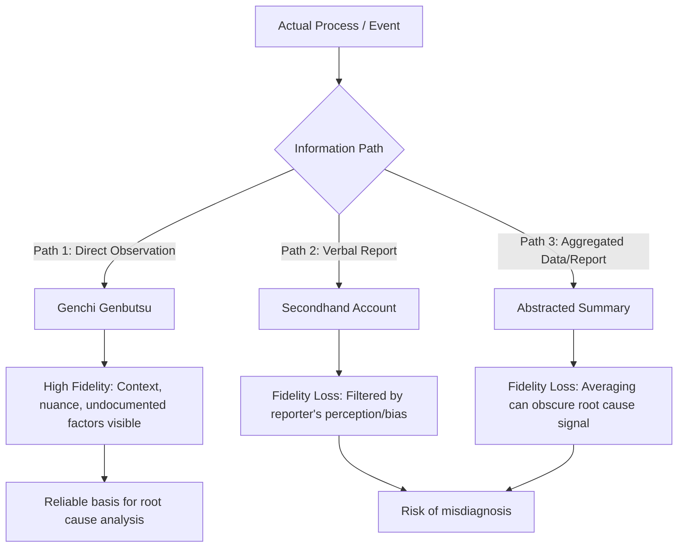

## Genchi Genbutsu as Going to See for Yourself

### Overview

Genchi Genbutsu (現地現物) is a foundational principle of the Toyota Production System and Toyota's broader management philosophy, typically translated as "go and see" or "go to the actual place and see the actual thing." It mandates that decisions, problem diagnoses, and process improvements be grounded in direct, firsthand observation of the real work location — the gemba (現場) — rather than relying on secondhand reports, assumptions, data summaries alone, or abstract reasoning conducted away from the actual process.

**Key Points**

- Literally translates to "actual place, actual thing" (genchi = actual place; genbutsu = actual thing/part)
- One of the two pillars of the Toyota Way, alongside "Respect for People," under the broader "Continuous Improvement" value
- Distinguishes verified firsthand fact from secondhand assumption or report
- Prerequisite for credible root cause analysis (Five Whys, fishbone diagrams) and A3 thinking
- Closely related to, but distinct from, the general Lean term "Gemba" (the actual workplace)

---

### Origins and Philosophical Context

The principle traces to Toyota's early leadership, particularly Taiichi Ohno and Sakichi Toyoda, who emphasized that managers and engineers must personally observe operations rather than manage exclusively from reports, spreadsheets, or meeting rooms. This reflects a deeper epistemological stance within TPS: data and secondhand accounts are abstractions of reality and can obscure, distort, or omit critical details that are only visible through direct observation.

Genchi Genbutsu is formally documented as one of the core principles in "The Toyota Way 2001," Toyota's internal statement of values, where it sits under the pillar of "Continuous Improvement" alongside Kaizen and Challenge.

[Inference] The principle is often associated with the anecdote of new engineers being required to stand within a chalk circle on the shop floor and observe a single workstation for an extended period (sometimes cited as multiple hours) to develop observational discipline — this specific practice is widely referenced in Lean literature as illustrative of the philosophy, though accounts of its exact implementation details vary across sources.

---

### Genchi Genbutsu vs. Gemba: Distinguishing Related Concepts

| Term | Meaning | Focus |
| --- | --- | --- |
| **Gemba** (現場) | "The actual place" — the physical location where value-creating work happens (shop floor, warehouse, service counter) | The *location* itself |
| **Genchi Genbutsu** (現地現物) | "Go to the actual place and see the actual thing" | The *practice* of going there to observe firsthand |
| **Gemba Walk** | A structured, often routine managerial practice of walking the gemba to observe | A specific *implementation method* of Genchi Genbutsu |

Genchi Genbutsu is the underlying principle; the Gemba Walk is one common operational technique for practicing it, though Genchi Genbutsu also applies to one-off investigations (e.g., a single defect investigation), not only routine walks.

---

### Core Rationale: Why Firsthand Observation Matters

Reports and data summaries are necessarily abstractions — they compress reality into categories and numbers, which can strip away situational context essential to correctly diagnosing a problem. A defect rate of "3%" does not reveal *how* or *why* the defects occur; only direct observation of the process reveals contextual factors such as operator hesitation, tooling friction, or environmental interference that a report cannot capture.

**Example**

A quality report shows a rising defect rate on an assembly line, attributed in the report to "operator error." A manager practicing Genchi Genbutsu visits the line directly and observes that the operator is reaching awkwardly around a newly installed guard rail to access a part bin — revealing the true root cause as a poor ergonomic layout change, not operator carelessness. This distinction would likely not have surfaced from the report alone.

---

### Application in Problem-Solving Methodology

Genchi Genbutsu is not a standalone tool but an operating discipline embedded throughout TPS problem-solving processes:

#### Within A3 Thinking

- The "Current Condition" section of an A3 report is expected to be populated with data and observations gathered through direct visits to the gemba, not from assumptions or secondhand summaries
- Mentors reviewing A3 drafts frequently challenge authors with questions like "Did you see this yourself?" to enforce the discipline

#### Within Five Whys

- Each "why" answer should ideally be verifiable through direct observation or evidence gathered at the gemba, rather than speculative reasoning conducted at a desk

#### Within Kaizen Events

- Kaizen team members are expected to physically observe the target process before proposing changes, ensuring improvements are grounded in the actual conditions rather than theoretical process maps

---

### Standard Practice: How Genchi Genbutsu Is Conducted

#### Step 1: Go to the Actual Location

- Physically travel to where the work occurs — the production line, warehouse, service desk, or customer site
- Avoid substituting a photo, video call, or written description for physical presence when a firsthand assessment is feasible

#### Step 2: Observe the Actual Thing/Process

- Examine the actual part, defect, machine, or document in question directly
- Observe the process as it naturally occurs — ideally without altering worker behavior through obvious scrutiny (observer effect is a recognized limitation)

#### Step 3: Gather Facts, Not Impressions

- Focus on objective, verifiable facts: timing, sequence, physical condition, environmental factors
- Separate factual observation from interpretation or premature conclusion

#### Step 4: Engage Directly with Those Doing the Work

- Ask frontline operators about their experience of the process
- Respect for People principle intersects here: workers are treated as valuable sources of insight, not merely observed as objects

#### Step 5: Use Observations to Inform, Not Replace, Analysis

- Firsthand observation feeds into structured analysis tools (Five Whys, fishbone diagrams, A3) rather than substituting for rigorous analysis
- Genchi Genbutsu supplies verified inputs; it does not itself constitute the analytical method

---

### Common Pitfalls

- **Substituting reports for visits**: Relying on dashboards, emails, or secondhand summaries when direct observation is feasible and would add material insight
- **Superficial visits**: Walking through an area briefly without genuinely observing details, satisfying the letter of "going to see" without its analytical purpose
- **Observer effect blindness**: Failing to account for the fact that workers may behave differently when being directly observed, potentially masking the true process condition
- **One-time application**: Treating Genchi Genbutsu as a single visit rather than an ongoing discipline revisited throughout a problem's investigation and resolution
- **Authority without engagement**: Visiting the gemba only to assert managerial authority rather than to genuinely learn from frontline workers — inconsistent with the Respect for People principle that underlies the practice

[Inference] Critics of Lean implementation outside Japan have noted that Genchi Genbutsu is sometimes reduced to a superficial "management by walking around" ritual disconnected from its original emphasis on rigorous, fact-based verification — this represents a recognized implementation risk rather than a flaw in the principle itself.

---

### Relationship to Other TPS/Lean Tools

- **A3 Thinking**: supplies the verified data populating the Current Condition and Root Cause sections
- **Five Whys**: each causal link should ideally be traceable to a directly observed or verified fact
- **Gemba Walks**: the routine operational technique through which Genchi Genbutsu is practiced regularly
- **Kaizen**: improvement activities are expected to be grounded in direct observation of the target process
- **Respect for People**: Genchi Genbutsu, properly practiced, involves engaging respectfully with frontline workers rather than merely observing them

---

**Related Topics**

- Gemba Walks and structured observation practices
- A3 Thinking and the A3 Report Structure
- Five Whys Root Cause Analysis
- Respect for People as a TPS pillar
- The Toyota Way: Continuous Improvement and Respect for People
- Standardized Work and its role in enabling accurate observation