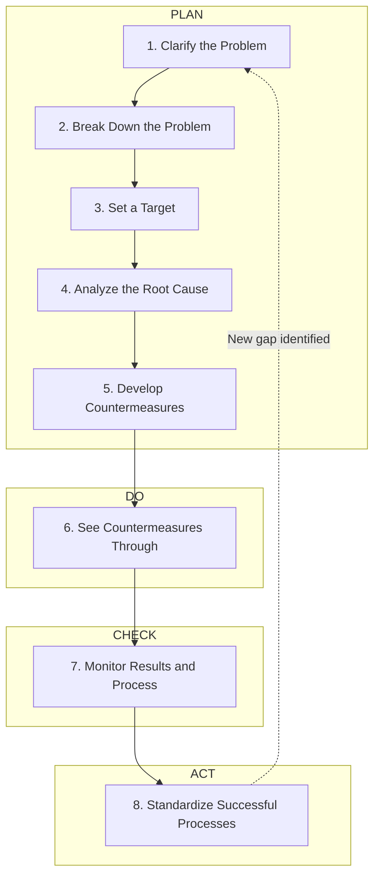
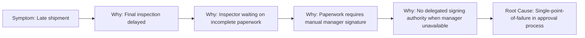

## Toyota's Structured Eight Step Problem Solving Process

### Overview

Toyota's Eight Step Problem Solving process (often referred to as Toyota Business Practices, or TBP) is a formalized, sequential methodology that operationalizes the scientific thinking underlying PDCA, A3 reports, and Genchi Genbutsu into a discrete, repeatable sequence of steps. While the A3 report provides the physical documentation format, the eight-step process provides the granular procedural logic that populates each A3 section, offering a more explicit checklist than the four broad PDCA phases alone.

**Key Points**

- Also known as Toyota Business Practices (TBP) or the 8-Step Practical Problem Solving process
- Maps directly onto the PDCA cycle, but with greater granularity
- Emphasizes clarifying the problem before jumping to solutions — a discipline central to TPS
- Steps 1–5 correspond to "Plan," Step 6 to "Do," Step 7 to "Check," Step 8 to "Act"
- Frequently used as the internal logic populating an A3 report's sections

---

### Relationship to PDCA and A3

---

### Step 1: Clarify the Problem

The process begins not with the presumed problem, but with a broad recognition of a gap between the ideal state and current reality. This step establishes the overarching context: why does the issue matter, and where does it sit relative to organizational or customer-level goals.

- Identify the ideal/desired state
- Compare it to the current, observed state
- Confirm the gap is grounded in fact (Genchi Genbutsu), not assumption
- Avoid conflating the broad problem with a specific solvable issue at this stage

**Example**

Ideal: 100% on-time delivery to customers. Current: 92% on-time delivery over the last quarter. The 8% gap is the broad problem to be clarified.

---

### Step 2: Break Down the Problem

The broad problem identified in Step 1 is decomposed into smaller, more specific, and more solvable sub-problems. Large, vague problems are rarely solvable directly; breaking them into discrete components allows prioritization and focused analysis.

- Use data stratification (by product line, shift, location, defect type, etc.) to segment the broad problem
- Apply Pareto analysis to identify which sub-problem contributes most significantly to the overall gap
- Select a specific, narrow point of occurrence for deeper investigation

**Example**

The 8% delivery shortfall is broken down by product line, revealing that 70% of late deliveries stem from a single product family assembled on Line 4 — this becomes the focused sub-problem.

---

### Step 3: Set a Target

A specific, measurable, achievable, and time-bound target is established for the narrowed sub-problem identified in Step 2. This target defines what "solved" will concretely look like, providing a benchmark against which the effectiveness of later countermeasures can be judged.

- States a specific numeric target and deadline
- Distinguished from the broad ideal state defined in Step 1 — this target is scoped to the specific sub-problem
- Should be ambitious but grounded in what is realistically achievable given resources and timeframe

**Example**

"Reduce Line 4 late-delivery contribution from 70% of shortfall to under 10% within 6 weeks."

---

### Step 4: Analyze the Root Cause

This step applies structured root-cause analysis tools to the narrowed problem, most commonly Five Whys and/or Ishikawa fishbone diagrams, always grounded in direct observation (Genchi Genbutsu) rather than assumption.

- Conduct direct observation at the point of occurrence
- Apply Five Whys iteratively, validating each causal link with evidence
- Use fishbone diagramming if multiple candidate cause categories require structured brainstorming
- Distinguish root cause (systemic, actionable) from symptoms (superficial, non-systemic)

---

### Step 5: Develop Countermeasures

Countermeasures are proposed that directly target the verified root cause(s) from Step 4, not merely the symptoms observed in Step 1 or Step 2.

- Generate multiple candidate countermeasures where feasible, rather than settling on the first idea
- Evaluate countermeasures against criteria: effectiveness (does it address the root cause?), feasibility (cost, time, resources), and risk (unintended consequences)
- Assign clear ownership and a specific implementation timeline for each selected countermeasure
- Countermeasures should map explicitly back to a specific root cause identified in Step 4

**Example**

Countermeasure for the single-point-of-failure approval process: establish a delegated backup signing authority and digitize the paperwork workflow to remove the manual bottleneck entirely.

---

### Step 6: See Countermeasures Through (Implementation)

This is the "Do" phase — countermeasures are executed according to the plan developed in Step 5.

- Execute the implementation plan with assigned owners and deadlines
- Communicate changes to all affected stakeholders, including frontline workers
- Document the implementation process itself, since deviations from plan may themselves yield useful learning
- Maintain discipline in following the plan as designed, to allow for a clean assessment of whether the countermeasure itself was effective

---

### Step 7: Monitor Both Results and Process

This is the "Check" phase — the team evaluates two distinct dimensions: **results** (did the target from Step 3 get achieved?) and **process** (was the countermeasure implemented as intended, and is it operating as designed?).

- Compare post-implementation data against the Step 3 target
- Verify the countermeasure is being followed consistently (a countermeasure that is not actually being used cannot be judged effective or ineffective)
- If the target is not met, determine whether the failure is due to an ineffective countermeasure (requiring a return to Step 4/5) or inconsistent execution (requiring reinforcement of Step 6)

[Inference] The explicit separation of "results" monitoring from "process" monitoring in this step is frequently highlighted in TBP literature as a safeguard against misdiagnosing a good countermeasure that was poorly executed as a bad countermeasure — though the precise framing varies somewhat between different internal and external descriptions of TBP.

---

### Step 8: Standardize Successful Processes

This is the "Act" phase — once a countermeasure is confirmed effective and consistently executed, it is formalized into the organization's standard operating procedure to prevent regression and to enable the improvement to be transferred to other relevant areas.

- Update standardized work documents, training materials, and visual controls to reflect the new standard
- Communicate the change and its rationale broadly, particularly to areas that may face similar problems
- Conduct follow-up audits to confirm the new standard is sustained over time
- If unsuccessful, cycle back to earlier steps rather than abandoning the problem — the process is iterative

---

### Comparison: Eight Steps vs. A3 Report Sections

| 8-Step Process | Corresponding A3 Section |
| --- | --- |
| 1. Clarify the Problem | Background |
| 2. Break Down the Problem | Current Condition |
| 3. Set a Target | Goal / Target Condition |
| 4. Analyze the Root Cause | Root Cause Analysis |
| 5. Develop Countermeasures | Countermeasures |
| 6. See Countermeasures Through | Implementation Plan |
| 7. Monitor Results and Process | Effect Confirmation |
| 8. Standardize Successful Processes | Follow-up / Standardization |

---

### Common Pitfalls

- **Skipping Step 2 (breakdown)**: Attempting to solve an overly broad problem directly, leading to diffuse, ineffective countermeasures
- **Setting vague targets (Step 3)**: Targets that are not measurable make Step 7 evaluation impossible
- **Jumping from Step 1/2 directly to Step 5**: Proposing countermeasures before completing root cause analysis, a common and serious violation of the scientific discipline the process is designed to enforce
- **Conflating results and process monitoring (Step 7)**: Failing to distinguish whether a poor outcome stems from a flawed countermeasure or inconsistent execution
- **Neglecting Step 8**: Achieving a temporary improvement without institutionalizing it into standardized work, risking regression once attention moves elsewhere

---

### Relationship to Other TPS/Lean Tools

- **PDCA**: the eight steps are a more granular expansion of the four PDCA phases
- **A3 Thinking**: the eight-step logic is the analytical backbone typically documented within an A3 report
- **Five Whys / Fishbone Diagrams**: the specific tools applied within Step 4
- **Genchi Genbutsu**: underlies the fact-gathering required in Steps 1, 2, 4, and 7
- **Standardized Work**: the formal output of Step 8

---

**Related Topics**

- A3 Thinking and the A3 Report Structure
- PDCA Cycle in depth
- Five Whys Root Cause Analysis
- Ishikawa Fishbone Diagrams
- Genchi Genbutsu and direct observation
- Standardized Work documentation and maintenance
- Pareto Analysis for problem prioritization