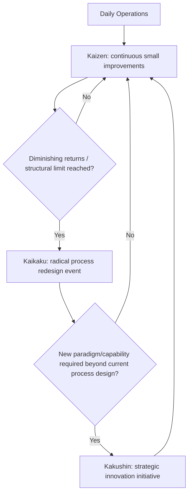

## Distinguishing Kaizen, Kaikaku, and Kakushin

### Overview

Kaizen, Kaikaku, and Kakushin represent three distinct categories of improvement within Lean and Toyota Production System thinking, differentiated primarily by the **scale**, **speed**, and **nature of change** each involves. While Kaizen refers to continuous, incremental improvement conducted by those closest to the work, Kaikaku and Kakushin describe more radical, transformative, and often leadership-driven change. Understanding the distinctions clarifies when each approach is appropriate and prevents the common error of treating all improvement activity as interchangeable "kaizen."

**Key Points**

- **Kaizen** (改善): small, continuous, incremental improvement — typically bottom-up, frequent, low-risk
- **Kaikaku** (改革): radical, breakthrough change — typically top-down, infrequent, higher-risk, larger scope
- **Kakushin** (革新): innovation, often technology-driven transformation — represents fundamentally new capability, not merely improved existing capability
- All three terms share the root character 改 (kai), meaning "change" or "reform," but differ in the second character and connotation
- Organizations benefit from applying the right type of change to the right situation, rather than defaulting exclusively to incremental Kaizen

---

### Etymology and Literal Meaning

| Term | Kanji | Literal Translation | Connotation |
| --- | --- | --- | --- |
| **Kaizen** | 改善 | "Change" + "Good/Better" | Continuous improvement toward a better state |
| **Kaikaku** | 改革 | "Change" + "Reform/Leather (transformation)" | Radical reform; a fundamental restructuring |
| **Kakushin** | 革新 | "Reform" + "New" | Innovation; creating something fundamentally new |

[Inference] The shared root character 改 (kai, "change") across Kaizen and Kaikaku signals that both are forms of intentional change, while the second character in each term signals the *manner* of that change — incremental betterment (善, zen) versus structural reform (革, kaku). This is a linguistic observation drawn from the kanji composition rather than an official Toyota doctrinal statement.

---

### Comparative Framework

```mermaid
flowchart LR
    subgraph Kaizen["KAIZEN — Continuous Improvement"]
        K1[Small, incremental steps]
        K2[Frequent, ongoing]
        K3[Bottom-up, frontline-driven]
        K4[Low cost, low risk]
    end
    subgraph Kaikaku["KAIKAKU — Radical Reform"]
        Kk1[Large, breakthrough change]
        Kk2[Infrequent, event-based]
        Kk3[Top-down or cross-functional leadership]
        Kk4[Higher cost, higher risk]
    end
    subgraph Kakushin["KAKUSHIN — Innovation"]
        Ks1[Fundamentally new capability]
        Ks2[Often technology or business-model driven]
        Ks3[Strategic, longer time horizon]
        Ks4[Highest uncertainty, highest potential impact]
    end
    Kaizen -->|Accumulated limits reached| Kaikaku
    Kaikaku -->|New paradigm required| Kakushin
```

---

### Kaizen: Continuous Incremental Improvement

Kaizen is the most widely recognized of the three terms in Western Lean literature, referring to the practice of making small, frequent improvements to existing processes, typically initiated and executed by the people who perform the work daily.

**Characteristics**

- Incremental: each individual improvement is small in scope and impact
- Continuous: conducted as an ongoing habit rather than a one-time event
- Participative: frontline workers are the primary drivers, consistent with the Respect for People principle
- Low-risk: small changes are easier to reverse if unsuccessful and require minimal capital investment
- Cumulative: the aggregate effect of many small improvements over time can be substantial

**Example**

An operator suggests repositioning a tool bin 30 cm closer to the workstation, reducing reach distance and shaving two seconds off each cycle — implemented immediately with no capital expenditure, repeated across hundreds of similar micro-improvements over a year.

**Typical Implementation Vehicles**: Kaizen events/workshops (short, focused improvement sprints, often 3–5 days), suggestion systems, daily Kaizen practiced as part of standard work review.

---

### Kaikaku: Radical, Breakthrough Reform

Kaikaku refers to radical, transformative change — a fundamental restructuring of a process, system, or organizational approach rather than incremental refinement of the existing one. Kaikaku is typically reserved for situations where incremental Kaizen has reached diminishing returns, or where the existing process paradigm itself is a limiting constraint.

**Characteristics**

- Radical: represents a step-change rather than incremental refinement
- Infrequent: occurs as a distinct event or initiative, not a continuous daily practice
- Leadership-driven: often requires authority, capital investment, or cross-functional coordination beyond what frontline teams can mobilize independently
- Higher risk: larger scope changes carry greater potential for disruption if unsuccessful
- Often involves reconceiving the process layout, technology, or organizational structure entirely

**Example**

Rather than incrementally optimizing an existing batch-production layout, a plant undertakes a Kaikaku initiative to completely redesign the factory floor around one-piece flow cellular manufacturing — relocating machines, retraining staff, and restructuring the entire production sequence in a concentrated transformation event.

**Typical Implementation Vehicles**: Major process redesign projects, facility relayouts, significant capital-investment initiatives, restructuring of organizational reporting lines.

---

### Kakushin: Innovation and Paradigm-Level Transformation

Kakushin represents the most transformative of the three categories, referring to innovation that creates fundamentally new capability, product, technology, or business model — not merely a reform of the existing process (Kaikaku) or an improvement of the existing process (Kaizen), but the introduction of something new that did not exist before within the organization's operating paradigm.

**Characteristics**

- Innovative: introduces new-to-the-organization (or new-to-the-industry) capability
- Strategic: typically tied to longer-term competitive positioning rather than immediate operational efficiency
- Technology or business-model driven: often involves new materials, automation paradigms, digital capability, or entirely new value propositions
- Highest uncertainty: outcomes are less predictable than Kaizen or even Kaikaku, since the capability itself is unproven within the organization

**Example**

A manufacturer's shift from traditional stamping and welding to computer-vision-guided robotic assembly cells represents Kakushin — this is not a reform of the existing stamping process (Kaikaku) but the introduction of a fundamentally different production paradigm and technological capability.

[Inference] Kakushin is discussed less frequently in mainstream Western Lean literature compared to Kaizen and Kaikaku, and its boundary with Kaikaku can be context-dependent — a change that is "radical reform" for one organization (Kaikaku) may represent genuine "innovation" (Kakushin) for another, depending on whether the underlying capability already existed within the organization's known repertoire.

---

### When to Apply Each Approach

| Situation | Appropriate Approach |
| --- | --- |
| Process functions adequately; opportunities exist for incremental efficiency gains | Kaizen |
| Process has structural limitations that repeated Kaizen cannot resolve; diminishing returns reached | Kaikaku |
| Competitive or technological environment requires capability the organization does not currently possess | Kakushin |
| Frontline team identifies a small friction point in daily work | Kaizen |
| Leadership identifies that an entire value stream requires redesign | Kaikaku |
| Organization must adopt a new technology paradigm to remain competitive | Kakushin |

---

### The Complementary Relationship

These three are not mutually exclusive alternatives but complementary tools within a mature continuous-improvement culture. A sustainable improvement system typically relies primarily on Kaizen for the majority of ongoing operational refinement, punctuated periodically by Kaikaku events when structural constraints are identified, and guided at the strategic level by Kakushin initiatives when the competitive landscape demands fundamentally new capability.

---

### Common Pitfalls

- **Treating all improvement as "Kaizen"**: A common Western simplification that collapses the distinct scale and risk profiles of these three concepts into a single generic term, obscuring important differences in required leadership involvement, risk tolerance, and resourcing
- **Relying solely on Kaizen when Kaikaku is needed**: Continuing to make small incremental adjustments to a fundamentally flawed process layout, achieving only marginal gains when a structural redesign would yield substantially greater benefit
- **Attempting Kaikaku without Kaizen discipline**: Undertaking radical redesign without the underlying culture of continuous, disciplined problem-solving that sustains the gains afterward, risking regression to prior performance
- **Conflating Kaikaku with Kakushin**: Treating a large-scale process reform (Kaikaku) as equivalent to genuine innovation (Kakushin) when no fundamentally new capability is actually introduced

---

### Relationship to Other TPS/Lean Tools

- **PDCA**: applies at every scale — Kaizen, Kaikaku, and Kakushin initiatives are all structured through Plan-Do-Check-Act cycles, differing in cycle duration and scope
- **A3 Thinking**: used to document and justify both Kaizen-scale improvements and larger Kaikaku initiatives
- **Hoshin Kanri**: strategic deployment planning often determines when Kaikaku or Kakushin initiatives are prioritized versus routine Kaizen activity
- **Value Stream Mapping**: frequently used to identify whether a process requires incremental Kaizen or a Kaikaku-level redesign

---

**Related Topics**

- PDCA Cycle in depth
- A3 Thinking and the A3 Report Structure
- Hoshin Kanri and Strategy Deployment
- Value Stream Mapping fundamentals
- Kaizen Events and Rapid Improvement Workshops
- One-Piece Flow and Cellular Manufacturing Design
- The Toyota Way: Continuous Improvement and Respect for People