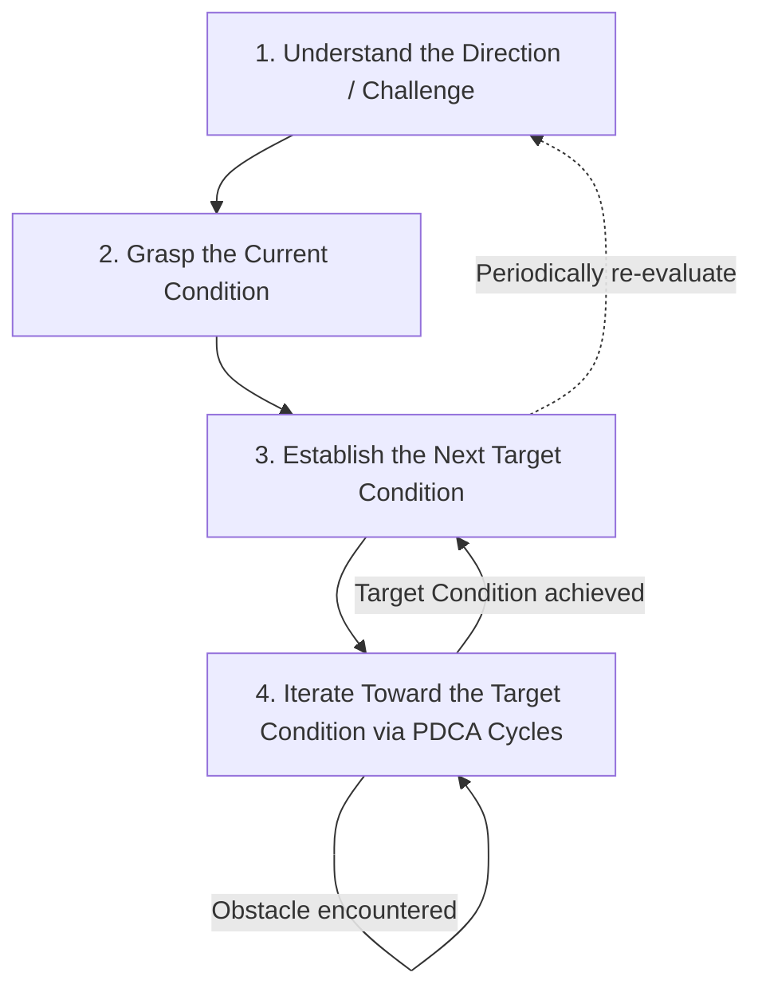
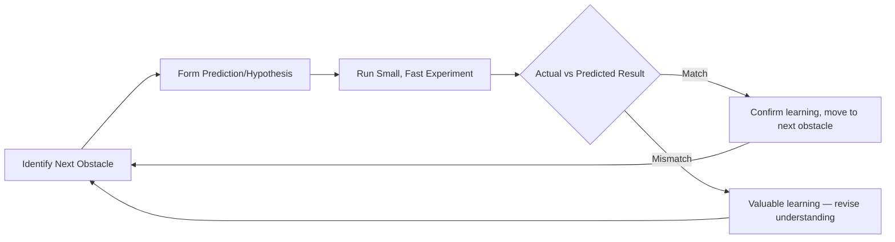
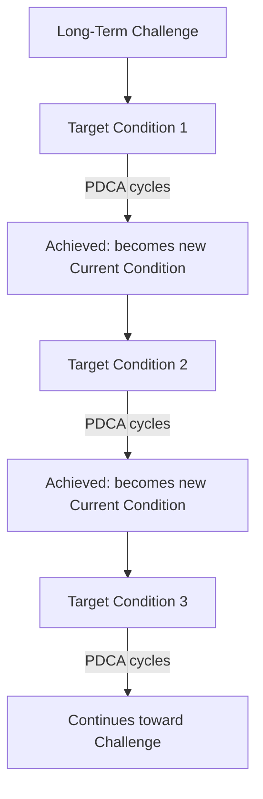

## The Improvement Kata's Four Step Pattern

### Overview

The Improvement Kata is a structured, repeatable routine for scientific thinking and practice, developed and articulated by Mike Rother based on extensive research into how Toyota develops improvement capability across its organization. Rather than being a specific problem-solving tool like Five Whys or a specific document like the A3, the Improvement Kata is a meta-pattern — a way of structuring thinking and behavior — that describes the underlying routine practiced consistently at Toyota when moving from a current condition toward a challenging future condition, one target condition at a time.

**Key Points**

- Popularized by Mike Rother in *Toyota Kata* (2009), based on research into Toyota's internal management practices
- "Kata" (型) is a Japanese term borrowed from martial arts, referring to a practiced routine or pattern drilled until it becomes habitual
- The four-step pattern is a scientific-thinking routine, not a one-time project methodology
- Distinguished from, but complementary to, the Coaching Kata (the mechanism by which the Improvement Kata is taught and reinforced)
- Emphasizes navigating toward a challenge through short, iterative learning cycles rather than planning a complete solution upfront

---

### Origins and Philosophical Basis

Mike Rother's research, documented extensively in *Toyota Kata*, sought to answer a question that had puzzled many Lean practitioners: why do attempts to replicate specific Toyota tools (kanban, 5S, standardized work) in other organizations frequently fail to reproduce Toyota's sustained improvement capability? Rother's conclusion was that the visible tools represent surface-level artifacts of a deeper, largely invisible behavioral routine — a kata — practiced consistently by Toyota managers and employees when approaching any improvement challenge. This routine, rather than any single tool, was identified as the more fundamental transferable capability.

[Inference] Rother's framework is influential and widely adopted in the Lean community, but it represents an external researcher's interpretation and formalization of observed Toyota practices rather than an official internal Toyota document — a distinction Rother himself acknowledges in his writing.

---

### The Four-Step Pattern

#### Step 1: Understand the Direction or Challenge

The starting point of the kata is a clear, longer-term, and often ambitious challenge — typically set by management and aligned with organizational strategy (often connected to Hoshin Kanri strategic deployment). The challenge is deliberately set beyond the current known solution path, requiring the team to navigate through territory where the specific route is not yet known.

- Defines a meaningful, often multi-month or multi-year strategic direction
- Distinguished from a specific, immediate target — the challenge is the "North Star," not the next step
- Should be significant enough that the path to achieving it is not obvious at the outset, necessitating genuine learning rather than mere execution of a known plan

**Example**

"Achieve a fully leveled, one-piece-flow production system for the entire vehicle sub-assembly process within 18 months" — a challenge that likely cannot be achieved by any single known countermeasure, requiring iterative learning toward it.

#### Step 2: Grasp the Current Condition

Before determining what to do next, the team must develop a precise, fact-based, quantified understanding of how the process currently performs. This mirrors the Genchi Genbutsu principle — the current condition must be established through direct observation and data, not assumption.

- Gather objective, measurable facts about current process performance (cycle time, quality rate, changeover time, etc.)
- Observe the process directly rather than relying on secondhand or aggregated reports alone
- Establish this understanding freshly each time a new target condition is being set — the current condition changes as improvements accumulate, so this step recurs throughout the kata cycle, not just once

**Example**

Direct time-study observation reveals: current cycle time is 62 seconds against a required takt time of 45 seconds; changeover between two product variants takes 12 minutes; defect rework rate is 4%.

#### Step 3: Establish the Next Target Condition

Rather than attempting to leap directly to the distant challenge, the team defines a specific, achievable **next target condition** — a concrete, measurable, time-bound description of how the process should operate in the near term (commonly within one to a few weeks), representing one meaningful step along the path toward the broader challenge.

A well-formed target condition specifies more than a single output metric; it describes the operating pattern of the process itself:

- The specific process step or scope in focus
- The desired operating pattern (e.g., cycle time, sequence, WIP levels, defect rate)
- A specific achieve-by date
- Where relevant, one or more process metrics in addition to outcome metrics

**Example**

"By [date], the sub-assembly station operates with a cycle time of 50 seconds or less, working in a fixed, standardized sequence, with WIP between stations limited to no more than 2 units."

Target conditions are deliberately set as a stretch beyond the current condition but within a timeframe short enough that the path is learnable through direct experimentation — typically far short of the ultimate challenge.

#### Step 4: Iterate Toward the Target Condition (PDCA Experimentation)

With the target condition defined, the team conducts a series of rapid, small-scale PDCA experiments to discover and overcome the obstacles preventing the process from currently operating at the target condition. This step is where the bulk of the kata's iterative, scientific character is expressed.

- Identify the single next obstacle standing between the current condition and the target condition
- Formulate a hypothesis (prediction) about what will happen if a specific change is made
- Conduct a small, fast experiment (often within a single day or even hours) to test the hypothesis
- Compare actual results against the prediction — a mismatch is itself valuable information, revealing a gap in understanding
- Adjust and repeat, cycling through many short PDCA loops until the target condition is achieved

Once the target condition is achieved and stabilized, the cycle returns to Step 2 (grasping the new current condition) and Step 3 (establishing the next target condition), continuing the iterative march toward the overarching challenge from Step 1.

---

### The Kata as a Recurring Cycle, Not a Linear Project

A critical distinguishing feature of the Improvement Kata is that Steps 2 through 4 repeat continuously — the process does not conclude after a single target condition is reached. Each achieved target condition becomes the new current condition, from which the next target condition is established, in a sustained, ongoing practice rather than a bounded project with a defined end date.

---

### Relationship to PDCA

The Improvement Kata's four steps are not a replacement for PDCA but rather a scaffolding that structures *when* and *at what scope* PDCA cycles are applied. Step 4 of the kata consists of numerous small, rapid PDCA cycles, each addressing a single specific obstacle, nested within the larger movement from current condition to target condition.

| Improvement Kata Step | Relationship to PDCA |
| --- | --- |
| 1. Direction/Challenge | Sets long-term context; not itself a PDCA cycle |
| 2. Grasp Current Condition | Fact-finding basis for the Plan phase |
| 3. Establish Target Condition | Defines the "Plan" objective for upcoming cycles |
| 4. Iterate via PDCA | Composed of many rapid, nested Plan-Do-Check-Act loops |

---

### Distinguishing the Improvement Kata from the Coaching Kata

While closely related and often discussed together, these are two separate patterns serving different functions:

| Aspect | Improvement Kata | Coaching Kata |
| --- | --- | --- |
| **Purpose** | The routine for *improving* a process | The routine for *teaching* the Improvement Kata to others |
| **Practitioner** | The person conducting the improvement work | A mentor/coach guiding the improver |
| **Mechanism** | Four-step pattern described above | A structured set of coaching questions asked in a defined sequence (the "Five Questions" / coaching cycle) |
| **Output** | Process improvement toward the target/challenge | Development of the improver's scientific-thinking capability |

[Inference] The Coaching Kata is generally treated as inseparable from sustaining the Improvement Kata in practice, since Rother's research suggests the routine is best developed through structured mentorship (echoing the mentor-mentee tradition seen in A3 thinking) rather than through documentation alone — though this is Rother's interpretive framework rather than a directly verifiable universal claim.

---

### Common Pitfalls

- **Setting the target condition too far ahead**: Attempting to jump directly to the long-term challenge rather than defining an achievable near-term target condition, undermining the rapid-learning cycle structure
- **Treating the current condition as static**: Failing to re-grasp the current condition after each target condition is achieved, working from outdated assumptions
- **Skipping hypothesis formation**: Making changes without first predicting expected results, which forecloses the learning value that comes from comparing prediction to actual outcome
- **Batching too many changes per PDCA cycle**: Testing multiple variables simultaneously within Step 4, making it difficult to attribute results to a specific change
- **Treating the kata as a one-time project**: Disbanding the improvement effort once a single target condition is reached, rather than continuing the cycle toward the broader challenge

---

### Relationship to Other TPS/Lean Tools

- **PDCA**: the Improvement Kata's Step 4 is structurally composed of nested PDCA cycles
- **A3 Thinking**: shares the same underlying scientific-thinking discipline; some organizations use A3 documentation to record kata target conditions and experiments
- **Genchi Genbutsu**: essential to Step 2 (Grasp the Current Condition), requiring direct, firsthand observation
- **Hoshin Kanri**: often supplies the overarching challenge referenced in Step 1
- **Coaching Kata**: the paired mechanism through which the Improvement Kata is taught and sustained

---

**Related Topics**

- The Coaching Kata and the Five Coaching Questions
- PDCA Cycle in depth
- A3 Thinking and the A3 Report Structure
- Genchi Genbutsu and direct observation
- Hoshin Kanri and Strategy Deployment
- Target Condition vs. Goal: Precise Distinctions in Kata Practice
- Building a Daily Kata Practice: Organizational Implementation