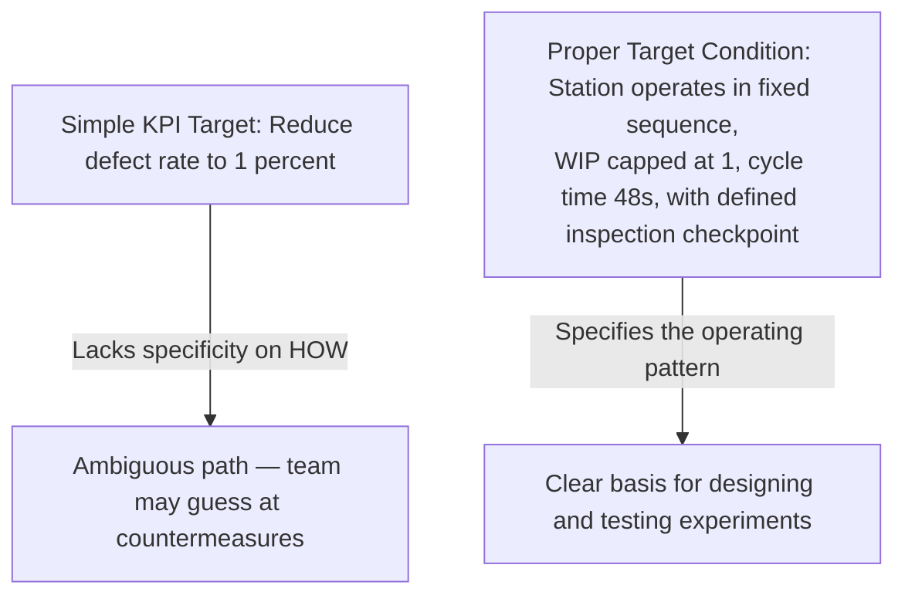
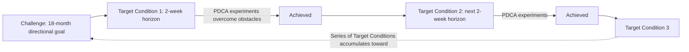

## Establishing a Challenge and Target Condition

### Overview

Establishing a Challenge and a Target Condition constitutes the directional and near-term goal-setting foundation of the Improvement Kata. These two constructs operate at different time horizons and levels of specificity: the Challenge defines an ambitious, longer-term direction that gives improvement work meaning and orientation, while the Target Condition defines a precise, near-term operating pattern the team commits to achieving within days or weeks. Precision in distinguishing and correctly formulating each is critical, since conflating them — or defining either vaguely — undermines the scientific rigor the Improvement Kata is designed to instill.

**Key Points**

- Challenge: a longer-term (often 3–12+ months), ambitious, directional statement — the "why" behind the improvement effort
- Target Condition: a near-term (typically days to a few weeks), specific, measurable description of desired process operation — the immediate "next step" toward the Challenge
- Both must be grounded in the current condition, established through direct observation (Genchi Genbutsu)
- A Target Condition is not merely a metric goal; it describes a complete operating pattern of the process
- Poorly formed Challenges or Target Conditions are among the most common failure points in kata practice

---

### The Challenge: Defining Long-Term Direction

#### Purpose

The Challenge sets the outer boundary of aspiration — a condition significantly beyond current performance, intended to orient improvement effort toward a meaningful strategic outcome rather than allowing incremental activity to drift without direction. It typically originates from, or is closely aligned with, organizational strategy (frequently connected to Hoshin Kanri strategy deployment).

#### Characteristics of a Well-Formed Challenge

- **Directionally clear**: describes a future state of the process or value stream, not a vague aspiration ("be more efficient")
- **Time-horizon appropriate**: generally set far enough out (often 6 months to several years) that the specific path to achieve it is not yet known
- **Grounded in business need**: connected to customer requirements, competitive positioning, or strategic objectives — not arbitrary
- **Stretch, not fantasy**: ambitious enough to require genuine learning and multiple target conditions to achieve, but not so detached from reality that it provides no orientation value
- **Process-focused**: typically describes how a specific value stream or process should operate (e.g., true one-piece flow, specific lead time, specific quality level) rather than only an abstract financial outcome

**Example**

"Within 18 months, the engine sub-assembly line operates in continuous one-piece flow at a takt time of 38 seconds, with zero defects escaping to the next process, and no more than 4 hours of finished-goods inventory buffer."

#### Common Sources of a Challenge

- Hoshin Kanri strategic breakthrough objectives cascaded down to the value stream level
- Customer requirement shifts (e.g., new demand volume, tighter quality specifications)
- Competitive benchmarking gaps identified by leadership
- A recognized fundamental limitation in the current process design that Kaizen alone cannot resolve (potentially signaling a Kaikaku-scale Challenge)

---

### The Target Condition: Defining the Next Concrete Step

#### Purpose

The Target Condition translates the distant Challenge into an immediately actionable, learnable step. Rather than attempting to plan the entire path to the Challenge in advance (which is generally not knowable given the unknown obstacles that will be encountered), the team commits to achieving one specific, well-defined operating pattern within a short timeframe, then iterates.

#### Components of a Well-Formed Target Condition

A precise Target Condition specifies several distinct elements, not merely a single output number:

| Component | Description |
| --- | --- |
| **Specific process/scope** | Which exact process step, station, or segment of the value stream is in focus |
| **Achieve-by date** | A specific date, typically days to a few weeks out |
| **Operating pattern** | How the process should function — sequence, timing, work-in-process levels, staffing pattern |
| **Process metric(s)** | Measures describing *how* the process runs (e.g., cycle time per step, changeover time) |
| **Outcome metric(s)** (where applicable) | Measures describing the *result* of the process running that way (e.g., defect rate, output volume) |

**Example**

"By [date, 3 weeks out]: the final-assembly station completes each unit in a fixed six-step sequence at 48 seconds or less per unit, with a maximum of 1 unit of WIP between this station and the next, achieved with the current staffing level of 2 operators."

This differs meaningfully from a vague goal such as "improve final assembly efficiency," which lacks the specificity needed to know precisely when the condition has been achieved or to design focused experiments toward it.

#### Distinguishing Target Condition from a Simple Goal or KPI Target

A common error is treating the Target Condition as equivalent to a single performance metric target (e.g., "reduce defect rate to 1%"). The Improvement Kata's Target Condition is broader — it describes the *pattern of operation* that, if achieved, would be expected to produce the desired outcome metric, giving the team something concrete to design toward and verify against, rather than an outcome number disconnected from any specified process design.

---

### The Relationship Between Challenge and Target Condition

The Challenge is not decomposed into a predetermined sequence of Target Conditions at the outset. Because the obstacles between current condition and Target Condition are not fully knowable in advance, each successive Target Condition is established only once the prior one has been reached and the new current condition has been freshly grasped — consistent with the iterative, experimental nature of the Improvement Kata.

---

### Process for Establishing Each

#### Establishing the Challenge

1. Align with organizational strategy or a recognized significant gap (often via Hoshin Kanri deployment)
2. Define the desired future state of the specific process or value stream in concrete, process-oriented terms
3. Set a time horizon distant enough that the path is not yet fully known, but close enough to remain meaningfully actionable for the team
4. Communicate the Challenge clearly to the team, ensuring it is understood as directional inspiration rather than an immediately executable plan

#### Establishing the Target Condition

1. **Grasp the current condition** through direct observation (Genchi Genbutsu) — quantify how the process currently operates
2. **Identify the threshold** — a meaningful, achievable stretch beyond current performance, generally reachable within days to a few weeks
3. **Define the specific operating pattern** the process should exhibit at the Target Condition, including relevant process and outcome metrics
4. **Set an achieve-by date**
5. **Verify alignment** — confirm the Target Condition represents genuine progress toward the overarching Challenge, not an arbitrary or disconnected improvement

---

### Common Pitfalls

- **Challenge defined too vaguely**: Statements like "be world-class" or "improve significantly" provide no concrete orientation and cannot inform meaningful Target Conditions
- **Target Condition set too far out**: Attempting to define a Target Condition months away undermines the rapid-learning, short-cycle nature of the kata; the appropriate horizon is typically measured in days to a few weeks
- **Target Condition as output-only metric**: Specifying only a result (e.g., "95% on-time delivery") without describing the process operating pattern expected to produce that result, leaving the team without a clear basis for designing experiments
- **Skipping the current-condition grasp before setting a new Target Condition**: Setting successive Target Conditions from outdated or assumed data rather than freshly observed current performance
- **Treating the Challenge as immediately achievable through a single Target Condition**: Failing to recognize that multiple successive Target Conditions, each surfacing and resolving different obstacles, are typically required to progress meaningfully toward the Challenge

[Inference] Practitioner guidance (notably from Mike Rother's kata materials) generally suggests Target Condition horizons in the range of one to four weeks as a practical starting convention for teams new to the practice, though the appropriate interval can vary by process complexity and organizational context, and no single universal duration applies to every situation.

---

### Relationship to Other TPS/Lean Tools

- **Improvement Kata Four-Step Pattern**: Establishing the Challenge and Target Condition constitutes Steps 1 and 3 of the four-step pattern
- **Genchi Genbutsu**: required to accurately grasp the current condition underpinning any Target Condition
- **PDCA**: the Target Condition defines the objective toward which the Step 4 PDCA experimentation cycles are directed
- **Hoshin Kanri**: frequently the strategic source from which an appropriate Challenge is derived
- **Coaching Kata**: the coach's structured questions are specifically designed to reinforce disciplined, precise articulation of both the Challenge and the current Target Condition

---

**Related Topics**

- The Improvement Kata's Four Step Pattern
- The Coaching Kata and the Five Coaching Questions
- Genchi Genbutsu and direct observation
- Hoshin Kanri and Strategy Deployment
- PDCA Cycle in depth
- Designing Rapid PDCA Experiments Toward a Target Condition