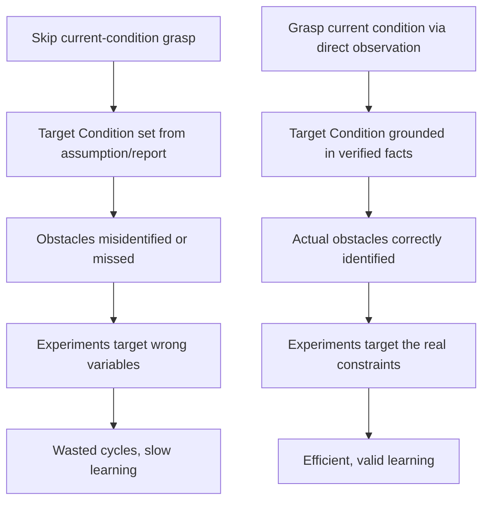
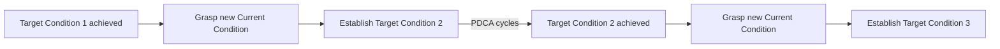

## Grasping the Current Condition

### Overview

Grasping the Current Condition is the second step of the Improvement Kata's four-step pattern, and functions as the essential factual foundation upon which a valid Target Condition can be established. It refers to the disciplined, fact-based practice of directly and precisely understanding how a process actually operates today — not how it is assumed, reported, or believed to operate — before any decision is made about what to change next. This step operationalizes Genchi Genbutsu within the kata framework and must be repeated afresh each time a new Target Condition cycle begins, since the process's actual condition shifts continuously as improvements accumulate.

**Key Points**

- Requires direct, firsthand observation of the process (Genchi Genbutsu), not reliance on secondhand reports or assumptions
- Must be re-established at the start of every new Target Condition cycle, not performed once at project outset
- Focuses on the process's actual operating pattern, not only summary output metrics
- Distinguishes between what the process is *designed* to do and what it *actually* does when observed directly
- Provides the essential baseline against which a meaningful, achievable Target Condition can be set

---

### Why Grasping the Current Condition Precedes Target-Setting

Setting a Target Condition without first grasping the current condition risks defining a goal that is either unrealistically distant (ignoring genuine constraints) or insufficiently ambitious (failing to account for slack already present). More critically, without a precise understanding of how the process currently behaves — including its variability, its failure points, and undocumented workarounds — the team cannot identify which specific obstacles stand between current performance and the desired target, undermining the entire subsequent PDCA experimentation cycle.

---

### What "Grasping" Involves

#### Direct Observation at the Process (Genchi Genbutsu)

The practitioner physically observes the process in operation rather than relying exclusively on dashboards, verbal summaries, or historical reports. Observation reveals details that aggregated data typically cannot: hesitations, workarounds, informal adjustments operators make to cope with variation, and the actual sequence followed versus the documented standard.

#### Quantifying Actual Performance

Beyond qualitative observation, grasping the current condition requires collecting specific, measurable data describing how the process performs:

| Data Category | Examples |
| --- | --- |
| **Timing** | Actual cycle time per unit/step (measured directly, not from historical average alone), variation across observations |
| **Flow** | Work-in-process (WIP) levels between steps, batch sizes, sequencing |
| **Quality** | Defect/error rate, rework frequency, first-pass yield |
| **Capacity/Demand** | Current output rate versus takt time (customer demand rate) |
| **Consistency** | Degree to which actual work matches documented standardized work, if any exists |

#### Understanding the Pattern of Operation, Not Just Output

A central emphasis is capturing *how* the process currently operates — its actual pattern, sequence, and behavior — not merely a single output metric. Two processes with identical average cycle times can have very different underlying patterns (e.g., one is highly consistent, the other swings widely and averages out), and this distinction materially affects which obstacles are relevant.

**Example**

An output report shows a station averages 52 seconds per cycle against a 50-second takt time — appearing only marginally behind target. Direct observation reveals the actual pattern: most cycles complete in 40 seconds, but roughly 1 in 5 cycles takes over 90 seconds due to an intermittent part-alignment issue, meaning the true underlying problem (an intermittent quality/tooling issue) is entirely obscured by the average alone.

---

### The Recurring Nature of This Step

Grasping the Current Condition is not a one-time activity performed only at the start of an improvement initiative. Because each achieved Target Condition becomes the new current condition, this step recurs at the start of every subsequent Target Condition cycle throughout the ongoing practice of the Improvement Kata.

Skipping this re-grasping step and instead carrying forward assumptions from an earlier point risks working from a stale or inaccurate picture of the process, particularly since the process's behavior may have shifted in ways not captured by the original Target Condition's success criteria alone.

---

### Practical Techniques for Grasping the Current Condition

#### Direct Time Observation

- Standing at the process and timing multiple cycles directly, rather than relying solely on system-reported averages
- Recording not just duration but the specific steps, interruptions, and variation observed

#### Process Walk-Through

- Physically tracing the flow of work, material, or information through the process sequence
- Noting where queues, delays, or handoffs occur that may not be visible in aggregated data

#### Engaging Directly with Operators

- Asking those who perform the work about their actual experience, workarounds, and pain points
- Respecting frontline knowledge as a primary source of insight (consistent with Respect for People)

#### Comparing Actual Practice to Documented Standard

- Where standardized work exists, observing whether actual practice matches the documented standard, and where deviations occur
- Deviations themselves are valuable data points, potentially indicating either non-compliance or an outdated/unrealistic standard

#### Visualizing the Data

- Plotting cycle time distributions, run charts, or simple visual boards to make patterns and variation visible to the team, rather than relying on a single summary statistic

---

### Common Pitfalls

- **Substituting reports for direct observation**: Relying on dashboards, historical averages, or secondhand summaries rather than going to the process directly, risking the loss of critical situational detail
- **One-time grasp**: Treating the current-condition assessment as a single activity completed at project kickoff, then failing to re-grasp it before establishing subsequent Target Conditions
- **Focusing only on output metrics**: Capturing a single summary number (e.g., average cycle time) while missing the underlying operating pattern, variation, and specific points of difficulty that actually determine which obstacles matter
- **Insufficient observation duration/sample size**: Drawing conclusions from too few observed cycles, missing intermittent but significant sources of variation
- **Conflating current condition with root cause analysis**: Grasping the current condition establishes *what is happening*; identifying *why* it happens (root cause) is a distinct, subsequent analytical activity, often conducted through Five Whys within the Step 4 PDCA experimentation

[Inference] Kata practitioner guidance generally recommends that this step be conducted by the person doing the improvement work themselves (with coaching support), rather than delegated entirely to a separate analyst, since firsthand exposure to the process is considered integral to developing the observer's own scientific-thinking capability — though the degree of hands-on involvement expected can vary by organizational context and team structure.

---

### Relationship to Other TPS/Lean Tools

- **Genchi Genbutsu**: Grasping the Current Condition is the direct application of this broader TPS principle within the specific context of the Improvement Kata
- **Improvement Kata Four-Step Pattern**: constitutes Step 2, sitting between establishing the Challenge (Step 1) and setting the Target Condition (Step 3)
- **A3 Thinking**: parallels the "Current Condition" section of an A3 report, which similarly demands fact-based, directly observed data
- **Five Whys**: root cause analysis conducted during Step 4 experimentation builds upon the factual baseline established while grasping the current condition
- **Coaching Kata**: the coach's structured questioning specifically probes whether the current condition has been grasped with sufficient rigor before allowing the improver to proceed to target-setting

---

**Related Topics**

- The Improvement Kata's Four Step Pattern
- Establishing a Challenge and Target Condition
- Genchi Genbutsu and direct observation
- The Coaching Kata and the Five Coaching Questions
- A3 Thinking and the A3 Report Structure
- Five Whys Root Cause Analysis
- Designing Rapid PDCA Experiments Toward a Target Condition