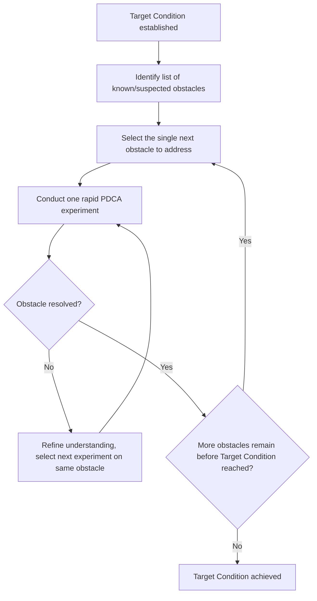
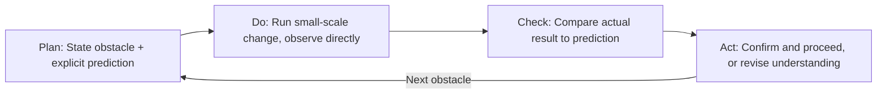
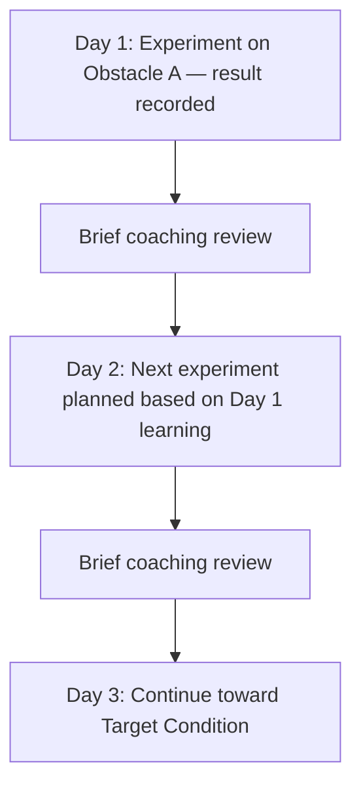

## Conducting PDCA Experiments Toward the Target Condition

### Overview

Conducting PDCA Experiments Toward the Target Condition corresponds to Step 4 of the Improvement Kata's four-step pattern — the iterative, scientific engine through which a team moves from the current condition to an established Target Condition. Rather than planning a complete solution upfront, this step involves identifying obstacles one at a time and testing small, fast hypotheses about how to overcome each, using tightly scoped Plan-Do-Check-Act cycles. The discipline of this step lies in prediction: each experiment begins with an explicit forecast of the expected result, which is then compared against what actually occurs, generating learning regardless of whether the prediction proves correct.

**Key Points**

- Composed of many small, rapid, nested PDCA cycles — not one large PDCA cycle per Target Condition
- Each cycle addresses a single identified obstacle at a time
- Requires an explicit prediction before each experiment, enabling a genuine test of understanding
- A mismatch between prediction and actual result is treated as valuable learning, not failure
- Distinguished from broader organizational PDCA (e.g., an A3 report) by its short cycle time — often hours to a few days

---

### The Obstacle-Driven Structure

Unlike a fully pre-planned implementation roadmap, Step 4 begins by identifying the single next obstacle currently preventing the process from operating at the established Target Condition. Only one (or a small, closely related set of) obstacle is addressed per experimental cycle, since attempting to resolve multiple obstacles simultaneously makes it difficult to attribute results to a specific cause.

Obstacles are typically surfaced through direct observation of the process while attempting to move toward the Target Condition — they are discovered empirically during the work itself, rather than being exhaustively predicted in advance.

---

### The Rapid PDCA Experiment Cycle

Each individual experiment within Step 4 follows the standard Plan-Do-Check-Act structure, but scoped tightly and executed quickly — often within a single shift, day, or even hours, rather than the weeks or months typical of a larger organizational PDCA cycle (such as one documented in a full A3 report).

#### Plan

- State the specific obstacle being addressed
- Formulate an explicit **prediction**: what result is expected if a specific, small change is made
- Design the smallest experiment that will meaningfully test the prediction
- Define how the result will be measured

**Example**

"Obstacle: operators frequently pause mid-cycle to search for a specific fastener. Prediction: if fasteners are pre-staged in a dedicated bin at the point of use, cycle time will decrease by approximately 8 seconds and pause frequency will drop to near zero."

#### Do

- Execute the small change exactly as planned, on a limited scale (e.g., a single shift, a single operator, a single unit batch) where feasible
- Observe directly while the experiment runs (Genchi Genbutsu), recording both the planned metric and any unexpected observations

#### Check

- Compare the actual result against the stated prediction
- Note not only whether the prediction was numerically correct, but *why* it was or was not — this comparison is the primary source of learning
- A result that matches the prediction confirms the team's understanding of that specific obstacle; a mismatch reveals a gap in understanding requiring further investigation

#### Act

- If the change proved effective and the prediction was validated, incorporate it and move to the next obstacle
- If the prediction was not confirmed, use the new information to revise understanding and design the next experiment — this may mean trying a variation of the same change, or recognizing that the true obstacle was misidentified
- Either outcome feeds directly into selecting the next experiment; the cycle does not pause for extended deliberation

---

### The Centrality of Prediction

A defining characteristic of Step 4, distinguishing it from ad hoc trial-and-error, is the requirement to state an explicit, falsifiable prediction *before* running each experiment. This transforms the activity from casual adjustment into genuine scientific testing: the gap between prediction and actual outcome is itself the primary unit of learning, regardless of whether the underlying change is ultimately kept.

| Without Explicit Prediction | With Explicit Prediction |
| --- | --- |
| Change is made; result is observed afterward | Expected result is stated first; actual result is then compared against it |
| Success/failure is the only outcome category | Match/mismatch between prediction and result generates learning either way |
| Difficult to assess whether the team's underlying understanding of the process is improving | Repeated accurate predictions indicate growing understanding; repeated mismatches reveal a persistent knowledge gap |

[Inference] This emphasis on prediction-before-experiment is frequently cited in kata literature as the mechanism by which the Improvement Kata builds genuine scientific-thinking capability in practitioners over time, as opposed to merely producing isolated process improvements — though the degree to which this capability-building effect can be measured independently of the process improvements themselves is not something that lends itself to precise quantification.

---

### Frequency and Cadence

Step 4 experiments are typically conducted at a high frequency — commonly one or more per day during an active improvement effort — reflecting the kata's emphasis on rapid, incremental learning cycles rather than infrequent, large-scale interventions. This cadence is often supported by a **daily kata practice**, in which the improver and a coach briefly review the most recent experiment's result and plan the next one together (structured through the Coaching Kata's set of questions).

---

### Distinguishing Step 4 PDCA from A3-Level PDCA

Both the Improvement Kata's Step 4 and the A3 report embody Plan-Do-Check-Act, but they differ substantially in scope, cycle time, and granularity:

| Aspect | Step 4 Kata Experiments | A3-Level PDCA |
| --- | --- | --- |
| **Cycle duration** | Hours to a few days | Weeks to months |
| **Scope** | Single specific obstacle | Complete problem, often with multiple root causes and countermeasures |
| **Documentation** | Often informal (notebook, simple experiment log) | Formal single-page report |
| **Frequency within a project** | Many cycles per Target Condition | Typically one complete cycle per problem addressed |

An A3 report addressing a broader problem may, in practice, contain or be supported by numerous underlying Step 4-style rapid experiments conducted while working toward the countermeasures documented in the A3.

---

### Common Pitfalls

- **Skipping the explicit prediction**: Making a change and simply observing whether it "worked," without a stated forecast to compare against, forfeiting the learning value the comparison provides
- **Testing multiple changes simultaneously**: Bundling several changes into a single experiment, making it impossible to attribute the observed result to a specific cause
- **Scoping experiments too large**: Attempting to test a change across an entire shift or facility rather than a small, controlled scale, increasing risk and slowing the learning cycle
- **Treating a mismatched prediction as failure rather than data**: Discarding a result that did not confirm the prediction instead of using the gap to refine understanding of the obstacle
- **Insufficient direct observation during the "Do" phase**: Relying on after-the-fact reported results rather than observing the experiment as it unfolds, missing contextual detail relevant to interpreting the outcome

---

### Relationship to Other TPS/Lean Tools

- **Improvement Kata Four-Step Pattern**: Step 4 is the iterative execution phase following the Challenge (Step 1), Current Condition (Step 2), and Target Condition (Step 3)
- **PDCA**: the foundational cycle structure applied at small scale, repeated many times within this step
- **Genchi Genbutsu**: required during both the Check phase (verifying actual results directly) and ongoing observation during the Do phase
- **Coaching Kata**: the mechanism through which a coach reviews each experiment's prediction and result with the improver, reinforcing rigor
- **A3 Thinking**: operates at a broader scope, often informed by or encompassing multiple Step 4-style rapid experiments

---

**Related Topics**

- The Improvement Kata's Four Step Pattern
- Establishing a Challenge and Target Condition
- Grasping the Current Condition
- The Coaching Kata and the Five Coaching Questions
- PDCA Cycle in depth
- Genchi Genbutsu and direct observation
- A3 Thinking and the A3 Report Structure