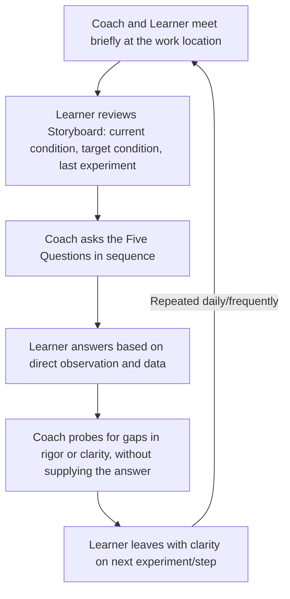
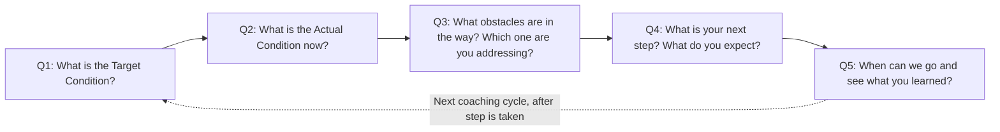

## The Coaching Kata and Its Five Core Questions

### Overview

The Coaching Kata is the paired routine through which the Improvement Kata is taught, reinforced, and sustained within an organization. While the Improvement Kata describes the pattern of scientific thinking applied to process improvement, the Coaching Kata describes the pattern of mentorship through which a coach helps a learner (the improver) practice that scientific thinking correctly and consistently. Its most recognizable feature is a fixed, short sequence of questions — commonly referred to as the Five Questions — asked in the same order during brief, frequent coaching interactions at the site of the improvement work.

**Key Points**

- Developed and documented by Mike Rother as the companion practice to the Improvement Kata
- Structured as a short, repeatable dialogue between coach and learner, conducted frequently (often daily)
- The Five Questions are asked in a fixed sequence to build a consistent thinking habit, not varied case-by-case
- Conducted at or near the actual work (reflecting Genchi Genbutsu), typically using a simple visual tracking mechanism (often called a "Storyboard")
- Distinguishes coaching from directive instruction: the coach guides the learner's thinking process rather than supplying answers

---

### Purpose and Philosophy

Mike Rother's research found that Toyota's improvement capability was sustained not merely through documented tools but through a consistent mentorship routine that developed scientific-thinking habits in employees at every level. The Coaching Kata formalizes this mentorship pattern: rather than a manager reviewing results and issuing directives, the coach asks a fixed set of questions designed to surface whether the learner is following the Improvement Kata's disciplined logic — grounding decisions in the current condition, working toward a clearly defined Target Condition, and learning through explicit prediction-based experiments.

The coach's role is deliberately non-directive with respect to *content* (the coach does not typically tell the learner what change to try) while being highly directive with respect to *process* (the coach firmly enforces that the learner follows the Improvement Kata's structure and rigor).

[Inference] This distinction between coaching the thinking process versus dictating the technical solution is a central theme in Rother's writing and is widely emphasized in kata practitioner literature, reflecting a deliberate design choice intended to build the learner's own capability rather than create dependency on the coach's specific answers — though the precise balance struck varies by coach and organizational maturity.

---

### The Coaching Cycle Structure

Coaching Kata interactions are typically brief (often 5–15 minutes), frequent (often daily or near-daily), and conducted at the location of the improvement work rather than in a separate meeting room — reinforcing the Genchi Genbutsu principle within the coaching relationship itself.

---

### The Five Core Coaching Kata Questions

The sequence is generally structured around four questions asked about the current improvement effort, followed by a fifth question — often called the "coaching question" or reflection question — addressed to the learner about their most recent experiment. Different sources present minor variations in exact wording, but the core structure is consistent.

#### Question 1: "What is the Target Condition?"

- Establishes whether the learner has a clear, specific Target Condition in mind, grounded in the broader Challenge
- If the learner cannot state this precisely, the coaching conversation redirects to clarifying or re-establishing the Target Condition before proceeding

#### Question 2: "What is the Actual Condition now?"

- Requires the learner to state the current, factual status of the process — based on direct, recent observation, not assumption or memory of an earlier state
- Reinforces the discipline of re-grasping the current condition rather than working from stale information

#### Question 3: "What obstacles do you think are preventing you from reaching the Target Condition? Which one are you addressing now?"

- Surfaces the learner's current understanding of what stands between the actual condition and the Target Condition
- Requires the learner to identify a **single** obstacle currently being worked on, reinforcing the one-obstacle-at-a-time discipline of Step 4 experimentation

#### Question 4: "What is your next step? What do you expect?"

- Requires the learner to state the specific next experiment planned, along with an explicit **prediction** of its expected result
- This question directly enforces the prediction-based rigor central to valid PDCA experimentation — an answer without a stated prediction is incomplete

#### Question 5: "When can we go and see what we Learned from taking that step?"

- Schedules the follow-up check, ensuring the loop closes with a direct comparison between the stated prediction and the actual observed result
- Reinforces Genchi Genbutsu by specifying that the coach and learner will go observe together, rather than relying on a verbal report afterward

---

### Summary Table of the Five Questions

| # | Question | Purpose |
| --- | --- | --- |
| 1 | What is the Target Condition? | Confirms clarity and specificity of the near-term goal |
| 2 | What is the Actual Condition now? | Confirms current, fact-based understanding (Genchi Genbutsu) |
| 3 | What obstacles do you think are preventing you from reaching the Target Condition? Which one are you addressing now? | Confirms focus on a single, identified obstacle |
| 4 | What is your next step? What do you expect? | Enforces explicit prediction before action |
| 5 | When can we go and see what we learned from taking that step? | Schedules direct verification, closing the PDCA loop |

---

### The Fifth Question's Special Role

Question 5 is sometimes distinguished from the first four as the point at which the coach and learner jointly commit to a specific, near-term follow-up observation — converting the coaching conversation itself into a small PDCA commitment. This reinforces that coaching is not a passive review of past results but an active, forward-looking part of the experimentation cycle.

---

### The Role of the Storyboard

Many implementations of the Coaching Kata use a simple, physical or visual tracking tool — often called a Storyboard — displayed at or near the work area, recording:

- The current Challenge and Target Condition
- A record of recent obstacles addressed and experiments conducted, including stated predictions and actual results
- The next planned step

The Storyboard serves as the shared reference point for the coaching conversation, ensuring the Five Questions are answered from visible, current data rather than recollection alone.

---

### Coach's Behavioral Discipline

Effective use of the Coaching Kata depends heavily on the coach's own discipline in adhering to the structured questioning pattern rather than reverting to directive problem-solving:

- **Ask, don't tell**: the coach resists the temptation to directly suggest the next experiment, instead guiding the learner to articulate it themselves
- **Insist on specificity**: vague answers to any of the Five Questions are challenged and redirected rather than accepted
- **Maintain the fixed sequence**: asking the questions in the same order each time builds a consistent thinking habit in the learner over repeated cycles
- **Keep sessions brief and frequent**: short, regular coaching sessions are generally favored over long, infrequent reviews, supporting rapid learning cycles

[Inference] The emphasis on strict question sequencing and coach restraint from supplying answers is presented in Rother's materials as essential to building the learner's independent capability over time; the specific behavioral discipline required of coaches is often cited as a significant implementation challenge for organizations newly adopting the practice, though the degree of difficulty naturally varies by organizational culture and prior coaching experience.

---

### Common Pitfalls

- **Coach supplies the answer**: Directly telling the learner what experiment to try next, undermining the capability-building purpose of the coaching relationship
- **Skipping or reordering questions**: Deviating from the fixed sequence, which weakens the consistent thinking habit the repetition is designed to instill
- **Accepting vague answers**: Allowing imprecise responses to Questions 1–4 (e.g., a Target Condition stated only as a general aspiration) without probing for specificity
- **Question 4 answered without a prediction**: Accepting a stated next step without requiring an explicit expected result, removing the scientific comparison basis for the follow-up
- **Infrequent or lengthy sessions**: Conducting coaching conversations too rarely or allowing them to become long, unfocused meetings rather than brief, frequent exchanges tied closely to the pace of actual experimentation

---

### Relationship to Other TPS/Lean Tools

- **Improvement Kata Four-Step Pattern**: the Coaching Kata is the mechanism through which adherence to the four-step pattern is reinforced and taught
- **PDCA**: Questions 4 and 5 directly correspond to the Plan (prediction) and Check (verification) phases of a Step 4 experiment
- **Genchi Genbutsu**: embedded throughout — Question 2 requires firsthand current-condition knowledge, and Question 5 commits to direct joint observation
- **A3 Thinking**: shares the same underlying mentor-mentee "catchball" tradition of iterative questioning found in A3 review processes

---

**Related Topics**

- The Improvement Kata's Four Step Pattern
- Establishing a Challenge and Target Condition
- Grasping the Current Condition
- Conducting PDCA Experiments Toward the Target Condition
- Genchi Genbutsu and direct observation
- A3 Thinking and the A3 Report Structure
- Building a Daily Kata Practice: Organizational Implementation