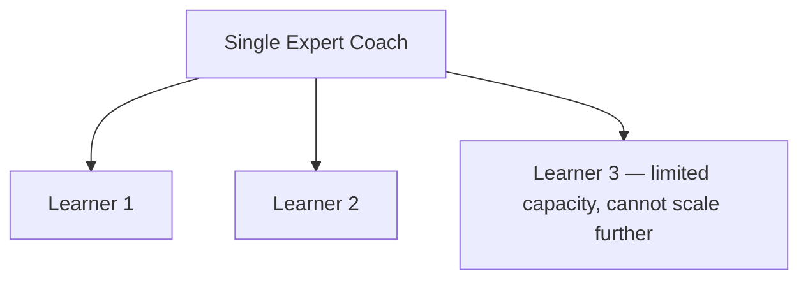
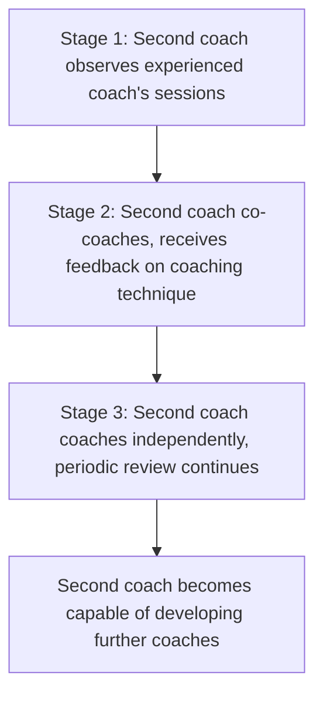
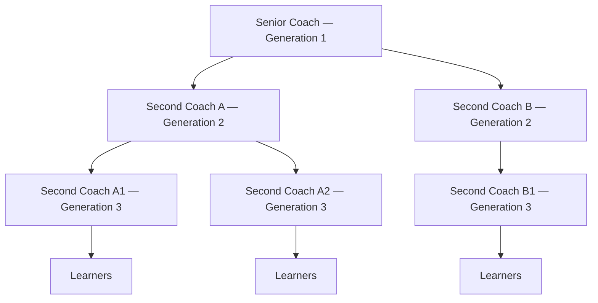

## Second Coach Development and Mentoring Chains

### Overview

Second Coach Development refers to the practice, within the Toyota Kata framework, of extending the Coaching Kata beyond a single coach-learner pair by having an experienced coach mentor a second individual — the "second coach" — who observes and eventually conducts coaching sessions themselves. Mentoring Chains describe the resulting organizational structure that emerges when this practice cascades across multiple levels: a senior coach develops new coaches, who in turn develop further coaches or learners, creating a self-sustaining, self-propagating system for building scientific-thinking capability throughout an organization rather than concentrating it in a small number of individuals.

**Key Points**

- Addresses a central scalability challenge: a single skilled coach can only directly mentor a limited number of learners
- The "second coach" typically begins by observing established coaching sessions before conducting their own
- Creates a cascading, multi-level structure often described as a mentoring or coaching chain
- Reflects the broader Toyota principle of developing people as a core management responsibility, not a peripheral HR function
- Distinct from simply training more people in kata *content* — it specifically builds the capacity to *coach* others in the practice

---

### The Scalability Problem the Practice Addresses

The Coaching Kata, practiced as a one-to-one relationship between a single expert coach and a single learner, does not scale efficiently across a large organization. If capability development depends entirely on a small number of highly experienced coaches personally mentoring each individual learner, the pace of organizational capability-building is severely constrained by the coaches' available time and attention.

Second coach development directly addresses this constraint by having the expert coach's mentoring effort produce not just improved learners, but *additional coaches* — multiplying the organization's coaching capacity over successive generations rather than remaining fixed.

---

### The Second Coach Development Process

#### Stage 1: Observation

The prospective second coach begins by directly observing an experienced coach conducting Coaching Kata sessions with a learner, without actively participating. This mirrors Genchi Genbutsu — the second coach learns the practice by watching it applied firsthand, rather than through description or documentation alone.

- Observes the fixed sequence and phrasing of the Five Questions in live use
- Notes how the experienced coach probes for specificity, redirects vague answers, and maintains the coaching cadence
- Observes the coach's restraint in not supplying direct answers to the learner

#### Stage 2: Guided Co-Coaching

The second coach begins participating more directly, often by taking on part of the coaching role (e.g., asking some of the Five Questions) while the experienced coach observes and provides feedback afterward, sometimes referred to as being "coached on coaching."

- The experienced coach (sometimes called a "second coach's coach" or meta-coach) observes the second coach's session with a learner
- Feedback is given on the second coach's own adherence to the Coaching Kata discipline — did they maintain the question sequence, avoid supplying answers, insist on specificity?
- This stage itself follows a kata-like structure: the second coach is themselves a learner being coached, but at the level of coaching skill rather than process-improvement skill

#### Stage 3: Independent Coaching with Periodic Review

The second coach begins conducting coaching sessions independently with their own learner(s), while continuing to receive periodic review and feedback from the more experienced coach, gradually reducing in frequency as proficiency develops.

---

### Mentoring Chains: The Cascading Structure

As second coaches themselves become proficient, they can take on the role of developing further second coaches, extending the pattern across multiple organizational levels. This produces a branching, multi-generational structure often referred to as a mentoring chain or coaching cascade.

Each link in the chain typically maintains a "second coach's coach" relationship even after becoming independently capable, preserving ongoing quality assurance and continued refinement of coaching skill across the organization, rather than treating coach development as a one-time credentialing event.

---

### Organizational Implications

#### Vertical Integration of Coaching Responsibility

In a mature implementation, coaching responsibility is typically integrated into existing management hierarchy rather than treated as a separate specialist function — team leaders coach team members, supervisors coach team leaders, and so on up the organizational structure, echoing Toyota's broader philosophy that developing people is an inherent responsibility of every management role, not a delegated HR activity.

| Organizational Level | Typical Coaching Relationship |
| --- | --- |
| Team Leader | Coaches individual operators/team members in the Improvement Kata |
| Group Leader / Supervisor | Coaches team leaders in their coaching of operators (second coach's coach) |
| Department Manager | Coaches group leaders in their coaching role |
| Senior Leadership | Sets overarching Challenges and periodically reviews the coaching chain's effectiveness |

#### Sustaining Consistency Across Generations

A key risk in any mentoring chain is drift — as the practice cascades across multiple generations of coaches, subtle deviations from the disciplined structure (e.g., loosening the fixed question sequence, allowing vaguer answers) can compound and dilute rigor over successive levels. Maintaining consistency typically requires:

- Periodic direct observation by more senior coaches, even after a second coach is deemed independently capable
- Shared reference materials or storyboards that standardize how Target Conditions and experiments are documented across the organization
- Explicit reinforcement of the Coaching Kata's fixed structure at each level, rather than allowing informal reinterpretation

[Inference] Kata practitioner literature generally emphasizes that mentoring chains require deliberate, ongoing attention from senior leadership to sustain rigor across multiple organizational levels, since informal or unsupported cascading of the practice risks degrading into generic "coaching" language disconnected from the specific disciplined structure of the Five Questions — though the precise mechanisms and degree of oversight needed likely vary meaningfully by organizational size and culture.

---

### Distinguishing Second Coach Development from General Leadership Training

Second coach development is narrower and more specific than general leadership or management training:

| General Leadership Training | Second Coach Development |
| --- | --- |
| Broad management or interpersonal skills | Specific proficiency in the Coaching Kata's fixed structure and Five Questions |
| Often classroom-based or generic | Conducted through direct observation and guided practice at the actual coaching sessions |
| May not involve an ongoing mentor relationship | Explicitly structured around an ongoing "second coach's coach" relationship |
| Not necessarily tied to a specific improvement methodology | Directly tied to sustaining the Improvement Kata practice specifically |

---

### Common Pitfalls

- **Promoting to coach without sufficient observation**: Allowing a prospective second coach to begin independent coaching before adequately observing the disciplined structure in practice, risking early deviation from the fixed question sequence
- **Treating coach development as one-time training**: Conducting a single workshop or certification rather than the extended, practice-based observation-and-feedback process the role actually requires
- **Losing the "second coach's coach" relationship after initial proficiency**: Discontinuing periodic review too early, allowing gradual drift from the disciplined structure over time
- **Concentrating coaching only at senior levels**: Failing to cascade coaching responsibility into frontline supervisory roles, recreating the original scalability bottleneck the practice is meant to solve
- **Diluting the Five Questions across generations**: Allowing successive coaches to informally modify or abbreviate the fixed question structure, weakening the consistency of the thinking habit it is designed to build

---

### Relationship to Other TPS/Lean Tools

- **The Coaching Kata and Its Five Core Questions**: second coach development is the mechanism by which capacity to conduct this specific practice is propagated across the organization
- **The Improvement Kata's Four Step Pattern**: the ultimate content being taught and reinforced through the mentoring chain
- **Genchi Genbutsu**: second coaches learn primarily through direct observation of live coaching sessions rather than abstract instruction
- **The Toyota Way — Respect for People**: developing people's capability is treated as a core management responsibility, directly reflected in the deliberate, structured investment second coach development requires

---

**Related Topics**

- The Coaching Kata and Its Five Core Questions
- The Improvement Kata's Four Step Pattern
- Establishing a Challenge and Target Condition
- Genchi Genbutsu and direct observation
- The Toyota Way: Continuous Improvement and Respect for People
- Building a Daily Kata Practice: Organizational Implementation