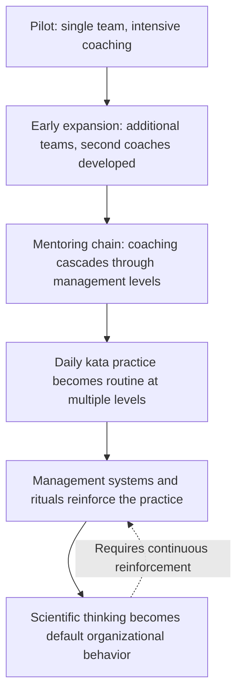
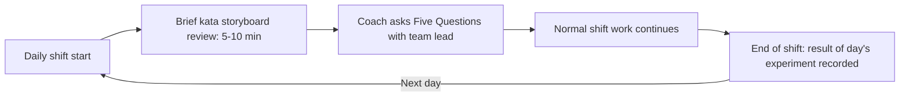

## Building Organization Wide Scientific Thinking Habits

### Overview

Building Organization Wide Scientific Thinking Habits refers to the extension of the Improvement Kata and Coaching Kata beyond isolated pilot teams or individual practitioners into a pervasive, embedded pattern of behavior across an entire organization. This represents the ultimate objective of Toyota Kata practice as articulated by Mike Rother: not the completion of specific process improvements, but the cultivation of a durable organizational capability for structured, evidence-based, iterative problem-solving that operates continuously at every level, from frontline operators to senior leadership.

**Key Points**

- The end goal of kata practice is a sustained organizational habit, not a series of one-off projects
- Requires embedding scientific thinking into daily routines and management systems, not treating it as a special initiative
- Depends on cascading coaching structures (mentoring chains) to scale beyond a small number of practitioners
- Leadership behavior and management systems must reinforce, rather than undermine, the discipline of the practice
- Distinguished from simply deploying Lean tools broadly — the focus is on the underlying thinking pattern, not the visible artifacts alone

---

### From Isolated Practice to Organizational Habit

Toyota Kata practice typically begins with a small number of pilot teams, coached intensively by experienced practitioners, before being deliberately expanded. The transition from isolated pilot success to organization-wide habit is a distinct and often more difficult challenge than establishing the initial pilot itself, since it requires the practice to survive without the concentrated attention a pilot team typically receives.

---

### Structural Requirements for Organization-Wide Adoption

#### Cascading Coaching Capacity (Mentoring Chains)

Since a single expert coach cannot directly mentor an entire organization, sustained scale requires the systematic development of additional coaches at successive management levels, each responsible for coaching those below them in both the Improvement Kata and the Coaching Kata itself.

- Coaching responsibility is integrated into existing management roles rather than treated as a separate specialist function
- Each level of the mentoring chain maintains periodic review from the level above, sustaining consistency across generations of coaches

#### Embedding Kata Cycles into Daily Routines

For scientific thinking to become habitual rather than exceptional, the Improvement Kata's rhythm — grasping current condition, establishing target conditions, running rapid experiments — must be incorporated into existing daily management activities rather than requiring separate, additional meetings.

- Daily huddles or shift-start meetings incorporate brief review of current Target Condition status and the next planned experiment
- Visual management tools (storyboards, tracking boards) are placed at the point of work, visible during normal daily activity
- Coaching conversations occur briefly and frequently at the workplace, rather than as infrequent formal reviews disconnected from the daily work rhythm

#### Alignment with Strategic Direction (Hoshin Kanri Linkage)

For organization-wide kata practice to remain meaningful rather than disconnected from business priorities, the Challenges pursued at each level should trace clearly back to broader organizational strategic objectives, typically through Hoshin Kanri strategy deployment. Without this linkage, widespread kata activity risks producing scattered, locally optimized improvements that do not aggregate into meaningful organizational progress.

---

### The Role of Leadership Behavior

A recurring theme in the literature on scaling Toyota Kata is that organization-wide adoption depends less on training content and more on the sustained behavioral discipline of leaders and managers, who must themselves consistently practice the Coaching Kata rather than reverting to directive, answer-supplying management habits under pressure.

#### Leadership Behaviors That Reinforce the Habit

- Consistently asking the Five Questions rather than issuing direct instructions when reviewing improvement work
- Visiting the actual workplace regularly to observe kata practice directly (Genchi Genbutsu), rather than relying solely on reports
- Protecting time for daily or frequent brief coaching interactions, rather than allowing them to be crowded out by other priorities
- Modeling patience with the iterative, sometimes slow nature of the process, resisting pressure to demand immediate large-scale results

#### Leadership Behaviors That Undermine the Habit

- Reverting to directive problem-solving (supplying the answer) when time pressure increases
- Prioritizing visible large-scale initiatives (Kaikaku-type projects) over the sustained, less visible daily discipline of Kaizen-scale kata practice
- Treating kata training as a one-time event rather than an ongoing coaching relationship
- Evaluating teams primarily on outcome metrics without regard to whether the underlying scientific-thinking process was followed rigorously

[Inference] Toyota Kata literature, particularly Rother's writing and subsequent practitioner case studies, consistently identifies leadership behavioral consistency — rather than tool deployment or training volume — as the primary determinant of whether organization-wide adoption succeeds or stalls; the specific degree to which any individual organization's outcomes can be attributed to this factor versus other contextual variables is not something that can be precisely isolated from case-study evidence alone.

---

### Common Organizational Barriers to Scale

| Barrier | Description |
| --- | --- |
| **Insufficient coaching capacity** | Too few developed coaches to sustain daily practice across many teams simultaneously |
| **Management system misalignment** | Existing performance review, budgeting, or reporting systems reward outcomes only, not adherence to the disciplined process |
| **Time pressure reverting to directive habits** | Under deadline pressure, coaches and managers default to supplying answers rather than maintaining Coaching Kata discipline |
| **Treating kata as a program with an end date** | Framing the practice as a bounded initiative rather than a permanent operating habit, leading to disengagement once the "program" formally concludes |
| **Inconsistent practice across the mentoring chain** | Drift in rigor as the practice cascades through multiple coaching generations without adequate ongoing oversight |

---

### Indicators of a Mature Organization-Wide Practice

- Storyboards or equivalent visual tracking are present and actively used across many teams and departments, not confined to a pilot area
- New employees are introduced to the Improvement Kata and Coaching Kata as a standard part of onboarding, rather than through occasional special training
- Managers at multiple levels can be observed conducting brief, structured coaching conversations as a routine part of their daily work
- Target Conditions at various organizational levels visibly connect back to broader strategic Challenges, reflecting genuine Hoshin Kanri alignment
- The practice persists and adapts across changes in specific personnel or projects, rather than depending on the continued presence of particular pilot champions

---

### Common Pitfalls

- **Rapid, shallow rollout**: Attempting to deploy the Improvement Kata across many teams simultaneously without first developing sufficient coaching capacity, resulting in widespread but superficial practice lacking genuine rigor
- **Treating scientific thinking as a training topic rather than a habit**: Conducting classroom instruction on the Five Questions without the sustained, practice-based coaching relationship required to actually build the habit
- **Leadership disengagement from direct practice**: Senior leaders delegating kata coaching entirely to lower levels without themselves modeling or periodically engaging in the discipline
- **Misaligned metrics and incentives**: Continuing to evaluate and reward only outcome achievement, inadvertently signaling that the underlying scientific-thinking process is optional
- **Failure to sustain mentoring chains**: Allowing "second coach's coach" relationships to lapse once initial proficiency is reached, permitting gradual drift from disciplined practice across the organization over time

---

### Relationship to Other TPS/Lean Tools

- **The Improvement Kata's Four Step Pattern**: the specific thinking routine being propagated organization-wide
- **The Coaching Kata and Its Five Core Questions**: the mentorship mechanism through which the habit is taught and sustained
- **Second Coach Development and Mentoring Chains**: the structural scaling mechanism required to extend coaching capacity across the organization
- **Hoshin Kanri**: provides the strategic alignment ensuring dispersed kata activity connects to meaningful organizational objectives
- **Genchi Genbutsu**: the observational discipline underlying both the Improvement Kata's current-condition grasping and the leadership behaviors that sustain the practice
- **The Toyota Way — Respect for People**: developing organization-wide problem-solving capability reflects the broader principle of investing in people's capability as a core management responsibility

---

**Related Topics**

- The Improvement Kata's Four Step Pattern
- The Coaching Kata and Its Five Core Questions
- Second Coach Development and Mentoring Chains
- Hoshin Kanri and Strategy Deployment
- Genchi Genbutsu and direct observation
- The Toyota Way: Continuous Improvement and Respect for People
- Visual Management and Storyboards in Daily Kata Practice