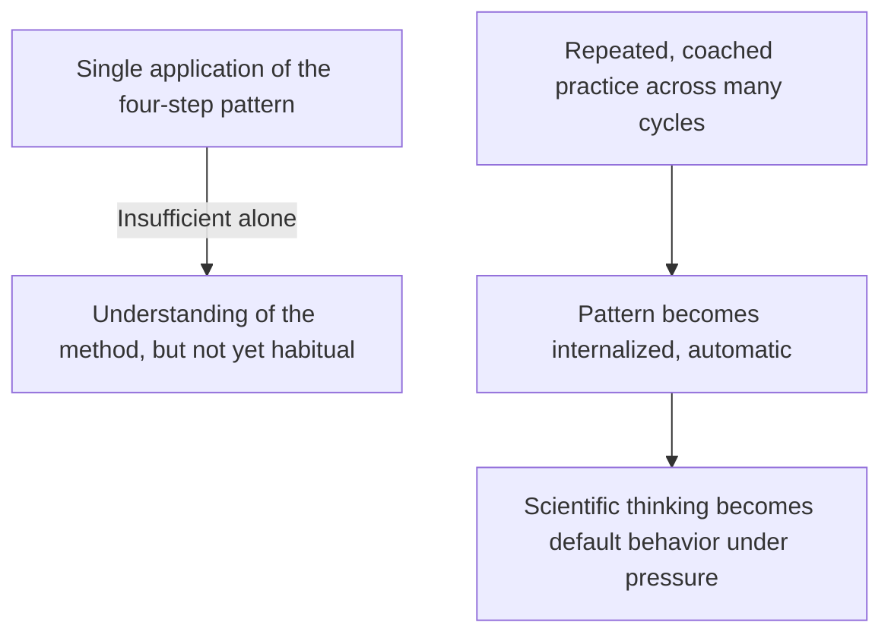
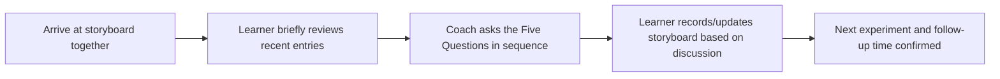
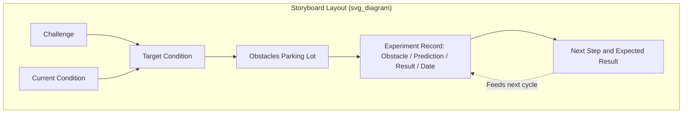

## Kata Practice Routines and Storyboards

### Overview

Kata Practice Routines and Storyboards refer to the concrete operational mechanisms through which the Improvement Kata and Coaching Kata are conducted in daily practice. While the four-step pattern and the Five Questions describe the underlying logical structure, practice routines define the cadence, format, and behavioral discipline of actually doing the work repeatedly until it becomes habitual — echoing the martial-arts origin of the word "kata" as a drilled, repeated form. The Storyboard is the primary visual artifact supporting this practice: a structured, typically physical display that makes the current state of an improvement effort visible and provides the shared reference point for coaching conversations.

**Key Points**

- "Kata" implies repeated, deliberate practice of a fixed pattern until it becomes an ingrained habit, not a one-time application
- Practice routines establish a consistent cadence (often daily) for reviewing progress and conducting the next experiment
- The Storyboard visually organizes the Challenge, current condition, Target Condition, obstacles, and experiment records in one place
- Storyboards are typically located at or near the actual work (gemba), reinforcing Genchi Genbutsu
- Consistent routine and visual structure are what differentiate disciplined kata practice from informal, ad hoc improvement activity

---

### The Purpose of Deliberate Practice Routines

The term "kata" is deliberately borrowed from martial arts, where a kata is a fixed sequence of movements practiced repeatedly until the correct form becomes automatic, freeing the practitioner's conscious attention for higher-level judgment once the underlying pattern is internalized. Applied to improvement work, this implies that the value of the Improvement Kata and Coaching Kata is realized not through a single correct application, but through sustained, repetitive practice of the same structural pattern across many different problems and contexts.

[Inference] This martial-arts framing is a deliberate metaphor used by Mike Rother to emphasize that mastery of the Improvement Kata, like a physical kata, depends on repetition and correction under the guidance of a more experienced practitioner (the coach), rather than being acquired through conceptual understanding alone — this is an interpretive analogy rather than a literal claim about identical learning mechanisms between martial arts and process improvement.

---

### Establishing a Practice Cadence

#### Daily or Near-Daily Rhythm

Because Step 4 of the Improvement Kata (conducting PDCA experiments) is designed around small, rapid cycles, the associated coaching and review routine is typically structured to match — often occurring daily or several times per week, rather than in infrequent, lengthy review meetings.

- Brief coaching sessions (often 5–15 minutes) conducted at the storyboard location
- Timed to align naturally with the completion of the most recent experiment, so the Five Questions can be asked while the result is still fresh and directly observable
- Consistency in timing (e.g., same time each day) helps establish the routine as a habitual part of the workday rather than an occasional special event

#### Structuring a Single Coaching Session

A typical brief session follows a consistent internal rhythm:

---

### The Storyboard: Structure and Function

The Storyboard is a visual tool — commonly a physical board, poster, or wall chart located at or near the actual process — that organizes the essential elements of an ongoing Improvement Kata effort into a single, shared reference. Its purpose parallels the A3 report's single-page discipline: forcing clarity and conciseness while making the current state of thinking visible to anyone who views it, including the coach during structured questioning.

#### Typical Storyboard Sections

| Section | Content |
| --- | --- |
| **Challenge** | The longer-term directional goal guiding the effort |
| **Current Condition** | Most recently grasped, fact-based description of how the process operates now |
| **Target Condition** | The specific, near-term operating pattern being pursued, with achieve-by date |
| **Obstacles Parking Lot** | A running list of known or suspected obstacles between current and target condition |
| **Experiment Record** | A log of recent experiments, each showing the obstacle addressed, the prediction made, the actual result, and the date |
| **Next Step** | The next planned experiment and its expected result, ready to be discussed at the next coaching session |

#### The Experiment Record in Detail

The experiment record is often the most actively updated section, since it directly captures the rapid PDCA cycles conducted in Step 4. Each entry typically includes:

- **Obstacle addressed**: the specific single obstacle targeted by this experiment
- **Prediction**: the explicitly stated expected result, recorded before the experiment is run
- **Actual result**: what was directly observed, recorded after
- **Learning**: a brief note on what the comparison between prediction and result revealed
- **Date**

**Example entry**

"Obstacle: Fasteners not pre-staged, causing mid-cycle search delay. Prediction: pre-staging will reduce cycle time by ~8 sec. Actual: cycle time reduced by 6 sec; search delay eliminated but a new minor delay appeared at bin refill. Learning: primary obstacle resolved; new smaller obstacle identified for next cycle."

---

### Why the Storyboard Is Located at the Gemba

Consistent with Genchi Genbutsu, storyboards are deliberately placed physically near the process they document rather than in a separate office or digital-only location distant from the actual work. This placement serves several practical purposes:

- Coaching conversations occur where the work happens, allowing direct reference to the process itself during discussion
- The board remains visible to the broader team throughout the day, reinforcing transparency and shared awareness of the improvement effort's status
- Reduces the tendency for review conversations to drift into abstraction disconnected from the observable reality of the process

---

### Format Variations

While physical paper or whiteboard storyboards are common and often preferred for their immediacy and low friction of use, digital equivalents (shared documents, dashboard tools) are also used in some organizational contexts, particularly where teams are geographically distributed.

| Format | Advantages | Trade-offs |
| --- | --- | --- |
| **Physical board (paper/whiteboard)** | Immediate, low-friction updates; naturally visible at the gemba; tactile engagement | Not easily accessible for distributed teams; can be lost or damaged |
| **Digital storyboard** | Accessible remotely; easier to archive and search historical entries | Risk of reduced gemba engagement if not paired with physical presence; may introduce friction in quick updates |

[Inference] Practitioner discussion generally favors physical, simple formats for storyboards specifically because they reduce the friction of frequent, brief updates central to the daily practice cadence — though this preference reflects common practitioner guidance rather than a documented universal requirement, and organizational context (e.g., distributed teams) may reasonably shift the appropriate format choice.

---

### Common Pitfalls

- **Infrequent updates**: Allowing the storyboard to fall out of sync with actual daily experiments, undermining its function as a real-time shared reference
- **Storyboard as static documentation rather than living tool**: Treating the board as a one-time-created artifact rather than something actively updated after each experiment cycle
- **Locating the storyboard away from the actual work**: Placing it in an office or conference room disconnected from the process, weakening the Genchi Genbutsu link between the visual record and direct observation
- **Recording results without predictions**: Logging only what happened in an experiment without the prior stated prediction, losing the comparison that generates genuine learning
- **Treating the routine as optional under time pressure**: Skipping scheduled coaching sessions when workload increases, precisely when the discipline of brief, structured practice is most valuable

---

### Relationship to Other TPS/Lean Tools

- **The Improvement Kata's Four Step Pattern**: the storyboard visually organizes all four steps in one place
- **The Coaching Kata and Its Five Core Questions**: the storyboard serves as the shared reference during structured coaching sessions
- **Genchi Genbutsu**: reinforced through the storyboard's physical placement at the actual work location
- **A3 Thinking**: shares the same discipline of forcing clarity and conciseness onto a single visual artifact
- **Visual Management** (broader Lean practice): the storyboard is a specific application of the general Lean principle of making process status visible through simple visual tools

---

**Related Topics**

- The Improvement Kata's Four Step Pattern
- The Coaching Kata and Its Five Core Questions
- Conducting PDCA Experiments Toward the Target Condition
- Second Coach Development and Mentoring Chains
- Genchi Genbutsu and direct observation
- Building Organization Wide Scientific Thinking Habits
- Visual Management Boards in Lean Daily Management