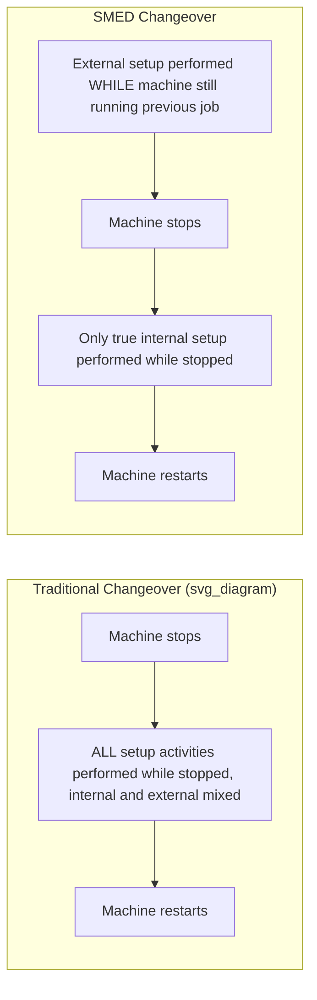
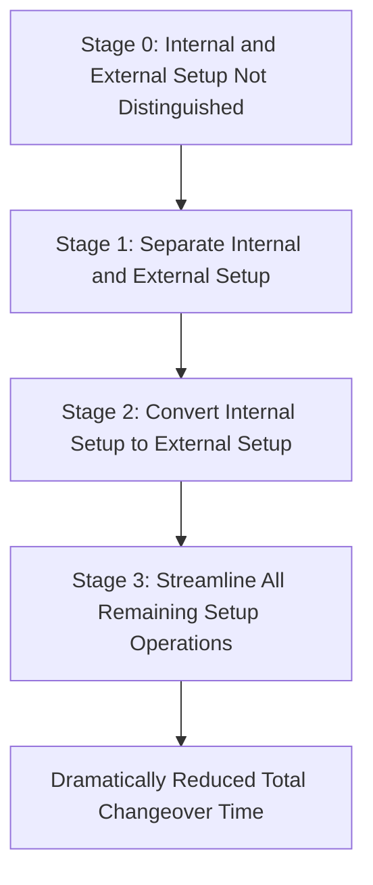
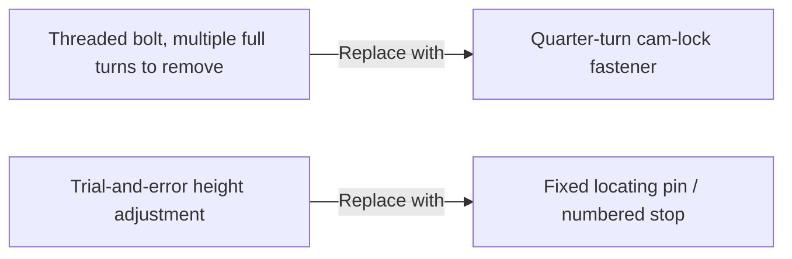
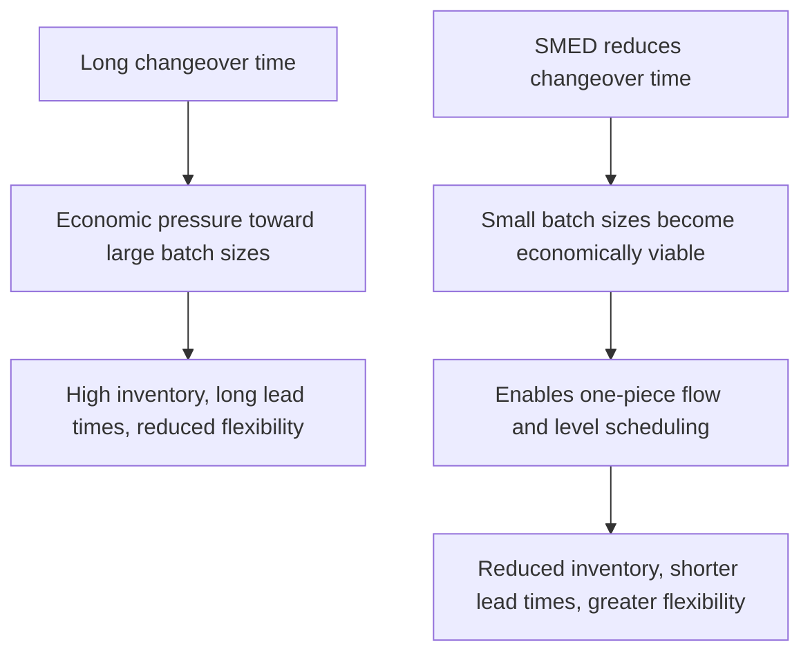

## SMED and the Single Minute Exchange of Die Methodology

### Overview

Single-Minute Exchange of Die (SMED) is a structured methodology for dramatically reducing equipment changeover and setup times, developed by Japanese industrial engineer Shigeo Shingo through decades of consulting work with Toyota and other manufacturers. The name reflects the aspirational target of reducing changeover time to a "single minute" — conventionally interpreted as under ten minutes (single digits) rather than literally sixty seconds. SMED provides both a conceptual framework (distinguishing internal from external setup activities) and a systematic, staged procedure for analyzing and restructuring any changeover process to minimize non-value-adding downtime between production runs.

**Key Points**

- Developed by Shigeo Shingo, based on extensive fieldwork across numerous industries, most notably die-change operations at Toyota
- Core insight: distinguish **internal setup** (tasks requiring the machine to be stopped) from **external setup** (tasks that can be performed while the machine runs)
- Enables smaller batch sizes and greater production flexibility by removing changeover time as a barrier to frequent product switching
- A key enabler of one-piece flow, level scheduling (heijunka), and reduced inventory
- Typically implemented through a structured, staged analysis rather than ad hoc time-cutting

---

### Origins and Development

Shigeo Shingo developed the SMED methodology over approximately nineteen years of industrial engineering work, beginning with observations at Toyo Kogyo (Mazda) and later refined extensively through work with Toyota, where die changes on large stamping presses — historically requiring hours — were reduced to minutes. Shingo's core contribution was not merely faster work, but a fundamentally different analytical lens: recognizing that a large proportion of traditional changeover time consisted of activities that did not actually require the machine to be stopped, and that simply reorganizing *when* these activities occurred could yield dramatic reductions without requiring faster human motion or expensive equipment redesign as a first step.

[Inference] Shingo's own accounts, referenced widely in Lean literature, describe specific historic reductions (such as a Toyota body-panel press changeover reduced from roughly four hours to three minutes) as illustrative case studies of the methodology's potential; these figures are commonly cited but represent specific historical instances rather than universally guaranteed outcomes for any given changeover process.

---

### The Core Distinction: Internal vs. External Setup

This distinction is the conceptual foundation of the entire SMED methodology.

| Type | Definition | Example |
| --- | --- | --- |
| **Internal Setup (IED)** | Activities that can only be performed while the machine is stopped | Removing/installing the die itself, mounting a new tool in the spindle |
| **External Setup (OED)** | Activities that can be performed while the machine is still running the previous job | Retrieving the next die from storage, pre-heating a mold, gathering required tools and fasteners |

In traditional, unanalyzed changeovers, many activities that could technically be performed externally are habitually performed internally simply because no one has distinguished between the two categories. Correctly separating them, without any other change, is frequently the single largest source of changeover-time reduction achievable through SMED.

---

### The Four Conceptual Stages of SMED

Shingo's methodology is structured as a progression through four conceptual stages, each building on the reduction achieved in the prior stage.

#### Stage 0: Internal and External Setup Not Distinguished

The baseline, unanalyzed state: internal and external activities are intermixed without distinction, and preparation activities that could occur while the machine runs are instead performed only after the machine has already stopped, extending downtime unnecessarily.

#### Stage 1: Separate Internal and External Setup

The most fundamental and often highest-impact stage: systematically classify every existing setup activity as either internal (must be done machine-stopped) or external (can be done machine-running), and reorganize the process so all external activities are completed *before* the machine is stopped, ensuring the machine-stopped period contains only genuinely internal work.

- Conduct direct observation (often video recording) of the current changeover process
- Document every discrete task, its duration, and whether it currently occurs while the machine is running or stopped
- Reclassify tasks: identify which currently-internal tasks could, with no design change, simply be moved to occur externally (e.g., pre-staging tools, pre-checking specifications) if properly sequenced

**Example**

A die-change process at Stage 0 includes searching for the correct replacement die in a storage area only after the press has stopped. Simply relocating this search-and-retrieval activity to occur *before* the press stops (performed while the prior job still runs) converts it from internal to external with no equipment modification required.

#### Stage 2: Convert Internal Setup to External Setup

Beyond simple reclassification, this stage involves actively redesigning the process or tooling so that activities *currently* requiring the machine to be stopped can be restructured to occur externally, even if they could not previously.

- **Pre-preparation**: preheating molds, pre-assembling sub-components externally before the machine stops
- **Standardized function elements**: using standardized clamping heights, die dimensions, or fixture interfaces so that adjustment work traditionally performed internally becomes unnecessary or can be pre-set externally
- **Duplicate tooling/fixtures**: using intermediate jigs or duplicate fixture sets that can be prepared externally and then quickly swapped internally

**Example**

Rather than adjusting die height on the press itself (internal, time-consuming), standardized shim blocks of a fixed height are used across all dies, allowing height adjustment to be eliminated as an internal step entirely, since compatibility is guaranteed by the standardized interface.

#### Stage 3: Streamline All Remaining Setup Operations

Once internal setup has been minimized to only what is genuinely unavoidable while the machine is stopped, this stage focuses on further reducing the duration of both the remaining internal steps and the external steps, through techniques such as:

- **Eliminating adjustment**: replacing trial-and-error adjustment with fixed positioning (e.g., locating pins, numbered settings) — Shingo considered adjustment elimination one of the most impactful techniques
- **Functional standardization**: standardizing only the specific functional interfaces necessary for quick changeover (e.g., clamp mechanisms), rather than requiring full standardization of the entire die or tool
- **Parallel operations**: using multiple people simultaneously performing different internal tasks rather than one person sequentially performing all steps
- **One-touch/quick-release mechanisms**: replacing threaded bolts and multi-turn fasteners with cam-lock, quarter-turn, or clamp-based fastening systems that reduce fastening time dramatically
- **Mechanization**: applying powered or mechanically assisted movement to heavy or slow manual tasks where justified

---

### Practical Implementation Procedure

#### Step 1: Observe and Document the Current Changeover

- Video-record an actual changeover from start to finish, capturing every activity and its duration
- Involve the operators who perform the changeover directly in the review, leveraging their firsthand knowledge (Genchi Genbutsu)

#### Step 2: List and Classify Every Activity

- Break the observed changeover into a complete list of discrete tasks
- Classify each as internal or external under current practice

#### Step 3: Separate Internal from External (Stage 1)

- Reorganize the sequence so all external tasks are completed before the machine stops
- Recalculate total internal (machine-stopped) time based purely on this resequencing

#### Step 4: Convert Internal to External Where Possible (Stage 2)

- For each remaining internal task, ask whether a design or procedural change could make it external
- Implement standardization, pre-preparation, or duplicate-tooling solutions identified

#### Step 5: Streamline Remaining Steps (Stage 3)

- Apply adjustment-elimination, quick-fastening, and parallel-work techniques to further compress both internal and external durations
- Iterate — SMED is typically applied repeatedly, achieving successive reductions over multiple improvement cycles rather than a single pass

#### Step 6: Standardize the New Procedure

- Document the improved changeover as new standardized work
- Train all operators performing the changeover on the new sequence
- Establish ongoing monitoring to confirm the reduced time is sustained

---

### Techniques Summary Table

| Technique | Stage | Effect |
| --- | --- | --- |
| Video analysis of current changeover | Preparation | Establishes factual baseline |
| Resequencing external tasks before stop | Stage 1 | Removes non-essential time from internal period |
| Pre-preparation (preheating, pre-staging) | Stage 2 | Converts previously internal tasks to external |
| Standardized interfaces/fixtures | Stage 2 | Eliminates need for internal adjustment |
| Elimination of adjustment | Stage 3 | Removes trial-and-error delay |
| Quick-release fasteners | Stage 3 | Reduces fastening/unfastening time |
| Parallel operations (multiple operators) | Stage 3 | Reduces total elapsed internal time |

---

### Relationship to Batch Size and Flow

SMED is a critical enabler of several other core TPS concepts, since it directly removes the economic justification for large batch production. When changeover time is significant, producing large batches minimizes the frequency (and cumulative cost) of changeovers; once changeover time is dramatically reduced, small-batch or even one-piece-flow production becomes economically viable.

---

### Common Pitfalls

- **Jumping directly to equipment redesign**: Investing in expensive mechanization (Stage 3-level solutions) before completing the low-cost Stage 1 reclassification, missing readily available reductions
- **Excluding operators from the analysis**: Conducting the SMED study without direct input from the people who perform the changeover, missing practical knowledge about why certain steps currently occur as they do
- **Treating SMED as a one-time event**: Achieving an initial reduction and considering the effort complete, rather than treating changeover reduction as an ongoing, iterative kaizen target
- **Focusing only on internal setup time reduction while ignoring external setup organization**: External tasks poorly organized (e.g., tools not readily available when needed) can still create delays even after correct internal/external classification
- **Failing to standardize the new procedure**: Achieving a reduced changeover time during a pilot but not documenting and training the new standard work, risking regression to the prior, slower method

---

### Relationship to Other TPS/Lean Tools

- **One-Piece Flow**: SMED removes the changeover-time barrier that otherwise favors large-batch production
- **Heijunka (Level Scheduling)**: relies on frequent, small-batch changeovers made economically feasible by SMED
- **Standardized Work**: the improved changeover procedure resulting from SMED becomes the new documented standard
- **Kaizen**: SMED improvement is typically pursued through iterative kaizen cycles rather than a single comprehensive redesign
- **5S**: workplace organization (particularly tool and die staging) directly supports efficient external setup activities

---

**Related Topics**

- One-Piece Flow and Cellular Manufacturing Design
- Heijunka and Level Scheduling
- Standardized Work documentation and maintenance
- 5S Workplace Organization
- Kaizen Events and Rapid Improvement Workshops
- Total Productive Maintenance (TPM) fundamentals