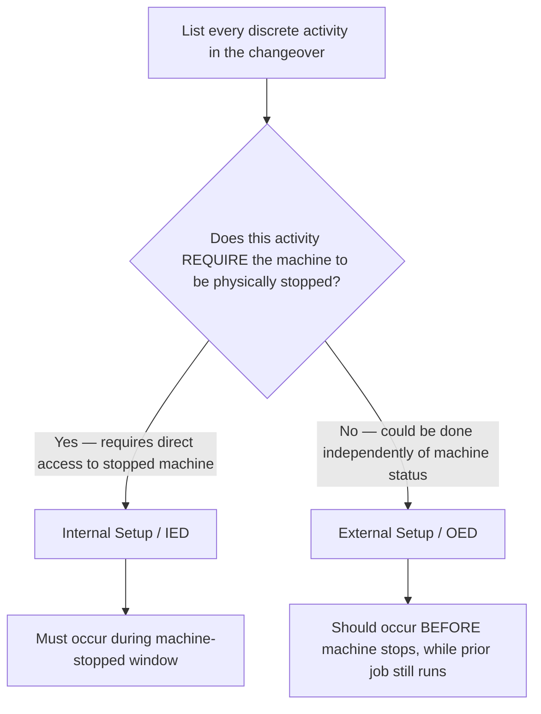
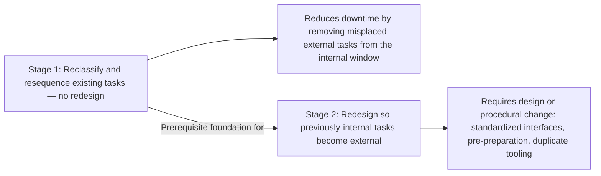

## Distinguishing Internal and External Setup Elements

### Overview

Distinguishing Internal and External Setup Elements is the foundational analytical step of the SMED methodology, corresponding to Shigeo Shingo's Stage 1. It involves systematically classifying every discrete activity within a changeover process according to whether it genuinely requires the machine to be stopped (internal setup, or IED — Inside Exchange of Die) or whether it can be performed while the machine continues running the current job (external setup, or OED — Outside Exchange of Die). This single distinction, properly applied without any equipment redesign or capital investment, is frequently the largest single source of changeover-time reduction available in an unanalyzed process.

**Key Points**

- Internal setup (IED): tasks that can only be performed while the machine is stopped
- External setup (OED): tasks that can be performed while the machine is still running the previous job
- Most unanalyzed changeover processes perform many external-capable tasks internally out of habit or lack of structured analysis
- Correct classification, followed by resequencing, requires no equipment modification and no capital expenditure
- Forms the prerequisite foundation for SMED's later stages (converting internal to external, and streamlining remaining steps)

---

### Definitions in Detail

#### Internal Setup (IED — Inside Exchange of Die)

Activities that, by their physical nature, cannot be performed unless the machine is stationary and the current job has ceased. These typically involve direct physical interaction with the machine's working elements — removing the previous tool/die, installing the new one, making machine-specific adjustments that require access only available when the equipment is not running.

**Examples**: unbolting and removing the previous die from the press bed; mounting the new die into position; connecting machine-specific utility lines (hydraulic, pneumatic, electrical) that physically interface with the tool being installed.

#### External Setup (OED — Outside Exchange of Die)

Activities that do not require the machine to be stopped and can, in principle, be completed while the current job continues running. These typically involve preparation, retrieval, transport, and verification tasks that do not require physical access to the machine's active work zone.

**Examples**: retrieving the next die from the storage area; pre-checking that all required tools and fasteners are present and in working condition; cleaning the die that will be installed next; pre-heating a mold to operating temperature.

---

### The Classification Logic

The key test is not "when does this activity currently happen?" but "does this activity require the machine to be stopped, given its physical nature?" This distinction is critical because unanalyzed processes routinely perform genuinely external tasks internally, simply because no one has separated the two categories — the classification exercise reveals hidden reduction opportunities that require no technical change, only resequencing.

---

### Why This Distinction Is Frequently the Highest-Impact SMED Step

In an unanalyzed ("Stage 0") changeover, internal and external activities are typically performed in whatever order operators have historically followed, often with the machine stopped for the entire duration of activities that did not need to occur during that window at all. Simply separating and resequencing — performing every external-capable task *before* the machine stops — can reduce total downtime substantially without any other change.

**Example**

A press changeover currently takes 40 minutes, entirely with the machine stopped. Direct observation and task-by-task classification reveals that of the 40 minutes, only 15 minutes are activities that genuinely require the press to be stationary (unbolting/removing the old die, mounting the new die, reconnecting hydraulic lines). The remaining 25 minutes — searching for the new die in storage, verifying fastener inventory, inspecting the incoming die for damage — could all be performed while the press was still running the prior job. Resequencing so these 25 minutes of external work occur beforehand reduces actual machine downtime from 40 minutes to approximately 15 minutes, with no equipment change.

---

### Method for Conducting the Classification

#### Step 1: Direct Observation of the Actual Changeover

Consistent with Genchi Genbutsu, the classification exercise begins with direct, firsthand observation of an actual changeover as it currently occurs — ideally video-recorded for detailed review — rather than working from a documented procedure that may not reflect actual practice.

#### Step 2: Decompose the Changeover into Discrete Tasks

Break the observed process into individual, granular activities (e.g., "walk to tool crib," "search for correct die," "unbolt clamp 1," "unbolt clamp 2," "lift old die from press bed") rather than broad phases, since granular decomposition reveals classification opportunities that broader groupings would obscure.

#### Step 3: Classify Each Task

For every discrete task identified, determine: does this specific activity require the machine to be physically stopped, based on its inherent physical nature? Record the classification (Internal or External) alongside the observed duration of each task.

| Task | Duration (observed) | Classification |
| --- | --- | --- |
| Walk to storage, retrieve new die | 4 min | External |
| Inspect new die for damage | 2 min | External |
| Verify correct fasteners on hand | 1 min | External |
| Unbolt and remove old die | 6 min | Internal |
| Position and mount new die | 7 min | Internal |
| Reconnect hydraulic lines | 3 min | Internal |
| Adjust die alignment (trial fit) | 8 min | Internal (candidate for Stage 2/3 reduction) |
| Clean work area of debris from old die | 3 min | External |

#### Step 4: Resequence So All External Tasks Precede Machine Stop

Reorganize the changeover procedure so external tasks are completed in advance — ideally while the prior production run is still in progress — ensuring the machine-stopped window contains only tasks classified as genuinely internal.

#### Step 5: Recalculate and Verify

Time the resequenced changeover under actual conditions to confirm the internal (machine-stopped) duration has been reduced as expected, and adjust the procedure based on direct observation of the new sequence in practice.

---

### Common Sources of Misclassified (Currently-Internal, Actually-External) Tasks

- **Material/tool retrieval**: fetching the next die, mold, or fixture from storage, often performed only after the machine has already stopped out of habit
- **Pre-inspection**: checking the incoming tool for damage or verifying specifications, which does not require the machine to be idle
- **Pre-staging fasteners and hand tools**: gathering the specific bolts, wrenches, or fixtures needed, rather than searching for them mid-changeover
- **Pre-heating or pre-conditioning**: bringing a mold or die to operating temperature in advance, where thermal requirements exist
- **Documentation and approval steps**: paperwork or sign-off procedures that are sometimes bundled into the machine-stopped window without functional necessity

---

### Distinguishing This Step from Later SMED Stages

It is important not to conflate Stage 1 (separating and resequencing existing tasks) with Stage 2 (actively converting inherently internal tasks into external ones through design changes). Stage 1 requires no redesign — it is purely an analytical and organizational exercise applied to tasks as they currently exist. Stage 2, by contrast, involves changing *how* a task is performed (e.g., standardizing a fixture interface) so that a task previously requiring the machine to be stopped no longer does.

---

### Common Pitfalls

- **Relying on documented procedure instead of direct observation**: Classifying tasks based on how the process is supposed to work rather than how it actually occurs, missing informal workarounds or habitual inefficiencies
- **Grouping tasks too broadly**: Classifying an entire phase (e.g., "prepare new die") as a single unit rather than decomposing it into granular sub-tasks, obscuring which specific components are actually external
- **Confusing "when it currently happens" with "when it must happen"**: Classifying a task as internal simply because operators have always performed it while the machine is stopped, rather than assessing its true physical requirement
- **Skipping direct timing data**: Estimating task durations from memory rather than measuring them directly, reducing the precision of the resulting analysis
- **Treating classification as a one-time exercise**: Failing to revisit the classification as the process, tooling, or product mix changes over time, missing new opportunities that emerge

---

### Relationship to Other TPS/Lean Tools

- **SMED Methodology**: this distinction constitutes Stage 1, the foundational step preceding Stage 2 (conversion) and Stage 3 (streamlining)
- **Genchi Genbutsu**: direct observation of the actual changeover is essential to accurate classification
- **Standardized Work**: the resequenced procedure, once verified, becomes the basis for new standardized work documentation
- **5S**: well-organized tool and die storage directly supports efficient execution of external setup tasks once properly identified
- **Kaizen**: the classification exercise is often conducted as a focused kaizen event

---

**Related Topics**

- SMED and the Single Minute Exchange of Die Methodology
- Converting Internal Setup to External Setup (SMED Stage 2)
- Streamlining Remaining Setup Operations (SMED Stage 3)
- Standardized Work documentation and maintenance
- 5S Workplace Organization
- Genchi Genbutsu and direct observation