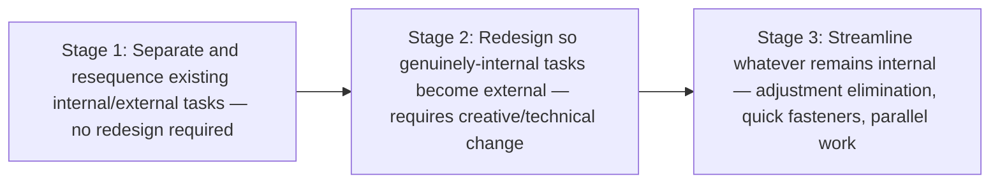
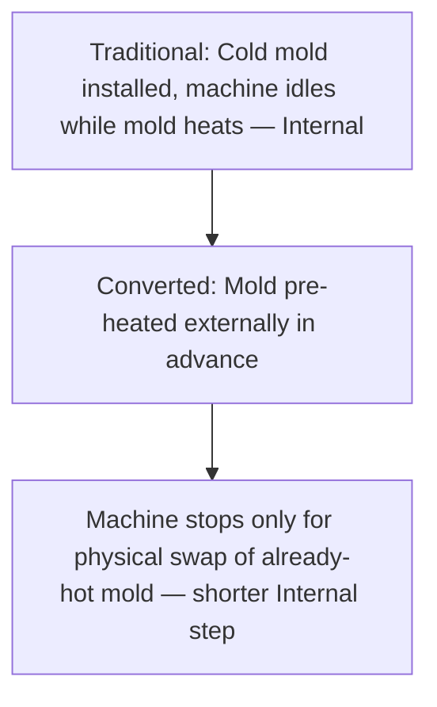
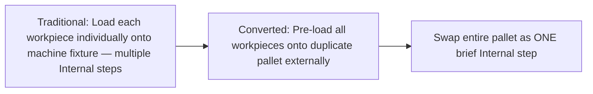

## Converting Internal Setup Steps to External Setup

### Overview

Converting Internal Setup Steps to External Setup corresponds to Stage 2 of Shigeo Shingo's SMED methodology, building directly upon the classification work of Stage 1. Where Stage 1 involves separating and resequencing existing tasks without changing them, Stage 2 requires actively redesigning tooling, procedures, or preparation practices so that activities which currently and genuinely require the machine to be stopped are transformed into activities that can be performed while the machine continues running the prior job. This stage typically requires more creativity and, in some cases, modest investment compared to Stage 1, but often yields the second-largest tranche of changeover-time reduction after the initial separation exercise.

**Key Points**

- Builds on Stage 1's classification; targets tasks correctly identified as genuinely internal, not misclassified ones
- Requires active redesign — of tooling, fixtures, or procedure — rather than mere resequencing
- Core techniques include standardization of functional interfaces, pre-preparation, and use of duplicate or intermediate tooling
- Distinguished from Stage 3 (streamlining), which further reduces time on tasks that remain internal even after conversion
- Often the stage requiring the most engineering creativity and cross-functional problem-solving within SMED implementation

---

### Distinguishing Stage 2 from Stage 1 and Stage 3

Stage 1 addresses tasks that were *misclassified* — performed internally out of habit despite not truly requiring the machine to be stopped. Stage 2 addresses tasks that genuinely and correctly require internal execution under current conditions, and asks: can the conditions themselves be changed so the requirement no longer applies?

---

### Core Techniques for Conversion

#### Technique 1: Pre-Preparation of Conditions

Many internal tasks exist because a condition (temperature, calibration, assembly state) is not yet ready when the machine stops, forcing that preparation to occur during the internal window. Pre-preparing the condition externally, before the machine stops, converts the associated task from internal to external.

**Example**

A plastic injection molding changeover requires the incoming mold to reach a specific operating temperature before production can resume — traditionally achieved by installing the cold mold and waiting for it to heat up while the machine sits idle (internal). Installing an external pre-heating station allows the next mold to reach operating temperature *before* the changeover begins, so that by the time the machine stops, only the physical mold swap (a much shorter internal task) remains.

#### Technique 2: Standardization of Functional Elements

Rather than fully standardizing an entire die, tool, or fixture (which may be costly or impractical across a large product variety), Shingo emphasized standardizing only the specific functional interface elements relevant to mounting and connection — such as clamping height, bolt-hole pattern, or connector type — allowing quick, adjustment-free internal mounting regardless of which specific die is being installed.

**Example**

Dies of varying internal geometry are manufactured with a standardized base-plate height and a common bolt-pattern interface. Because the mounting interface is identical across all dies, the press does not require internal height adjustment for any die — the standardized interface guarantees compatibility, and adjustment (previously internal) is eliminated entirely.

#### Technique 3: Use of Duplicate or Intermediate Fixtures

Introducing an intermediate jig, pallet, or fixture that can be prepared and loaded externally, then quickly attached to the machine as a single internal step, converts what was previously a multi-step internal loading process into a brief internal swap plus externally-completed preparation.

**Example**

Rather than mounting individual workpieces onto a machine's fixture one at a time (internal), workpieces are pre-loaded onto a removable pallet externally while the machine runs the prior job. The changeover then consists only of swapping the entire pre-loaded pallet (a single, brief internal step) rather than individually internal-mounting each piece.

#### Technique 4: Function Separation via Modular Components

Breaking a complex tool or die into modular sub-components allows portions of assembly or adjustment to occur externally (assembling and pre-testing modules), while only the final module-to-machine connection remains internal.

#### Technique 5: Pre-Verification and Pre-Calibration

Where internal time is consumed by inspection, calibration checks, or trial runs to confirm correct setup, performing this verification externally (using duplicate gauges, test fixtures, or simulation) before the actual internal swap removes that verification time from the internal window.

---

### Procedure for Applying Stage 2

#### Step 1: Review the Confirmed Internal Task List

Starting from the Stage 1 classification, focus specifically on tasks correctly confirmed as internal — those genuinely requiring the machine to be stopped under current conditions.

#### Step 2: Ask "What Condition Makes This Task Internal?"

For each internal task, identify the specific physical or procedural condition creating the requirement that the machine be stopped (e.g., "the mold must be at a specific temperature before production, and it is currently cold when installed").

#### Step 3: Generate Candidate Conversion Approaches

Brainstorm how the identified condition could be satisfied externally instead — through pre-preparation, standardization, duplicate tooling, or modular redesign — drawing on the core techniques above.

#### Step 4: Evaluate Feasibility and Cost

Assess candidate approaches against implementation cost, technical feasibility, and expected time savings. Some conversions require minimal investment (e.g., a pre-heating hot plate); others may require more substantial tooling redesign or standardization investment across a broader product range.

#### Step 5: Implement, Test, and Verify

Implement the selected conversion, then directly observe and time the revised changeover to confirm the intended task has genuinely shifted from internal to external, and that total internal (machine-stopped) time has decreased accordingly.

#### Step 6: Update Standardized Work

Document the converted procedure as the new standard, ensuring the external preparation steps are clearly specified with sufficient lead time before the changeover begins.

---

### Example: Comprehensive Stage 2 Application

**Before Stage 2** (following Stage 1 resequencing): Internal setup for a stamping press changeover totals 15 minutes, consisting of: unbolt old die (3 min), remove old die (2 min), position new die (3 min), adjust die height via trial-and-error (5 min), reconnect hydraulic lines (2 min).

**Stage 2 Conversion Applied**:

- Standardized base-plate height across all dies (functional standardization) → eliminates the 5-minute trial-and-error height adjustment entirely, since compatibility is now guaranteed
- Introduces quick-connect hydraulic couplings pre-tested externally → reduces reconnection verification time

**After Stage 2**: Internal setup reduced to approximately 8–9 minutes (unbolt, remove, position, quick-connect), with the adjustment step eliminated as a distinct internal task rather than merely shortened.

[Inference] The magnitude of reduction achievable through any specific Stage 2 conversion is highly dependent on the particular process, equipment, and product variety involved; the example figures above illustrate the general pattern of impact rather than a guaranteed or typical percentage applicable across all changeover contexts.

---

### Common Pitfalls

- **Attempting Stage 2 before completing Stage 1**: Investing in conversion techniques for tasks that could have been resolved through simple resequencing alone, missing lower-cost gains first
- **Over-standardizing unnecessarily**: Pursuing full standardization of entire tools or dies when standardizing only the functional interface elements would achieve the same benefit at lower cost
- **Underestimating pre-preparation lead time**: Introducing external pre-preparation (e.g., pre-heating) without ensuring sufficient lead time is built into the production schedule for it to complete before the changeover begins
- **Neglecting to verify actual results**: Assuming a conversion technique has succeeded without directly timing and observing the revised changeover to confirm the intended internal task has genuinely become external
- **Treating conversion as a one-time technical fix**: Failing to revisit conversion opportunities as product variety or tooling changes over time, missing new applicable techniques

---

### Relationship to Other TPS/Lean Tools

- **SMED Methodology**: Stage 2 is the second of the three core stages, following the Internal/External distinction (Stage 1) and preceding streamlining (Stage 3)
- **Distinguishing Internal and External Setup Elements**: the prerequisite classification work upon which Stage 2 conversion targets are identified
- **Standardized Work**: converted procedures, particularly standardized functional interfaces, become part of updated standard work documentation
- **Poka-Yoke**: standardized interfaces and locating features used in conversion techniques often double as error-proofing mechanisms preventing incorrect installation
- **Total Productive Maintenance (TPM)**: equipment reliability and consistent tooling condition support the effectiveness of pre-preparation and standardization techniques

---

**Related Topics**

- SMED and the Single Minute Exchange of Die Methodology
- Distinguishing Internal and External Setup Elements
- Streamlining Remaining Setup Operations (SMED Stage 3)
- Standardized Work documentation and maintenance
- Poka-Yoke Error-Proofing Design Principles
- Total Productive Maintenance (TPM) fundamentals