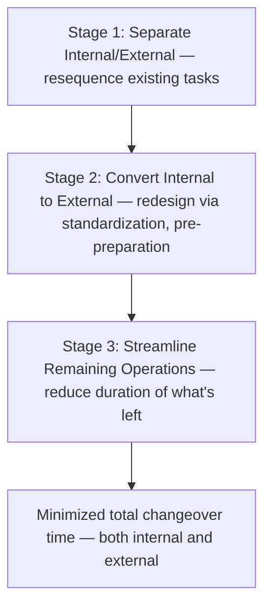
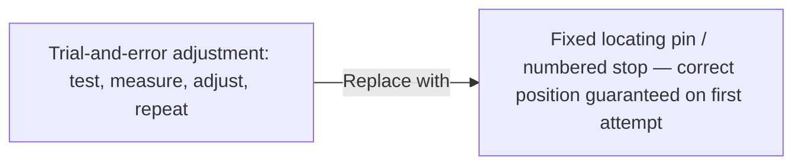
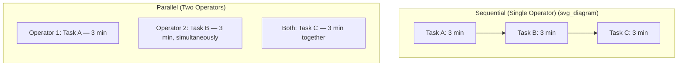

## Streamlining and Standardizing Remaining Setup Steps

### Overview

Streamlining and Standardizing Remaining Setup Steps corresponds to Stage 3 of Shigeo Shingo's SMED methodology, the final conceptual stage applied after internal and external setup have been separated (Stage 1) and as many internal tasks as feasible have been converted to external (Stage 2). Stage 3 focuses on reducing the duration of whatever tasks remain — both those still classified as internal and the external tasks now performed in parallel — through targeted techniques such as eliminating adjustment, replacing slow fasteners with quick-release mechanisms, enabling parallel operations, and applying mechanization where justified. Because Stage 3 operates on the residual, irreducible-seeming core of the changeover, it often requires the most granular, detail-oriented problem-solving of the three stages.

**Key Points**

- Applied after Stage 1 (separation) and Stage 2 (conversion) have already reduced the changeover to its essential remaining tasks
- Focuses on shortening the duration of tasks, not reclassifying which category they belong to
- Core techniques: eliminating adjustment, quick-release fastening, parallel operations, mechanization
- Shingo considered elimination of adjustment one of the single most impactful techniques within this stage
- Streamlining applies to both remaining internal and remaining external tasks, since total changeover time depends on both

---

### The Position of Stage 3 Within SMED

By the time Stage 3 is reached, the changeover no longer contains misclassified or convertible tasks — what remains is the genuine, irreducible-seeming core of physical work. Stage 3's contribution is to attack the *duration* of these remaining tasks directly, through mechanical, procedural, and organizational refinement.

---

### Core Technique 1: Elimination of Adjustment

Shingo identified adjustment — trial-and-error positioning, alignment, and fine-tuning — as consuming a disproportionately large share of remaining internal setup time in most unrefined changeovers, and considered its elimination one of the highest-value techniques available.

#### Why Adjustment Consumes Disproportionate Time

Adjustment typically involves iterative cycles of: make a small change, test, observe result, make another small change, test again — a process inherently slower and less predictable than a single, correctly-positioned action.

#### Techniques for Eliminating Adjustment

- **Fixed locating features**: pins, notches, or keyed interfaces that mechanically force correct positioning on the first attempt, removing the need for trial-and-error alignment
- **Numbered or graduated settings**: replacing continuous, trial-based adjustment with discrete, pre-calibrated settings (e.g., numbered stop positions corresponding to known correct values for each product variant)
- **Calibration curves/charts**: pre-determined reference tables allowing an operator to set a value directly based on the product being run, rather than iteratively testing and adjusting

**Example**

A die height traditionally required 5–8 minutes of trial-and-error adjustment using test stampings to verify correct depth. Installing a fixed mechanical stop calibrated to the correct height for that specific die eliminates the need for any adjustment — the die simply seats against the stop at the correct position on the first attempt.

---

### Core Technique 2: Quick-Release Fastening Mechanisms

Traditional threaded fasteners (bolts, screws) requiring multiple full rotations to tighten or loosen are a common source of unnecessary time within remaining internal steps. Replacing them with mechanisms requiring only a single motion or partial rotation can substantially reduce fastening/unfastening duration.

| Traditional Fastener | Quick-Release Alternative | Typical Benefit |
| --- | --- | --- |
| Multi-turn threaded bolt | Cam-lock / clamp lever | Single-motion engagement/release |
| Full-thread nut and bolt | Quarter-turn fastener | Reduced rotation requirement |
| Threaded pipe fitting | Quick-connect coupling | Single push/pull connection |
| Multiple individual bolts | Single captive clamping bar | One action secures multiple points simultaneously |

[Inference] Shingo's writing generally emphasizes that the *number of turns* required by a fastener, more than its raw physical size or strength requirement, is the primary driver of time consumed — implying that a shift from full-thread to minimal-rotation fastening mechanisms tends to yield time reduction roughly proportional to the reduction in required rotations, though the precise time savings in any specific application depends on the particular fastener and installation context.

---

### Core Technique 3: Parallel Operations

Rather than a single operator sequentially completing every internal task, assigning multiple operators to work simultaneously on different aspects of the changeover can proportionally reduce total elapsed internal time, even though the total labor-hours consumed may remain similar or increase slightly.

Parallel operations are particularly effective for tasks occurring on physically separate parts of the machine (e.g., securing fasteners on opposite sides of a die simultaneously) or for tasks with no interdependency requiring sequential completion.

**Example**

A die change requiring bolts to be secured at four corners is traditionally performed by one operator moving sequentially from corner to corner. Assigning two operators, each securing two corners simultaneously, roughly halves the elapsed time for that specific task, even though total labor input remains the same.

---

### Core Technique 4: Mechanization

Where manual tasks remain slow due to physical demands (heavy lifting, precise but repetitive motion) despite the application of the preceding techniques, targeted mechanization — powered lifts, motorized positioning systems, pneumatic clamps — can further reduce duration. Shingo generally treated mechanization as a technique to be applied selectively and after simpler, lower-cost improvements had been exhausted, rather than as a first resort.

**Example**

Manually lifting and positioning a heavy die (requiring careful, slow manual handling to avoid damage or injury) is replaced with a powered hoist and guided rail system, allowing faster and more consistent positioning while also improving operator safety.

[Inference] Shingo's broader methodological philosophy, as reflected across SMED literature, generally favors low-cost procedural and mechanical simplification (adjustment elimination, quick fasteners, parallel work) before capital-intensive mechanization, on the reasoning that many changeover-time reductions can be achieved without significant investment — though the appropriate sequencing and threshold for justifying mechanization naturally depends on the specific economics of each situation.

---

### Applying Stage 3 to External Tasks as Well

While much of Stage 3 technique discussion centers on internal setup, streamlining also applies to external tasks, since total changeover-related labor and elapsed time still matter even when a task no longer contributes to machine downtime.

- **Organizing external staging areas**: ensuring tools, dies, and fasteners for the next changeover are stored in clearly marked, easily accessible locations (closely related to 5S practice)
- **Standardizing external preparation checklists**: reducing variability and search time in external preparation through simple visual checklists
- **Pre-positioning materials closer to point of use**: minimizing walking or transport time during external preparation steps

---

### Procedure for Applying Stage 3

#### Step 1: Review the Post-Stage-2 Task List

- Begin with the changeover procedure as it exists after Stage 1 separation and Stage 2 conversion have already been applied
- Identify which tasks remain internal and which external tasks still consume meaningful time

#### Step 2: Analyze Each Remaining Task for Streamlining Opportunity

- For each task, ask: does this involve trial-and-error adjustment that could be eliminated? Does it involve slow threaded fastening that could be replaced? Could it be performed in parallel by multiple people? Is it a good candidate for targeted mechanization?

#### Step 3: Prioritize by Impact and Cost

- Favor low-cost, high-impact techniques (adjustment elimination, quick fasteners) before pursuing more capital-intensive mechanization
- Focus first on tasks consuming the largest share of remaining time (a Pareto-style prioritization)

#### Step 4: Implement, Test, and Verify

- Apply the selected technique, then directly time and observe the revised task to confirm the intended reduction has been achieved
- Adjust further based on direct observation of the change in actual practice

#### Step 5: Update Standardized Work and Train

- Document the streamlined procedure, including any new fixed settings, fastener types, or parallel-work assignments, as the updated standard
- Train all relevant operators on the refined sequence

---

### Common Pitfalls

- **Applying Stage 3 techniques before completing Stage 1 and Stage 2**: Investing effort in streamlining a task that could have been eliminated entirely through reclassification or conversion, wasting effort on a lower-value target
- **Over-investing in mechanization prematurely**: Pursuing costly automated solutions before exhausting lower-cost adjustment-elimination and fastening improvements
- **Introducing parallel operations without addressing safety or coordination**: Adding a second operator without adequate coordination protocols, risking safety issues or interference between simultaneous tasks
- **Standardizing settings without adequate calibration verification**: Introducing fixed stops or numbered settings without confirming their accuracy across the actual range of products run, risking quality issues from incorrect but unquestioned settings
- **Neglecting external-task streamlining**: Focusing exclusively on internal-task duration while leaving external preparation disorganized, missing labor-efficiency and reliability gains available there as well

---

### Relationship to Other TPS/Lean Tools

- **SMED Methodology**: Stage 3 is the final of the three core conceptual stages, following separation (Stage 1) and conversion (Stage 2)
- **Converting Internal Setup Steps to External Setup**: the preceding stage whose residual internal tasks become Stage 3's focus
- **5S**: organized staging areas and visual tool management directly support efficient parallel and external work streamlining
- **Poka-Yoke**: fixed locating features and numbered settings used to eliminate adjustment also function as error-proofing mechanisms preventing incorrect setup
- **Standardized Work**: the final streamlined procedure becomes the documented, trained standard for future changeovers

---

**Related Topics**

- SMED and the Single Minute Exchange of Die Methodology
- Distinguishing Internal and External Setup Elements
- Converting Internal Setup Steps to External Setup
- Poka-Yoke Error-Proofing Design Principles
- 5S Workplace Organization
- Standardized Work documentation and maintenance