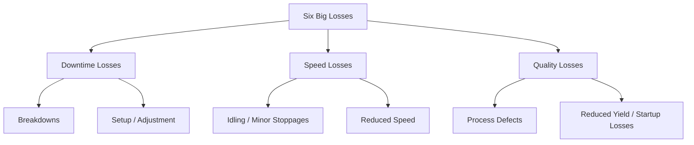
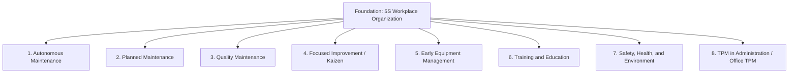
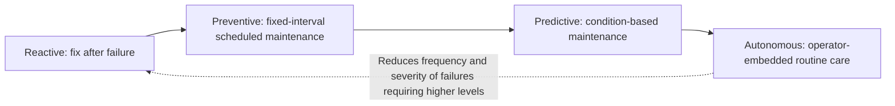

## Total Productive Maintenance Overview and Its Pillars

### Overview

Total Productive Maintenance (TPM) is a comprehensive equipment-management philosophy that seeks to maximize equipment effectiveness through the active, ongoing participation of every employee — not solely dedicated maintenance staff — across the entire lifecycle of production equipment. Originating in Japan and closely associated with the Japan Institute of Plant Maintenance (JIPM), TPM extends the concept of maintenance beyond reactive repair into a proactive, organization-wide discipline aimed at eliminating the major categories of loss that reduce equipment productivity, commonly structured around a set of foundational "pillars."

**Key Points**

- Extends maintenance responsibility beyond specialist maintenance staff to include operators (autonomous maintenance)
- Aims to eliminate the "Six Big Losses" that reduce Overall Equipment Effectiveness (OEE)
- Typically structured around eight pillars (in the JIPM formulation), each addressing a distinct dimension of equipment and organizational reliability
- Complements SMED and other Lean tools by ensuring the equipment reliability foundation needed for smooth, predictable flow
- Distinguishes reactive/breakdown maintenance from planned, preventive, and predictive maintenance approaches

---

### Origins and Development

TPM emerged in Japan in the late 1960s and 1970s, developed initially at companies within the Toyota supply chain (notably Nippondenso, a Toyota Group electrical components manufacturer) as an extension of preventive maintenance concepts imported from the United States. Where earlier preventive maintenance approaches concentrated maintenance responsibility within a specialized department, TPM's distinguishing innovation was to involve production operators directly in routine maintenance activities (cleaning, inspection, lubrication), freeing specialist maintenance staff to focus on more technically demanding preventive and predictive work, while simultaneously building operators' ownership of and familiarity with their equipment's condition.

The Japan Institute of Plant Maintenance formalized and popularized TPM methodology, including its widely referenced eight-pillar structure and associated certification/award programs, extending TPM adoption across a broad range of industries beyond its automotive origins.

---

### The Six Big Losses

TPM's improvement focus is commonly organized around eliminating six categories of loss that reduce equipment productivity, grouped into three broader loss types:

| Loss Category | Specific Loss | Description |
| --- | --- | --- |
| **Downtime Losses** | Breakdowns | Unplanned equipment failure |
|  | Setup and Adjustment | Time lost to changeovers and adjustment |
| **Speed Losses** | Idling and Minor Stoppages | Small interruptions not classified as breakdowns |
|  | Reduced Speed | Equipment running below its designed/rated speed |
| **Quality Losses** | Process Defects | Defective output requiring rework or scrap during normal operation |
|  | Reduced Yield | Losses occurring during startup, before stable production is reached |

These six losses directly inform the calculation of Overall Equipment Effectiveness (OEE), TPM's core measurement metric, computed as the product of Availability, Performance, and Quality rates.

$$OEE = Availability \times Performance \times Quality$$

---

### The Eight Pillars of TPM

The JIPM formulation of TPM organizes implementation activity around eight pillars, each targeting a specific dimension of equipment reliability, quality, or organizational capability.

#### Pillar 1: Autonomous Maintenance (Jishu Hozen)

Operators are trained and empowered to perform routine maintenance tasks on their own equipment — cleaning, inspection, lubrication, and minor tightening — rather than relying exclusively on specialist maintenance personnel for these basic activities. This builds operator ownership and early detection capability, since operators develop intimate familiarity with their equipment's normal condition and can notice abnormalities before they escalate into breakdowns.

- Typically implemented through a staged progression (often seven steps): initial cleaning/inspection, addressing sources of contamination, establishing cleaning/lubrication standards, general inspection training, autonomous inspection, standardization, and full self-management
- Distinguishes tasks appropriate for operators (routine, low-complexity) from those requiring specialist maintenance skill (complex repair, overhaul)

#### Pillar 2: Planned Maintenance

Specialist maintenance staff conduct maintenance according to a structured, planned schedule based on failure rate data and equipment condition, rather than purely reactive, breakdown-driven maintenance. This pillar encompasses preventive maintenance (scheduled based on time/usage intervals) and predictive maintenance (scheduled based on condition-monitoring data, such as vibration analysis or thermal imaging).

- Reduces unplanned breakdowns by addressing wear and potential failure points proactively
- Frees specialist maintenance capacity from constant reactive firefighting, enabling more strategic, planned activity

#### Pillar 3: Quality Maintenance (Hinshitsu Hozen)

Focuses specifically on maintaining equipment conditions that directly affect product quality, establishing and monitoring equipment parameters known to cause defects if allowed to drift out of specification. The goal is to prevent quality defects through equipment condition management, rather than detecting defects after they occur through inspection alone.

- Identifies specific equipment conditions (e.g., temperature ranges, pressure settings, tool wear limits) causally linked to defect generation
- Establishes monitoring and control points for these conditions, often integrated with Poka-Yoke error-proofing

#### Pillar 4: Focused Improvement (Kobetsu Kaizen)

Cross-functional teams conduct focused, structured improvement projects targeting specific significant losses (drawing on the Six Big Losses framework), applying root-cause analysis and other structured problem-solving tools (Five Whys, PDCA) to systematically reduce or eliminate identified loss sources.

- Prioritizes improvement targets using data (often Pareto analysis) to focus effort on the most significant loss contributors
- Draws directly on broader Kaizen and scientific problem-solving methodology

#### Pillar 5: Early Equipment Management

Incorporates lessons learned from maintaining existing equipment into the design and specification of new equipment, aiming to design in maintainability, reliability, and ease of operation from the outset rather than addressing these concerns only after equipment is already in service.

- Involves maintenance and operations personnel in the equipment design/procurement process
- Applies "maintenance prevention" principles — designing equipment to minimize future maintenance burden

#### Pillar 6: Training and Education

Develops the technical and operational skills of both operators (for autonomous maintenance tasks) and maintenance specialists (for increasingly sophisticated planned and predictive maintenance techniques), recognizing that TPM's effectiveness depends heavily on the competence of the people executing it.

- Structured skill-development programs distinguishing operator-level and specialist-level competencies
- Often includes skill matrices tracking individual proficiency levels across relevant maintenance and operational tasks

#### Pillar 7: Safety, Health, and Environment

Integrates safety and environmental considerations directly into TPM activity, recognizing that well-maintained equipment, proper procedures, and trained operators contribute directly to a safer working environment, and that safety incidents themselves represent a significant form of organizational loss.

- Targets zero-accident objectives as part of overall equipment and process reliability
- Addresses environmental compliance and impact alongside equipment performance goals

#### Pillar 8: TPM in Administration (Office TPM)

Extends TPM principles — waste elimination, focused improvement, standardization — to administrative and support functions (procurement, scheduling, order processing) that, while not directly operating production equipment, contribute to overall organizational efficiency and can constrain production performance if inefficient.

- Applies similar loss-analysis and focused-improvement logic to office and administrative processes
- Recognizes that production equipment effectiveness is influenced by supporting administrative processes (e.g., timely parts ordering, accurate scheduling information)

---

### The 5S Foundation

Most formulations of TPM's eight pillars rest upon a foundation of 5S workplace organization (Sort, Set in Order, Shine, Standardize, Sustain), reflecting the principle that a clean, organized, visually managed workplace is a prerequisite for effective autonomous maintenance and reliable equipment operation — abnormalities are far easier to detect on clean, organized equipment than on cluttered, poorly maintained equipment.

---

### Maintenance Approach Comparison

| Approach | Trigger | Characteristics |
| --- | --- | --- |
| **Reactive/Breakdown Maintenance** | Equipment failure occurs | Repair after failure; highest disruption and cost |
| **Preventive Maintenance** | Scheduled time/usage interval | Maintenance performed at fixed intervals regardless of actual condition |
| **Predictive Maintenance** | Condition-monitoring data indicates emerging issue | Maintenance triggered by measured equipment condition (vibration, temperature, etc.) |
| **Autonomous Maintenance** | Continuous, by operator | Routine tasks (cleaning, inspection, lubrication) performed by equipment operators themselves |

---

### Relationship Between TPM and Overall Equipment Effectiveness (OEE)

OEE serves as TPM's primary quantitative measurement tool, combining three factors directly tied to the Six Big Losses:

- **Availability**: proportion of scheduled time the equipment is actually running (affected by breakdowns and setup/adjustment losses)
- **Performance**: proportion of designed speed actually achieved while running (affected by idling/minor stoppages and reduced speed losses)
- **Quality**: proportion of output meeting quality standards without rework (affected by process defects and reduced yield losses)

**Example**

A machine scheduled for 8 hours experiences 1 hour of downtime (Availability = 87.5%), runs at 90% of rated speed while operational (Performance = 90%), and produces 95% first-pass-quality output (Quality = 95%). OEE = 0.875 × 0.90 × 0.95 ≈ 74.8%.

---

### Common Pitfalls

- **Treating TPM as a maintenance-department-only initiative**: Failing to genuinely engage operators in autonomous maintenance, undermining the core participative principle distinguishing TPM from conventional preventive maintenance
- **Skipping the 5S foundation**: Attempting autonomous maintenance and abnormality detection on cluttered, poorly organized equipment, where early signs of deterioration are difficult to observe
- **Focusing exclusively on OEE as a number without addressing underlying losses**: Tracking the metric without conducting the focused-improvement root-cause work needed to actually reduce the Six Big Losses driving it
- **Neglecting Pillar 5 (Early Equipment Management)**: Continuing to procure new equipment without incorporating maintenance and reliability lessons from existing equipment, perpetuating avoidable future maintenance burden
- **Underinvesting in Pillar 6 (Training)**: Assigning autonomous maintenance responsibilities to operators without adequate skill development, risking either ineffective maintenance or safety concerns

---

### Relationship to Other TPS/Lean Tools

- **SMED**: equipment reliability supported by TPM directly enables the consistent, predictable equipment behavior that fast, reliable changeovers depend on
- **5S**: serves as the foundational workplace-organization discipline underlying effective autonomous maintenance
- **Poka-Yoke**: Quality Maintenance pillar activities often incorporate error-proofing devices to maintain quality-critical equipment conditions
- **Kaizen**: the Focused Improvement pillar directly applies Kaizen and PDCA-based root-cause problem-solving to specific loss categories
- **Jidoka**: equipment reliability and abnormality-detection capability developed through TPM support the broader Jidoka principle of building quality and stoppage-on-abnormality into the process

---

**Related Topics**

- Overall Equipment Effectiveness (OEE) Calculation in Depth
- Autonomous Maintenance: The Seven-Step Implementation Process
- SMED and the Single Minute Exchange of Die Methodology
- 5S Workplace Organization
- Jidoka and Andon Systems
- Poka-Yoke Error-Proofing Design Principles
- Kaizen Events and Rapid Improvement Workshops