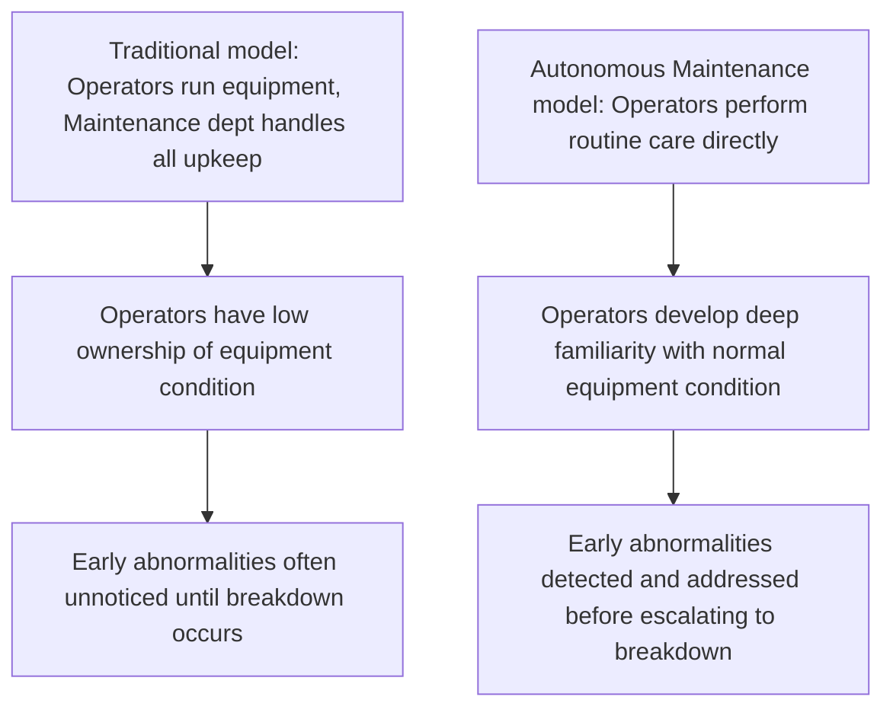
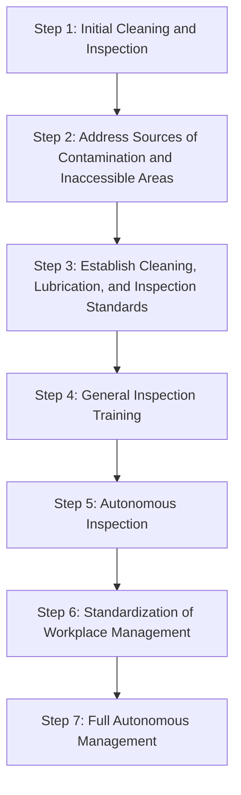

## Autonomous Maintenance Performed by Operators

### Overview

Autonomous Maintenance (Jishu Hozen, 自主保全) is the first and foundational pillar of Total Productive Maintenance, referring to the systematic transfer of routine, low-complexity maintenance tasks — cleaning, inspection, lubrication, and minor tightening — from specialist maintenance personnel to the equipment operators who use the machinery daily. Rather than treating maintenance as the exclusive responsibility of a separate department, autonomous maintenance builds operator ownership of equipment condition, enabling earlier detection of abnormalities while freeing specialist maintenance staff to focus on more technically demanding planned and predictive maintenance activities.

**Key Points**

- Operators take direct responsibility for routine cleaning, inspection, lubrication, and minor tightening of their own equipment
- Distinguishes operator-appropriate maintenance tasks from those requiring specialist technical skill
- Typically implemented through a structured, staged progression (commonly seven steps) rather than all at once
- Builds operator familiarity with normal equipment condition, improving early detection of developing abnormalities
- Grounded in the principle that "cleaning is inspection" — the physical act of cleaning surfaces problems that would otherwise go unnoticed

---

### Rationale: Why Involve Operators in Maintenance

Operators spend more continuous time in direct contact with a given piece of equipment than any specialist maintenance technician, who typically visits only periodically or in response to a reported problem. This constant proximity gives operators a uniquely favorable position to notice early signs of deterioration — unusual sounds, vibration, minor leaks, loosening fasteners — long before these signs would trigger a formal maintenance request or escalate into a breakdown.

The principle "cleaning is inspection" (seisou wa tenken) captures this logic directly: the physical act of thoroughly cleaning equipment inherently requires close visual and tactile contact with every component, surfacing loose bolts, developing leaks, unusual wear, or minor damage that would otherwise remain hidden under normal operating conditions.

---

### Distinguishing Operator Tasks from Specialist Maintenance Tasks

Autonomous maintenance does not eliminate the specialist maintenance function; it reallocates specific categories of task based on complexity and required skill level.

| Task Category | Typically Assigned To |
| --- | --- |
| Routine cleaning | Operator (Autonomous Maintenance) |
| Visual/tactile inspection for obvious abnormalities | Operator (Autonomous Maintenance) |
| Basic lubrication (per defined schedule) | Operator (Autonomous Maintenance) |
| Minor tightening of accessible fasteners | Operator (Autonomous Maintenance) |
| Component replacement, overhaul | Specialist Maintenance |
| Diagnosis of complex mechanical/electrical faults | Specialist Maintenance |
| Condition-monitoring analysis (vibration, thermal imaging) | Specialist Maintenance |
| Precision calibration | Specialist Maintenance |

This division allows specialist maintenance resources, which are typically more constrained and more costly per hour than operator time, to concentrate on higher-value, higher-skill activities rather than routine, low-complexity tasks that operators are well-positioned to perform as part of their normal shift.

---

### The Seven-Step Implementation Process

Autonomous maintenance is typically introduced through a structured, staged progression rather than assigning full maintenance responsibility to operators immediately. The staged approach builds capability incrementally and ensures each foundation level is solid before progressing to more advanced operator responsibility.

#### Step 1: Initial Cleaning and Inspection

Operators conduct a thorough, deep cleaning of their assigned equipment, often for the first time in a structured way, while simultaneously inspecting for and tagging any abnormalities discovered (loose bolts, leaks, unusual wear, damaged guards). This initial step frequently surfaces a substantial backlog of previously unnoticed minor issues.

#### Step 2: Address Sources of Contamination and Inaccessible Areas

Rather than simply repeating the deep clean indefinitely, this step targets the root causes of contamination and dirt accumulation identified during Step 1 (e.g., a leaking seal causing repeated oil accumulation) and improves access to areas that were difficult to clean or inspect, often through simple modifications (viewing windows, relocated access panels).

#### Step 3: Establish Cleaning, Lubrication, and Inspection Standards

Operators, often working with maintenance specialists, develop simple, visual standards specifying what needs to be cleaned/inspected/lubricated, how often, and by what method — formalizing what had previously been an ad hoc or specialist-only activity into clear, repeatable operator standard work.

#### Step 4: General Inspection Training

Operators receive broader technical training in basic equipment mechanisms (lubrication systems, pneumatics, basic electrical components) to build the underlying knowledge needed to recognize a wider range of abnormalities during routine inspection, beyond what could be identified through simple visual cleaning alone.

#### Step 5: Autonomous Inspection

Operators, now equipped with the standards from Step 3 and the technical knowledge from Step 4, take on independent responsibility for routine inspection, often integrating it into standardized daily or shift-start routines rather than treating it as a separate periodic activity.

#### Step 6: Standardization of Workplace Management

Autonomous maintenance activities are integrated into broader workplace management systems — including visual management, 5S practices, and safety procedures — ensuring consistency across shifts, teams, and equipment types.

#### Step 7: Full Autonomous Management

Operators reach a mature level of self-management, continuously monitoring, maintaining, and incrementally improving their equipment's condition as an integrated part of daily work, with specialist maintenance staff engaged primarily for planned maintenance and more complex issues identified through the operators' ongoing vigilance.

---

### The Role of Visual Management in Autonomous Maintenance

Autonomous maintenance is typically supported by visual controls that make normal versus abnormal equipment conditions immediately apparent, reducing the reliance on operator memory or specialized knowledge for routine checks.

- **Inspection tags**: visible tags marking identified abnormalities pending resolution
- **Gauge marking**: color-coded ranges on pressure or temperature gauges indicating normal operating zones at a glance
- **Lubrication point labeling**: clear labeling of lubrication points, required lubricant type, and frequency directly on the equipment
- **One-point lessons**: brief, highly visual training documents covering a single specific piece of equipment knowledge, often created collaboratively between operators and maintenance specialists

---

### Example Application

A stamping press operator, previously responsible only for running the machine, is trained under an autonomous maintenance program. During Step 1's initial cleaning, the operator discovers a small hydraulic leak previously undetected beneath a control panel and several loosened mounting bolts on a safety guard — both tagged for maintenance follow-up. Investigation reveals the leak's root cause is a worn seal exposed to metal shavings accumulating in that area (Step 2), leading to installation of a simple shield redirecting shavings away from the seal. A cleaning/lubrication standard is then established (Step 3) specifying a daily two-minute visual and tactile check of that specific area, which the operator now performs as part of shift-start routine (Step 5), catching a similar developing issue on a different machine months later before it escalates to a breakdown.

---

### Common Pitfalls

- **Skipping the staged progression**: Assigning full autonomous maintenance responsibility to operators immediately, without the foundational cleaning, standard-setting, and training steps, risking superficial or inconsistent execution
- **Treating Step 1 as a one-time event**: Conducting an initial deep clean without establishing the ongoing standards (Step 3) that sustain the improved condition, allowing gradual regression to the prior state
- **Insufficient training investment (Step 4)**: Expecting operators to identify meaningful abnormalities without adequate underlying technical knowledge, limiting inspection effectiveness to only the most obvious visual issues
- **Maintenance staff resistance or role ambiguity**: Failing to clearly define which tasks remain with specialist maintenance versus which transfer to operators, creating confusion, duplicated effort, or gaps in coverage
- **Neglecting root-cause elimination of contamination sources (Step 2)**: Continuing to repeat labor-intensive cleaning without addressing underlying causes, generating ongoing operator burden without corresponding reliability improvement

---

### Relationship to Other TPS/Lean Tools

- **Total Productive Maintenance**: autonomous maintenance is the first of TPM's eight pillars, foundational to the broader philosophy's participative approach
- **5S**: provides the workplace organization foundation (particularly Sort, Set in Order, Shine) that supports effective cleaning-as-inspection activity
- **Visual Management**: inspection tags, gauge marking, and one-point lessons are direct applications of visual control principles within autonomous maintenance
- **Genchi Genbutsu**: operators' direct, firsthand contact with their equipment embodies this broader TPS principle at the equipment-condition level
- **Standardized Work**: Step 3's cleaning/inspection/lubrication standards become integrated into operators' documented standard work

---

**Related Topics**

- Total Productive Maintenance Overview and Its Pillars
- Overall Equipment Effectiveness (OEE) Calculation in Depth
- 5S Workplace Organization
- Standardized Work Documentation and Maintenance
- Visual Management Boards in Lean Daily Management
- Genchi Genbutsu and Direct Observation