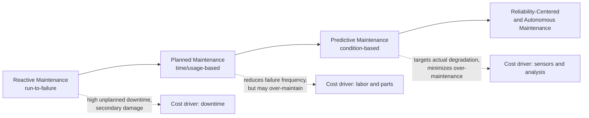
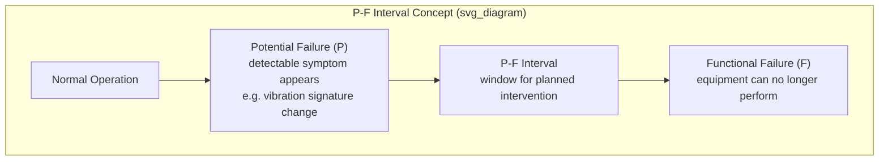

## Planned and Predictive Maintenance

### Definition and Position within TPM

Planned maintenance (calendar- or usage-based, scheduled servicing performed before failure occurs) and predictive maintenance (condition-based servicing triggered by measured deterioration trends rather than fixed intervals) are two of the core pillars of Total Productive Maintenance (TPM), the maintenance philosophy that underpins equipment reliability within the Toyota Production System. Both approaches sit in contrast to reactive (breakdown) maintenance, where equipment runs until it fails and is then repaired.

In TPS, equipment reliability is not treated as a maintenance-department concern alone. It is treated as a precondition for flow, small-lot production, and low inventory buffers. Because TPS deliberately minimizes work-in-process (WIP) and safety stock, an unplanned equipment stoppage propagates through the line almost immediately — there is no buffer to absorb it. This is why the TPS literature elevates maintenance strategy to the same level of importance as changeover reduction (SMED) and jidoka.

### Position in the Maintenance Maturity Spectrum

**Key Points**

- Reactive (run-to-failure) maintenance: lowest cost per intervention, highest total cost due to unplanned downtime, secondary damage, and safety risk.
- Planned (preventive) maintenance: interventions scheduled on fixed intervals — calendar time, operating hours, or cycle counts — regardless of actual equipment condition.
- Predictive maintenance: interventions triggered by monitored condition indicators (vibration, temperature, oil analysis, current draw, acoustic emission) that reveal an impending failure mode before it manifests.
- Autonomous maintenance (part of TPM's broader eight pillars, distinct from but complementary to planned/predictive maintenance): operators perform basic cleaning, inspection, and lubrication (CIL) themselves, freeing skilled maintenance technicians for higher-value planned and predictive work.

### Planned Maintenance: Mechanics

Planned maintenance is built around three scheduling logics, often used in combination:

1. **Calendar-based scheduling** — intervention triggered by elapsed time (e.g., quarterly lubrication, annual overhaul). Simplest to administer; weakest correlation to actual wear because it ignores utilization intensity.
2. **Usage-based scheduling** — intervention triggered by a usage counter: operating hours, cycle counts, distance traveled (for mobile equipment), or units produced. Better correlated with wear than calendar-based scheduling because it reflects actual duty.
3. **Failure-mode-driven scheduling** — intervals derived from the known life distribution of a specific failure mode (e.g., bearing L10 life, belt fatigue life), rather than an arbitrary round-number interval. This is the more rigorous version of planned maintenance and overlaps with Reliability-Centered Maintenance (RCM) methodology.

A planned maintenance program requires:

- An equipment master list with criticality ranking (which machines, if stopped, halt the line vs. which have redundancy or buffer).
- Documented maintenance standards per machine (what to check, replace, lubricate, and to what tolerance).
- A scheduling and work-order system (a Computerized Maintenance Management System, or CMMS, in most modern implementations).
- Spare parts inventory management tied to the maintenance schedule (kitting parts before the work order is due, not ordering reactively).

**Example**

A stamping press with a known die life of 500,000 strokes is scheduled for die inspection and refurbishment every 480,000 strokes (a safety margin below the known failure threshold), tracked via a stroke counter integrated into the press controller. This is usage-based planned maintenance, not calendar-based, because stroke count — not elapsed weeks — is the variable that drives die wear.

### Predictive Maintenance: Mechanics

Predictive maintenance (often abbreviated PdM, and referred to in TPM literature as "condition-based maintenance") monitors physical parameters that degrade measurably before functional failure occurs, and schedules intervention only when a trend crosses a defined threshold.

**Common condition-monitoring techniques**

| Technique | Failure Modes Detected | Typical Sensors/Tools |
| --- | --- | --- |
| Vibration analysis | Bearing wear, misalignment, imbalance, gear mesh defects | Accelerometers, FFT spectrum analyzers |
| Oil analysis (tribology) | Internal wear (metal particulate), lubricant degradation, contamination | Particle counters, spectrometric oil analysis |
| Infrared thermography | Electrical connection degradation, bearing friction, insulation breakdown | Thermal imaging cameras |
| Ultrasonic analysis | Compressed air/gas leaks, early-stage bearing defects, electrical arcing | Ultrasonic detectors |
| Motor current signature analysis (MCSA) | Rotor bar defects, eccentricity, load-related electrical faults | Current clamps, signature analysis software |
| Acoustic emission | Crack propagation, surface fatigue | Acoustic emission sensors |

**Key Points**

- Predictive maintenance requires establishing a healthy-state baseline for each monitored parameter before trend deviations become meaningful.
- Thresholds are typically set using statistical control limits or manufacturer-specified alarm/danger bands (e.g., ISO 10816 vibration severity zones).
- [Inference] The specific alarm thresholds and inspection intervals used in practice vary by machine class, load profile, and criticality, so any numeric threshold cited in training materials should be treated as illustrative rather than a universal standard.
- Predictive maintenance has a data-maturity precondition: without a reliable baseline and consistent measurement cadence, trend-based alerts are unreliable — this is why many organizations run planned maintenance in parallel with predictive maintenance during the transition period rather than replacing one with the other outright.

### Failure Curve Rationale (P-F Interval)

The theoretical justification for predictive maintenance is the P-F curve: a conceptual model showing that most failure modes exhibit a detectable **potential failure** point (P) — a measurable early symptom — well before the **functional failure** point (F), where the equipment can no longer perform its function. The time span between P and F is the P-F interval, and predictive maintenance's task is to detect the potential failure point and schedule the intervention with enough lead time before F to plan the repair without unplanned downtime.

A short P-F interval (e.g., some electrical faults) may not leave enough lead time for predictive maintenance to be practical, in which case planned maintenance or design-out (eliminating the failure mode via redesign) is more appropriate. A long P-F interval (e.g., bearing degradation, which can be monitored for weeks before failure) is well suited to predictive maintenance.

### Integration with TPS Flow Principles

**Key Points**

- Equipment reliability directly enables the low-inventory, small-lot, one-piece-flow objectives of TPS: without reliable equipment, buffer stock becomes a necessary hedge against downtime, which contradicts the waste-reduction goal of minimizing inventory (muda of excess inventory).
- Unplanned downtime on a bottleneck (constraint) operation has a compounding effect on takt time attainment, since TPS lines are typically balanced tightly to customer demand rate with minimal slack capacity built in.
- Planned and predictive maintenance schedules are ideally synchronized with SMED-optimized changeover windows — performing maintenance during a changeover or a planned line-stop minimizes the incremental downtime cost of the maintenance activity itself.
- Overall Equipment Effectiveness (OEE) — the composite metric of Availability × Performance × Quality — is the standard metric used to quantify the return on planned/predictive maintenance investment; Availability loss specifically captures unplanned breakdowns and setup/adjustment time.

### Relationship to Autonomous Maintenance and the "Six Big Losses"

TPM's Six Big Losses framework categorizes the primary sources of equipment-related productivity loss, and planned/predictive maintenance directly targets two of them:

1. Breakdown losses (targeted by planned and predictive maintenance directly).
2. Setup and adjustment losses (targeted primarily by SMED, but planned maintenance scheduling can reduce setup time by keeping tooling and fixtures in known-good condition).
3. Idling and minor stoppage losses.
4. Reduced speed losses.
5. Startup/yield losses.
6. Quality defects and rework losses.

Autonomous maintenance (operator-performed CIL — Cleaning, Inspection, Lubrication) is the mechanism by which early symptoms feeding into predictive maintenance are often first detected, because operators interact with the equipment continuously and can notice abnormal sounds, temperatures, or vibrations before instrumented sensors flag them. This is why TPM treats autonomous maintenance and planned/predictive maintenance as complementary rather than competing pillars: operators handle first-level detection and basic care, while specialized maintenance technicians handle the deeper condition monitoring and complex interventions.

### CMMS and Digital Infrastructure

**Key Points**

- A Computerized Maintenance Management System (CMMS) is the typical software backbone for planned maintenance: it stores equipment master data, generates work orders on schedule, tracks parts consumption, and records maintenance history for failure-mode analysis.
- In predictive maintenance implementations, the CMMS is often integrated with a condition-monitoring platform or IIoT (Industrial Internet of Things) sensor layer that streams vibration, temperature, or current data and triggers work orders automatically when thresholds are breached — this pattern is sometimes marketed as "Industry 4.0 predictive maintenance" or "smart maintenance."
- [Unverified] Specific vendor claims about AI/ML-based failure prediction accuracy vary widely by implementation maturity and data quality, and should be evaluated against the organization's own historical failure data rather than accepted at face value.

### Implementation Roadmap

**Next Steps**

1. Build an equipment criticality matrix ranking machines by impact on flow, safety, and quality if they fail.
2. Establish maintenance standards and checklists for each critical asset, distinguishing operator-level (autonomous) tasks from specialist-level tasks.
3. Deploy a CMMS to formalize planned maintenance scheduling and capture failure history.
4. Layer in condition-monitoring technology (vibration, thermography, oil analysis) on the highest-criticality, highest-cost-of-failure assets first, since instrumentation cost is not justified uniformly across all equipment.
5. Analyze accumulated failure history to refine intervals — shifting time-based tasks toward condition-based ones where the P-F interval and monitoring cost justify it.
6. Integrate maintenance windows with SMED-optimized changeover schedules to minimize incremental downtime.

**Related Topics**

- Overall Equipment Effectiveness (OEE) measurement and the Six Big Losses
- SMED (Single-Minute Exchange of Die) and changeover time reduction
- Autonomous Maintenance and the Cleaning-Inspection-Lubrication (CIL) cycle
- Reliability-Centered Maintenance (RCM) methodology
- Jidoka and built-in quality (autonomation)
- Total Productive Maintenance (TPM) eight-pillar framework
- Poka-yoke (error-proofing) as a complement to reliability engineering