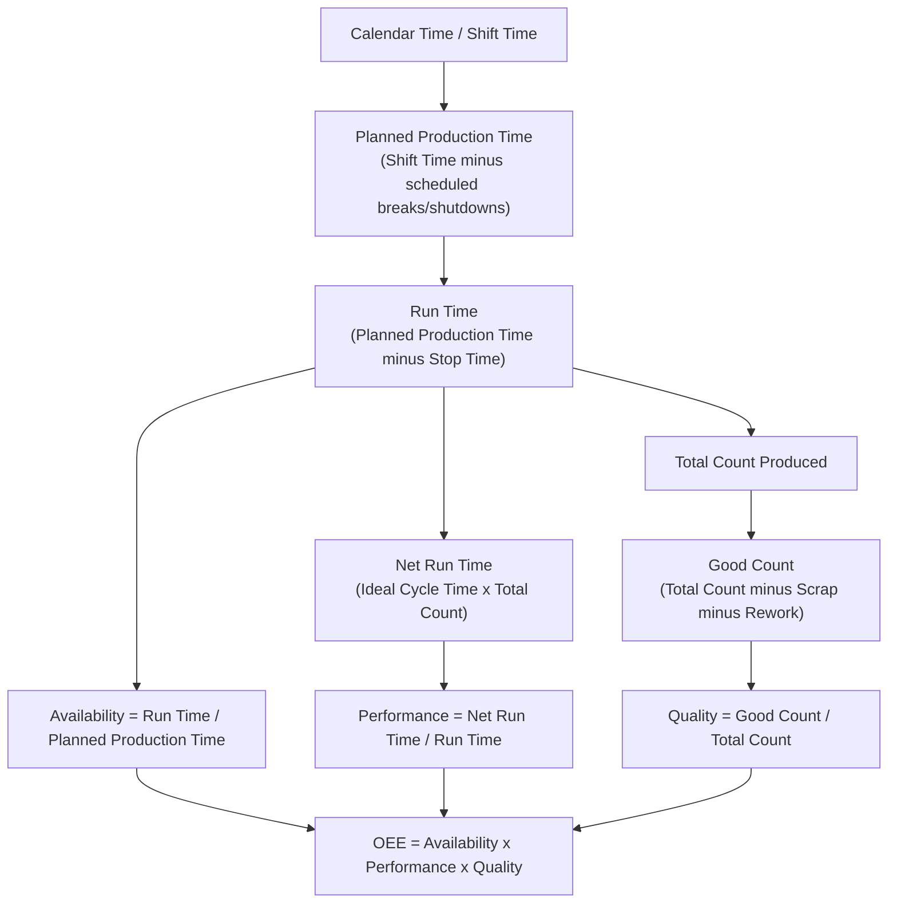

## Calculating Overall Equipment Effectiveness (OEE)

### Definition and Purpose

Overall Equipment Effectiveness (OEE) is a composite metric that quantifies how effectively a manufacturing operation is utilized, expressed as the product of three component ratios: Availability, Performance, and Quality. It was developed by Seiichi Nakajima as part of the Total Productive Maintenance (TPM) framework to give a single, comparable number that captures all forms of productivity loss on a piece of equipment or a line.

$$\text{OEE} = \text{Availability} \times \text{Performance} \times \text{Quality}$$

OEE is designed to expose the gap between theoretical maximum output (if the equipment ran at full speed, with zero stops, producing only good parts) and actual output. Because it multiplies three independently-measured ratios, it penalizes compounding losses more severely than any single metric would — a common illustrative point is that three losses of 10% each do not sum to a 30% loss but compound to roughly a 27.1% effective output ($0.9 \times 0.9 \times 0.9 = 0.729$).

### The Six Big Losses Mapped to OEE Components

**Key Points**

| OEE Component | Six Big Losses Captured | What It Measures |
| --- | --- | --- |
| Availability | Breakdown losses; Setup and adjustment losses | Was the equipment running when it was scheduled to run? |
| Performance | Idling and minor stoppage losses; Reduced speed losses | When running, did it run at its designed speed? |
| Quality | Startup/yield losses; Defects and rework losses | Of what it produced, how much was good on the first pass? |

### Component 1: Availability

Availability measures the proportion of scheduled production time during which the equipment was actually running, net of both unplanned stops (breakdowns) and planned stops that consume scheduled time (changeovers, setup, adjustment).

$$\text{Availability} = \frac{\text{Run Time}}{\text{Planned Production Time}}$$

Where:

- **Planned Production Time** = Total shift/period time minus scheduled non-production time (breaks, planned shutdowns, no scheduled demand). This is the time the equipment is *expected* to be available for production.
- **Run Time** = Planned Production Time minus **Stop Time** (all unplanned stops such as breakdowns, plus planned stops that eat into production time such as changeovers and adjustments).

**Example**

A press is scheduled for an 8-hour (480-minute) shift. 30 minutes are allocated for scheduled breaks (excluded from Planned Production Time). During the remaining 450 minutes, the press experiences a 25-minute breakdown and a 35-minute die changeover.

$$\text{Planned Production Time} = 480 - 30 = 450 \text{ min}$$

$$\text{Stop Time} = 25 + 35 = 60 \text{ min}$$

$$\text{Run Time} = 450 - 60 = 390 \text{ min}$$

$$\text{Availability} = \frac{390}{450} = 0.867 = 86.7\%$$

### Component 2: Performance

Performance measures how closely the equipment's actual output rate, while running, matched its designed (ideal) rate. It captures both minor stoppages that are too brief or numerous to log individually and genuine speed loss (running slower than the rated cycle time).

$$\text{Performance} = \frac{\text{Ideal Cycle Time} \times \text{Total Count}}{\text{Run Time}}$$

Equivalently, using an actual-vs-ideal rate formulation:

$$\text{Performance} = \frac{\text{Actual Output Rate}}{\text{Ideal (Design) Output Rate}}$$

Where:

- **Ideal Cycle Time** is the theoretical minimum time to produce one part, per the equipment's design specification (e.g., manufacturer-rated cycle time).
- **Total Count** is the total number of units produced (good and defective) during Run Time.

**Example**

Continuing the press example: the press has an ideal cycle time of 2 seconds/part (30 parts/minute). During the 390 minutes of Run Time, it actually produced 10,000 parts total.

$$\text{Ideal Output} = 390 \text{ min} \times 30 \text{ parts/min} = 11{,}700 \text{ parts}$$

$$\text{Performance} = \frac{10{,}000}{11{,}700} = 0.855 = 85.5\%$$

The gap (1,700 parts of theoretical capacity not realized) reflects minor stoppages (jams, misfeeds, sensor trips too brief to log as breakdowns) and running below rated speed (e.g., an operator deliberately slowing the line, or a machine derated due to wear).

### Component 3: Quality

Quality (sometimes called the "First Pass Yield" or "Quality Rate") measures the proportion of total output that meets quality standards on the first pass, without rework.

$$\text{Quality} = \frac{\text{Good Count}}{\text{Total Count}}$$

Where **Good Count** excludes scrapped parts, rejected parts, and parts requiring rework (rework parts count as bad in strict OEE calculation, since they consumed capacity that did not yield a first-pass-good unit).

**Example**

Of the 10,000 total parts produced, 300 were scrapped for dimensional defects and 100 required rework.

$$\text{Good Count} = 10{,}000 - 300 - 100 = 9{,}600$$

$$\text{Quality} = \frac{9{,}600}{10{,}000} = 0.96 = 96.0\%$$

### Composite OEE Calculation

$$\text{OEE} = 0.867 \times 0.855 \times 0.96 = 0.7117 \approx 71.2\%$$

This means that of the theoretical maximum output achievable in the scheduled production window, only 71.2% was realized as good parts produced at rated speed with no stoppages.

### Data Collection Requirements

**Key Points**

- Accurate OEE calculation depends on reliable time-stamped data for: shift schedule, all stop events (with cause codes distinguishing breakdown from changeover from other categories), total units produced, and units rejected/reworked.
- Manual OEE tracking (paper logs, operator-entered stop reasons) is prone to under-reporting of minor stoppages, since brief stops (under a minute or two) are frequently not logged, which inflates the apparent Performance figure.
- Automated data collection — via PLC integration, machine controllers, or IIoT sensors feeding a Manufacturing Execution System (MES) — captures minor stoppages and cycle-time variation far more completely than manual logging, and is the standard approach in mature OEE implementations.
- [Inference] The magnitude of the discrepancy between manually logged and automatically logged Performance figures depends heavily on stoppage frequency and duration distribution at a given operation, so no fixed correction factor can be generalized across all equipment types.

### Common Calculation Pitfalls

**Key Points**

- **Confusing Planned Production Time with Calendar Time.** OEE is not meant to penalize equipment for scheduled non-production time (breaks, no-demand periods); only Planned Production Time should be used as the Availability denominator.
- **Treating changeover time inconsistently.** Some organizations exclude changeover time entirely from Planned Production Time (treating it as "not scheduled for production"), which artificially inflates Availability. The TPM-standard convention treats scheduled changeovers as a loss captured within Availability, since the equipment was scheduled to produce but was not running.
- **Ideal Cycle Time drift.** Using an outdated, aspirational, or incorrect Ideal Cycle Time (rather than the equipment's actual rated capability) distorts Performance in either direction. The Ideal Cycle Time should reflect the best sustainable rate the equipment can run at, not a theoretical best-case that has never been achieved in practice.
- **Rework double-counting.** Rework units should not be counted in Good Count even if they are eventually brought to spec, because the capacity consumed by the rework operation is a real loss relative to a single-pass-good unit.
- **Comparing OEE across dissimilar equipment without context.** OEE benchmarks are most meaningful when compared against the same equipment's own historical trend, or against equipment with genuinely comparable process characteristics; direct cross-industry benchmark comparisons can be misleading due to differing Ideal Cycle Time definitions and loss classification conventions.

### Benchmark Interpretation

**Key Points**

- A commonly cited reference figure in TPM literature considers roughly 85% OEE to represent "world-class" performance for discrete manufacturing, though this figure is illustrative rather than a universal target and its applicability varies by industry, equipment type, and process complexity.
- [Unverified] Published "world-class" OEE percentages vary across sources and industry contexts; treat any single benchmark figure as a general reference point to be validated against the specific process and industry rather than an absolute standard.
- OEE is most valuable as a diagnostic tool for identifying which of the three components (Availability, Performance, or Quality) is the dominant loss driver, directing improvement effort (e.g., toward SMED if Availability is low due to changeover time, toward maintenance if Availability is low due to breakdowns, toward process capability studies if Quality is low).

### Related Metrics

- **TEEP (Total Effective Equipment Performance)**: extends OEE by using Calendar Time (all 24/7/365 time) rather than Planned Production Time as the base, capturing the loss from scheduling decisions (e.g., running only one shift when the equipment could run three) in addition to the standard OEE losses.
- **OOE (Overall Operations Effectiveness)**: a variant that excludes losses outside the equipment's own control from the Availability calculation, isolating operations-controllable loss.

**Related Topics**

- Total Productive Maintenance (TPM) and the Six Big Losses framework
- SMED (Single-Minute Exchange of Die) and its direct impact on the Availability component
- Planned and predictive maintenance strategies and their effect on breakdown-driven Availability loss
- Statistical Process Control (SPC) and its relationship to the Quality component
- Manufacturing Execution Systems (MES) and automated OEE data collection
- Takt time and line balancing in relation to Ideal Cycle Time