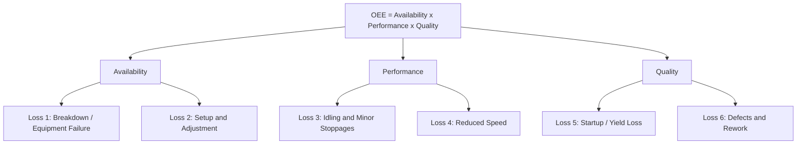

## The Six Big Equipment Losses

### Definition and Origin

The Six Big Losses is a classification framework, developed within Total Productive Maintenance (TPM) by Seiichi Nakajima, that categorizes the primary sources of equipment-related productivity loss on a manufacturing asset. The framework exists to give maintenance and operations teams a structured way to diagnose *why* Overall Equipment Effectiveness (OEE) is below its theoretical maximum, by grouping all loss events into six distinct, mutually exclusive categories that map directly onto the three components of OEE (Availability, Performance, Quality).

The framework's value lies in forcing a distinction between loss types that require fundamentally different countermeasures — a breakdown is solved differently than a minor stoppage, and a minor stoppage is solved differently than a startup defect, even though all three suppress output.

### Mapping to OEE Components

**Key Points**

| OEE Component | Six Big Losses Included | Loss Category |
| --- | --- | --- |
| Availability | 1. Breakdown (Equipment Failure) Losses | Downtime Loss |
| Availability | 2. Setup and Adjustment Losses | Downtime Loss |
| Performance | 3. Idling and Minor Stoppage Losses | Speed Loss |
| Performance | 4. Reduced Speed Losses | Speed Loss |
| Quality | 5. Startup/Yield (Reduced Yield) Losses | Quality Loss |
| Quality | 6. Defects and Rework Losses | Quality Loss |

### Loss 1: Breakdown (Equipment Failure) Losses

Time lost when equipment stops running due to an unplanned failure — a component breaks, a sensor fails, a motor burns out, a mechanical part seizes. This is the most visible and most commonly tracked loss category because it produces an abrupt, unmistakable stop.

**Key Points**

- Classified as a **downtime loss**, reducing Availability.
- Sub-divided in some TPM implementations into *sporadic breakdowns* (sudden, large-magnitude failures) and *chronic breakdowns* (small, recurring failures of the same mode that are individually minor but cumulatively significant and often normalized/ignored by operators).
- Primary countermeasure: planned and predictive maintenance, root-cause failure analysis, and autonomous maintenance (operator-performed cleaning, inspection, lubrication catching early symptoms).

**Example**

A conveyor motor bearing seizes mid-shift, halting the line for 40 minutes while maintenance replaces it. This 40 minutes is logged as Breakdown Loss and directly reduces Run Time in the Availability calculation.

### Loss 2: Setup and Adjustment Losses

Time lost when equipment is stopped for planned changeovers — product changeovers, die changes, tooling swaps — plus the adjustment/fine-tuning time immediately after restart before the process stabilizes at target output and quality.

**Key Points**

- Classified as a **downtime loss**, reducing Availability, even though the stop is planned rather than a failure — the equipment was scheduled to be producing and was not.
- Includes both the changeover activity itself and post-changeover adjustment (e.g., first-piece verification, dialing in a process parameter).
- Primary countermeasure: SMED (Single-Minute Exchange of Die) methodology, which separates internal setup (must be done with the machine stopped) from external setup (can be done while the machine is still running) and systematically converts internal to external.

**Example**

A stamping press requires 35 minutes to swap dies for a new part number, plus an additional 10 minutes of adjustment before output meets spec. The full 45 minutes is Setup and Adjustment Loss.

### Loss 3: Idling and Minor Stoppage Losses

Brief interruptions — typically under five minutes, and often only a few seconds — where equipment stops or idles due to a transient issue: a part misfeed, a sensor false-trigger, a momentary jam that clears itself or is cleared quickly by the operator without calling maintenance.

**Key Points**

- Classified as a **speed loss**, reducing Performance rather than Availability, because these stoppages are typically too brief and too numerous to be individually logged as downtime events in most tracking systems.
- The most commonly under-reported of the six losses in manually-tracked environments, because operators frequently clear minor stoppages without recording them, which causes actual Performance loss to be invisible in manual OEE data and only detectable through automated cycle-time monitoring.
- Primary countermeasure: root-cause analysis of recurring minor stoppage patterns (often via Pareto analysis of stoppage-cause logs from automated data collection), poka-yoke (error-proofing) to prevent the triggering condition, and 5S/workplace organization to eliminate material-flow interruptions.

**Example**

A bottling line experiences a bottle jam at the capping station roughly once every 15 minutes, each clearing in under 20 seconds. Individually trivial, but across an 8-hour shift this can accumulate to a significant fraction of lost cycle time — and because each event is sub-minute, it is rarely logged as a discrete downtime entry.

### Loss 4: Reduced Speed Losses

The gap between the equipment's designed (ideal) cycle time and its actual operating speed when running, excluding minor stoppages. This occurs when equipment is deliberately or inadvertently run slower than its rated capability.

**Key Points**

- Classified as a **speed loss**, reducing Performance.
- Common causes: mechanical wear reducing achievable speed without triggering a stoppage, an operator running the equipment cautiously below rated speed (sometimes due to past quality problems at full speed), or a process parameter set conservatively.
- Distinct from minor stoppages: this is continuous running at a suppressed rate, not intermittent full stops.
- Primary countermeasure: root-cause analysis of why actual speed diverges from design speed (mechanical condition assessment, operator practice review, and verifying the Ideal Cycle Time reference value is itself accurate).

**Example**

A machine rated for a 2-second cycle time is consistently observed running at a 2.4-second cycle time due to accumulated mechanical wear in a drive component. This 0.4-second-per-cycle gap, multiplied across total cycles run, is Reduced Speed Loss.

### Loss 5: Startup/Yield (Reduced Yield) Losses

Output lost during the warm-up or startup phase of a production run, before the process stabilizes and produces consistently good parts — for example, scrap generated while a process reaches thermal equilibrium, or while initial process parameters are being fine-tuned.

**Key Points**

- Classified as a **quality loss**, reducing Quality (the ratio of Good Count to Total Count).
- Distinct from ongoing Defect Losses in that it is specifically tied to the startup/transition period of a run, not steady-state production.
- Primary countermeasure: standardized startup procedures, process parameter templates saved per product (reducing re-tuning time), and equipment designed for faster stabilization (e.g., pre-heating systems that reach target temperature before the first part is run).

**Example**

An injection molding machine produces 15 parts with dimensional variance outside tolerance during the mold-temperature stabilization period at the start of each shift, before settling into consistent production. These 15 parts are Startup/Yield Loss.

### Loss 6: Defects and Rework Losses

Output lost to quality defects during steady-state (non-startup) production — parts that are scrapped outright, or parts that require rework/reprocessing to meet specification.

**Key Points**

- Classified as a **quality loss**, reducing Quality.
- Rework parts are counted as loss in strict OEE/Six Big Losses accounting even if they are eventually brought to spec, because the capacity consumed reprocessing them represents lost first-pass-good output.
- Primary countermeasure: Statistical Process Control (SPC) to detect process drift before it produces defects, poka-yoke (error-proofing) to prevent defect-generating conditions, and jidoka (automatic stop on abnormality) to prevent a defect from propagating into multiple bad units before detection.

**Example**

During a steady-state production run, a machining operation produces 200 parts with an out-of-tolerance dimension due to tool wear that went undetected between inspection intervals. These 200 parts are Defect Loss, separate from any startup-related scrap earlier in the shift.

### Diagnostic Use: Pareto Analysis of Losses

**Key Points**

- In practice, loss data across all six categories is typically collected over a representative period and ranked by cumulative impact (a Pareto analysis), since the six categories rarely contribute equally — a small number of loss modes usually account for the majority of lost OEE.
- This ranking directs improvement resource allocation: a line dominated by Setup and Adjustment Loss benefits most from SMED efforts, while a line dominated by Breakdown Loss benefits most from planned/predictive maintenance investment, and one dominated by Minor Stoppages benefits most from automated data collection plus poka-yoke.
- [Inference] The relative proportion of each loss category is highly specific to the equipment, process, and operating context in question; no universal distribution across the six categories can be assumed without measurement on the actual line being analyzed.

### Distinguishing Sporadic vs. Chronic Losses

A cross-cutting distinction that applies across several of the six categories, particularly Breakdown and Minor Stoppage losses:

- **Sporadic losses**: large-magnitude, infrequent, and highly visible (e.g., a major breakdown). Easy to notice and prioritize, but root-causing often requires deep technical investigation since the failure mode may be novel or rare.
- **Chronic losses**: small-magnitude, frequent, and often normalized by the workforce as "just how the machine runs" (e.g., a minor stoppage that recurs many times per shift). Individually low-impact but cumulatively substantial, and prone to being overlooked precisely because no single occurrence seems worth escalating.

TPM practice generally emphasizes that chronic losses, in aggregate, often represent a larger recoverable opportunity than sporadic losses, precisely because they are systematically under-addressed relative to their cumulative cost.

**Related Topics**

- Overall Equipment Effectiveness (OEE) calculation methodology
- Planned and predictive maintenance strategies (targeting Breakdown Loss)
- SMED (Single-Minute Exchange of Die) methodology (targeting Setup and Adjustment Loss)
- Poka-yoke (error-proofing) and jidoka (targeting Minor Stoppage and Defect losses)
- Autonomous maintenance and the Cleaning-Inspection-Lubrication (CIL) cycle
- Statistical Process Control (SPC) and process capability analysis
- Total Productive Maintenance (TPM) eight-pillar framework