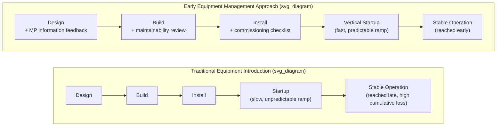
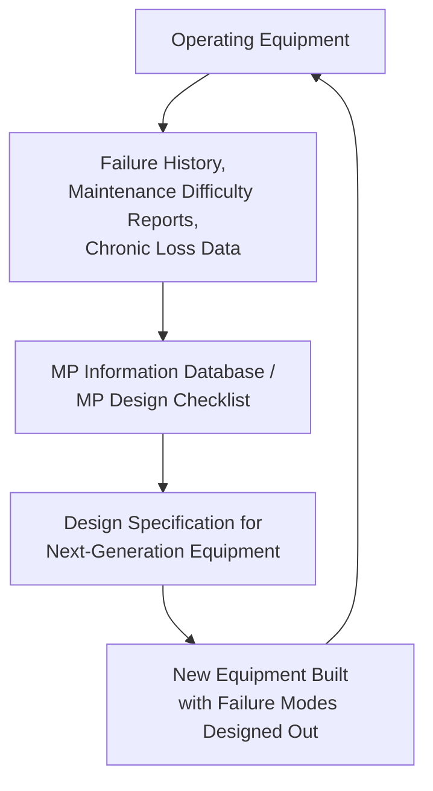

## Early Equipment Management and Maintenance Prevention

### Definition and Position within TPM

Early Equipment Management (EEM) and Maintenance Prevention (MP) are two closely related pillars of Total Productive Maintenance (TPM) that shift reliability engineering upstream — into the equipment design and procurement phase — rather than treating reliability purely as something achieved through post-installation maintenance activity. Where planned and predictive maintenance manage the reliability of equipment that already exists, EEM and MP are concerned with designing new equipment (or specifying new lines) so that it inherently requires less maintenance, is easier to maintain when it does, and reaches its target production performance faster after installation.

**Maintenance Prevention (MP)** is the design principle: incorporating knowledge from past failure history, maintenance difficulty, and operability issues directly into the specification and design of new equipment, so that known failure modes and maintenance pain points are engineered out before the equipment is ever built or purchased.

**Early Equipment Management (EEM)**, sometimes called Initial Phase Management, is the broader project-management process that governs the full lifecycle from equipment planning through design, installation, commissioning, and the vertical startup ramp to stable production — with the explicit goal of minimizing the time and cost of each phase, particularly the startup ramp-up period.

### Rationale within TPS

**Key Points**

- Correcting a design flaw or maintenance-difficulty issue after equipment is installed and running is substantially more costly than designing it out beforehand — this cost-escalation principle is analogous to the widely observed pattern in quality engineering that defects become progressively more expensive to fix the later they are discovered in a lifecycle.
- New equipment introduced without EEM/MP discipline typically exhibits a slow, unpredictable startup curve — the "vertical startup" problem, where a machine takes a long, uncertain time after installation to reach its designed rate, designed quality level, and designed uptime.
- TPS treats capital equipment decisions as long-lived commitments: a machine specified poorly will generate recurring maintenance burden and chronic losses (see the Six Big Losses framework) for its entire operating life, so front-loading design rigor is treated as a high-leverage investment relative to its one-time cost.

### Maintenance Prevention (MP) Information Feedback Loop

The core mechanism of MP is a structured feedback loop: failure history, chronic loss data, and maintenance difficulty reports from currently-operating equipment are systematically captured, analyzed, and fed forward as design requirements for the next generation of equipment.

**Key Points**

- **MP information** typically includes: recurring failure modes and their root causes, components with poor accessibility for inspection/replacement, tooling or fixtures prone to misalignment, safety incidents related to maintenance access, and operator feedback on ergonomics and ease of cleaning/inspection.
- This information is the same data captured through the Six Big Losses tracking and autonomous maintenance activities on existing equipment — EEM/MP is the pillar that closes the loop by ensuring that data actually changes future design decisions, rather than only informing repair of the current machine.
- A common implementation mechanism is an MP design checklist or MP standard, maintained and updated by the maintenance and engineering functions jointly, which is consulted at each new equipment specification and design review.

### The LCC (Life Cycle Cost) Perspective

**Key Points**

- EEM and MP evaluate equipment decisions against Life Cycle Cost (LCC) rather than initial purchase price alone — LCC includes acquisition cost plus the full stream of maintenance labor, spare parts, downtime cost, and energy consumption over the equipment's operating life.
- A piece of equipment with a higher purchase price but substantially lower maintenance burden and faster, more reliable startup can have a lower total LCC than a cheaper alternative that generates chronic losses for years — MP-driven specification decisions are evaluated on this basis rather than on capital cost minimization alone.
- [Inference] The specific LCC breakeven point between a higher-upfront-cost, lower-maintenance design and a lower-upfront-cost, higher-maintenance alternative depends on the equipment's expected operating life, utilization rate, and the organization's cost of downtime, so no general ratio can be assumed without a case-specific analysis.

### Vertical Startup and the MP Design Review Process

A structured EEM process typically runs new equipment projects through staged reviews, each incorporating MP information at the appropriate point:

1. **Planning phase** — define target performance (speed, quality, reliability) based on process requirements, referencing MP information from comparable existing equipment.
2. **Design phase (DR1, DR2 design reviews)** — engineering design is reviewed against the MP checklist: are known failure-prone components avoided or upgraded; is the design accessible for inspection, lubrication, and part replacement without extensive disassembly; are wear parts standardized and commonly stocked.
3. **Manufacturing/build phase** — the equipment is fabricated; deviations from the MP-informed design are tracked and reviewed.
4. **Installation and commissioning phase** — includes a structured debugging period specifically targeting early-life failures before the equipment is handed to production.
5. **Initial flow control / vertical startup phase** — production ramp-up is actively managed against a target startup curve, with rapid root-cause response to any deviation, rather than allowing an extended, unmanaged "settling-in" period.
6. **Stable operation** — equipment transitions to standard planned/predictive maintenance and autonomous maintenance programs, and its performance data begins feeding the MP information loop for the next design cycle.

**Example**

A plant introducing a new automated welding cell references MP information from three prior welding cell installations, which flagged recurring failures in cable management (causing chafing and electrical faults) and poor technician access to the wire-feed mechanism (extending routine maintenance time). The new cell's design specification requires a redesigned cable routing channel and a hinged access panel for the wire-feed mechanism — both derived directly from documented MP information rather than discovered through failures on the new cell itself.

### Relationship to Other TPM Pillars

**Key Points**

- EEM/MP depends on accurate, well-documented data from **planned and predictive maintenance** (failure history, condition-monitoring trend data) and **autonomous maintenance** (operator-reported maintainability issues) — without disciplined data capture on existing equipment, there is no MP information to feed forward.
- EEM/MP complements **Quality Maintenance** (another TPM pillar, focused on designing quality into the process itself) by extending the same design-time prevention logic from quality characteristics to maintainability and reliability characteristics.
- The overall philosophy mirrors Design for Manufacturability/Design for Assembly (DFM/DFA) principles from product design, applied instead to production equipment: designing the *equipment* to be inherently easy to maintain and reliable, rather than relying on maintenance effort to compensate for a difficult design after the fact.

### Common Implementation Challenges

**Key Points**

- Requires cross-functional collaboration between maintenance, operations, and engineering/procurement functions that may not have a standing structured feedback mechanism in organizations without a mature TPM program — building the MP information database is itself an organizational capability that takes time to establish.
- Benefits are realized on a delayed timeline (during the *next* equipment purchase cycle), which can make EEM/MP a harder investment to justify against more immediately visible improvement activities like SMED or point-of-use kaizen on existing lines.
- [Inference] Organizations early in their TPM maturity journey commonly begin with the more immediately tangible pillars (autonomous maintenance, planned maintenance) before formalizing EEM/MP, since the latter requires a baseline of reliable failure-history data that itself takes time to accumulate — though the specific sequencing varies by organization.

**Related Topics**

- Total Productive Maintenance (TPM) eight-pillar framework
- Planned and predictive maintenance strategies
- The Six Big Losses and their role as MP information source
- Autonomous maintenance and operator-reported maintainability feedback
- Quality Maintenance (Hinshitsu Hozen) as a parallel design-time prevention pillar
- Life Cycle Cost (LCC) analysis for capital equipment decisions
- Design Reviews (DR) and staged equipment introduction processes