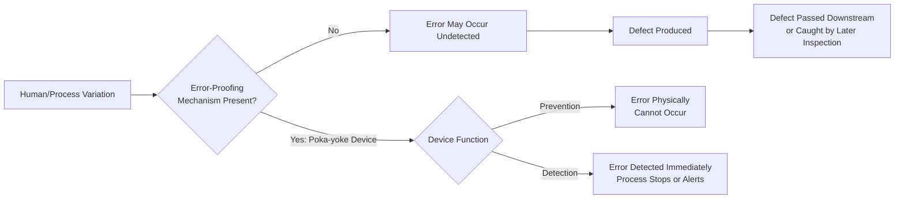
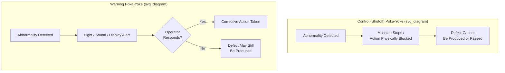
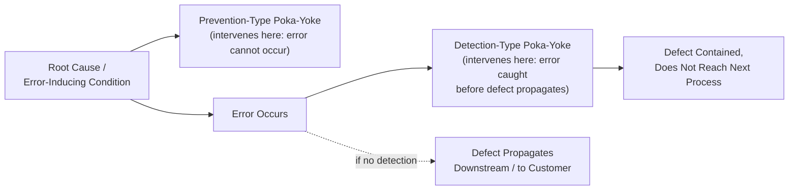

## Poka-Yoke Concepts and Classification of Error-Proofing Devices

### Definition and Origin

Poka-yoke (ポカヨケ, literally "mistake-proofing," from *poka* meaning inadvertent error and *yokeru* meaning to avoid) is a quality engineering method developed principally by Shigeo Shingo within the Toyota Production System that uses mechanisms — mechanical, electrical, procedural, or visual — to prevent human errors from occurring, or to detect them immediately when they do occur, before a defect can be produced or passed downstream.

The underlying premise of poka-yoke is a specific view of human error: mistakes are treated as an inevitable, normal aspect of human work rather than a failure of worker attentiveness or diligence. Consequently, poka-yoke does not attempt to eliminate errors through training, warnings, or exhortations to be more careful — it redesigns the task or the equipment so that the error either cannot physically occur, or is caught the instant it occurs, independent of the worker's attention level.

### Position within Zero Quality Control (ZQC) and Jidoka

**Key Points**

- Poka-yoke is the primary mechanism through which Shingo's Zero Quality Control (ZQC) system pursues 100% inspection with immediate feedback and action, as an alternative to statistical sampling inspection, which by design accepts some defect escape rate.
- Poka-yoke devices are frequently the physical implementation of jidoka (automation with a human touch / autonomation) at the individual process-step level: jidoka is the broader principle that a process should stop automatically when an abnormality occurs, and a poka-yoke device is often the specific sensor or mechanism that detects the abnormality and triggers the stop.
- Poka-yoke complements, but is distinct from, standard work: standard work defines the correct method: poka-yoke ensures the correct method is followed (or that a deviation is caught) without depending on the worker recalling or choosing to follow it correctly every time.

### Classification by Function: Control vs. Warning

Poka-yoke devices are classified along two independent dimensions. The first is the device's **regulatory function** — what it does once an error condition is detected.

**Control (Shutoff) Poka-Yoke**

A control poka-yoke stops the process or physically prevents the erroneous action from proceeding when an abnormal condition is detected. This is the stronger of the two functional types because it removes the defect-producing condition entirely, rather than relying on a human response to a signal.

**Key Points**

- Halts the machine, locks out the next process step, or physically blocks an incorrect part/orientation from being loaded.
- Preferred over warning-type devices wherever feasible, because it does not depend on a worker noticing and correctly responding to an alert — the error is arrested regardless of operator attentiveness.

**Example**

A fixture on an assembly station has a locating pin pattern that matches only the correct part orientation; an incorrectly oriented part physically cannot be seated in the fixture, so the operator cannot proceed to the next step until the part is correctly placed. This is a control poka-yoke because the erroneous action is physically prevented, not merely flagged.

**Warning Poka-Yoke**

A warning poka-yoke alerts the operator (via light, sound, or display) that an abnormal condition has occurred or is about to occur, but does not itself stop the process — the operator must recognize and respond to the signal.

**Key Points**

- Used when a control (shutoff) mechanism is technically infeasible, too costly relative to the risk, or would create excessive process interruption for a low-severity error mode.
- Effectiveness depends on operator response, making it inherently less reliable than a control-type device, though still substantially more reliable than relying on unaided operator vigilance alone.

**Example**

A torque wrench emits an audible beep when a fastener reaches target torque, and a different tone if the wrench detects the fastener was under-torqued when the operator moved to the next joint. The operator must hear and act on the signal; the wrench itself does not halt the assembly line.

### Classification by Detection Method

The second classification dimension is the **detection principle** the device uses to identify an error condition. Shingo identified three primary detection methods.

**1. Contact Method**

Detects errors through physical contact (or lack thereof) between a sensing device and the workpiece — shape, dimension, presence/absence, or position is sensed through a physical or proximity-based interface.

**Key Points**

- Common implementations: limit switches, proximity sensors, guide pins that only fit a correctly-shaped part, shaped fixtures/jigs that reject misoriented parts.
- Well suited to detecting dimensional, shape, or presence errors where a physical differentiator exists between correct and incorrect states.

**Example**

A fixture uses an asymmetric locating pin pattern (one large pin, one small pin, positioned off-center) so a component can physically be loaded in only one correct orientation — an incorrect orientation simply will not fit onto the pins. This is a contact-method poka-yoke.

**2. Fixed-Value (Constant Number) Method**

Detects errors by counting a fixed, expected number of repeated actions or parts, and signals an abnormality if the actual count does not match the expected count.

**Key Points**

- Used where a process requires a specific number of identical steps or components (e.g., a fixed number of fasteners, a fixed number of weld points, a fixed number of parts placed in a kit) and an error consists of doing too few or too many.
- Typically implemented via a counter, a parts-presence sensor array, or a kitting tray with cavities matching the exact required part count (an empty or extra cavity is immediately visible).

**Example**

An assembly operation requires exactly six screws to secure a panel. A screwdriver is connected to an electronic counter that will not allow the workstation to signal "complete" and release the part to the next station unless exactly six fastening cycles have been registered.

**3. Motion-Step (Sequence) Method**

Detects errors by monitoring whether the standard sequence of motions or process steps was actually performed, in the correct order, within the correct time.

**Key Points**

- Used where the risk is a skipped step, an out-of-sequence step, or an incomplete step, rather than a dimensional or count error.
- Typically implemented via sensors that must register activation in a specific order (e.g., a photoelectric sensor confirming a part was picked from bin A before the fixture will accept placement) or a timer that flags if a step took less than the minimum required cycle time (suggesting the step may have been skipped or rushed).

**Example**

An operator must apply adhesive, then place a component, then apply clamping pressure, in that order, before the fixture releases the assembled part. Sensors confirm each step occurred in sequence; if the clamp is engaged without the adhesive-dispense sensor having triggered first, the fixture locks and will not release, since the sequence indicates the adhesive step may have been skipped.

### Combined Classification Matrix

Any given poka-yoke device is described by combining its regulatory function (control or warning) with its detection method (contact, fixed-value, or motion-step), giving six possible combinations in practice.

| Detection Method | Control (Shutoff) Example | Warning Example |
| --- | --- | --- |
| Contact | Locating pins physically block incorrect part orientation | Sensor triggers a warning light if a part contour doesn't match, but line continues |
| Fixed-Value | Line will not advance until exact fastener count is confirmed | Display shows a count mismatch alert; operator must acknowledge to proceed |
| Motion-Step | Fixture will not release part unless required steps registered in sequence | Buzzer sounds if a step is skipped, but process is not halted |

### The Source-Level Principle: Prevention vs. Detection

**Key Points**

- Shingo's original framing draws a further distinction based on *when in the causal chain* the poka-yoke intervenes: a **prediction (prevention) type** poka-yoke acts before the error-causing condition can occur at all (e.g., a part simply cannot be loaded incorrectly), while a **detection type** poka-yoke identifies the error after it has occurred but before the resulting defective part moves to the next process or reaches the customer.
- Prevention-type devices are generally preferred wherever feasible, since they eliminate the error condition itself rather than catching its consequence — this mirrors the general preference for control-type over warning-type devices, and both preferences reflect the same underlying principle: intervene as early and as automatically as possible in the error-to-defect causal chain.
- In practice, many implementations combine both: a design that prevents most incorrect actions (source-level prevention) plus a downstream sensor that catches any residual defect that slips through (a safety-net detection layer), rather than relying on a single point of control.

### Implementation Guidelines

**Key Points**

- Poka-yoke design should target the **specific failure mode**, not attempt to generically "improve quality" — effective implementation begins with root-cause analysis of an actual or potential defect (often via a Pareto analysis of recurring defect types, or Failure Mode and Effects Analysis, FMEA) to identify the precise error condition to be engineered against.
- Devices should be simple, low-cost, and preferably passive/mechanical where possible, rather than complex or software-dependent — Shingo's original philosophy favored inexpensive, robust, "cheap automation" solutions over elaborate sensor systems, on the reasoning that simpler devices are more reliable and easier for production personnel to maintain and trust.
- Poka-yoke should be implemented as close as possible to the point where the error is made (source inspection), rather than only at final inspection, since source-level implementation prevents the defect from consuming any further downstream processing resources.
- [Inference] The specific choice between a control-type and warning-type device for a given failure mode depends on factors such as defect severity, cost of a false stoppage, and technical feasibility of a full shutoff mechanism, so no universal rule dictates which type to use in every case — this is a case-by-case engineering judgment.

### Relationship to Other Quality and Reliability Tools

**Key Points**

- Poka-yoke works in conjunction with **jidoka**: jidoka is the principle-level commitment to stopping a process on abnormality, while poka-yoke devices are frequently the specific sensing/actuation mechanism that implements that commitment at a given process step.
- Complements **Statistical Process Control (SPC)**: SPC monitors process variation trends over time to catch drift before it produces defects, while poka-yoke intervenes at the individual-unit level to prevent or catch an error regardless of whether it was predicted by a trend.
- Distinct from general quality inspection: poka-yoke aims for the error to be prevented or caught at the moment and point of occurrence, rather than relying on a separate downstream inspection step (which introduces delay between error occurrence and detection, and consumes inspection resources).

**Related Topics**

- Jidoka and autonomation (automatic stop on abnormality)
- Zero Quality Control (ZQC) and source inspection
- Failure Mode and Effects Analysis (FMEA) as a tool for identifying poka-yoke targets
- Statistical Process Control (SPC) and process capability
- Standard work and its relationship to error-proofing
- Andon systems and visual management for abnormality signaling
- The Six Big Losses (Defects and Rework Loss category)