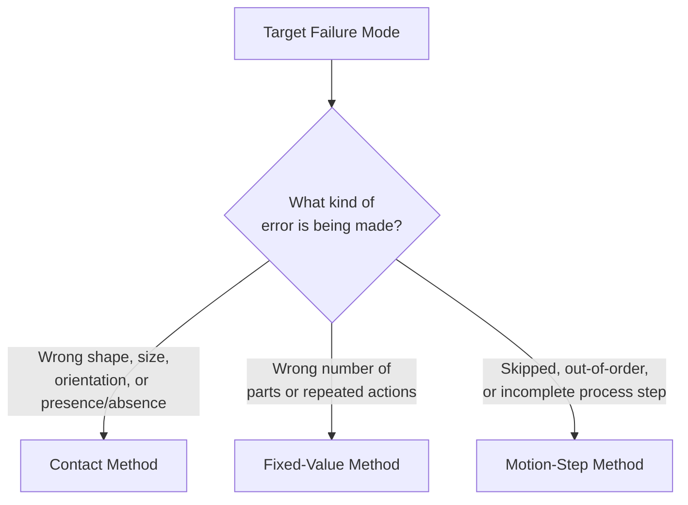
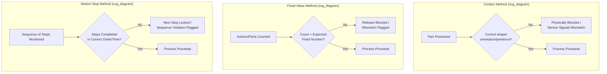

## Contact, Fixed-Value, and Motion-Step Poka-Yoke Methods

### Overview

Contact, fixed-value, and motion-step are the three detection methods Shigeo Shingo identified for how a poka-yoke device senses that an error condition exists. Every poka-yoke device, regardless of whether it is a control (shutoff) type or a warning type, relies on one of these three underlying sensing principles to determine that something is wrong. Understanding these methods independently of the control/warning classification is essential because the detection method determines *what kind of error* a given device is physically capable of catching — a contact-method device cannot detect a count error, and a fixed-value device cannot detect a shape error, so selecting the correct method for the target failure mode is the first design decision in building an effective poka-yoke.

### Contact Method

**Key Points**

- Detects an abnormality through physical contact, or absence of expected physical contact, between a sensing element and the workpiece — form, dimension, weight, position, or presence is sensed via a mechanical or proximity-based interface.
- The sensing element does not need to be a powered sensor: a purely mechanical fixture geometry (locating pins, shaped nests, guide rails) that simply will not physically accept a misoriented or wrong part is a valid, and often preferred, contact-method implementation because it requires no power, no maintenance of electronics, and cannot fail due to a sensor malfunction.
- Powered variants include limit switches, proximity switches (inductive, capacitive), photoelectric sensors detecting part presence/absence, and dimensional gauges that trigger a signal when a measured value falls outside tolerance.
- Best suited to failure modes involving: incorrect part orientation, wrong part variant substituted into an assembly, missing component, or a dimensional/form deviation large enough to be mechanically or optically distinguishable.

**Example (Passive Mechanical)**

A connector housing has two mounting holes of different diameters, positioned asymmetrically. The mating bracket has locating pins matching only that hole pattern. If an operator attempts to mount the housing in the reversed orientation, the pins physically will not align with the holes, and the part cannot be seated. No sensor, power, or logic is involved — the geometry itself is the contact-method poka-yoke.

**Example (Powered Sensor)**

A photoelectric sensor is mounted at a parts-loading station to confirm a gasket is present in a housing before the housing advances to the next station. If the sensor does not detect the gasket's reflective surface within the expected time window, the conveyor is halted. This is a contact-method poka-yoke (detecting presence/absence via a sensing interface) combined with a control (shutoff) function.

### Fixed-Value (Constant Number) Method

**Key Points**

- Detects an abnormality by counting occurrences — of parts, fasteners, cycles, or repeated actions — against a known, fixed expected quantity, and flags a deviation when the actual count does not equal the expected count.
- Applicable specifically to failure modes where the correct outcome is defined by *quantity*: too few, too many, or a mismatch between two counts that should agree (e.g., parts issued vs. parts consumed).
- Common physical implementations: electronic fastening tools (torque wrenches, screwdrivers) wired to a counter that will not release the workstation until the required cycle count is reached; kitting trays with a fixed number of cavities shaped to hold exactly the required parts, where an empty or leftover cavity is immediately visible to the eye; weigh-scale verification, where a kit or assembly's total weight is compared against the expected weight for the correct part count.
- Distinct from the contact method in that it is indifferent to *which* specific part or motion occurred — it only verifies that the *number* of occurrences matches expectation. A fixed-value device would not catch a wrong-part substitution if the substituted part still allowed the correct count to be reached; that failure mode requires a contact-method device instead.

**Example (Electronic Counting)**

A control panel assembly requires exactly eight identical terminal screws. The pneumatic screwdriver used at the station is integrated with a cycle counter; the station's "complete" signal, which releases the part to the conveyor, is wired to only activate when the counter registers exactly eight fastening cycles since the last reset. If an operator misses a screw or double-fastens one, the count will not equal eight and the part cannot be released — a control-type, fixed-value poka-yoke.

**Example (Visual/Kitting)**

A kitting tray for a sub-assembly has eight shaped cavities, each sized for one specific fastener type in its required quantity. At the end of the kitting operation, an operator visually scans the tray: any cavity still containing a part indicates a missed installation, and any empty slot that should hold a spare or excess part indicates an over-consumption. This is a fixed-value method implemented as a low-cost, non-powered visual check.

### Motion-Step (Sequence) Method

**Key Points**

- Detects an abnormality by verifying that a defined sequence of process steps or motions actually occurred, in the correct order, and (in some implementations) within the correct time window — the target failure mode is a skipped step, an out-of-sequence step, or a step performed too quickly to have been done correctly.
- Requires that each step in the sequence be independently detectable (typically via a sensor confirming that step's specific action occurred) and that the control logic enforce sequence dependency — a later step's completion signal is only accepted if the sensor for the prior required step already registered.
- Best suited to multi-step manual operations where the *correctness of individual actions* is not itself in doubt, but the risk is that an operator, under time pressure, distraction, or fatigue, skips a step entirely or performs steps out of the required order (e.g., forgetting to apply an adhesive before mating two parts, or torquing fasteners before a required alignment step).
- A time-based variant flags an abnormality if a step's duration falls below (or above) an expected range, on the reasoning that an implausibly short duration suggests the step was not actually performed, only nominally triggered.

**Example (Sequence Enforcement)**

An assembly fixture requires, in order: (1) adhesive dispensed onto a mating surface, confirmed by a dispense-volume sensor; (2) a component placed onto the adhesive, confirmed by a photoelectric presence sensor; (3) clamping pressure applied via a pneumatic actuator. The clamp's control circuit is wired so that it cannot engage unless both the dispense sensor and the placement sensor have already registered in that order. If an operator attempts to place the component and immediately reach for the clamp without the adhesive having been dispensed, the clamp will not engage, and a warning light indicates the sequence violation.

**Example (Time-Based)**

A curing station requires a minimum 12-second dwell time under a UV lamp for an adhesive bond to reach adequate strength. A light curtain and timer confirm that the assembly remained under the lamp for at least 12 seconds before the fixture will release it to the next station; if an operator removes the part early, the elapsed-time check fails and the fixture remains locked, flagging that the required cure time was not met.

### Comparative Summary

| Method | Detects | Cannot Detect | Typical Implementation |
| --- | --- | --- | --- |
| Contact | Wrong shape, size, orientation, presence/absence | Count errors; sequence errors | Locating pins, shaped fixtures, limit switches, photoelectric presence sensors |
| Fixed-Value | Wrong quantity (too few/too many) | Wrong part identity if count is still correct; sequence errors | Cycle counters on fastening tools, kitting trays, weigh-scale checks |
| Motion-Step | Skipped, out-of-order, or rushed process steps | Shape/dimension errors; count errors, unless tied to a specific step | Sequenced sensor interlocks, time-based dwell verification |

### Method Selection Considerations

**Key Points**

- The choice of detection method is driven entirely by the nature of the target failure mode, identified through root-cause analysis of an actual or potential defect (often supported by a Pareto analysis of recurring defects or a Failure Mode and Effects Analysis) — the method is not a matter of preference but of fit to the specific error being addressed.
- A single process step may require more than one detection method layered together if it is vulnerable to more than one class of error — for example, a fastening operation might combine a contact-method check (correct fastener type present, verified by a shape-matched feeder) with a fixed-value check (correct number of fastening cycles completed).
- [Inference] Combining multiple detection methods at a single station increases error-catching coverage but also increases implementation complexity and potential nuisance-stoppage rate, so the marginal value of adding a second detection layer should be weighed against the severity and frequency of the specific failure mode it targets, rather than applied uniformly to every station.
- Whichever method is selected, pairing it with a control (shutoff) regulatory function rather than a warning-only function generally yields a more robust outcome, since detection alone does not prevent the defect unless paired with an enforced response — this consideration is independent of, and layered on top of, the detection-method choice.

**Related Topics**

- Poka-yoke concepts and the control/warning classification
- Jidoka and autonomation (automatic stop on abnormality)
- Failure Mode and Effects Analysis (FMEA) for identifying poka-yoke targets
- Zero Quality Control (ZQC) and source inspection
- Standard work as the baseline sequence that motion-step poka-yoke enforces
- Andon systems and visual management for signaling detected abnormalities