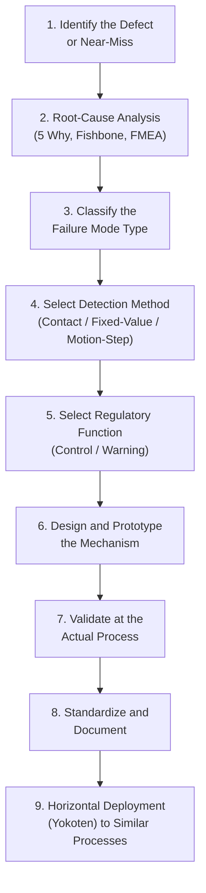

## Designing Poka-Yoke into Processes and Products

### Purpose and Scope

Designing poka-yoke into processes and products is the systematic engineering activity of translating a specific, identified failure mode into a physical, procedural, or logical mechanism that prevents or immediately detects that error. This differs from simply knowing poka-yoke's classification taxonomy (control vs. warning; contact, fixed-value, motion-step): it is the applied methodology — how to identify where poka-yoke is needed, how to select and design the specific mechanism, and how to validate and sustain it once implemented.

The design activity spans two distinct domains that require different intervention points:

- **Process-level poka-yoke**: mechanisms built into the workstation, fixture, tooling, or work sequence at the point where an operator or machine performs an action.
- **Product-level (design-for-error-proofing) poka-yoke**: features built into the product's own design — its geometry, connector keying, or component differentiation — such that an assembly error is physically impossible or immediately obvious regardless of which process or which plant assembles it.

### The Systematic Design Sequence

**Key Points**

A disciplined poka-yoke design activity generally follows a defined sequence rather than jumping directly to a mechanism. Skipping the early analytical steps is a common cause of poka-yoke devices that address a symptom rather than the actual failure mode, or that are over-engineered relative to the risk they mitigate.

1. **Identify the defect or near-miss.** The starting point is always an actual defect, a customer complaint, or an observed near-miss — not a hypothetical concern. Chronic, recurring defects captured through Pareto analysis of quality data are typically the highest-value starting point.
2. **Root-cause analysis.** Techniques such as 5 Why analysis, a fishbone (Ishikawa) diagram, or Failure Mode and Effects Analysis (FMEA) are used to trace the defect back to its actual originating condition — the specific action, omission, or ambiguity that allowed the error to occur — rather than stopping at a superficial symptom.
3. **Classify the failure mode type.** Determine whether the root cause is a shape/orientation/presence issue, a quantity issue, or a sequence/procedural issue, since this classification directly determines which detection method is applicable.
4. **Select the detection method.** Choose contact, fixed-value, or motion-step based on the failure mode classification (see the companion reference on these three methods for selection logic).
5. **Select the regulatory function.** Decide between a control (shutoff) mechanism, which is generally preferred where technically and economically feasible, and a warning mechanism, used where a full shutoff is infeasible or disproportionate to the defect's severity.
6. **Design and prototype the mechanism.** Favor the simplest, lowest-cost, most mechanically robust solution capable of reliably catching the target failure mode — Shingo's original philosophy consistently favored inexpensive, passive, low-tech solutions over complex sensor or software systems wherever a simple mechanical solution could achieve the same reliability.
7. **Validate at the actual process (genchi genbutsu).** Test the device under real production conditions, with real operators and real variation in parts and technique, rather than relying solely on a bench-test or a hypothetical scenario — a device validated only in isolation frequently reveals unanticipated interference or nuisance-triggering conditions once deployed on the line.
8. **Standardize and document.** Update the relevant standard work documentation, maintenance standards, and training materials so the device's function and maintenance requirements are captured and sustained rather than depending on institutional memory.
9. **Horizontal deployment (yokoten).** Once validated, actively assess whether the same failure mode exists at other similar processes, stations, or even other plants, and deploy the same or an adapted poka-yoke solution there — this step is what distinguishes poka-yoke as a systemic quality practice from isolated one-off fixes.

### Process-Level Design Principles

**Key Points**

- **Design at the source of the error, not downstream of it.** A poka-yoke placed at the exact station and moment where the error is physically made prevents the defective part from consuming any further processing time or resources; a poka-yoke placed several stations later (or only at final inspection) still catches the defect but after value has already been added to a bad part.
- **Prefer mechanisms that require no operator judgment.** A well-designed process-level poka-yoke does not ask the operator to notice, decide, or remember anything — the mechanism itself enforces the correct outcome. A warning light that an operator must recognize and act on is a weaker design than a fixture geometry that makes the incorrect action physically impossible.
- **Minimize added cycle time.** A poka-yoke device that meaningfully slows down the takt-time-constrained operation it protects creates a new form of loss (a Performance loss under OEE) even as it prevents a Quality loss; effective designs integrate the check into an action the operator or machine is already performing (e.g., a locating pin that also serves as the part-loading guide) rather than adding a separate verification step.
- **Design for the actual failure mode's frequency and consequence, not a worst-case-everywhere assumption.** Over-engineering a poka-yoke device for a low-frequency, low-severity error consumes design and capital resources disproportionate to the risk, and can also introduce unnecessary process friction (false triggers, added complexity, additional maintenance burden).

**Example**

At a wire-harness assembly station, operators occasionally installed a connector into the wrong of two visually similar receptacle positions, both located within reach on the same panel. Rather than adding a warning light (which depends on the operator noticing it before proceeding), the fixture was redesigned so that each receptacle position has a physically distinct connector-keying shape matching only its correct mating connector. The incorrect connector-to-receptacle pairing can no longer be physically completed — this is source-level, control-type, contact-method poka-yoke integrated directly into the existing part-loading action, adding no extra cycle time.

### Product-Level (Design-for-Error-Proofing) Principles

**Key Points**

- Product-level poka-yoke embeds error-proofing into the product's own geometry or feature set so that the protection travels with the product regardless of which plant, line, or even which customer's field-service technician handles it — this is a stronger, more durable form of error-proofing than a process-level fixture, because it does not depend on any specific downstream process retaining the protective mechanism.
- Common product-level techniques include: **asymmetric connector or component keying** (a part that can only be installed in the correct orientation because its mounting geometry is deliberately non-symmetric), **color-coding or shape-coding of otherwise visually similar components** (e.g., differently colored wiring harness connectors for circuits that must not be swapped), and **eliminating the failure-prone feature entirely through design simplification** (reducing the number of similar-looking variants, combining parts to remove an assembly step where an error could occur).
- Design-for-error-proofing decisions made during product development (and reviewed in design reviews, echoing the Maintenance Prevention philosophy applied to product rather than equipment design) are generally lower-cost and more effective than compensating for a difficult-to-assemble product design with process-level poka-yoke devices added later — this mirrors the broader principle that upstream design decisions carry more leverage than downstream compensating controls.

**Example**

A control module has two wiring harness connectors that are physically identical in size and pin count but must connect to different circuits; swapping them causes a functional failure that is difficult to diagnose after final assembly. The product is redesigned so the two connectors use different housing colors and a different key-slot position, making a swap physically impossible at the connector level — this protection exists regardless of which assembly line, shift, or even which authorized repair facility handles the module in the field.

### Balancing Poka-Yoke with Cost and Process Flow

**Key Points**

- Poka-yoke devices should be evaluated against the same Life Cycle Cost logic applied to equipment decisions under Early Equipment Management: the device's implementation and maintenance cost is weighed against the cost of the defect it prevents (scrap, rework, warranty, and — for severe failure modes — safety or regulatory consequences).
- A control (shutoff) type device introduces a new potential source of unplanned downtime if it is prone to false triggers (detecting an error condition that is not actually present) — false-trigger rate should be validated during the process-validation step, since a poorly tuned device can convert a Quality loss into a comparable or larger Availability loss (an unplanned stoppage under the Six Big Losses framework) without a net improvement.
- [Inference] The appropriate balance between error-proofing rigor and process flow impact depends on the specific defect's severity, frequency, and downstream cost, so no single ratio or threshold generalizes across all failure modes — this determination is made case-by-case, typically informed by the FMEA severity/occurrence/detection scoring used to prioritize which failure modes receive poka-yoke investment first.

### Sustaining and Auditing Poka-Yoke Devices

**Key Points**

- A poka-yoke device that has been disabled, bypassed, or has degraded over time (e.g., a worn locating pin that no longer reliably blocks a misoriented part) provides a false sense of protection that is often worse than having no device at all, since operators and supervisors may have stopped performing the manual check the device was intended to replace.
- Periodic verification that poka-yoke devices remain functional — sometimes formalized as a poka-yoke audit or included within standard work audits and autonomous maintenance inspection checklists — is necessary to sustain the intended protection over the equipment's operating life.
- Any modification to a process (a new part revision, a tooling change, a line rebalancing) should trigger a review of whether existing poka-yoke devices remain valid and effective for the changed condition, since a device designed for one part configuration may not correctly detect the equivalent error on a revised part.

**Related Topics**

- Poka-yoke concepts and classification of error-proofing devices (control vs. warning)
- Contact, fixed-value, and motion-step poka-yoke methods
- Failure Mode and Effects Analysis (FMEA) as the prioritization tool for poka-yoke investment
- Jidoka and autonomation
- Early Equipment Management and Maintenance Prevention (the parallel design-time philosophy for equipment)
- Standard work and its role in defining the correct sequence a poka-yoke enforces
- Yokoten (horizontal deployment) of kaizen improvements