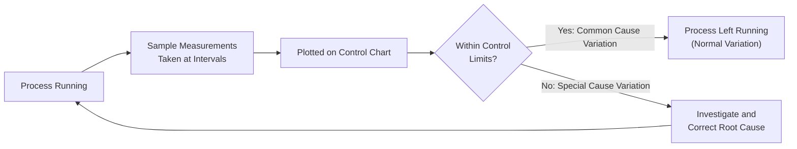
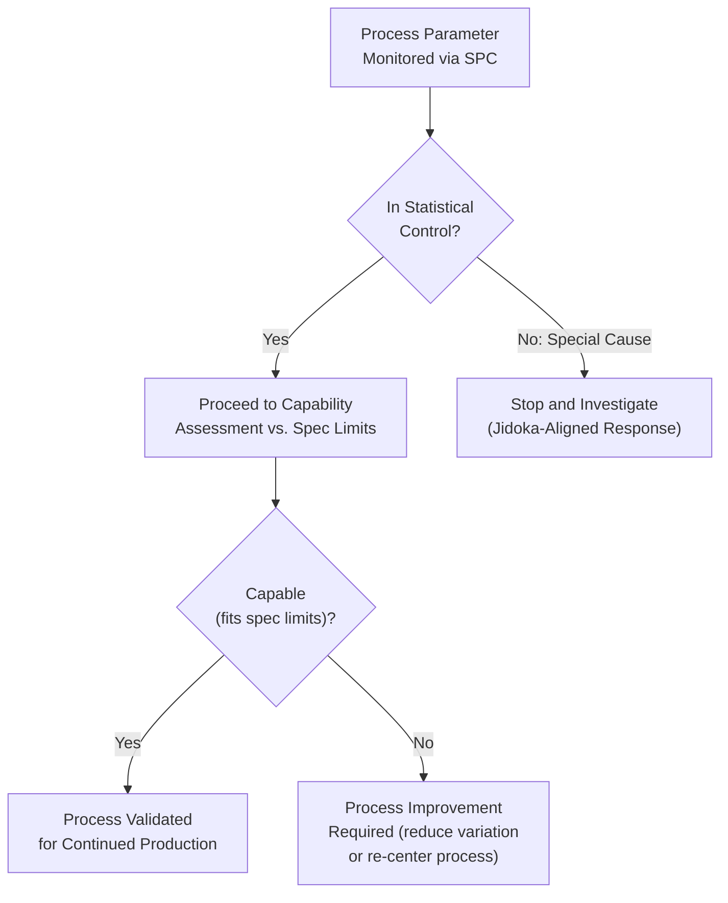

## Statistical Process Control Fundamentals in a Lean Context

### Definition and Purpose

Statistical Process Control (SPC) is a quality management method that uses statistical techniques — primarily control charts — to monitor and control a process by distinguishing between normal, expected process variation and abnormal variation that signals the process has changed in a way requiring investigation and correction. Within a lean/TPS context, SPC serves a purpose distinct from, but complementary to, poka-yoke: where poka-yoke prevents or catches an individual erroneous unit at the moment of occurrence, SPC monitors the process's underlying behavior over time, detecting drift or instability before it produces a stream of defective units.

### Position within Lean Quality Systems

**Key Points**

- SPC operates upstream of poka-yoke in the causal chain: poka-yoke catches an error after a process condition has already produced (or is about to produce) an incorrect unit, while SPC is intended to detect that the process condition itself is drifting toward producing errors, allowing correction before any defective unit is made at all.
- In TPS, SPC supports the principle of jidoka at the process level: a process exhibiting statistically abnormal variation is itself an "abnormality" that warrants investigation and, in mature implementations, a stop-and-fix response — the same logic jidoka applies to a machine detecting a defective part, extended to a machine or process detecting that its own output distribution has shifted.
- SPC is one of several tools supporting the broader lean objective of building quality into the process (jidoka/quality-at-the-source) rather than relying on end-of-line inspection to catch defects after they have already consumed processing resources.
- Distinct from 100% inspection or poka-yoke's typical unit-by-unit detection, SPC is fundamentally a sampling-based, trend-oriented method — it infers the state of the underlying process from a sample of measurements taken at intervals, rather than inspecting or gating every single unit.

### Common Cause vs. Special Cause Variation

The foundational distinction in SPC, originally articulated by Walter Shewhart and extended by W. Edwards Deming, is between two categories of process variation that require fundamentally different responses.

**Key Points**

- **Common cause variation** is the natural, inherent variation present in a stable process due to the cumulative effect of many small, ordinary sources (minor material variation, normal machine vibration, ordinary measurement variation). A process exhibiting only common cause variation is considered "in statistical control" — predictable within a known range, even though individual measurements still vary.
- **Special cause variation** is variation arising from an identifiable, specific, and typically correctable source that is not part of the process's normal operation — a tool breaking, a new batch of nonconforming raw material, an untrained operator substituting for a regular one, an equipment malfunction. A process exhibiting special cause variation is "out of statistical control" and its behavior is not reliably predictable until the special cause is identified and removed.
- A critical practical implication: adjusting a process in response to common cause variation (treating every individual data point's fluctuation as if it were a signal requiring correction) actually increases total variation — a phenomenon Deming referred to as "tampering." SPC's control limits exist precisely to prevent this by distinguishing which fluctuations warrant action and which do not.

**Example**

A machining operation's bore diameter measurements naturally fluctuate within a narrow band due to ordinary tool wear between sharpenings and minor material hardness variation — this is common cause variation, and the process is stable as long as measurements stay within the calculated control limits. If a cutting tool then fractures partway through a shift, causing a sudden, sustained shift in diameter measurements outside the control limits, this is special cause variation requiring immediate investigation and correction, not a routine process adjustment.

### Control Charts: Structure and Interpretation

**Key Points**

- A control chart plots a process characteristic (a measured value, or a summary statistic like a subgroup mean) over time, against three reference lines: the **center line** (typically the process average), the **Upper Control Limit (UCL)**, and the **Lower Control Limit (LCL)**.
- Control limits are calculated from the process's own observed variation (commonly set at ±3 standard deviations from the center line for many chart types), not from customer specification limits or engineering tolerances — this is a frequently misunderstood distinction: control limits describe what the process actually does, while specification limits describe what the customer requires, and the two are conceptually independent.
- A point falling outside the control limits, or specific non-random patterns within the limits (a run of consecutive points on one side of the center line, a clear trend, unusual cyclical patterns), are the signals interpreted as special cause variation requiring investigation — these are commonly formalized as a set of "run rules" or "Western Electric rules" in SPC training materials.
- [Inference] The specific run rules and their sensitivity vary somewhat by SPC methodology and industry convention, so the exact set of rules applied in a given implementation should be confirmed against the organization's own SPC standard rather than assumed universal.

### Common Chart Types

| Chart Type | Data Type | Typical Use |
| --- | --- | --- |
| $\bar{X}$-R chart (X-bar and Range) | Continuous (variable) data, subgrouped | Monitoring a measured dimension or characteristic using subgroup averages and ranges |
| $\bar{X}$-S chart (X-bar and Standard Deviation) | Continuous (variable) data, subgrouped | Similar to X-bar/R, preferred for larger subgroup sizes |
| I-MR chart (Individuals and Moving Range) | Continuous (variable) data, individual measurements | Used when subgrouping is impractical (e.g., low-volume or destructive testing) |
| p-chart | Attribute data (proportion defective) | Monitoring the fraction of defective units in variable-size samples |
| np-chart | Attribute data (count defective) | Monitoring the count of defective units in fixed-size samples |
| c-chart | Attribute data (count of defects) | Monitoring the number of defects per unit or inspection area, fixed sample size |
| u-chart | Attribute data (defects per unit) | Similar to c-chart, for variable-size samples |

**Example**

A process filling containers to a target weight uses an $\bar{X}$-R chart: every hour, a subgroup of five containers is weighed, the subgroup average and range are calculated and plotted. If the subgroup average chart shows a point above the UCL, or the range chart shows increasing spread, this signals that either the process center has shifted or its variability has increased, respectively — distinct diagnostic signals requiring different investigation paths.

### Process Capability in Relation to SPC

**Key Points**

- Process capability analysis (commonly expressed via indices such as $C_p$ and $C_{pk}$) answers a different question than SPC's control charts: capability asks whether a *stable* process's inherent variation fits within the customer's specification limits, while SPC's control charts ask whether the process *is* currently stable (in statistical control) at all.
- Capability analysis is only meaningful once a process has been demonstrated to be in statistical control via control charts — calculating a capability index on data from an unstable (out-of-control) process produces a misleading result, because the underlying variation being measured is not a fixed, predictable property of the process.
- $$C_{pk} = \min\left(\frac{USL - \bar{X}}{3\sigma}, \frac{\bar{X} - LSL}{3\sigma}\right)$$ is a commonly used capability index that additionally accounts for how centered the process is between the specification limits, not only its spread.
- [Inference] Specific target $C_{pk}$ thresholds (commonly cited reference values in quality literature) vary by industry, regulatory context, and the criticality of the characteristic being measured, so any single numeric target should be validated against the applicable industry or customer requirement rather than treated as universal.

### Integration with Lean Flow Principles

**Key Points**

- SPC supports the lean objective of stable, predictable processes, which is itself a precondition for reliable takt-time attainment and small-lot, low-buffer flow: a process with unpredictable output quality forces downstream buffering (extra inventory, extra inspection capacity) to absorb the uncertainty, which is a form of waste under lean principles.
- In a lean environment with short cycle times and small lot sizes, SPC sampling frequency and subgroup design must be adapted to fit the actual production rate and lot structure — a sampling plan designed for large-batch, long-run production does not directly translate to a high-mix, small-lot lean environment, and subgroup rationality (ensuring each subgroup reflects only common cause variation, not a mix of different setups or lots) requires deliberate attention in a lean context.
- SPC and poka-yoke are frequently deployed together at the same operation: SPC monitors a critical process parameter (e.g., temperature, pressure, dimension trend) for drift, while poka-yoke provides an independent, unit-level safety net that catches any individual defective unit that SPC's sampling-based, trend-oriented monitoring might not catch between sample intervals.
- Real-time or automated SPC data collection (via in-line gauging integrated with a data acquisition system) is increasingly used to reduce the lag between a special cause occurring and its detection — a manual, periodic sampling scheme has an inherent detection lag equal to the sampling interval, during which out-of-control production may continue undetected.

### Common Implementation Pitfalls in a Lean Environment

**Key Points**

- **Applying SPC to every characteristic uniformly**, rather than prioritizing critical-to-quality characteristics identified through FMEA or customer requirements — SPC has real data-collection and analysis overhead, and applying it indiscriminately dilutes attention away from the characteristics where variation actually matters most.
- **Reacting to every individual out-of-limits point as if it always warrants a full process stop**, without first confirming whether the signal reflects a genuine special cause versus, in rare cases, a measurement or charting error — though genuine special-cause signals should generally be investigated promptly, distinguishing signal from noise in the interpretation step is itself a skill requiring training.
- **Confusing control limits with specification limits** in operator training, leading to either unnecessary process adjustments (tampering) when points are within spec but near a control limit, or false confidence when a process is in control but not capable of meeting the specification.
- [Inference] The degree to which any given organization experiences these specific pitfalls depends on the maturity of its SPC training and the discipline of its data collection practices, so the prevalence of these issues is not uniform across implementations.

**Related Topics**

- Poka-yoke concepts and classification of error-proofing devices
- Process capability analysis ($C_p$, $C_{pk}$) and its relationship to control charts
- Jidoka and autonomation
- Failure Mode and Effects Analysis (FMEA) for prioritizing which characteristics to monitor
- The Six Big Losses (Defects and Rework Loss category)
- Standard work and process stability as preconditions for reliable SPC