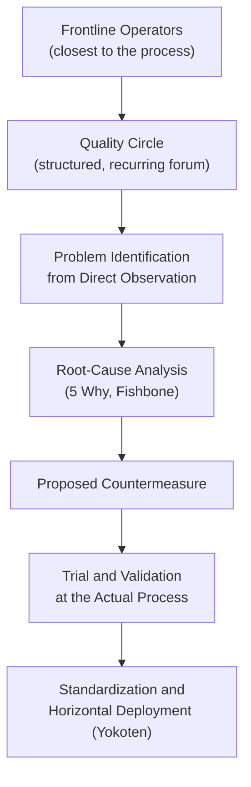

## Quality Circles and Frontline Quality Ownership

### Definition and Origin

Quality circles are small, voluntary groups of frontline employees — typically from the same work area — who meet regularly to identify, analyze, and propose solutions for quality and productivity problems within their own workplace. The quality circle movement originated in Japan in the early 1960s, associated with Kaoru Ishikawa and the Japanese Union of Scientists and Engineers (JUSE), and became a widely adopted mechanism through which Japanese manufacturers, including Toyota, institutionalized continuous improvement (kaizen) at the operator level rather than confining improvement activity to engineering or management functions.

Frontline quality ownership is the broader principle underlying quality circles: the idea that the people who perform the work are best positioned to detect, understand, and often solve the quality problems occurring in that work, and that a lean organization should structure itself to capture and act on that frontline knowledge rather than routing all quality problem-solving through specialized quality departments removed from the actual process.

### Position within TPS and Lean Culture

**Key Points**

- Quality circles are a structural expression of *respect for people*, one of the two pillars (alongside continuous improvement) commonly cited as underpinning the Toyota Production System's cultural foundation — the practice assumes operators have valuable problem-solving insight and creates a formal channel for that insight to be developed and acted upon.
- Quality circles complement, rather than substitute for, jidoka and poka-yoke: jidoka and poka-yoke are mechanisms that catch or prevent defects at the point of occurrence, while quality circles are a human organizational mechanism through which the *root causes* behind recurring defects (which poka-yoke may only be masking or containing) are investigated and addressed by the people closest to the process.
- The practice reflects the TPS principle of *genchi genbutsu* (go and see for yourself): because circle members are the operators actually performing the work, their problem analysis is grounded directly in first-hand observation of the process, rather than relying on secondhand reports or ex-post data alone.
- Frontline quality ownership is also expressed through mechanisms beyond quality circles — for example, the authority for any operator to stop the line via an andon signal when a quality abnormality is detected, which presumes and reinforces the same underlying trust in frontline judgment that quality circles formalize into a standing improvement structure.

### Structure and Operating Characteristics

**Key Points**

- Typical quality circles consist of a small number of members (commonly cited as roughly four to twelve, though group size varies by organization) drawn from the same work area, meeting on a regular but limited cadence (often weekly or biweekly, for a bounded duration per session) rather than as a continuous, full-time assignment.
- Participation is described in the originating literature as voluntary, distinguishing quality circles from a mandatory work assignment — though the degree to which participation is genuinely voluntary versus organizationally expected varies across implementations and has been a point of practical and academic discussion.
- A circle typically selects its own problem topics from issues observed in its own work area, rather than having problems assigned exclusively from above, reinforcing that the improvement agenda originates from frontline observation.
- Circles generally follow a structured problem-solving methodology for their work — commonly a Plan-Do-Check-Act (PDCA) cycle, or basic quality tools (Pareto charts, fishbone/Ishikawa diagrams, check sheets, histograms, control charts, scatter diagrams — the "seven basic quality tools" associated with the same JUSE/Ishikawa tradition) — rather than unstructured discussion.
- A facilitator or team leader (sometimes a first-line supervisor, sometimes a rotating circle member) typically guides the meeting structure and helps the group access data, resources, or cross-functional support needed to investigate a problem properly.

**Example**

A quality circle on an assembly line notices that a particular fastening step produces intermittent under-torque defects, occurring more often on the second shift than the first. Rather than waiting for the quality department to investigate, the circle uses a check sheet over two weeks to log defect occurrences by shift, time of day, and operator, then constructs a fishbone diagram to organize potential causes (material, method, machine, manpower, environment). The pattern points to a specific torque wrench that drifts out of calibration faster than others in the pool. The circle proposes a shortened calibration interval for that specific tool, trials it, confirms defect reduction, and the finding is shared with other lines using the same tool model — the horizontal deployment (yokoten) step.

### Distinguishing Quality Circles from Related Practices

**Key Points**

- Quality circles are distinct from a **kaizen event** (a time-boxed, intensive improvement workshop, often cross-functional and facilitated, targeting a specific defined problem over several consecutive days) — quality circles are an ongoing, standing structure operating at a lower intensity but sustained indefinitely, while a kaizen event is episodic and problem-specific.
- Quality circles are distinct from **autonomous maintenance** activities (structured operator-performed cleaning, inspection, and lubrication under TPM) — autonomous maintenance is a defined maintenance discipline with standardized steps, while quality circles are a general-purpose problem-solving forum that may address maintenance-related, quality-related, or productivity-related topics depending on what the group identifies.
- Quality circles are distinct from a **suggestion system** (where individuals submit improvement ideas, often for individual recognition or reward) — a quality circle is a collective, structured investigation process producing a validated countermeasure through group analysis, rather than an individual idea submitted without the group problem-solving discipline attached.

### Conditions for Effectiveness

**Key Points**

- Quality circles require management commitment to allocate time (releasing operators from production duties for circle meetings) and to act on validated recommendations — a circle whose well-analyzed proposals are consistently ignored or indefinitely delayed by management will predictably see declining engagement and eventual program failure, since the practice's credibility depends on visible follow-through.
- Effective circles require basic training in problem-solving tools (the seven basic quality tools, root-cause analysis techniques, PDCA structure) — without this training, circle discussions risk staying at the level of anecdote and opinion rather than producing data-grounded, validated countermeasures.
- Recognition for circle contributions is commonly non-monetary or modestly structured (public acknowledgment, presentation opportunities, minor incentives) in the originating Japanese quality-circle tradition, in contrast to individual monetary suggestion-system rewards — though specific recognition practices vary considerably by organization and cultural context.
- [Inference] The specific factors that determine whether a quality circle program is sustained successfully over time versus fading into inactivity are organization-specific and depend heavily on management follow-through, training quality, and whether the program is integrated into a broader continuous-improvement culture rather than run as an isolated initiative — general success factors cited in the literature should be treated as commonly observed patterns rather than guarantees.

### Relationship to Broader Frontline Ownership Mechanisms

**Key Points**

- Quality circles operate alongside other structural mechanisms that express and reinforce frontline quality ownership within a lean system: the authority to stop the line (andon) when a defect or abnormality is observed; autonomous maintenance responsibilities that give operators direct ownership of their equipment's basic condition; and standard work development processes in which operators themselves are often involved in defining and refining the standard, rather than having it imposed purely from an industrial engineering function.
- Together, these mechanisms reflect a consistent organizational design choice in TPS: rather than concentrating quality responsibility in a separate quality-control function that inspects output after the fact, responsibility for detecting, stopping, and improving upon quality problems is distributed to the point of production, with specialist functions (quality engineering, maintenance engineering) playing a supporting rather than sole-ownership role.
- This distribution of ownership is what makes frontline quality data (defect patterns, near-misses, maintenance difficulty observations) available in the first place to feed related improvement loops — for example, the Maintenance Prevention information loop (used in Early Equipment Management) depends on frontline personnel actually observing and reporting maintenance difficulty, which is the same underlying behavioral pattern that quality circles cultivate and formalize.

**Related Topics**

- Poka-yoke concepts and classification of error-proofing devices
- Jidoka, autonomation, and andon systems
- The seven basic quality tools (Pareto chart, fishbone diagram, check sheet, histogram, control chart, scatter diagram, stratification)
- Kaizen events and PDCA (Plan-Do-Check-Act) methodology
- Autonomous maintenance and the Cleaning-Inspection-Lubrication (CIL) cycle
- Standard work development and operator involvement
- Respect for people as a TPS cultural pillar