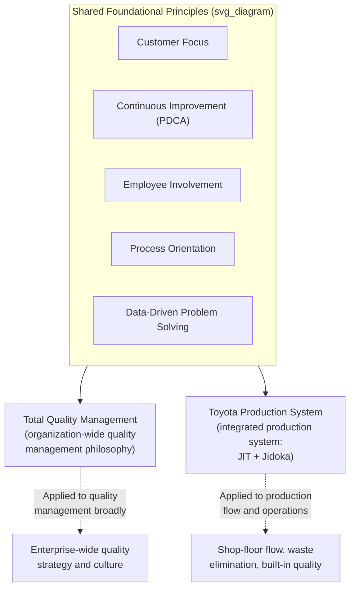

## Total Quality Management's Relationship to TPS

### Definitions and Historical Context

Total Quality Management (TQM) is a management philosophy and framework, developed through the combined influence of American quality pioneers (W. Edwards Deming, Joseph Juran, Armand Feigenbaum) and their subsequent adoption and adaptation in Japan, centered on organization-wide commitment to continuous quality improvement, customer focus, and the involvement of every employee and function in quality outcomes rather than confining quality responsibility to a dedicated inspection department.

The Toyota Production System (TPS) is a specific, integrated production management system developed primarily by Taiichi Ohno and colleagues at Toyota, built around two structural pillars — Just-in-Time (JIT) and jidoka (automation with a human touch) — supported by practices including standardized work, kaizen, heijunka (production leveling), and the broader waste-elimination and flow-optimization philosophy widely referred to today as "lean manufacturing" (a term coined by researchers studying TPS rather than by Toyota itself).

These two frameworks developed on overlapping but distinct historical tracks: TQM's intellectual lineage traces substantially through Deming's and Juran's statistical quality and management theory (introduced to Japanese industry in the 1950s), while TPS was developed within Toyota specifically as a production and flow system, later absorbing and adapting quality principles compatible with its own JIT and jidoka logic. The two are related and mutually reinforcing but are not the same framework, and TPS should not be characterized as simply "TQM applied to manufacturing" or vice versa.

### Shared Foundational Principles

**Key Points**

- **Customer focus.** Both frameworks orient quality effort toward meeting customer requirements, though TQM traditionally frames this at the organizational and strategic level (customer satisfaction as an enterprise objective), while TPS frames it operationally through the concept of the "next process is the customer" — every internal handoff between processes is treated as a customer relationship, extending the customer-focus principle down to the individual workstation level.
- **Continuous improvement.** TQM's improvement cycle is commonly structured around Plan-Do-Check-Act (PDCA), originating from Shewhart's cycle and popularized by Deming. TPS's kaizen practice uses the same underlying PDCA logic, applied specifically and continuously at the process level by the people performing the work, and reinforced through structural mechanisms like quality circles.
- **Employee involvement.** Both frameworks reject the view that quality responsibility belongs solely to a specialized quality-control function; both call for broad employee engagement in identifying and solving quality problems. TQM formalizes this through cross-functional quality teams and organization-wide training programs; TPS formalizes it through mechanisms like quality circles, andon authority, and standard work development involving the operators who perform the work.
- **Process orientation.** Both frameworks emphasize that quality is achieved by controlling and improving the process that produces an outcome, rather than relying primarily on inspecting outcomes after the fact — TQM through statistical process control and process management principles, TPS through jidoka and poka-yoke built directly into the process at the point of production.
- **Data-driven decision-making.** Both frameworks rely on the same underlying statistical and analytical toolset — the seven basic quality tools (Pareto chart, fishbone diagram, check sheet, histogram, control chart, scatter diagram, stratification), root-cause analysis methods, and process capability analysis — as the shared analytical foundation for quality problem-solving.

### Key Structural Differences

**Key Points**

- **Scope and origin.** TQM is a general management philosophy applicable across industries and functions (manufacturing, service, healthcare, government), with quality as its central organizing concept. TPS is a specific, integrated production system originating in and refined within a manufacturing context, where quality is one of several interdependent objectives pursued alongside flow, cost, and lead-time reduction — TPS does not treat quality as a standalone pursuit separable from its flow and waste-elimination objectives.
- **Mechanism of quality assurance.** TQM's classical toolset emphasizes statistical process control, quality audits, and structured quality management systems (historically associated with standards such as ISO 9000) as its primary mechanisms. TPS emphasizes jidoka and poka-yoke — mechanisms that physically prevent or immediately halt a process upon detecting an abnormality — as its primary mechanism, treating defect prevention at the source as inseparable from the physical design of the process and equipment, not solely a management-system or audit-based discipline.
- **Relationship to inventory and flow.** TQM, as a general quality philosophy, does not inherently prescribe a position on inventory levels, lot sizing, or production flow design — these are outside its core scope. TPS treats low inventory and small-lot flow as deliberately exposing quality problems (a defect surfaces and stops the line immediately, rather than being buffered and discovered downstream), meaning quality improvement and flow improvement are structurally intertwined in TPS in a way that is not inherent to TQM as a standalone framework.
- **Certification and standardization.** TQM has historically been associated with formal, certifiable quality management system standards (e.g., ISO 9001) that organizations can be externally audited against. TPS is not itself a certifiable standard — it is Toyota's internal production system, and organizations implementing "lean" practices derived from TPS do so through internal adoption and adaptation rather than external certification against a TPS standard specifically (Toyota does license and teach elements of its system through channels such as the Toyota Production System Support Center, but this is distinct from a certifiable management-system standard).

| Dimension | TQM | TPS |
| --- | --- | --- |
| Primary scope | Organization-wide quality management, cross-industry | Integrated production system, originating in manufacturing |
| Core mechanism | Statistical process control, quality audits, quality management systems | Jidoka, poka-yoke, built into process/equipment design |
| Relationship to flow/inventory | Not inherently prescribed | Central: low inventory deliberately exposes quality problems |
| Certification | Associated with certifiable standards (e.g., ISO 9001) | Not a certifiable standard; internally adopted/adapted |
| Improvement cycle | PDCA (Plan-Do-Check-Act) | Kaizen (same underlying PDCA logic, applied continuously at process level) |

### How the Frameworks Interact in Practice

**Key Points**

- Many organizations implementing lean/TPS-derived practices also maintain a formal TQM-aligned quality management system (such as ISO 9001 certification) as their overarching quality governance structure, with TPS-derived tools (poka-yoke, standard work, jidoka) serving as the specific operational mechanisms through which that system's quality objectives are achieved on the shop floor — the two are frequently used together rather than as competing alternatives.
- SPC, historically a core TQM tool, is used within a lean/TPS context in a manner adapted to lean's flow characteristics (small lot sizes, short cycle times, JIT delivery) — the underlying statistical methodology (control charts, common vs. special cause variation) is unchanged, but its application (sampling frequency, subgroup design) is adapted to fit lean production characteristics rather than the large-batch production environments in which classical SPC was originally widely deployed.
- [Inference] The degree to which a given organization's TQM program and TPS/lean implementation are integrated versus operated as separate initiatives varies considerably in practice, and the specific integration pattern (which framework provides the overarching quality governance versus which provides the operational toolset) is organization-specific rather than following a single universal model.

### A Note on Terminology and Common Misconceptions

**Key Points**

- TPS and "lean manufacturing" are often used interchangeably in practice, but strictly speaking, "lean" is the term coined by external researchers (notably associated with the MIT International Motor Vehicle Program study of the late 1980s) to describe and generalize the principles observed in TPS for broader industry adoption — TPS is Toyota's specific internal system, and "lean" is the generalized framework derived from studying it.
- TQM should not be conflated with Six Sigma, another quality-focused methodology (emphasizing statistical rigor and a defined problem-solving structure, DMAIC — Define, Measure, Analyze, Improve, Control) that emerged later and is itself sometimes integrated with lean practices under the combined banner "Lean Six Sigma" — TQM, Six Sigma, and TPS/lean are three related but historically and methodologically distinct traditions that share overlapping tools and philosophical commitments to quality and continuous improvement.
- A common misconception is that TPS's quality practices (jidoka, poka-yoke) are a subset or application of TQM; a more historically accurate characterization is that both frameworks share common intellectual roots (particularly Deming's and Juran's influence on postwar Japanese quality practice) but developed as parallel, differently-scoped traditions — TQM as a general management philosophy for quality across any organizational context, and TPS as a specific, integrated production system in which quality mechanisms are inseparable from its flow and waste-elimination architecture.

**Related Topics**

- Jidoka and autonomation as TPS's core quality mechanism
- Poka-yoke concepts and classification of error-proofing devices
- Statistical process control fundamentals in a lean context
- Quality circles and frontline quality ownership
- PDCA (Plan-Do-Check-Act) and kaizen methodology
- ISO 9001 and formal quality management system standards
- Six Sigma and DMAIC methodology
- The history and origins of "lean manufacturing" as a term