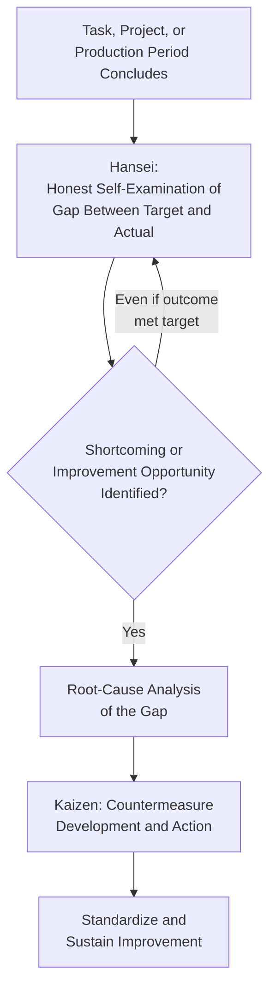

## Hansei as Structured Reflection on Failure

### Definition and Cultural Origin

Hansei (反省) is a Japanese concept, adopted as a formal management practice within the Toyota Production System, that translates roughly to "self-reflection" or "critical self-examination." Within TPS, hansei is the disciplined practice of honestly acknowledging a shortcoming, failure, or gap between intended and actual outcome, and treating that acknowledgment as the necessary starting point for genuine improvement — rather than treating a completed task, even a successful one, as closed without examination of what could have gone better.

The concept carries a cultural weight beyond a neutral "lessons learned" exercise: hansei implies genuine acknowledgment of personal or organizational responsibility for a shortfall, without deflection, minimization, or immediately pivoting to blame external factors. This distinguishes hansei, as understood within Toyota's management literature, from a purely procedural post-mortem or retrospective — the emphasis is on the sincerity and depth of the self-examination, not merely the existence of a review meeting.

### Position within TPS and the Toyota Way

**Key Points**

- Hansei is frequently paired with kaizen (continuous improvement) in descriptions of Toyota's management philosophy, with the relationship often summarized as: hansei identifies what must improve by honestly confronting the gap between target and result, and kaizen is the subsequent disciplined action to close that gap. Without genuine hansei, kaizen activity risks addressing superficial symptoms rather than acknowledged root shortcomings.
- Hansei is applied even to outcomes that were nominally successful — a project that met its target is still subject to hansei examination of *how* it was achieved, what unnecessary difficulty or waste occurred along the way, and what would be done differently. This reflects the underlying philosophy that there is always a gap between current performance and an ideal state, and that satisfaction with a successful outcome should not foreclose examination of that gap.
- The practice is described in Toyota's own management literature (notably referenced in the "Toyota Way" framework articulated by Toyota and by external researchers who have studied the company) as one of the cultural practices supporting the principle of continuous improvement, alongside genchi genbutsu (go and see for yourself) and structured problem-solving methodology.

### Hansei-kai: The Structured Reflection Meeting

**Key Points**

- Hansei is frequently formalized as a scheduled reflection meeting, sometimes referred to as *hansei-kai*, held at defined milestones — the conclusion of a project phase, a new product launch, or a defined production period — rather than only occurring informally or exclusively in response to a major failure.
- A structured hansei session typically examines: what was the intended target or standard; what actually occurred; where and why a gap exists between the two; what the root cause of that gap is (often using the same root-cause tools applied elsewhere in TPS, such as 5 Why analysis); and what specific action will be taken as a result.
- The practice is explicitly distinguished from an assignment of blame directed at individuals — while hansei requires honest acknowledgment of what went wrong, the stated purpose within TPS literature is organizational and process learning, not punitive accountability directed at a person. [Inference] The degree to which this non-punitive framing is consistently achieved in practice depends on organizational culture and leadership behavior, and is not automatically guaranteed simply by labeling a session "hansei."

**Example**

At the conclusion of a new vehicle model's production ramp-up, a hansei session is held even though the launch ultimately met its production volume and quality targets. The session examines that the ramp-up took longer than planned to reach full-rate production, identifies that a specific supplier's part variation was underestimated during planning, and documents this as a specific input to be weighed more heavily in the risk assessment for the next model's early equipment management and launch planning process.

### Distinguishing Hansei from Related Practices

**Key Points**

- **Hansei vs. a standard post-mortem/retrospective.** A conventional post-mortem or retrospective (as used in various project management traditions) is typically framed procedurally around identifying "what went well" and "what could improve," often with an emphasis on balanced or positive framing. Hansei places specific emphasis on genuine acknowledgment of shortfall and personal or team responsibility for it, and is applied even to successes, not primarily as a failure-response ritual.
- **Hansei vs. blame or punitive review.** Hansei is not intended to function as a disciplinary or blame-assigning process — its stated purpose is to surface the honest truth about a gap so that root causes can be addressed, on the premise that a process or organizational review will produce a shallow or evasive answer if participants fear individual punishment for what is disclosed.
- **Hansei vs. kaizen.** Hansei is the reflective, diagnostic phase — honestly identifying that a gap exists and understanding its nature; kaizen is the subsequent improvement action taken in response. The two are sequential and complementary rather than interchangeable: reflection without follow-through action is incomplete, and improvement action taken without honest reflection risks addressing the wrong problem.

### Relationship to Root-Cause Analysis and Problem-Solving Structure

**Key Points**

- Hansei's diagnostic phase typically employs the same analytical tools used elsewhere in TPS quality and improvement practice — 5 Why analysis to trace a surface-level shortfall back to its underlying cause, and structured problem-solving formats (such as the A3 problem-solving report format associated with Toyota's management practice) to document the target, actual condition, gap analysis, root cause, and countermeasure in a single, disciplined structure.
- The A3 report format in particular is frequently cited as the documentation vehicle through which hansei-style reflection is captured and shared: a single-page structured document (traditionally sized to A3 paper) that walks through background, current condition, goal, root-cause analysis, proposed countermeasures, and follow-up plan, making the reflective process visible and reviewable rather than existing only as an internal, undocumented judgment.
- Because hansei asks not only "what was the root cause of the shortfall" but also "what does this reveal about how we planned, decided, or executed," its scope can extend beyond the immediate technical root cause of a specific defect or delay into an examination of the planning process, risk assessment, or decision-making approach that preceded the outcome — a broader reflective scope than a narrowly technical root-cause investigation.

### Practical Implementation Considerations

**Key Points**

- Effective hansei practice depends substantially on psychological safety within the team or organization — genuine, honest self-examination of shortfalls is difficult to sustain if participants have reason to fear that candid disclosure will be used against them individually, which is why TPS literature consistently frames hansei as oriented toward organizational learning rather than individual blame.
- Hansei is described as most valuable when conducted promptly after the relevant event or milestone, while details are still fresh and specific, rather than deferred to a much later, generalized annual review where specific causal detail has been lost.
- [Inference] The specific cadence, format, and level of formality with which hansei is practiced varies across organizations that have adopted the concept from Toyota's management literature, since the practice is a cultural and managerial discipline rather than a single standardized procedure with a fixed template — organizations adapting the concept should expect to calibrate its implementation to their own context rather than assuming a single universal format exists.
- Sustaining hansei as a genuine practice, rather than a symbolic or perfunctory meeting, generally requires visible leadership modeling of the behavior — leaders who themselves openly acknowledge their own planning or decision shortfalls in these sessions reinforce that honest self-examination is safe and valued, whereas leadership that treats hansei sessions as a forum for evaluating subordinates' performance tends to undermine the candor the practice depends on.

**Related Topics**

- Kaizen and continuous improvement methodology
- The A3 problem-solving report format
- 5 Why root-cause analysis
- Genchi genbutsu (go and see for yourself)
- Quality circles and frontline quality ownership
- PDCA (Plan-Do-Check-Act) cycle
- The Toyota Way framework and its cultural principles