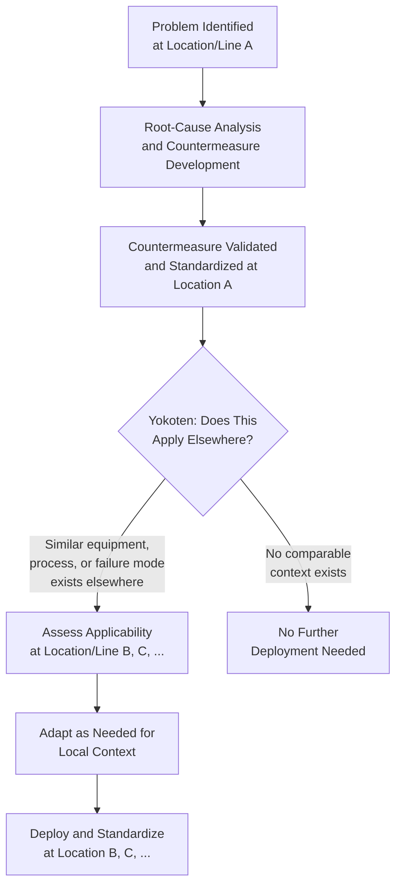

## Yokoten as Horizontal Deployment of Lessons Learned

### Definition and Etymology

Yokoten (横展, from *yoko* meaning "horizontal/sideways" and *ten* an abbreviation of *tenkai*, "deployment/expansion") is a Japanese management concept, used within the Toyota Production System and broader lean practice, referring to the deliberate, systematic sharing of a validated improvement, solution, or lesson learned at one location, line, or process to other comparable locations, lines, or processes across the organization. Where kaizen describes the act of improving a specific process, yokoten describes the distinct, subsequent discipline of ensuring that improvement's benefit is not confined to the single point where it was first developed.

The concept addresses a specific organizational failure mode: without a deliberate horizontal-deployment discipline, a validated fix for a recurring problem may remain known only to the team that solved it, while other teams facing the identical or a closely analogous problem continue to experience it, re-discover the same root cause independently, and re-invent the same or a similar countermeasure — a redundant and avoidable expenditure of problem-solving effort across the organization.

### Position within TPS Continuous Improvement Practice

**Key Points**

- Yokoten is the final step in a disciplined problem-solving and improvement sequence: identify a problem, root-cause it, develop and validate a countermeasure at the originating point, standardize it there — and then actively assess and pursue its applicability elsewhere. Omitting the yokoten step leaves the improvement cycle incomplete from an organization-wide perspective, even though the local problem has been solved.
- The practice connects directly to poka-yoke design methodology and quality circle activity, both of which explicitly include horizontal deployment as a final step: a poka-yoke device validated at one station is reviewed for applicability at any other station sharing the same failure mode; a quality circle's validated countermeasure is shared with other teams facing an analogous problem, extending the return on the circle's analytical effort beyond its own work area.
- Yokoten reflects a broader TPS/lean organizational value: knowledge generated through frontline problem-solving is treated as an organizational asset to be deliberately propagated, not merely a local fix whose benefit is left to accrue only where it happened to be developed.

### Mechanics of Effective Yokoten

**Key Points**

- **Identification of comparable contexts.** Effective yokoten requires actively scanning the organization for other locations, lines, or processes that share the same equipment type, failure mode, or process structure as the originating context — this scanning step does not happen automatically and requires either a deliberate review process or a visibility mechanism (a shared database of validated countermeasures, a periodic cross-line review meeting) that surfaces the improvement to people beyond the originating team.
- **Adaptation, not blind copying.** A countermeasure validated in one context frequently requires some adaptation before it is genuinely applicable elsewhere — differences in equipment vintage, part variant, layout, or local process constraints mean that a direct, unexamined copy of the original solution may not fit, or may even introduce new problems if applied without local validation. Yokoten is the deployment of the *underlying lesson and approach*, validated locally at each new site, rather than a mandate to install an identical physical solution everywhere without review.
- **Documentation that supports transfer.** For yokoten to function at scale, the originating improvement needs to be documented in a form that a different team, potentially with less context, can understand and apply — this is one of the reasons structured documentation formats (such as an A3 problem-solving report, or a standardized poka-yoke design record) are valued in TPS practice: they capture not just the final solution but the root-cause reasoning behind it, which is what a receiving team needs in order to judge whether and how the solution applies to their own context.
- **Organizational visibility mechanisms.** Practices that support yokoten include cross-line or cross-plant review meetings, shared best-practice repositories, and management systems that explicitly ask, as a standard step after any validated improvement, "where else does this problem exist, and has this solution been shared there."

**Example**

A quality circle at one assembly line identifies that a specific connector-keying redesign eliminates a wrong-orientation assembly error (as might be documented through the poka-yoke design process). Before yokoten, this fix would remain known only to that line. Through yokoten, the plant's improvement-tracking system flags that two other lines use the same connector family, prompting an engineering review of whether the same keying redesign applies. On investigation, one line uses a design variant where the redesign applies directly and is deployed as-is; the other line's slightly different housing geometry requires an adapted version of the same underlying keying principle, validated separately before deployment. Both lines benefit from the original root-cause insight, but neither receives a blind, unexamined copy of the original physical fix.

### Distinguishing Yokoten from Related Practices

**Key Points**

- **Yokoten vs. kaizen.** Kaizen is the act of improving a specific process at a specific point. Yokoten is the subsequent, distinct discipline of propagating a validated kaizen result to other comparable contexts — kaizen without yokoten produces isolated local improvements; yokoten multiplies the return on a single kaizen effort across the organization.
- **Yokoten vs. standardization.** Standardization (as in standard work) formalizes the correct method at a single point of use. Yokoten is the mechanism by which a newly improved standard, once validated at one location, is extended to become the standard at other comparable locations — the two concepts operate together: yokoten results in a broader footprint of standardization than would exist if each location's standard were developed in isolation.
- **Yokoten vs. simple best-practice sharing.** Generic "best practice sharing," as practiced in many organizations, can sometimes amount to a passive knowledge repository that individual teams may or may not consult. Yokoten, as understood within disciplined TPS practice, implies an active, deliberate push — someone is responsible for identifying where an improvement applies and driving its adaptation and adoption, rather than relying solely on other teams discovering and pulling the information themselves.

### Organizational Preconditions for Yokoten to Function

**Key Points**

- Yokoten depends on the existence of validated, well-documented improvements to propagate in the first place — it is downstream of, and dependent on, the same disciplined problem-solving and documentation practices (root-cause analysis, A3 reporting, poka-yoke design records) discussed elsewhere in a mature lean quality system; without rigorous local problem-solving, there is nothing substantive for yokoten to deploy.
- Cross-functional or cross-location visibility structures must exist for yokoten to occur systematically rather than by chance — this can range from informal cross-line supervisor communication in a smaller organization to formal knowledge-management systems and structured review cadences in a larger, multi-plant organization.
- [Inference] The most effective specific mechanism for enabling yokoten (informal communication networks, formal databases, scheduled cross-functional reviews, or some combination) likely depends on organizational size, geographic distribution, and existing communication culture, so no single implementation mechanism should be assumed to be universally best — the underlying discipline (actively seeking and validating applicability elsewhere) is the transferable principle, while its specific implementation mechanism is context-dependent.
- Yokoten's effectiveness is also connected to the psychological and cultural conditions discussed in relation to hansei: a team that shares a "lesson learned" is implicitly disclosing that a problem existed in the first place, so an organizational culture that treats problem disclosure punitively will tend to suppress the flow of information yokoten depends on, whereas a culture that treats problem disclosure as valued organizational learning supports it.

**Related Topics**

- Kaizen and continuous improvement methodology
- Hansei as structured reflection on failure
- The A3 problem-solving report format
- Poka-yoke concepts and classification of error-proofing devices
- Quality circles and frontline quality ownership
- Standard work and its role as the baseline that yokoten extends across locations
- Early Equipment Management and Maintenance Prevention (which relies on a comparable cross-equipment information feedback loop)