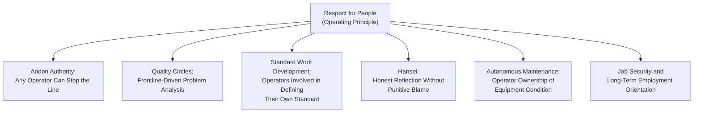

## Respect for People as an Operating Principle Rather Than a Slogan

### Definition and Position within TPS

Respect for People is one of the two foundational pillars of the Toyota Production System, standing alongside Continuous Improvement in Toyota's own articulation of its management philosophy (as formalized in the "Toyota Way 2001" internal document). Within this framework, Respect for People is not presented as a value statement or cultural aspiration existing separately from production operations — it is presented as an operating principle with specific, structural consequences for how work, authority, and problem-solving are designed on the shop floor.

The distinction this reference draws — operating principle versus slogan — matters because Respect for People is frequently mischaracterized, in secondary treatments of lean manufacturing, as a general humanistic sentiment (treating employees kindly, valuing morale) disconnected from the mechanics of the production system. Within Toyota's own framing, and in the analysis of researchers who have studied the system closely, Respect for People instead denotes specific structural commitments: that frontline workers possess valuable knowledge about their own work that management does not have direct access to, and that the production system should be designed to actively solicit, trust, and act on that knowledge — not merely to treat workers considerately while decisions are made elsewhere.

### How the Principle Manifests Structurally

**Key Points**

Respect for People, understood as an operating principle, is expressed through specific structural features of TPS rather than through a stated value alone. Several practices discussed elsewhere in a lean curriculum are, under this framing, not separate initiatives that happen to coexist with Respect for People — they are the concrete mechanisms through which the principle is operationalized.

- **Andon authority.** Granting any individual operator the authority to stop a production line upon detecting a quality abnormality is a direct structural expression of Respect for People: it presumes that the operator's judgment about an abnormality in their own immediate work is trustworthy and important enough to override the default continuation of production, rather than requiring escalation to a supervisor before action can be taken.
- **Quality circles and frontline problem-solving.** As discussed in the companion reference on quality circles, formal structures that give frontline workers standing time and a defined methodology to investigate and solve problems in their own work area operationalize the premise that the people closest to the work have insight worth systematically capturing — this is a structural commitment, not merely a stated openness to employee suggestions.
- **Operator involvement in standard work.** In mature TPS implementations, the people who perform standard work are involved in defining and refining it, rather than having a fixed method imposed exclusively by an industrial engineering function without their input — reflecting the premise that the people doing the work are positioned to identify practical issues with a proposed method that someone observing from outside the process may miss.
- **Hansei's non-punitive framing.** As discussed in the companion reference on hansei, honest organizational reflection on shortcomings depends on psychological safety — a structural precondition, not merely a cultural nicety — because genuine disclosure of problems requires trust that disclosure will not be used against the discloser.
- **Autonomous maintenance and operator ownership.** Assigning operators direct responsibility for the basic condition of their own equipment (cleaning, inspection, lubrication) reflects a design choice to distribute ownership and competence broadly rather than concentrate all equipment expertise in a separate maintenance function, treating operators as capable of and responsible for meaningful technical judgment about their own equipment.
- **Long-term employment orientation.** Toyota's historical emphasis on long-term employment stability (particularly pronounced in its Japanese operations) is frequently cited as both an expression of and a precondition for Respect for People as an operating principle: an organization that expects a worker's tenure to be short has structurally weaker incentive to invest in that worker's deep skill development, judgment, and long-horizon problem-solving capability — capabilities the other mechanisms above depend on.

### Distinguishing "Operating Principle" from "Slogan" in Practice

**Key Points**

- A slogan-level treatment of Respect for People typically manifests as posted value statements, occasional recognition events, or general management courtesy — practices that can coexist with, but do not by themselves constitute, structural change to how authority and knowledge flow through the production system.
- An operating-principle-level treatment is testable by specific, falsifiable questions about system design: Does an individual operator actually have the authority to stop the line, or does the andon cord exist but escalation is discouraged in practice? Are quality circle recommendations that are well-analyzed actually acted upon by management, or do they accumulate without follow-through? Is hansei genuinely used for organizational learning, or does candid disclosure in practice lead to individual consequence? The presence of the *labeled* practice (an andon cord installed, a quality circle scheduled) does not by itself confirm the operating-principle-level commitment — the test is whether the structural authority and follow-through genuinely function as designed.
- [Inference] The gap between a stated commitment to Respect for People and its consistent structural implementation is a commonly discussed risk in lean-implementation literature, particularly when organizations adopt individual lean tools (kanban boards, 5S, kaizen events) without the accompanying shift in management behavior and authority distribution that the tools presuppose — this pattern is frequently referred to informally as adopting the "tools" of lean without the underlying "system" or "culture," though the specific terminology and framing vary across sources.

### Relationship to Continuous Improvement (the Other TPS Pillar)

**Key Points**

- Respect for People and Continuous Improvement are presented in Toyota's own framework as mutually dependent rather than independent pillars: Continuous Improvement (kaizen, PDCA, standardized-work refinement) requires that the people closest to a process are trusted to identify problems and propose changes — which is precisely the premise Respect for People establishes. Conversely, Respect for People without a disciplined improvement methodology risks becoming an unfocused cultural sentiment without a mechanism for translating trust into concrete operational gains.
- This interdependence explains why isolated adoption of Respect-for-People-associated practices (for example, installing andon cords) without the accompanying management behavior of taking every stop seriously and supporting the underlying investigation tends to produce a hollow implementation: the structural mechanism exists, but the operating principle it was meant to express is not actually functioning, because the improvement follow-through half of the relationship is missing.

### Common Points of Confusion

**Key Points**

- Respect for People is sometimes conflated with general employee satisfaction or workplace morale programs; while a well-functioning implementation of the principle likely correlates with higher morale and engagement, the principle itself is specifically about the structural distribution of authority, trust, and problem-solving responsibility, not primarily a morale-management initiative.
- Respect for People is sometimes assumed to imply an absence of standardized, disciplined work methods (on the reasoning that standardization constrains worker autonomy). Within TPS, however, standard work and Respect for People are treated as compatible and mutually reinforcing: standard work is intended to be developed with meaningful input from the people who perform it (an expression of respect for their expertise) and to serve as a stable baseline from which kaizen improvements are proposed by those same workers, rather than being an externally imposed constraint disconnected from worker input.
- [Inference] The specific balance between structural standardization and worker autonomy that constitutes a genuine implementation of Respect for People, as opposed to either excessive rigidity or an absence of needed discipline, is a matter of ongoing practical judgment within any given organization rather than a fixed formula specified by TPS theory itself.

**Related Topics**

- Continuous improvement (kaizen) as the complementary TPS pillar
- Jidoka, autonomation, and andon authority
- Quality circles and frontline quality ownership
- Hansei as structured reflection on failure
- Standard work development and operator involvement
- Autonomous maintenance and the Cleaning-Inspection-Lubrication (CIL) cycle
- The Toyota Way framework and its cultural principles