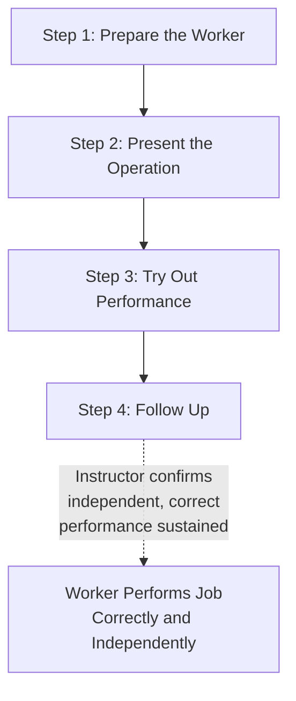

## Training Within Industry and the Job Instruction Module

### Historical Origin

Training Within Industry (TWI) is a training program developed in the United States during World War II, administered by the U.S. War Manpower Commission's TWI Service (active roughly 1940–1945), created to rapidly develop effective supervisory skills in the wartime manufacturing workforce, which had expanded quickly with large numbers of new, inexperienced workers and supervisors. TWI's importance to lean manufacturing history lies in its subsequent adoption: following World War II, TWI programs were introduced into Japanese industry during the postwar reconstruction period (via the Civil Communications Section and related occupation-era industrial programs), where they were adopted and integrated deeply into Japanese manufacturing management practice, including at Toyota. Standardized work and structured job instruction methodology within TPS draw substantially on TWI's Job Instruction module, making TWI one of the direct historical antecedents of practices now closely associated with lean manufacturing.

TWI consisted of three core modules, each addressing a distinct supervisory skill: **Job Instruction (JI)** — how to teach a job to a worker correctly, safely, and conscientiously; **Job Methods (JM)** — how to critically analyze and improve a job's method; and **Job Relations (JR)** — how to handle people and resolve workplace problems effectively. Of these three, Job Instruction has the most direct and well-documented lineage into TPS's standardized work and training practices.

### The Job Instruction Module: Purpose and Structure

**Key Points**

- Job Instruction addresses a specific, narrow problem: how does a supervisor or experienced worker effectively transfer a job skill to another person, such that the second person performs the job correctly, safely, and consistently — as opposed to training methods that rely on informal, unstructured demonstration ("watch me do it") that frequently fails to transfer tacit knowledge completely or consistently.
- The JI methodology is built on a foundational premise, stated directly in the original TWI materials: "If the worker hasn't learned, the instructor hasn't taught." This reframes training failure as a teaching-method problem to be corrected through better instructional technique, rather than attributing it to the trainee's aptitude or attentiveness — a framing consistent with TPS's broader tendency to locate the cause of a process failure in the system or method rather than in individual worker deficiency.
- JI is structured around a defined four-step teaching method, itself broken into preparatory and instructional phases, designed to be applied consistently by any supervisor trained in the method, regardless of the specific job being taught.

### The Four-Step Job Instruction Method

**1. Prepare the Worker**

**Key Points**

- The instructor puts the learner at ease, states the job and finds out what the learner already knows about it, gets the learner interested in learning the job, and places the learner in the correct position to observe the operation clearly.
- This preparatory step exists to address the reality that a learner who is anxious, uninterested, or physically unable to see the operation clearly will absorb instruction poorly regardless of how well the subsequent demonstration steps are executed — the step is not a formality but is treated as a precondition for effective transfer.

**2. Present the Operation**

**Key Points**

- The instructor performs the job at the normal work pace, explaining what is being done, why each step is done that way, and how to do it — critically, breaking the job down into its **important steps** and, for each important step, identifying the associated **key points**.
- An "important step" is a logical segment of the job that advances the work; a "key point" is anything within that step that could (a) make or break the job, (b) injure the worker, or (c) make the work easier to do (a "knack," trick, or timing detail that an experienced worker may perform automatically without realizing it is a distinct, teachable point). Identifying key points explicitly is what TWI's methodology considers the critical differentiator between a job instruction that transfers real competence and one that merely shows the visible motions.
- The presentation is typically repeated multiple times at the normal pace, with the level of explanation increasing on each repetition (first showing the operation, then explaining the important steps, then explaining the key points and reasons behind them), rather than attempting to convey everything in a single pass.

**3. Try Out Performance**

**Key Points**

- The learner performs the job while the instructor corrects errors, having the learner explain the important steps (and, in a subsequent repetition, the key points) while performing the job — verbalizing the steps while performing them is used specifically to confirm the learner has genuinely absorbed the structure of the job, not merely memorized a physical motion sequence they could not otherwise account for.
- The instructor continues this supervised practice until confident the learner both knows the job and can perform it correctly — the criterion for advancing past this step is the instructor's direct confirmation of competence, not a fixed time allotment or a single successful repetition.

**4. Follow Up**

**Key Points**

- The learner is put on their own, but the instructor designates whom the learner should ask for help if needed, and checks on the learner frequently in the initial period after training, tapering supervision as competence is confirmed over time.
- This step exists to address a documented failure mode of less structured training approaches: a learner may perform correctly under direct observation during training but drift into an incorrect or unsafe method once left unsupervised, particularly under production pressure — the follow-up step is designed specifically to catch and correct this drift before it becomes habitual.

### Job Breakdown Sheets

**Key Points**

- TWI's Job Instruction method is typically supported by a **Job Breakdown Sheet** — a structured document prepared by the instructor in advance of teaching a job, listing the important steps of the operation in sequence, alongside the key points for each step and the reasons behind those key points.
- The Job Breakdown Sheet serves as the direct preparatory tool for step 2 (Present the Operation): it forces the instructor to have already analyzed and organized the job's structure before attempting to teach it, rather than improvising an explanation in real time, which the TWI methodology identifies as a common source of incomplete or inconsistent training.
- The structural resemblance between a TWI Job Breakdown Sheet and a modern **standardized work instruction sheet** used in TPS-derived training practice is close and is widely acknowledged in lean-history literature as a direct historical lineage: both documents decompose a job into sequential steps, and both explicitly call out points requiring particular attention (key points in TWI terminology; often labeled similarly, or as quality/safety points, in standardized work documentation) — the modern standardized work instruction sheet used to train new operators on a given station is, in structural terms, a direct descendant of the TWI Job Breakdown Sheet.

**Example**

A Job Breakdown Sheet for a manual component insertion operation lists the important step "Insert component into housing" and, for that step, a key point noting "align the beveled edge toward the operator before inserting — inserting with the bevel reversed causes the component to bind and can damage the housing." This key point captures a piece of tacit knowledge (the correct bevel orientation and the reason it matters) that an experienced operator might perform automatically without consciously narrating it, and which a learner would be unlikely to discover reliably through unstructured observation alone.

### Relationship to Standard Work and TPS Training Practice

**Key Points**

- TPS's practice of training new operators against a documented standard work instruction sheet, with a qualified trainer demonstrating the correct method, having the trainee perform it under supervision, and following up after the trainee begins independent work, closely mirrors the TWI Job Instruction four-step structure — this is not coincidental but reflects TWI's documented direct historical influence on postwar Japanese manufacturing training practice.
- The TWI principle of explicitly identifying "key points" — the specific details within a step that affect quality, safety, or ease of performance — parallels the standardized work practice of documenting specific quality checkpoints and safety considerations within a work instruction, rather than describing an operation only as a generic sequence of motions.
- [Inference] While the historical connection between TWI and the development of Japanese manufacturing training practice, including at Toyota, is well documented in lean-history scholarship, the precise degree to which specific elements of Toyota's current standardized work and training documentation directly derive from TWI methodology versus having evolved independently or through other influences is a matter better addressed by specific historical scholarship than asserted definitively here.

### Contemporary Relevance

**Key Points**

- TWI's Job Instruction methodology has seen renewed interest and application within contemporary lean manufacturing implementations, sometimes reintroduced explicitly as "TWI" training programs distinct from, but complementary to, standard work documentation practices, particularly in organizations seeking to strengthen the quality and consistency of frontline operator training.
- The core diagnostic value of the JI framework — its emphasis on explicitly identifying key points (the tacit knowledge points that experienced workers may not realize they are relying on) — remains directly applicable to any effort to document standard work thoroughly, since an incompletely documented standard (one that captures the sequence of motions but omits the key points that make the job succeed or fail) is a common practical failure mode in standardized work implementation.

**Related Topics**

- Standardized work and standard work instruction sheets
- Job Methods and Job Relations (the other two TWI modules)
- Quality circles and frontline quality ownership
- Respect for people as an operating principle
- The historical origins of the Toyota Production System
- On-the-job training (OJT) methodology more broadly