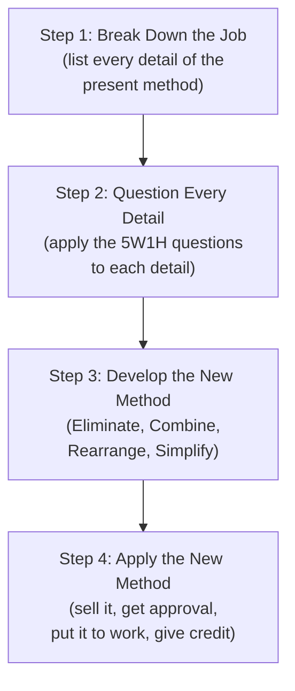

## Training Within Industry and the Job Methods Module

### Historical Origin and Position within TWI

Job Methods (JM) is the second of the three core Training Within Industry (TWI) modules, developed during World War II by the U.S. War Manpower Commission's TWI Service alongside Job Instruction (JI) and Job Relations (JR). Where Job Instruction addresses how to teach an existing job method correctly, Job Methods addresses a distinct and prior question: how to critically examine a job's current method and systematically improve it — making Job Methods the direct historical antecedent of what is now recognized within TPS and lean manufacturing as structured kaizen and method-improvement practice, applied specifically by supervisors and workers at the point of production rather than by a separate industrial engineering function alone.

As with Job Instruction, Job Methods was introduced into Japanese industry during the postwar occupation period and was adopted and integrated into Japanese manufacturing management practice, including at Toyota, where its underlying logic — a structured, repeatable procedure for questioning and improving a current method — parallels the disciplined approach to kaizen that later became closely associated with TPS.

### Purpose and Underlying Premise

**Key Points**

- Job Methods was developed to address a specific wartime production problem: with output demands rising rapidly and skilled industrial engineering resources limited, supervisors and lead workers needed a simple, teachable, repeatable procedure for improving job methods themselves, rather than depending exclusively on specialized methods-engineering staff to identify and implement every improvement.
- The foundational premise of JM, consistent with the broader TWI philosophy, is that meaningful, practical improvement ideas can and should come from the people closest to the job — the same premise that later became formalized in TPS as a structural expression of Respect for People, and operationalized through mechanisms such as quality circles.
- JM emphasizes improving the *existing* method using available resources, rather than requiring new equipment or major capital investment — the method breakdown and improvement procedure is explicitly designed to surface improvements achievable through better sequencing, elimination of unnecessary steps, and better arrangement of the current workplace, tools, and materials.

### The Four-Step Job Methods Procedure

Job Methods is structured around a four-step procedure, applied to a specific job whose method the supervisor or worker wishes to improve.

**Step 1: Break Down the Job**

**Key Points**

- The current method is decomposed into every individual detail involved in performing the job — not only the "important steps" identified in Job Instruction's job breakdown, but every constituent motion, handling action, inspection, and delay, listed in the exact order they currently occur.
- This exhaustive listing is deliberately granular: the JM methodology holds that improvement opportunities are frequently found in details so small or habitual (an unnecessary reach, a redundant inspection, an avoidable walk) that they are invisible unless the job is broken down to this level of detail and examined systematically rather than viewed only at the level of its overall sequence.

**Step 2: Question Every Detail**

**Key Points**

- Every single detail listed in Step 1 is questioned using a structured set of questions, commonly summarized as the "5W1H" framework: Why is it necessary? What is its purpose? Where should it be done? When should it be done? Who is best qualified to do it? How is the best way to do it?
- The questioning is applied systematically to *every* detail without exception, including details that appear obviously necessary — the discipline of the method lies precisely in not allowing an assumption of necessity to exempt a detail from scrutiny, since habitual or historically-inherited steps frequently persist without anyone having recently questioned whether they remain necessary.
- This structured questioning discipline parallels, and is historically antecedent to, the "5 Why" root-cause analysis technique widely used in TPS problem-solving — both rely on repeated, structured questioning to surface underlying causes or unnecessary elements that a single surface-level review would miss, though 5 Why (repeatedly asking "why" to trace causation) and JM's 5W1H (a broader set of questions applied to method details) are related but distinct techniques with different specific purposes.

**Step 3: Develop the New Method**

**Key Points**

- Based on the answers to the questioning in Step 2, the new method is developed by applying four specific actions to the job's details: **Eliminate** unnecessary details entirely; **Combine** details where possible; **Rearrange** details for a better, more logical sequence; and **Simplify** the necessary details that remain (making them easier, safer, or faster to perform).
- This Eliminate-Combine-Rearrange-Simplify (ECRS) framework is frequently cited directly in lean and industrial engineering literature as a foundational method-improvement heuristic, and is recognizable as a direct conceptual ancestor of the waste-elimination logic embedded throughout TPS and lean practice — the seven (or eight) categories of waste (muda) identified in TPS represent specific categories of unnecessary detail that the Eliminate step of JM's ECRS framework would target for removal.
- The new method is developed with full participation and input from the workers who actually perform the job, consistent with TWI's foundational premise that those closest to the work possess essential knowledge for identifying what is truly necessary versus habitual.

**Step 4: Apply the New Method**

**Key Points**

- The final step addresses implementation, not merely design: the supervisor must "sell" the new method to those affected by it (workers, other supervisors, and, if applicable, workers' representatives), obtain necessary approvals (from safety, quality, or engineering functions as applicable), and put the new method into actual use.
- The final sub-step, "give credit where credit is due," explicitly instructs the supervisor to recognize the contribution of any worker whose observation or suggestion informed the improvement — a specific, deliberate mechanism supporting sustained worker engagement in future method-improvement efforts, since workers who see their contributions acknowledged are more likely to continue contributing improvement ideas.
- Sustaining the new method also requires updating the associated training documentation and standard — connecting Job Methods directly back to Job Instruction: an improved method that is not reflected in the job breakdown sheet and subsequent training will not be reliably transferred to new workers or maintained consistently across the workforce.

### Comparison to Job Instruction and to TPS Kaizen Practice

| Aspect | Job Instruction (JI) | Job Methods (JM) | TPS Kaizen (as generally practiced) |
| --- | --- | --- | --- |
| Core question | How do I teach the current correct method effectively? | How do I improve the current method? | How do I continuously improve the current standard? |
| Output | A trained worker performing the existing standard correctly | An improved method, to be documented and trained | An improved standard, incorporated into standard work |
| Key tool | Job Breakdown Sheet (important steps + key points) | Detailed method breakdown + 5W1H questioning + ECRS | Various (5 Why, fishbone diagram, A3, PDCA) |
| Relationship to standard work | Trains against the current standard | Produces the input for a revised standard | Continuously revises the standard over time |

**Key Points**

- Job Methods and Job Instruction are sequentially linked in a complete improvement cycle: JM produces an improved method; JI is then the mechanism by which that improved method is correctly and consistently taught to the workforce — an improved method that is never properly instructed risks being performed inconsistently or incorrectly despite being objectively superior on paper.
- This JM-then-JI sequence closely parallels the TPS practice of updating standard work following a kaizen improvement and then retraining operators against the revised standard, reflecting the well-documented historical continuity between TWI methodology and TPS practice.
- [Inference] While the historical influence of TWI's Job Methods procedure on the development of structured kaizen practice within Japanese manufacturing, including at Toyota, is documented in lean-history scholarship, the precise mechanisms and extent of this specific influence relative to other contributing factors (such as Deming's and Juran's quality theory, and internally developed Toyota practice) is a matter better addressed through dedicated historical scholarship than definitively characterized here.

### Contemporary Relevance and Limitations

**Key Points**

- The Eliminate-Combine-Rearrange-Simplify (ECRS) framework from Job Methods remains in active use today, both explicitly under its TWI name in organizations that have reintroduced formal TWI training, and implicitly as a widely taught method-improvement heuristic within industrial engineering and lean training more broadly.
- Job Methods, as originally conceived, focuses primarily on the method-level detail of an individual job — it is well suited to identifying and eliminating unnecessary motion, handling, and sequencing waste within a single operation, but does not by itself address broader system-level flow issues (line balancing, inventory buffering, changeover strategy) that require the wider toolset of lean/TPS practice (value stream mapping, SMED, heijunka) to analyze and improve.
- [Inference] The relative emphasis an organization places on formal, explicitly-labeled TWI training versus equivalent method-improvement content delivered through general lean or kaizen training programs varies by organization, and both paths can in principle deliver comparable underlying skills, though the specific terminology and structured procedure differ.

**Related Topics**

- Training Within Industry and the Job Instruction module
- Job Relations (the third TWI module)
- Kaizen and continuous improvement methodology
- The eight wastes (muda) in lean manufacturing
- Quality circles and frontline quality ownership
- Standardized work and its relationship to method improvement
- 5 Why root-cause analysis