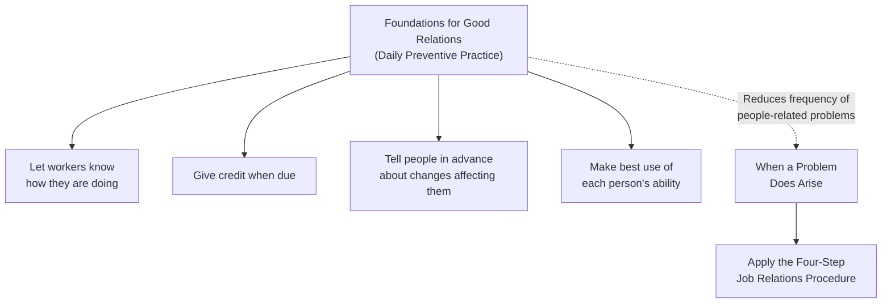
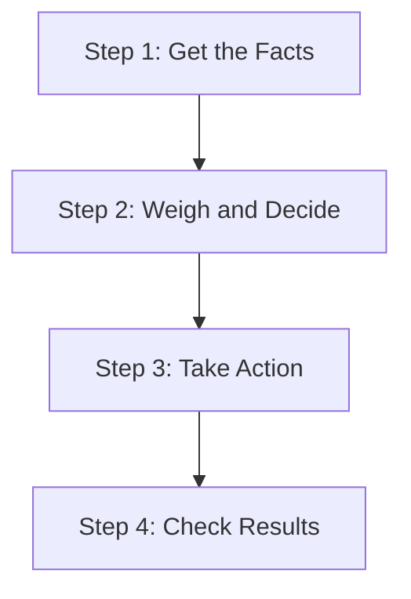

## Training Within Industry and the Job Relations Module

### Historical Origin and Position within TWI

Job Relations (JR) is the third of the three core Training Within Industry (TWI) modules, developed during World War II by the U.S. War Manpower Commission's TWI Service alongside Job Instruction (JI) and Job Methods (JM). Where Job Instruction addresses how to teach a job correctly and Job Methods addresses how to improve a job's method, Job Relations addresses a distinct concern: how a supervisor should handle people and resolve workplace problems effectively — specifically, how to prevent people-related problems from arising through good daily practice, and how to systematically diagnose and resolve such problems when they do occur.

As with the other two TWI modules, Job Relations was introduced into Japanese industry during the postwar occupation period and was adopted into Japanese manufacturing management practice, including at Toyota, where its structured, non-arbitrary approach to handling workplace problems is consistent with — and a plausible historical contributor to — the disciplined, root-cause-oriented approach to people-related issues found in later TPS management practice, including the emphasis on psychological safety underlying hansei and the trust-based structural commitments underlying Respect for People.

### Purpose and Underlying Premise

**Key Points**

- Job Relations was developed on the premise that supervisory success depends substantially on a supervisor's ability to work effectively with people — not only on technical competence in the job itself — and that this relational skill, like job instruction and method improvement, can be taught through a structured, repeatable procedure rather than being treated as an innate trait some supervisors simply have and others lack.
- The foundational statement of the JR module, paralleling JI's "if the worker hasn't learned, the instructor hasn't taught," is generally summarized as: people must be treated as individuals, and supervisors get results through people. This framing positions effective people-handling as a core supervisory responsibility and skill, not a secondary or optional consideration relative to technical production duties.
- JR distinguishes between **foundations for good relations** (proactive daily practices intended to prevent problems from arising) and a **structured procedure for handling a problem** once one has occurred — reflecting a broader pattern found elsewhere in TWI and later TPS practice of pairing preventive discipline with a systematic response method for when prevention has not been sufficient.

### Foundations for Good Relations

**Key Points**

TWI's Job Relations material specifies foundational practices intended to build the kind of ongoing relationship with workers that prevents many problems from arising in the first place, commonly summarized as four foundational commitments:

1. **Let each worker know how they are doing.** Workers should receive regular, honest feedback on their performance, rather than being left to guess or receiving feedback only when something goes wrong.
2. **Give credit when due.** Recognition for good work should be given promptly and specifically, reinforcing desired performance.
3. **Tell people in advance about changes that will affect them.** Workers should be informed ahead of changes to their job, work area, or conditions, rather than being confronted with a change without warning — a practice intended to reduce the anxiety, resistance, and mistrust that unexplained or unannounced changes tend to generate.
4. **Make the best use of each person's ability.** Supervisors should actively seek to understand each worker's capabilities and assign responsibilities that draw on and develop those capabilities, rather than treating workers as interchangeable.

### The Four-Step Job Relations Procedure

When a people-related problem does arise despite the foundational preventive practices, Job Relations specifies a structured, four-step procedure for handling it — deliberately designed to prevent a supervisor from reacting hastily or acting on an incomplete or emotionally-charged first impression of the situation.

**Step 1: Get the Facts**

**Key Points**

- The supervisor reviews the record, finds out what rules and plant customs apply, talks with the individuals concerned, and deliberately gets opinions and feelings as well as objective facts — the explicit inclusion of feelings alongside facts reflects the recognition that a person's perception of a situation, even where it diverges from an objective account, is itself a real factor shaping the problem and its resolution.
- The supervisor is instructed to be certain they have the whole story before proceeding to the next step — this step exists specifically to counter the tendency to act on a partial account, a single party's version of events, or an initial assumption formed before full investigation.

**Step 2: Weigh and Decide**

**Key Points**

- The gathered facts are fitted together, and the supervisor considers how the facts relate to one another, what possible actions exist, and what the effect of each possible action would be — the emphasis is on considering multiple possible responses and their likely consequences before committing to one, rather than defaulting to the first plausible-seeming response.
- This step explicitly directs the supervisor to check practices and policies for consistency (ensuring the response is consistent with how similar situations have been or should be handled) and to consider the objectives of the organization as well as the impact on the individual — balancing fairness and consistency against the specific circumstances of the case at hand.

**Step 3: Take Action**

**Key Points**

- The supervisor decides whether the problem is one they are equipped to handle themselves or whether it needs to be referred elsewhere (to a higher level of supervision, a specialized function, or, where applicable, a formal grievance or human-resources process), and then takes the determined action, paying attention to timing.
- This step includes explicit caution against a supervisor "passing the buck" (referring a problem elsewhere as a way of avoiding a decision within their own authority) while also acknowledging that some problems genuinely exceed a given supervisor's authority or expertise and require appropriate escalation — the distinction being whether the referral is a genuine matter of appropriate authority versus an avoidance of legitimate supervisory responsibility.

**Step 4: Check Results**

**Key Points**

- The supervisor follows up after taking action: checking how soon and how often the situation should be reviewed, watching for changes in output, attitudes, and relationships, and being alert to whether the action taken actually resolved the underlying problem or only addressed a surface symptom.
- This follow-up step parallels the follow-up step of the Job Instruction four-step method and reflects a consistent structural pattern across TWI's three modules: none of the three procedures treats the initial corrective action as sufficient in itself — each requires deliberate verification afterward that the intended outcome was actually achieved and sustained.

### Relationship to TPS Human-Systems Practice

**Key Points**

- Job Relations' structured, fact-based, non-reactive approach to handling workplace problems parallels the disciplined, root-cause-oriented approach found in TPS problem-solving methodology more broadly (5 Why, A3 reporting) — both traditions share an underlying discipline of resisting a premature or superficial response in favor of gathering sufficient information before acting.
- The JR foundational practice of "telling people in advance about changes affecting them" and the broader emphasis on treating workers as individuals whose perspective and feelings matter are consistent with, and plausibly contributory to, the trust-based structural commitments later formalized within TPS as Respect for People — both traditions position the supervisor's obligation to genuinely engage with worker perspective as a core professional responsibility rather than an optional courtesy.
- The non-punitive orientation embedded in JR's "Get the Facts" step (deliberately seeking a complete, multi-perspective account before judgment, including the affected individual's own account and feelings) parallels the psychological-safety precondition discussed in relation to hansei — both traditions recognize that a rushed or one-sided judgment tends to produce a worse outcome, and often a less honest account from those involved, than a more deliberate, fact-gathering approach.
- [Inference] As with the other two TWI modules, the precise degree to which Job Relations specifically, as opposed to other contributing historical influences, shaped the development of Toyota's own approach to workplace problem-handling and its broader Respect for People principle is a matter for dedicated historical scholarship rather than a claim that can be established definitively here — the parallel in underlying structure and philosophy is well documented, but a direct causal lineage for every specific practice should not be overstated.

### Comparison Across the Three TWI Modules

| Module | Core Question | Structured Procedure | TPS/Lean Parallel |
| --- | --- | --- | --- |
| Job Instruction (JI) | How do I teach a job correctly? | Prepare, Present, Try Out, Follow Up | Standardized work training |
| Job Methods (JM) | How do I improve a job's method? | Break Down, Question, Develop, Apply | Kaizen and ECRS-style method improvement |
| Job Relations (JR) | How do I handle people and workplace problems? | Get the Facts, Weigh and Decide, Take Action, Check Results | Respect for People; hansei's fact-based, non-punitive reflection |

### Contemporary Relevance

**Key Points**

- Job Relations' structured problem-handling procedure remains directly applicable to contemporary front-line supervisory training, and organizations reintroducing formal TWI programs frequently include JR alongside JI and JM as a complete supervisory skill set, on the premise that technical training (JI, JM) alone is insufficient without the interpersonal and problem-resolution competence JR addresses.
- [Inference] The specific degree to which a given organization's supervisory training program explicitly labels and teaches JR content under the TWI name, versus covering comparable interpersonal and conflict-resolution skills through other management training frameworks, varies by organization, and the underlying competencies (fact-based problem diagnosis, timely and appropriately-escalated action, and follow-up) can in principle be developed through multiple training traditions, not exclusively through formal TWI programs.

**Related Topics**

- Training Within Industry and the Job Instruction module
- Training Within Industry and the Job Methods module
- Respect for people as an operating principle rather than a slogan
- Hansei as structured reflection on failure
- Quality circles and frontline quality ownership
- Standardized work and operator involvement in its development