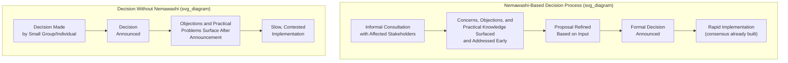

## Nemawashi as Building Consensus Before Deciding

### Definition and Etymology

Nemawashi (根回し) is a Japanese term, adopted as a formal management concept within the Toyota Production System and broader Japanese business practice, that literally translates to "going around the roots" — an agricultural metaphor referring to the horticultural practice of carefully preparing a tree's root ball, working the soil around it gradually, before transplanting it, so that the tree survives the move rather than dying from the shock of an abrupt, unprepared transplant. Applied to organizational decision-making, nemawashi denotes the practice of informally consulting, informing, and building agreement among all relevant stakeholders *before* a decision is formally proposed or made, so that the decision, once formally presented, has already been shaped by and has the informed support of those it will affect.

Within TPS and Toyota's broader management literature, nemawashi is presented not as a bureaucratic delay tactic or an exercise in political maneuvering, but as a deliberate process for surfacing objections, concerns, and relevant information *before* a decision is finalized, on the premise that problems identified after a decision has been formally announced are far more costly and disruptive to address than the same problems surfaced during informal groundwork beforehand.

### Position within TPS Decision-Making Philosophy

**Key Points**

- Nemawashi is frequently discussed alongside the Toyota principle of "slow to decide, fast to implement" — the observation, made by researchers studying Toyota's management practice, that Toyota's decision-making process for significant matters often appears deliberately unhurried by Western standards, but that once a decision is formally made, implementation proceeds rapidly and with minimal resistance, because the groundwork of consensus-building has already been done during the nemawashi phase rather than needing to be negotiated after the fact.
- This pattern stands in explicit contrast to a decision-making approach in which a decision is made quickly by a small group or an individual and then announced, with implementation proceeding slowly and unevenly because affected parties were not consulted beforehand and raise objections, resistance, or previously unconsidered practical problems only after the decision is already public.
- Nemawashi connects directly to Respect for People as an operating principle: consulting stakeholders before a decision affecting them is finalized reflects the premise that people closest to the affected work possess relevant knowledge and have a legitimate claim to be heard before, not merely informed after, a decision is made.
- The practice also connects to genchi genbutsu (go and see for yourself): informal consultation during nemawashi frequently involves direct conversation with the people who will implement or be affected by a decision, grounding the eventual decision in their first-hand perspective rather than relying solely on a proposal developed in isolation from those closest to the actual work.

### Mechanics of Nemawashi in Practice

**Key Points**

- Nemawashi typically proceeds through informal, often one-on-one or small-group conversations with each relevant stakeholder or stakeholder group, conducted before any formal proposal document or meeting agenda item is circulated — the informality is deliberate, since it allows a stakeholder to raise a candid objection or concern without the reputational stakes of doing so publicly in a formal meeting where a position, once stated, is harder to walk back.
- The person leading the nemawashi process (who may or may not be the eventual formal decision-maker) uses these conversations both to inform stakeholders of a proposal under consideration and to genuinely listen for objections, alternative information, or practical concerns that would improve or change the proposal — nemawashi is described in the literature as a two-way information-gathering process, not merely a one-way persuasion campaign to secure advance agreement for a proposal that will not actually change based on the input received.
- By the time a decision is formally presented (for example, in a meeting), the relevant stakeholders have typically already been consulted individually, their concerns have already been addressed or incorporated into the proposal, and the formal meeting functions largely to confirm and ratify a decision that has, in substance, already been shaped collaboratively — rather than functioning as the forum in which the decision's merits are debated and decided from scratch for the first time.

**Example**

A plant is considering a significant change to a production line's layout to support a new product variant. Before any formal proposal is presented to plant leadership, the engineer developing the proposal has individual conversations with the line supervisors and several experienced operators who will work the reconfigured line, with the maintenance team responsible for the affected equipment, and with the quality function whose inspection points would need to move. Through these conversations, an operator raises a specific ergonomic concern about a proposed workstation position that would not have been apparent from the layout drawing alone, and the maintenance team flags that a planned equipment relocation would complicate access for a specific scheduled maintenance task. Both concerns are incorporated into a revised proposal before it is formally presented for approval — by which point the people who will be most affected by the change have already had meaningful input and are not encountering a fully-formed decision for the first time in the approval meeting.

### Distinguishing Nemawashi from Related Concepts

**Key Points**

- **Nemawashi vs. consensus decision-making generally.** Nemawashi is a specific process (informal, individualized pre-consultation) rather than a synonym for consensus decision-making as a general category — an organization could pursue consensus through an open group discussion format instead, which is a structurally different process with different dynamics (public positioning, groupthink risk, and the difficulty of individually raising objections in front of the full group) than nemawashi's individualized, informal approach.
- **Nemawashi vs. political lobbying.** While nemawashi does involve building support before a formal decision, TPS's framing of the practice emphasizes genuine information exchange and willingness to modify the proposal based on stakeholder input, distinguishing it from a lobbying process oriented purely toward securing votes or agreement for an already-fixed position without genuine openness to being informed or changed by the input received. [Inference] The degree to which any specific instance of nemawashi in practice reflects genuine openness to input versus a more instrumental persuasion exercise likely varies across organizations and individual practitioners, and the ideal described in the management literature should be understood as the intended model rather than a guarantee of how the practice is always executed.
- **Nemawashi vs. the formal decision meeting itself.** Nemawashi is the preparatory phase preceding a formal decision, not the decision-making event itself — conflating the two obscures the specific value nemawashi is described as providing: shifting the location where genuine debate, objection-raising, and information exchange occurs from the public, harder-to-reverse setting of a formal meeting to the more candid, lower-stakes setting of individual prior conversation.

### Practical Considerations and Limitations

**Key Points**

- Nemawashi requires time invested before a decision is formalized, which can create a perception — particularly among those unfamiliar with the practice or accustomed to faster, more centralized decision processes — that Toyota-style decision-making is slow or indecisive; the counterpoint made in the literature describing this pattern is that the time invested upfront is recovered, and often more than recovered, through faster and less contested implementation once the decision is announced, though [Inference] the actual net time comparison between a nemawashi-based process and a faster, more centralized alternative depends heavily on the specific decision's complexity, the number of stakeholders involved, and the organization's broader decision culture, so a universal claim that nemawashi is faster overall in every case would overstate the point.
- The practice depends on genuine willingness by the person leading the consultation to actually incorporate stakeholder input, not merely to perform the ritual of consultation while proceeding with an unchanged predetermined plan — a nemawashi process conducted without genuine openness to being informed by stakeholder input risks being perceived, correctly, as a hollow formality, which would undermine trust in the practice going forward.
- Nemawashi is most naturally suited to decisions affecting a defined, identifiable set of stakeholders whose input can meaningfully improve the decision or whose buy-in is important to smooth implementation — for decisions requiring urgent action under significant time pressure, the extended informal consultation process nemawashi implies may need to be compressed or, in a genuine emergency, set aside in favor of a faster decision process, with more extensive consultation and explanation occurring after the fact instead.

### Relationship to Other TPS Human-Systems Practices

**Key Points**

- Nemawashi, hansei, and Job Relations' "tell people in advance about changes that will affect them" foundational practice share a common underlying logic: informing and involving people proactively, before a change or decision is imposed on them, tends to produce better outcomes and less resistance than announcing a fully-formed decision or change without prior engagement — this logic recurs across multiple distinct practices discussed within TPS's human-systems tradition rather than being unique to nemawashi alone.
- The practice is also connected to the broader emphasis on genchi genbutsu, since effective nemawashi consultation typically requires the person leading it to engage directly and specifically with the people and context a decision will affect, rather than relying on a proposal developed in the abstract without direct contact with those closest to its practical implications.

**Related Topics**

- Respect for people as an operating principle rather than a slogan
- Genchi genbutsu (go and see for yourself)
- Hansei as structured reflection on failure
- Training Within Industry and the Job Relations module
- The A3 problem-solving report format
- Quality circles and frontline quality ownership
- Toyota's decision-making culture and the "slow to decide, fast to implement" principle