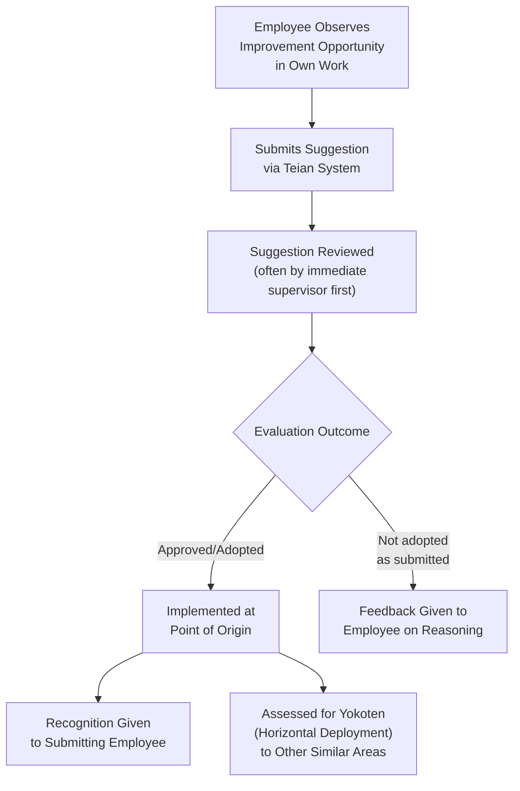

## Teian Employee Suggestion Systems

### Definition and Origin

Teian (提案, literally "proposal" or "suggestion") refers to formal employee suggestion systems developed within Japanese manufacturing management practice, closely associated with, though not exclusive to, Toyota's implementation of the concept. Teian systems provide a structured organizational channel through which individual employees submit improvement ideas — for their own workstation, process, or work area — outside of, and often in addition to, the group-based problem-solving activity conducted through quality circles.

The Toyota-specific implementation, sometimes referred to by its full name as the Toyota Suggestion System or, in some Toyota literature, associated with the term "Creative Idea Suggestion System," is frequently cited as one of the most extensively documented and highest-volume employee suggestion programs in manufacturing management history, with published accounts describing very high annual submission rates and adoption rates among Toyota's Japanese workforce relative to typical Western suggestion-box programs of the same era. [Unverified] Specific historical participation and adoption statistics for Toyota's teian system vary somewhat across published secondary sources and time periods; a reader seeking precise current or historical figures should consult primary Toyota publications or dedicated academic case studies rather than relying on a single commonly cited number, since figures reported in different sources are not always drawn from the same year or methodology.

### Position within TPS Human-Systems Practice

**Key Points**

- Teian complements quality circles rather than duplicating their function: quality circles are a group-based, standing forum for structured investigation of problems selected by the group, typically requiring several meeting sessions and use of formal problem-solving tools; teian is an individual-submission channel through which any single employee can propose an idea at any time, without requiring group formation, a facilitator, or a multi-session investigation process.
- The practice is a further structural expression of Respect for People and frontline quality/productivity ownership: by providing a low-barrier, individual channel for improvement ideas, teian extends the premise that valuable improvement insight originates from people directly performing the work, to a scale and immediacy that group-based mechanisms like quality circles do not by themselves provide (an individual insight does not need to wait for a circle's next scheduled meeting or for a topic to be selected by group consensus).
- Teian is generally oriented toward small, often localized improvements identifiable and implementable by the individual proposing them or by a small team — in contrast to larger, more complex problems that may be better suited to a quality circle's structured, multi-session investigation, or to a formal kaizen event's more intensive, cross-functional format.

### Characteristic Features of a Mature Teian System

**Key Points**

- **Low submission barrier.** A well-functioning teian system is designed for ease of submission — a simple form, a short description of the observed problem and proposed idea — rather than requiring the extensive documentation or formal analysis expected of a quality circle's investigation or a full A3 report, on the reasoning that a high barrier to entry would suppress the volume of small, valuable ideas the system is intended to capture.
- **Rapid review and response.** Suggestions are typically reviewed promptly, often by the employee's immediate supervisor in the first instance, with a defined process for escalating ideas that require resources or approval beyond the supervisor's own authority — a design feature intended to sustain employee engagement, since a suggestion left unreviewed or unanswered for an extended period discourages future participation.
- **Recognition, often modest and non-monetary or lightly monetary.** In the Toyota tradition specifically, and in the broader Japanese teian tradition, recognition for adopted suggestions has historically tended toward modest, often non-monetary or lightly monetary forms (acknowledgment, small awards, or nominal payments) rather than the larger individual cash-incentive structures sometimes associated with Western suggestion-box programs — a design choice that some accounts of the practice connect to an intent to emphasize the improvement's contribution to shared organizational goals rather than framing participation primarily as an individual financial transaction. [Inference] The specific scale and structure of recognition varies across organizations and time periods that have implemented teian-style systems, and this general characterization should not be taken as a fixed or universal rule applying identically to every implementation.
- **High participation volume expected as normal, not exceptional.** Where a Western suggestion-box program might be evaluated on the quality or impact of a small number of significant proposals, mature teian implementations are frequently described as valuing high overall participation rates (many employees submitting many small ideas over time) as itself a desired cultural outcome, reflecting an assumption that broad, frequent, small-scale improvement activity compounds meaningfully over time and reinforces continuous-improvement habits across the workforce, distinct from evaluating the program purely by the size of individual accepted ideas.

### Distinguishing Teian from Related Practices

**Key Points**

- **Teian vs. quality circles.** As discussed above, teian is an individual-submission channel available continuously, while quality circles are a standing group structure conducting scheduled, multi-session investigations — an organization can and typically does operate both simultaneously, since they serve complementary rather than substitutable functions (a group-investigated recurring defect pattern is a quality circle's natural scope; an individual's observation of an awkward reach motion at their own station is a natural teian submission).
- **Teian vs. a generic Western suggestion box.** Both share the basic structure of an individual submitting an improvement idea, but the teian tradition, as generally described in comparative management literature, is distinguished by its typically higher submission volume, faster and more consistent review cycle, closer integration with immediate supervisory relationships (rather than a suggestion disappearing into an anonymous central box with limited feedback), and its cultural framing as an expected, ordinary part of every employee's role rather than an optional extra activity for the unusually motivated.
- **Teian vs. yokoten.** Teian generates individual improvement ideas at their point of origin; yokoten is the subsequent, distinct discipline of assessing whether a validated teian-originated improvement applies elsewhere and deliberately propagating it — a well-functioning teian system depends on a connected yokoten process to realize the full organizational value of ideas that have broader applicability beyond the single station where they were first proposed.

### Conditions for Effectiveness

**Key Points**

- As with quality circles, sustained teian participation depends substantially on visible management follow-through: an employee whose reasonable, well-explained suggestion is neither adopted nor given a clear, respectful explanation for why it was not adopted is less likely to continue submitting ideas, and the discouraging effect can spread informally to co-workers who observe the outcome.
- Supervisor training and workload matter directly to program health: if immediate supervisors, who often serve as the first point of review, lack the time, authority, or coaching skill to engage constructively with submitted ideas, the review step becomes a bottleneck that undermines the system's intended responsiveness.
- A teian system's effectiveness is also connected to the psychological-safety conditions discussed in relation to hansei: an employee's willingness to point out that a current method has a flaw or inefficiency (the implicit content of most improvement suggestions) depends on trust that doing so will be received as a valued contribution rather than as an implicit criticism of whoever established or has been performing the current method, including, in some cases, the supervisor being asked to review the suggestion.
- [Inference] The relative success of a teian implementation compared to organizations without such a system, or compared to organizations relying primarily on other improvement channels (quality circles, kaizen events, engineering-led improvement) alone, likely depends on a range of organization-specific factors including management follow-through discipline, existing trust culture, and how well teian is integrated with complementary mechanisms like yokoten — general characterizations of teian's benefits in the literature should be understood as commonly observed patterns from documented implementations rather than a guarantee applicable to any organization adopting the practice.

### Relationship to the Broader Human-Systems Framework

**Key Points**

- Teian sits alongside quality circles, andon authority, autonomous maintenance, and nemawashi-based consultation as one of several distinct structural mechanisms through which TPS operationalizes Respect for People and frontline ownership — each mechanism addresses a different scale, cadence, or type of frontline contribution (an individual's immediate observation via teian; a group's structured multi-session investigation via a quality circle; an individual's real-time authority to halt production via andon; ongoing equipment stewardship via autonomous maintenance), and together they constitute a broader system rather than any single mechanism standing alone as sufficient.
- Teian-originated improvements, once validated, feed into the same standardization and yokoten disciplines discussed elsewhere: an adopted suggestion is documented, incorporated into the relevant standard work instruction if applicable, and assessed for applicability at comparable stations or lines beyond its point of origin.

**Related Topics**

- Quality circles and frontline quality ownership
- Yokoten as horizontal deployment of lessons learned
- Respect for people as an operating principle rather than a slogan
- Nemawashi as building consensus before deciding
- Standard work and its incorporation of validated improvements
- Training Within Industry and the Job Methods module