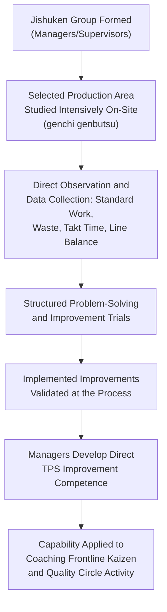

## Jishuken as Self-Study and Management-Led Kaizen

### Definition and Etymology

Jishuken (自主研, from *jishu* meaning "self-directed" or "voluntary" and *ken* an abbreviation of *kenkyu*, "study" or "research") refers to a structured, intensive kaizen practice within the Toyota Production System in which managers and supervisors themselves — rather than only frontline operators or dedicated improvement specialists — conduct hands-on, sustained study of a specific process or production area to identify and implement improvements. The term is frequently rendered in English-language lean literature as "self-study" or "autonomous study" activity, and jishuken groups are sometimes described as management-level or supervisory-level kaizen teams, distinguishing the practice from operator-driven mechanisms such as quality circles or teian suggestion systems.

Jishuken is closely associated with the Toyota Group's broader continuous-improvement infrastructure, including inter-company jishuken activities historically coordinated among Toyota-affiliated suppliers (sometimes conducted under the coordination of Toyota's own operations management consulting function, historically associated with what has been referred to in various accounts as the Operations Management Consulting Division, OMCD) — reflecting the practice's role not only as an internal management-development tool but also as a mechanism for propagating TPS capability across Toyota's supplier network.

### Position within TPS Human-Systems Practice

**Key Points**

- Jishuken addresses a distinct organizational need relative to the operator-driven mechanisms discussed elsewhere in TPS's human-systems practice (quality circles, teian): while those mechanisms cultivate frontline problem-solving capability among operators, jishuken is specifically designed to develop TPS understanding and improvement capability among the managers and supervisors who must, in turn, support, coach, and sustain the frontline improvement culture — addressing the premise that a manager cannot effectively coach or evaluate kaizen activity they have not themselves practiced directly and rigorously.
- The practice reflects genchi genbutsu applied specifically to management development: rather than developing managerial understanding of TPS principles through classroom instruction or reading alone, jishuken requires managers to go to the actual production floor, observe the actual process in detail, and work through a structured, sustained improvement effort themselves — treating direct, hands-on process engagement as the primary vehicle for developing genuine TPS competence at the management level.
- Jishuken groups typically focus intensively on a specific production line or process area over a defined period (which can range from several days to several weeks or more, depending on the scope and the specific organizational implementation), applying core TPS analytical tools — standardized work analysis, waste (muda) identification, takt time and line balancing analysis, and structured problem-solving — under close, hands-on facilitation, often by a senior TPS practitioner or, historically in Toyota's own supplier-development context, by OMCD-affiliated coordinators.

### Distinguishing Jishuken from Related Kaizen Practices

**Key Points**

- **Jishuken vs. quality circles.** Quality circles are operator-led, standing, lower-intensity groups investigating problems selected from their own work area on a recurring meeting cadence; jishuken is management/supervisor-led, typically more intensive and time-bounded, and explicitly framed as a management development activity as much as (or more than) a direct production-improvement activity, though genuine, validated improvements are also expected outputs.
- **Jishuken vs. a standard kaizen event.** A generic kaizen event (sometimes called a kaizen blitz or rapid improvement workshop) is typically a time-boxed, cross-functional improvement effort targeting a specific, pre-defined problem, and can be led or staffed by a mix of operators, engineers, and managers depending on the organization. Jishuken is more specifically characterized by its focus on developing the *managers themselves* as capable TPS practitioners through direct, sustained hands-on study — the participant composition and developmental intent (management capability-building, not solely the immediate production improvement) is the more distinctive defining feature, rather than the time-boxed format alone, which jishuken shares with many other kaizen event formats.
- **Jishuken vs. teian.** Teian is an individual, low-barrier, continuously available suggestion channel for any employee; jishuken is a structured, resource-intensive, scheduled activity involving a defined group over a defined period, applied to management development specifically — the two operate at entirely different organizational scales and serve entirely different functions within the broader TPS human-systems framework.

### Jishuken's Role in Cross-Company TPS Propagation

**Key Points**

- Beyond its role within a single plant or company, jishuken has historically been documented as a mechanism through which Toyota extended TPS capability-building to its supplier network — accounts of Toyota's supplier development practice describe jishuken-style activities conducted at supplier plants, sometimes with Toyota's own operations management consulting personnel facilitating or coordinating the effort, as part of Toyota's broader approach to developing TPS competence across its supply chain rather than confining TPS practice to Toyota's own internal plants alone.
- [Inference] The specific scope, frequency, and organizational structure of Toyota's historical supplier-facing jishuken activity, and the degree to which comparable practices continue in the same form in contemporary Toyota supplier-development programs, are matters better addressed through dedicated case studies and primary sources on Toyota's supplier relations than asserted with precision here, since publicly available secondary accounts vary in detail and specificity, and organizational practices of this kind evolve over time.
- This cross-company dimension distinguishes jishuken from most of the other human-systems practices discussed in this chapter (quality circles, teian, nemawashi), which are typically described primarily as internal, single-organization practices — jishuken's documented historical role in supplier capability development illustrates a further function of the practice: propagating TPS understanding not only within a management hierarchy but across organizational boundaries within a supply network.

### Characteristic Structure of a Jishuken Study

**Key Points**

- **Direct, sustained observation.** Consistent with genchi genbutsu, jishuken participants are expected to spend substantial direct time at the actual process under study, observing and measuring the current condition in detail (cycle times, motion patterns, material flow, defect occurrences) rather than relying on secondhand reports or historical data alone.
- **Structured analytical tools.** Jishuken activity typically applies the core analytical toolkit of TPS — value stream or process flow analysis, standardized work combination tables, waste (muda) identification against the seven or eight recognized waste categories, and takt-time-based line balancing analysis — providing participants with hands-on practice applying these tools to a real process rather than only studying them conceptually.
- **Facilitated, rigorous critique.** A defining and often demanding feature of jishuken practice, as described in various accounts of Toyota's and Toyota-affiliated companies' implementations, is close, rigorous facilitation by a senior, experienced TPS practitioner who challenges participants' analysis and proposed countermeasures closely — pushing participants to genuinely understand root causes and validate improvements at the actual process, rather than accepting a superficial analysis or an untested proposed solution.
- **Concrete implementation, not analysis alone.** Jishuken activity is expected to produce actual, implemented, validated changes to the studied process by its conclusion, consistent with the broader TPS emphasis (echoed in kaizen practice generally) on trialing and validating a countermeasure at the real process rather than stopping at a theoretical recommendation.

### Developmental Outcomes for Participating Managers

**Key Points**

- The primary intended outcome of jishuken, beyond the specific process improvements achieved during the study itself, is the development of participating managers' direct, practiced competence in applying TPS analytical methods and problem-solving discipline — competence intended to transfer into their ongoing role coaching, evaluating, and supporting kaizen activity, quality circles, and standard work development within their own areas of responsibility after the jishuken activity concludes.
- This developmental emphasis reflects a broader principle found across TPS's human-systems practices: that management capability in supporting and sustaining a lean production system is not assumed to arise automatically from managerial authority or general business experience, but is treated as a specific competence requiring deliberate, hands-on development — paralleling the premise underlying Training Within Industry's structured supervisory training modules, applied here specifically to TPS analytical and improvement skill rather than general supervisory skill.
- [Inference] The durability and transfer of jishuken-developed competence into a participating manager's subsequent day-to-day practice likely depends on organizational factors such as ongoing coaching support, opportunity to apply the skills regularly after the jishuken activity concludes, and organizational reinforcement of the expectation that managers remain personally engaged with process-level detail — general claims about jishuken's developmental effectiveness in the literature should be understood as describing an intended and commonly reported outcome rather than a guaranteed result independent of these supporting conditions.

**Related Topics**

- Genchi genbutsu (go and see for yourself)
- Quality circles and frontline quality ownership
- Teian employee suggestion systems
- Standardized work and standard work combination tables
- Training Within Industry and the Job Methods module
- Kaizen events and PDCA methodology
- Respect for people as an operating principle rather than a slogan