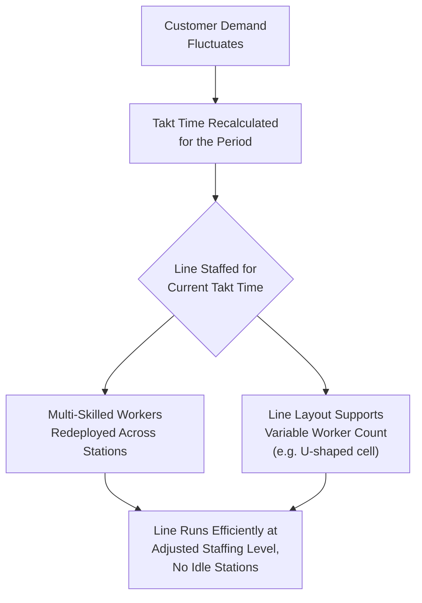
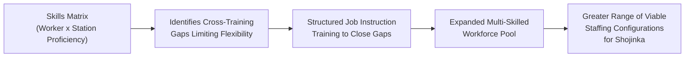

## Shojinka and Flexible, Multi-Skilled Workforce Design

### Definition and Etymology

Shojinka (少人化, from *sho* meaning "reduce/fewer," *jin* meaning "people," and *ka* meaning "-ization") refers to the flexible adjustment of the number of workers assigned to a production line or process in response to changes in demand, achieved through a workforce that has been deliberately trained and organized to be multi-skilled and through equipment and line layouts specifically designed to accommodate variable staffing levels. The term is sometimes translated as "flexible manpower" or "labor flexibility," though these translations can understate the specific mechanism the concept describes: shojinka is not simply the general goal of having adaptable staff, but a defined organizational capability — the ability to run the same line efficiently with a varying number of workers, from a maximum staffing level down to some minimum, depending on the volume actually needed on a given day or shift.

Shojinka is distinguished within TPS terminology from a related but distinct concept, shoninka (少人化 in some renderings is used ambiguously across sources, though the more commonly cited distinct term is shoninka, meaning "reduction in the number of workers" in a more limited, headcount-minimization sense) — the distinction some lean literature draws is between a system designed to flex worker count *up or down with demand* (shojinka) versus a narrower pursuit of permanently reducing headcount at fixed output (a distinction that is not applied entirely consistently across all secondary sources). [Unverified] The precise terminological distinction between shojinka and related terms varies somewhat across English-language lean literature, and a reader seeking precise linguistic and conceptual boundaries should consult primary Japanese-language TPS sources or dedicated academic treatments rather than relying on a single popularized definition, since translations and usage are not fully standardized across secondary accounts.

### Purpose and Position within TPS

**Key Points**

- Shojinka directly supports Just-in-Time production's core objective of producing only what is needed, when it is needed, in the quantity needed — because customer demand naturally fluctuates (daily, weekly, seasonally), a production line staffed at a single fixed level regardless of actual demand will be either overstaffed relative to low-demand periods (a labor-cost and capacity-utilization inefficiency) or unable to flex up for high-demand periods without disruptive, ad hoc staffing changes.
- Shojinka requires that a line's staffing level can move without requiring a full line redesign each time — this is achieved through specific line and cell layout design (commonly U-shaped or cellular layouts, discussed further below) and through a workforce whose members are each capable of performing multiple, sometimes many, of the operations along the line, so that as headcount is reduced, the operations previously split among more workers can be logically regrouped among fewer, multi-skilled workers without idle stations or unassigned operations.
- The practice is explicitly dependent on multi-skilled worker development, connecting shojinka directly to the broader TPS human-systems and training infrastructure: a workforce trained only in a single, narrow operation cannot be redeployed flexibly as headcount changes, so shojinka's line-flexibility capability rests on a deliberate, ongoing training investment in cross-training workers across multiple stations and operations.

### The U-Shaped Cell and Layout Enablers

**Key Points**

- Shojinka is closely associated with, and substantially enabled by, U-shaped (or similarly compact cellular) line layouts, in which workstations are arranged in a U or similar compact configuration rather than a long, straight line — this layout allows a single worker to tend multiple, physically proximate stations at both the entry and exit portions of the process, which is difficult or impossible in a long straight-line layout where the first and last stations are physically distant from each other.
- In a U-shaped cell, as staffing is reduced, each remaining worker's assigned operations expand to cover a larger portion of the cell's total operations, walking a defined path among their assigned stations — the compactness of the U-shape keeps this expanded walking path manageable, which is a key layout-design reason U-shaped cells are strongly associated with shojinka implementations rather than a fixed requirement in an absolute sense (some shojinka implementations use other compact or flexible cell layouts achieving a comparable effect).
- Standardized work combination tables (documenting the precise sequence and timing of manual work, walking, and machine-automatic time for each worker) are essential supporting documentation for shojinka: as staffing levels change, a new standardized work combination table must be developed and validated for each staffing configuration the line is expected to run, defining exactly which operations each worker performs at that specific headcount and confirming the resulting cycle time meets the current takt time.

**Example**

A component assembly cell has ten sequential operations arranged in a U-shaped layout and is normally staffed by three workers when demand is high, each responsible for roughly three to four operations along the U. When demand drops and takt time increases (less output is needed per unit time), the cell is reconfigured to run with two workers, each now covering five operations, following a revised standardized work combination table developed and validated in advance for this two-person configuration. When demand rises again, the cell reverts to the three-person configuration and its corresponding pre-validated standardized work combination table — the layout and worker training make this staffing shift routine rather than requiring line redesign each time.

### Relationship to Multi-Skilled Worker Development

**Key Points**

- Shojinka's staffing flexibility is entirely dependent on the depth and breadth of individual workers' skill across multiple stations — a worker capable of performing only a single station's operation cannot be redeployed to cover additional operations when headcount is reduced, so shojinka requires a sustained, deliberate cross-training program rather than emerging spontaneously from a flexible layout alone.
- Multi-skilling for shojinka purposes is frequently tracked and visually managed through a **skills matrix** (sometimes called a training matrix or skill versatility chart), a visual tool mapping each worker against each station or operation in a given area, indicating each worker's demonstrated proficiency level at each operation — this tool supports staffing planning (identifying which workers can be assigned to which configuration) and also makes visible where cross-training gaps exist that would limit staffing flexibility.
- The training methodology underlying effective multi-skilling connects directly back to structured job instruction practice (as discussed in relation to Training Within Industry's Job Instruction module): reliably teaching a worker a new station's operation to full proficiency, including the key points that affect quality and safety, depends on the same disciplined instructional method regardless of whether the training is for a worker's primary assignment or for cross-training toward shojinka flexibility.

### Relationship to Takt Time and Line Balancing

**Key Points**

- Shojinka staffing decisions are directly driven by takt time recalculation: as customer demand changes, the takt time (available production time divided by required output) changes correspondingly, and the line's staffing level is adjusted so that the resulting cycle time per worker's assigned operations matches the new takt time — running with too many workers relative to a longer takt time creates idle time (a form of waste), while running with too few workers relative to a shorter takt time makes the required takt time unachievable.
- This connects shojinka directly to line balancing methodology: each candidate staffing level for a given line requires its own line-balancing analysis, redistributing the line's total work content among the specific number of workers being deployed at that level, validated against the current takt time requirement.
- [Inference] The specific number of distinct staffing configurations a given line maintains as pre-validated, ready-to-deploy options (as opposed to developing a new configuration reactively each time demand shifts) varies by organization and by how frequently and predictably demand fluctuates for that particular line, so no universal number of standard configurations should be assumed applicable across all shojinka implementations.

### Distinguishing Shojinka from Related Concepts

**Key Points**

- **Shojinka vs. simple overtime or temporary staffing adjustment.** Many manufacturing operations adjust total labor hours through overtime or temporary staff without any structural line or skill change — this addresses total available labor hours but does not, by itself, constitute shojinka, which specifically concerns the ability to run the *same line* efficiently and without idle stations across a *range of headcounts*, a capability requiring the specific layout and multi-skilling investments described above, not merely adjusting how many hours the existing staffing works.
- **Shojinka vs. general workforce flexibility or job rotation.** Job rotation (having workers periodically move between stations, often for ergonomic variety or broader skill development) supports and often accompanies shojinka, but is not identical to it — job rotation's typical purpose (variety, ergonomic relief, broad skill maintenance) is complementary to, but distinct from, shojinka's specific purpose (enabling headcount to flex with demand while maintaining line efficiency), and an organization could in principle practice job rotation without having developed the specific layout and staffing-configuration infrastructure that constitutes full shojinka capability.
- **Shojinka vs. heijunka (production leveling).** Heijunka addresses variability in the production *schedule* (leveling the mix and volume of what is produced over time to reduce the variation any given process must absorb), while shojinka addresses variability in *labor requirements* in response to whatever demand level exists — the two are complementary rather than identical: heijunka reduces the magnitude and abruptness of demand swings a line must respond to, while shojinka provides the mechanism for efficiently adjusting staffing when demand does still vary.

### Practical Implementation Considerations

**Key Points**

- Implementing shojinka requires upfront investment in both physical layout (U-shaped or comparable flexible cell design) and workforce training (systematic multi-skilling), meaning it is generally planned as a deliberate line-design and workforce-development initiative rather than something that can be retrofitted trivially onto an existing straight-line layout with narrowly-skilled workers without a corresponding redesign and training investment.
- Sustaining shojinka capability over time requires ongoing attention to the skills matrix as workforce composition changes (new hires, transfers, retirements) — cross-training coverage that supported a full range of staffing configurations can erode over time if training is not actively maintained as the specific individuals who held that broad skill set leave the area.
- [Inference] The specific range of staffing flexibility (for example, the ratio between a line's maximum and minimum practical staffing level) that is achievable for a given process depends on the process's inherent work-content divisibility, the physical layout constraints of the specific line, and the depth of cross-training achieved, so no general ratio or target range can be assumed to apply uniformly across different production processes.

**Related Topics**

- Takt time and line balancing methodology
- Heijunka (production leveling)
- Training Within Industry and the Job Instruction module
- Standardized work and standard work combination tables
- U-shaped cell layout design
- Multi-skilling and skills matrix development
- Quality circles and frontline quality ownership