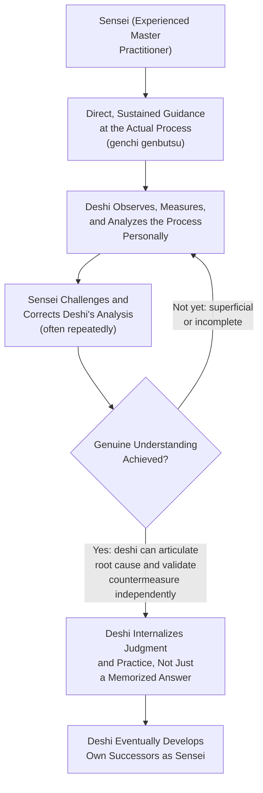

## The Sensei and Deshi Learning Relationship

### Definition and Etymology

Sensei (先生, literally "one born before" or "teacher/master") and deshi (弟子, "disciple" or "pupil") describe a mentorship relationship structure, rooted in broader Japanese cultural and craft-training traditions, that has been carried into Toyota Production System practice as the primary model through which deep, tacit TPS knowledge and judgment are transmitted from experienced practitioners to developing ones. Within TPS, a sensei is not simply an instructor delivering defined course content, but an experienced master practitioner whose knowledge is transmitted substantially through direct, sustained, hands-on guidance at the actual workplace (genchi genbutsu), including deliberately challenging questioning, correction of the deshi's analysis, and requiring the deshi to personally observe, measure, and re-examine a process repeatedly until genuine understanding — rather than an accepted answer — is achieved.

The sensei-deshi relationship is closely associated in TPS literature and in accounts of Toyota's own internal development practice with figures such as Taiichi Ohno, whose own teaching approach toward developing successors is frequently cited as an archetypal example of the sensei model in practice, including well-documented (if variously recounted) anecdotes of Ohno requiring a deshi to stand and observe a process for an extended period, drawing a chalk circle on the floor for the deshi to stand within, until the deshi had genuinely seen and could articulate specific wastes and problems in the process that were not apparent from a superficial glance.

### Position within TPS Knowledge Transmission

**Key Points**

- The sensei-deshi relationship addresses a specific limitation of purely classroom-based or document-based training: significant elements of TPS practice — judgment about what genuinely constitutes waste in a specific context, the discipline to keep asking "why" past a superficial first answer, the ability to see a process's actual condition rather than its assumed or reported condition — are difficult to transmit through written procedure or lecture alone, and are described in TPS literature as being more effectively developed through sustained, direct, personally-guided practice under an experienced practitioner's close observation and correction.
- This tacit-knowledge-transmission function connects the sensei-deshi model to genchi genbutsu as a shared underlying principle: much of what a sensei is described as teaching a deshi is precisely the skill and discipline of direct, rigorous observation itself — how to actually see a process's true condition, as opposed to relying on reports, assumptions, or a superficial walk-through.
- The relationship is also connected to hansei: a sensei's guidance frequently involves pushing a deshi to honestly confront the inadequacy of their own initial analysis or proposed countermeasure, a demanding and sometimes uncomfortable process that depends on the same psychological conditions (trust that rigorous correction is oriented toward genuine development rather than punitive judgment) discussed in relation to hansei's non-punitive framing.
- Jishuken activity, discussed elsewhere in this chapter, is frequently structured explicitly around a sensei-deshi dynamic: a senior TPS practitioner facilitates and rigorously challenges a jishuken group's analysis and proposed improvements, functioning in the sensei role relative to the participating managers as deshi during that intensive study period.

### Characteristic Features of the Relationship

**Key Points**

- **Emphasis on personally observed evidence over reported or assumed information.** A sensei characteristically declines to accept a deshi's analysis or proposed solution based on secondhand reports, assumptions, or superficial observation, instead directing the deshi back to the actual process to look again, measure directly, and confirm their understanding against the real, current condition — reinforcing genchi genbutsu as a practiced discipline rather than a stated value.
- **Repeated, probing questioning rather than direct answers.** Rather than supplying a solution or the "correct" root cause directly, a sensei is frequently described as repeatedly questioning a deshi's reasoning (echoing the structured questioning discipline found in 5 Why analysis and in TWI's Job Methods 5W1H framework), requiring the deshi to work through the reasoning themselves and often to discover that an initial, seemingly adequate answer does not hold up under further scrutiny.
- **Extended time investment and patience.** The relationship typically unfolds over a substantial period — sometimes years, in accounts of extended mentorships — rather than a short training course, reflecting the premise that the tacit judgment and disciplined habits of observation and analysis the sensei is transmitting cannot be compressed into a brief instructional format.
- **High standards and demanding correction.** Sensei-deshi accounts in TPS literature frequently emphasize a demanding, sometimes uncomfortable standard the sensei holds the deshi to — rejecting incomplete analysis, requiring the deshi to redo observation or analysis that falls short, and generally maintaining rigor rather than accepting a "good enough" answer — a pattern consistent with, and arguably a personal, relational embodiment of, hansei's expectation of honest confrontation with shortfall as the necessary precondition for genuine improvement.
- **Succession as an explicit goal.** A defining feature of the sensei-deshi model, distinguishing it from a purely transactional training engagement, is the expectation that the relationship's ultimate purpose includes developing the deshi's capability to the point where the deshi can eventually function as a sensei to others — the model is explicitly generational, oriented toward sustaining TPS practice and judgment across successive cohorts of practitioners rather than concentrating irreplaceable expertise permanently in a single individual.

**Example**

An often-recounted account describes Taiichi Ohno instructing a developing manager to stand within a chalk circle drawn on the factory floor and observe a specific process for an extended period without intervening, later returning to ask what the manager had observed. An initial account focused on the process's visible, surface-level activity is met with further probing questions, directing the manager to look again for specific instances of waste, delay, or unnecessary motion not captured in the first observation — the exercise is described as continuing, in various tellings, until the manager's account demonstrated a substantively deeper and more specific understanding of the process's actual condition than the initial superficial description had captured. [Unverified] Specific details of this and similar anecdotes (exact duration, precise dialogue, and specific individuals involved) vary across different published retellings, and the anecdote is generally treated in lean literature as illustrative of the sensei-deshi teaching approach rather than as a single, precisely documented historical event with an agreed-upon exact account.

### Distinguishing the Sensei-Deshi Relationship from Related Training Structures

**Key Points**

- **Sensei-deshi vs. Training Within Industry's Job Instruction method.** Both involve structured, hands-on, direct instruction rather than classroom-only delivery, but they differ in scope and object: TWI's Job Instruction is a defined, relatively brief four-step procedure for teaching a specific, already-established job method to competence; the sensei-deshi relationship is typically longer-term, less procedurally fixed, and oriented toward developing broader judgment, analytical discipline, and the capacity to identify and solve novel problems, rather than teaching a single, pre-defined task to a fixed standard.
- **Sensei-deshi vs. jishuken facilitation.** Jishuken is a specific, bounded activity (a defined study period applied to a specific process) that frequently *employs* a sensei-deshi dynamic in its facilitation structure, but the sensei-deshi relationship itself is a broader, more general mentorship pattern that can extend across a practitioner's career and across many specific activities and contexts, of which a given jishuken engagement might be one instance.
- **Sensei-deshi vs. general workplace mentorship.** While the sensei-deshi model shares surface similarity with mentorship practices found in many organizational and professional traditions, the specific TPS-associated characterization emphasizes the particular combination of genchi genbutsu-grounded direct observation, deliberately challenging Socratic-style questioning, sustained multi-year time horizons, and explicit succession intent — a combination of features that may or may not all be present in a more generic workplace mentoring relationship, which can vary considerably in structure and rigor across organizations and traditions.

### Practical and Organizational Implications

**Key Points**

- The sensei-deshi model implies that developing genuine, deep TPS capability in an organization's leadership cannot be fully achieved through documentation, training courses, or certification programs alone — it depends on the availability of experienced practitioners willing and able to invest substantial direct time in developing successors, which is itself a resource and succession-planning consideration for any organization seeking to build or sustain deep TPS capability over multiple generations of leadership.
- This dependency creates a documented organizational risk sometimes discussed in lean-implementation literature: if an organization does not deliberately cultivate multiple generations of sensei-level practitioners through sustained sensei-deshi relationships, the departure or retirement of a small number of deeply experienced individuals can represent a significant, difficult-to-replace loss of tacit organizational capability — a risk not fully mitigated by documentation of TPS tools and procedures alone, since the model's central premise is precisely that some of what is transmitted is not fully capturable in documentation.
- [Inference] The degree to which any specific organization outside Toyota itself has successfully replicated a genuine sensei-deshi developmental culture, as opposed to adopting the term or surface elements of the practice without its full underlying rigor and time investment, likely varies considerably across organizations that have attempted to adopt lean/TPS practices, and general claims about the model's transferability to other organizational contexts should be treated with appropriate caution rather than assumed to transfer automatically simply by labeling a mentorship arrangement "sensei-deshi."

**Related Topics**

- Genchi genbutsu (go and see for yourself)
- Hansei as structured reflection on failure
- Jishuken as self-study and management-led kaizen
- 5 Why root-cause analysis
- Training Within Industry and the Job Instruction module
- Taiichi Ohno and the historical development of TPS
- Respect for people as an operating principle rather than a slogan