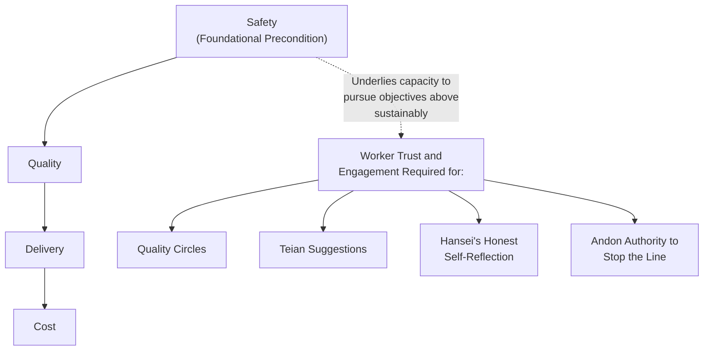

## Safety as a Precondition for Sustainable Improvement

### Definition and Position within TPS

Safety, within the Toyota Production System and lean manufacturing practice more broadly, is treated not as one improvement objective competing alongside quality, cost, and delivery, but as a foundational precondition that must be secured before other production objectives can be pursued sustainably. This framing — often expressed in lean literature through variations of a stated priority ordering such as "Safety, Quality, Delivery, Cost" — positions safety at the base of the objective hierarchy: a production system that achieves cost or delivery performance at the expense of worker safety is considered, within this framework, to have failed at a more fundamental level than one that has quality or cost problems, because an unsafe process is not a viable long-term operating condition regardless of its other performance characteristics.

This chapter's treatment of safety as a "precondition for sustainable improvement" reflects a specific claim beyond safety's ethical importance: that a workplace failing to secure basic worker safety cannot sustain the broader human-systems practices this chapter has covered — quality circles, teian, jishuken, nemawashi-based consultation, sensei-deshi mentorship — because each of these depends on a degree of worker trust, engagement, and willingness to surface problems that an unsafe environment actively undermines.

### Why Safety Is a Precondition, Not a Parallel Objective

**Key Points**

- An injury stops production directly and often severely — unlike many quality or cost problems, which can sometimes be absorbed or worked around temporarily, a serious workplace injury typically halts the affected line or process, triggers investigation, and can have consequences (regulatory, legal, reputational, and human) that outlast and outweigh most other production disruptions, making safety failures a uniquely severe category of Availability loss and organizational risk simultaneously.
- Sustainable engagement in continuous improvement activity depends on workers trusting that raising problems, including safety hazards, will be taken seriously and acted upon — this is the same underlying trust relationship on which quality circles, teian, and hansei's non-punitive framing all depend; a workplace where safety hazards are reported and not addressed, or where reporting a hazard carries a perceived risk of blame, erodes the same trust infrastructure that these other human-systems practices require to function.
- Standard work, a foundational TPS practice underlying much of the improvement infrastructure discussed elsewhere in this material, explicitly incorporates safety considerations at the individual-step level (as reflected in TWI's Job Instruction "key points," which specifically include points that could injure the worker) — a standard that is unsafe to follow as written is not a viable standard, and any subsequent kaizen activity building on that standard inherits and potentially compounds the underlying hazard rather than a "clean" baseline for a genuine quality or productivity improvement.
- The "Safety, Quality, Delivery, Cost" priority framing, where used, is intended to guide decision-making under tension: when a proposed change or a production pressure creates a genuine conflict between meeting a delivery target and maintaining a safe method, the stated priority ordering directs that safety is not to be compromised to meet the lower-priority objectives — though [Inference] the degree to which this priority ordering is consistently honored under real production pressure, as opposed to being a stated but imperfectly followed principle, varies across organizations and specific situations, and should be understood as the intended governing principle rather than a guarantee of how every real-world tradeoff is actually resolved in practice.

### Safety's Structural Relationship to Jidoka and Andon

**Key Points**

- Jidoka's core mechanism — a process or line stopping automatically, or being stopped by an operator, upon detecting an abnormality — applies directly to safety hazards as a category of abnormality, not solely to quality defects: a production system genuinely committed to the jidoka principle treats an emerging safety hazard (a machine guard failure, an unsafe accumulation of material, an equipment malfunction with injury risk) with the same "stop and fix" discipline applied to a quality abnormality, rather than treating safety hazards as a separate concern handled through a distinct, lower-priority process.
- Andon authority — the structural commitment, discussed in relation to Respect for People, that any operator can halt production upon detecting an abnormality — is most directly and unambiguously tested in the case of a safety hazard: an organization's genuine commitment to andon authority (as opposed to a nominally installed but practically discouraged andon cord) is most visibly demonstrated by whether an operator who stops the line for a safety concern is supported and taken seriously, or whether such stoppages are met with implicit or explicit pressure to resume production quickly regardless of the underlying hazard.
- This connects safety directly to the broader theme, discussed in relation to Respect for People as an operating principle rather than a slogan, that the credibility of a stated principle is tested specifically at the moments when honoring it carries a real cost (a production delay, a missed delivery target) — a safety-related line stoppage is one of the clearest such tests, since the pressure to prioritize continued output over addressing the hazard is often immediate and concrete.

### Safety and Autonomous Maintenance

**Key Points**

- Autonomous maintenance activities (operator-performed cleaning, inspection, and lubrication under TPM) directly support safety outcomes: an operator who is closely, routinely engaged with their own equipment's basic condition is positioned to notice a developing safety-relevant defect (a loose guard, a fraying cable, an abnormal noise suggesting an impending mechanical failure) earlier than a worker with only superficial, infrequent contact with the equipment — connecting equipment reliability practice, discussed extensively elsewhere in this material, directly to safety outcomes rather than treating equipment reliability solely as a production-availability concern.
- The Maintenance Prevention information loop, discussed in relation to Early Equipment Management, explicitly includes safety-related maintenance-difficulty feedback (for example, equipment features that create unsafe access conditions for routine maintenance) as a category of information fed forward into future equipment design — meaning safety improvement, like quality improvement, is intended to be designed into new equipment upstream rather than addressed solely through after-the-fact operational controls on existing, potentially hazard-prone equipment.

### Safety and Poka-Yoke

**Key Points**

- Poka-yoke devices, discussed extensively in the quality-systems material, are not limited to preventing quality defects — a substantial category of poka-yoke application is specifically safety-oriented: mechanisms that physically prevent an operator from placing a hand in a hazardous zone during a machine cycle, interlocks that prevent equipment operation unless a guard is correctly in place, or sequence-enforcement (motion-step) devices that ensure a hazardous step cannot be initiated until a required safety precondition (e.g., a guard closed, a lockout applied) has been confirmed.
- The same detection-method classification (contact, fixed-value, motion-step) and regulatory-function classification (control versus warning) developed for quality-oriented poka-yoke apply equally to safety-oriented poka-yoke design, and the same general preference for control-type (shutoff) devices over warning-type devices applies with, if anything, greater force in the safety context — a warning-type device for a serious safety hazard depends on human response under exactly the conditions (time pressure, distraction, fatigue) most likely to produce the error the device is meant to catch, making a control-type mechanism that physically prevents the hazardous action generally the stronger design choice wherever technically feasible.

### Common Points of Confusion

**Key Points**

- Safety-as-precondition is sometimes mischaracterized as implying that safety is somehow prioritized "instead of" production performance, as though the two were zero-sum; the more accurate characterization within lean/TPS literature is that a genuinely safe process is treated as a *necessary condition* for sustainably achieving quality, delivery, and cost objectives over time — an unsafe process that appears to perform well on other metrics in the short term is considered fragile and unsustainable, not a legitimate alternative path to the same objectives.
- Safety is sometimes treated in less mature lean implementations as a compliance-driven, separate function (audits, regulatory paperwork, a distinct safety department) disconnected from the shop-floor human-systems and process-design practices discussed throughout this chapter; the "precondition" framing specifically pushes against this separation, positioning safety instead as integrated into standard work, jidoka, poka-yoke, autonomous maintenance, and the trust-based conditions underlying quality circles and teian — a genuinely mature implementation treats safety as inseparable from these practices rather than as an independent, parallel compliance track.
- [Inference] The degree to which any given organization has actually achieved this integrated treatment of safety, as opposed to maintaining a more compliance-oriented, separated safety function alongside its lean/TPS practices, varies considerably across organizations, and the framing presented in this material describes the intended, mature model rather than asserting that this integration is universally achieved in practice.

**Related Topics**

- Jidoka, autonomation, and andon authority
- Poka-yoke concepts and classification of error-proofing devices
- Autonomous maintenance and the Cleaning-Inspection-Lubrication (CIL) cycle
- Early Equipment Management and Maintenance Prevention
- Respect for people as an operating principle rather than a slogan
- Standardized work and Training Within Industry's Job Instruction "key points"
- Hansei as structured reflection on failure