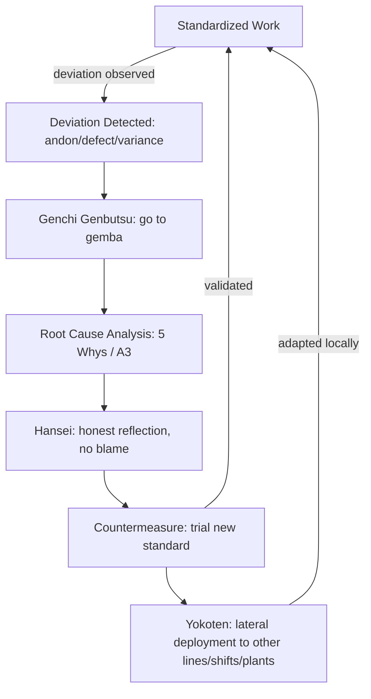

## Building a True Learning Organization Culture

### Overview

A learning organization, in the Toyota Production System (TPS) sense, is one where the organizational capacity to solve problems, absorb knowledge, and improve standards is treated as the primary output of daily work — arguably more important than the immediate product of that work. This concept is most closely associated with Toyota's internal principle often translated as "we build people before we build cars," and formalized in outside literature (notably Liker's *The Toyota Way*, Principle 14: "Become a Learning Organization Through Relentless Reflection and Continuous Improvement") and in Peter Senge's *The Fifth Discipline*, which coined "learning organization" as a general management term independently of Toyota but is frequently mapped onto TPS practice.

The distinction that matters technically: a company can have continuous improvement *events* (kaizen workshops, suggestion boxes) without being a learning organization. A learning organization has the *infrastructure* — standardized work, hansei (reflection), yokoten (lateral knowledge transfer), and A3 problem solving — that converts individual insight into organizational memory, repeatably, without depending on any single person's tenure or memory.

### Foundational Distinction: Learning Organization vs. Organization That Learns

- **An organization that learns**: individuals or teams occasionally solve problems and improve locally. Knowledge stays tacit, held by the people who solved the problem. When they leave, the knowledge leaves.
- **A learning organization**: problem-solving is a designed, repeatable process. Standards capture the current best-known method. Deviations from standards are treated as learning signals, not compliance failures. Knowledge is deliberately transferred across shifts, lines, and plants (yokoten). The system is designed so that learning survives personnel turnover.

[Inference] The gap between these two states is where most "lean transformations" stall — companies adopt the tools (5S, kanban, andon) without building the underlying learning infrastructure, and the tools decay back to prior states within 1–3 years once initial management attention fades.

### Core Structural Pillars

#### 1. Standardized Work as a Learning Baseline, Not a Cage

Standardized work is frequently misunderstood as rigid control. In TPS, its actual function is epistemic: a standard is the best-known method *at this moment*, written down precisely enough that any deviation from it is immediately visible and attributable to a specific cause.

- Without a written standard, "improvement" has no fixed baseline to measure against — you cannot know if a change was actually better.
- With a standard, every deviation (quality defect, cycle time variance, near-miss) becomes a data point: either the standard was violated (training/discipline issue) or the standard is now known to be wrong/incomplete (improvement opportunity).
- Standards must be created by the people doing the work, not imposed by engineering alone — otherwise workers have no ownership over them and no incentive to flag when they're wrong.

**Key Points**

- Standards are living documents, revised on a defined cadence (e.g., after every kaizen event or every genchi genbutsu review), not "issued once."
- A standard that hasn't changed in a long time is itself a red flag — it suggests either the process is stagnant or the standard is no longer being consulted.
- Version control on standards (physical or digital) is a real technical requirement: workers need to know which revision is current, and past revisions provide a history of the group's learning trajectory.

#### 2. Hansei (反省) — Structured Self-Reflection

Hansei is distinct from a generic "lessons learned" meeting. Its defining features:

- It happens even when a project or milestone is *successful* — the premise is that gaps between plan and actual always exist, and finding them while memory is fresh is more valuable than only reflecting after failures.
- It requires acknowledging shortcomings *before* proposing the next set of countermeasures. Skipping straight to "here's what we'll do differently" without naming the specific gap is considered incomplete hansei.
- It is personal and team-level, not just organizational. Individuals are expected to reflect on their own contribution to a gap, not only external/systemic factors.

[Inference] Western corporate culture often resists hansei because acknowledging a personal shortfall in a meeting can be read as an admission of failure with career consequences. Toyota's system depends on psychological safety: hansei only functions as a learning mechanism if surfacing a gap does not trigger blame. This is arguably the single hardest cultural precondition to import without also importing the surrounding management behavior (no punitive response to honestly reported problems).

#### 3. Yokoten (横展) — Lateral Knowledge Transfer

Yokoten literally means "horizontal deployment." It is the deliberate mechanism for spreading a solution found in one area (one line, one shift, one plant) to all other areas facing a structurally similar problem.

- Mechanism: A3 reports, kaizen newsletters, cross-plant visits, and rotational assignments are the typical vehicles.
- Without yokoten, every team re-solves the same problem independently — each local team learns, but the organization as a whole does not. Yokoten is what elevates individual/team learning to organizational learning.
- Effective yokoten requires the receiving team to adapt (not blindly copy) the solution to their local context — genchi genbutsu applied to the *transfer* itself, not just the original problem.

#### 4. Genchi Genbutsu (現地現物) — "Go and See"

Genchi genbutsu ("actual place, actual thing") is the requirement that decisions and learning be grounded in direct observation of the actual process, not reports, dashboards, or secondhand summaries.

- Managers and engineers are expected to physically go to the gemba (the place where value is created — the shop floor) to observe a problem before proposing a countermeasure.
- This directly supports learning-organization goals because secondhand data compresses and distorts nuance; a manager who has personally observed the failure mode develops far richer, more transferable understanding than one who only reads a summary.
- Toyota famously uses the "five whys" combined with genchi genbutsu: each "why" is meant to be answered by going back to the gemba, not by armchair reasoning.

#### 5. A3 Problem Solving as the Knowledge-Capture Format

The A3 report (named for the A3-size paper it traditionally fits on) is the standardized document format for problem-solving at Toyota. Its structure typically includes:

1. Background / problem statement
2. Current condition (with data, often a diagram)
3. Goal / target condition
4. Root cause analysis (e.g., five whys, fishbone/Ishikawa diagram)
5. Countermeasures
6. Implementation plan
7. Follow-up / verification of results

**Key Points**

- The A3 format matters technically because it forces a *consistent structure* across the organization — any employee, in any department, can read another team's A3 and immediately locate the problem statement, root cause, and results, regardless of who wrote it.
- This standardization of the *reasoning artifact itself* is what makes yokoten scalable — knowledge transfer doesn't require the original author to be present to explain it.
- A3s are archived and searchable in mature TPS organizations, functioning as an organizational "case law" of past problems and their root causes.

### Diagram: The Learning Loop (svg_diagram)

<svg xmlns="http://www.w3.org/2000/svg" viewBox="0 0 900 520">
<text x="450" y="30" font-size="20" font-weight="bold" text-anchor="middle" fill="#1a1a1a">TPS Learning Organization Loop (svg_diagram)</text>

<rect x="60" y="80" width="200" height="90" rx="8" fill="#e8f0fe" stroke="#1a56db" stroke-width="2" />
<text x="160" y="115" font-size="15" font-weight="bold" text-anchor="middle" fill="#1a1a1a">Standardized Work</text>
<text x="160" y="138" font-size="12" text-anchor="middle" fill="#333">(current best-known</text>
<text x="160" y="154" font-size="12" text-anchor="middle" fill="#333">method, written down)</text>

<rect x="340" y="80" width="200" height="90" rx="8" fill="#fef3c7" stroke="#b45309" stroke-width="2" />
<text x="440" y="115" font-size="15" font-weight="bold" text-anchor="middle" fill="#1a1a1a">Deviation Detected</text>
<text x="440" y="138" font-size="12" text-anchor="middle" fill="#333">(andon, defect,</text>
<text x="440" y="154" font-size="12" text-anchor="middle" fill="#333">cycle-time variance)</text>

<rect x="620" y="80" width="220" height="90" rx="8" fill="#dcfce7" stroke="#15803d" stroke-width="2" />
<text x="730" y="115" font-size="15" font-weight="bold" text-anchor="middle" fill="#1a1a1a">Genchi Genbutsu</text>
<text x="730" y="138" font-size="12" text-anchor="middle" fill="#333">(go observe at</text>
<text x="730" y="154" font-size="12" text-anchor="middle" fill="#333">the actual gemba)</text>

<rect x="620" y="220" width="220" height="90" rx="8" fill="#f3e8ff" stroke="#7e22ce" stroke-width="2" />
<text x="730" y="255" font-size="15" font-weight="bold" text-anchor="middle" fill="#1a1a1a">Root Cause Analysis</text>
<text x="730" y="278" font-size="12" text-anchor="middle" fill="#333">(5 Whys, A3 report,</text>
<text x="730" y="294" font-size="12" text-anchor="middle" fill="#333">Ishikawa diagram)</text>

<rect x="340" y="220" width="200" height="90" rx="8" fill="#fee2e2" stroke="#b91c1c" stroke-width="2" />
<text x="440" y="255" font-size="15" font-weight="bold" text-anchor="middle" fill="#1a1a1a">Hansei</text>
<text x="440" y="278" font-size="12" text-anchor="middle" fill="#333">(honest reflection</text>
<text x="440" y="294" font-size="12" text-anchor="middle" fill="#333">on the gap, no blame)</text>

<rect x="60" y="220" width="200" height="90" rx="8" fill="#e0f2fe" stroke="#0369a1" stroke-width="2" />
<text x="160" y="255" font-size="15" font-weight="bold" text-anchor="middle" fill="#1a1a1a">Countermeasure</text>
<text x="160" y="278" font-size="12" text-anchor="middle" fill="#333">(new/revised standard</text>
<text x="160" y="294" font-size="12" text-anchor="middle" fill="#333">is trialed)</text>

<rect x="200" y="380" width="500" height="90" rx="8" fill="#ffedd5" stroke="#c2410c" stroke-width="2" />
<text x="450" y="415" font-size="15" font-weight="bold" text-anchor="middle" fill="#1a1a1a">Yokoten (Lateral Deployment)</text>
<text x="450" y="438" font-size="12" text-anchor="middle" fill="#333">solution shared across shifts, lines, plants —</text>
<text x="450" y="454" font-size="12" text-anchor="middle" fill="#333">individual learning becomes organizational learning</text>

<line x1="260" y1="125" x2="335" y2="125" stroke="#444" stroke-width="2" marker-end="url(#arrow)" />
<line x1="540" y1="125" x2="615" y2="125" stroke="#444" stroke-width="2" marker-end="url(#arrow)" />
<line x1="730" y1="170" x2="730" y2="215" stroke="#444" stroke-width="2" marker-end="url(#arrow)" />
<line x1="615" y1="265" x2="545" y2="265" stroke="#444" stroke-width="2" marker-end="url(#arrow)" />
<line x1="335" y1="265" x2="265" y2="265" stroke="#444" stroke-width="2" marker-end="url(#arrow)" />
<line x1="160" y1="310" x2="160" y2="350" stroke="#444" stroke-width="2" marker-end="url(#arrow)" />
<line x1="160" y1="350" x2="440" y2="378" stroke="#444" stroke-width="2" marker-end="url(#arrow)" />
<line x1="700" y1="378" x2="500" y2="200" stroke="#888" stroke-width="2" stroke-dasharray="6,4" marker-end="url(#arrow)" />
<text x="620" y="345" font-size="11" fill="#666" font-style="italic">feeds back into standards</text>
<line x1="450" y1="380" x2="160" y2="170" stroke="#888" stroke-width="2" stroke-dasharray="6,4" marker-end="url(#arrow)" />
</svg>

### Process Flow (Mermaid)

### Management Behaviors That Enable (or Kill) the Culture

**Enabling behaviors:**

- Leaders visit the gemba routinely, not only during crises (this normalizes genchi genbutsu as a daily habit rather than an emergency response).
- Problems are treated as gifts — the discovery of a defect or deviation is rewarded (or at minimum, never punished), because it surfaces a learning opportunity before it compounds.
- Managers ask "why" questions to understand systemic cause, not "who" questions to assign blame.
- Time is explicitly budgeted for kaizen and reflection, rather than treating it as something squeezed in after "real work."
- Cross-training and job rotation are used deliberately to spread tacit knowledge and prevent single points of failure in expertise.

**Culture-killing behaviors (anti-patterns):**

- Punishing the messenger: an operator who stops the line (jidoka) or reports a defect being reprimanded for lost output. This immediately and durably suppresses future reporting — [Inference] this single behavior is probably the fastest way to destroy an otherwise well-designed learning system, because trust, once broken this way, is slow to rebuild.
- Treating kaizen events as one-off "improvement blitzes" disconnected from daily standardized work maintenance — improvements are made but not embedded into a living standard, so they decay.
- Management by dashboards/reports only, without periodic direct floor presence — this severs the feedback loop that hansei and genchi genbutsu depend on.
- Rewarding only the person who "solved" the problem rather than crediting the team and disseminating the method (undermines yokoten's incentive structure).

### Worked Example: A Learning Loop in Practice

**Example**

A production line experiences a recurring but low-severity dimensional defect at final assembly, roughly 2% of units, that has been present for months without formal investigation.

1. **Detection**: A quality check station flags the defect rate exceeding the standard's tolerance band (standardized work defines the acceptable range; the deviation is what triggers attention).
2. **Genchi genbutsu**: The line supervisor and a process engineer go to the actual station, observe several cycles directly rather than reviewing only aggregated defect-rate reports.
3. **Root cause (5 Whys)**:
   - Why is the dimension out of tolerance? → A fixture is slightly misaligned.
   - Why is the fixture misaligned? → It shifts slightly under vibration during the shift.
   - Why does it shift? → The mounting bolts loosen over a shift.
   - Why do the bolts loosen? → No re-torque check is part of the standard.
   - Why was re-torque omitted from the standard? → The original standard was written before a line-speed change increased vibration; it was never revisited.
4. **Hansei**: The team acknowledges that the standard update process failed to capture the effect of the line-speed change — a process gap, not an individual failure — and that the defect persisted for months because it was below an alert threshold that itself needs review.
5. **Countermeasure**: Add a scheduled re-torque check to the standardized work sheet; trial it for two weeks.
6. **Verification**: Defect rate drops to baseline; standard is formally updated with a revision date and the rationale documented.
7. **Yokoten**: The same fixture design is used on two other lines in the plant. The A3 documenting this fix is shared via the plant's kaizen circulation, and both other lines proactively add the same re-torque check without waiting to independently rediscover the defect.

### Common Pitfalls in Cross-Cultural / Non-Toyota Implementations

- **Copying tools without copying trust structures**: implementing A3 templates and kaizen events without the psychological safety hansei requires results in sanitized reports that hide real problems — the paperwork looks compliant but no genuine learning occurs. [Inference]
- **Treating "learning organization" as an HR training initiative**: sending employees to workshops on continuous improvement without changing daily management behavior (go-and-see habits, blame-free problem surfacing) tends to produce vocabulary adoption without behavior change.
- **Over-indexing on metrics over observation**: dashboards can create a false sense of situational awareness; teams that stop physically visiting the gemba lose the tacit, high-resolution understanding that genchi genbutsu provides, even while their reporting looks sophisticated.
- **Short tenure / high turnover undermining knowledge continuity**: TPS's learning infrastructure assumes some baseline organizational memory retention; extremely high turnover environments must compensate with heavier reliance on written standards and A3 archives, since tacit transfer through mentorship is less available.

### Related Topics

- Kaizen events vs. daily kaizen (structural differences and pitfalls of relying solely on the former)
- The Toyota mentor-mentee ("senpai-kohai") system for developing problem-solving capability
- A3 thinking as a management communication standard beyond manufacturing
- Jidoka and andon systems as real-time deviation-detection mechanisms feeding the learning loop
- Five Whys and Ishikawa (fishbone) diagrams as root-cause tools
- Toyota's "Training Within Industry" (TWI) heritage and job instruction methodology
- Psychological safety research (e.g., Amy Edmondson) as the Western management-theory counterpart to hansei's blame-free premise
- Knowledge management systems for capturing and retrieving A3 archives at scale